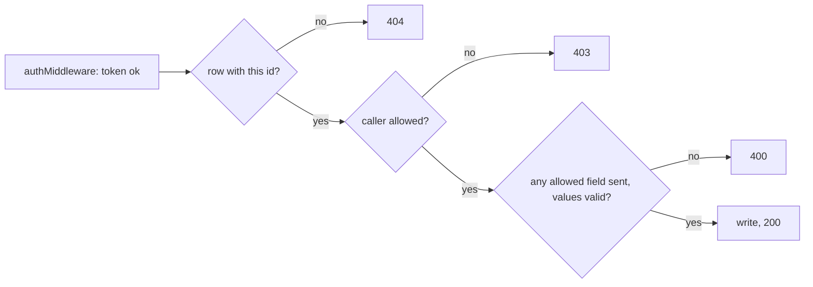
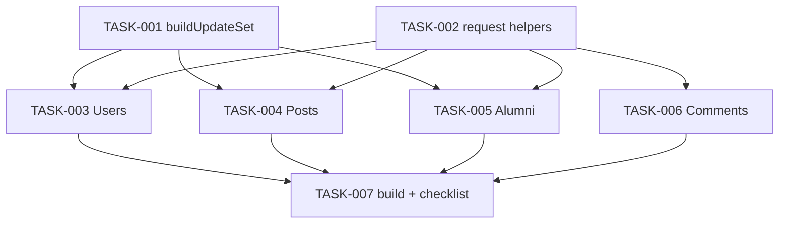

# Close the security and data-loss gaps in the backend — Architecture

| Field | Value |
|---|---|
| REQ | REQ-fs-002 |
| Status | validated |
| Created | 2026-10-06 |
| Related ADRs | [[architecture/adr-01-sign-up-role-is-student-or-alumni\|ADR-01]], [[architecture/adr-02-admin-deletes-any-post-edits-only-own\|ADR-02]], [[architecture/adr-03-one-alumni-profile-per-user-created-by-that-user\|ADR-03]] |

## Summary

Four vertical changes, one per domain (users, posts, alumni, comments), on top of two small shared helpers. The Query classes stop writing columns that were not sent and stop selecting `password`. The controllers read the author from the token, check the owner before every update or delete, and validate the sign-up role. `PUT /api/users/:id/login` and its code are deleted. Nothing changes in the database schema, the frontend or `@alumni/shared`.

## Blast radius

| Path | Why touched | Risk |
|---|---|---|
| `backend/src/dal/query/updateSet.ts` (new) | One function that builds a `SET` list from the fields that were sent, using a fixed column list | medium |
| `backend/src/api/utils/requestHelpers.ts` (new) | `pickSent`, `isAdmin`, `isSelf` — shared by the four controllers | low |
| `backend/src/dal/query/UserQuery.ts` | Named columns without `password` everywhere; one login-only read with the hash; partial `updateUser`; drop the row log; delete `updateLoginTime` | high |
| `backend/src/dal/dto/UserDTO.ts`, `backend/src/dal/index.ts` | Add and export the type `PublicUserDTO` (a user without `password`) | low |
| `backend/src/businessLogic/src/UserManager.ts` | Add `findUserForLogin`; delete `updateLoginTime`; return types follow the Query | medium |
| `backend/src/api/controllers/UserController.ts` | Login uses `findUserForLogin`; sign-up role check; partial update with owner check and validation; logout owner check; delete `updateLoginTime` | high |
| `backend/src/api/routes/UserRoutes.ts` | Delete the `/:id/login` route and import; fix two stale comments | low |
| `backend/src/dal/query/PostQuery.ts` | Partial `updatePost(id, data)`; `findPostById(id)` takes a number | medium |
| `backend/src/businessLogic/src/PostManager.ts` | `updatePost(id, data)`; add `findPostById(id)` | low |
| `backend/src/api/controllers/PostController.ts` | `createPost` author from token; `updatePost` owner-only, partial | medium |
| `backend/src/api/routes/PostRoutes.ts` | Comment only (the check lives in the controller, as for delete) | low |
| `backend/src/dal/query/AlumniQuery.ts` | Partial `updateAlumni` | medium |
| `backend/src/api/controllers/AlumniController.ts` | `createAlumni` `user_id` from token; `updateAlumni` owner-or-admin, partial, no `req.body` pass-through | medium |
| `backend/src/api/routes/AlumniRoutes.ts` | Comment only | low |
| `backend/src/dal/query/CommentQuery.ts` | Add `findCommentById(id)` | low |
| `backend/src/businessLogic/src/CommentManager.ts` | Add `findCommentById(id)` | low |
| `backend/src/api/controllers/CommentController.ts` | `createComment` author from token; `updateComment` owner-only, content only; `deleteComment` owner or admin | medium |
| `backend/src/api/routes/CommentRoutes.ts` | Comment only | low |
| `docs/roadmap.md` | Row B2 status, at wrap-up (project rule) | low |

`AlumniManager.ts` is not touched: its `updateAlumni(id, Partial<AlumniDTO>)` and `findAlumniById(id)` already fit. No README or Postman file describes these endpoints (searched `postman/`, `.postman/`, `README.md`), so no other doc is in the radius.

## Approach

### 1. "Sent" is decided once, in the controller

A controller never hands `req.body` or a full DTO to an update. It calls `pickSent(req.body, ALLOWED)` with a hard-coded list of key names and gets back a plain object holding only the keys that are present in the body and not `undefined`. `null` is kept, so a nullable field sent as `null` is cleared (AC6). Keys outside the list — `role`, `user_id`, `id`, anything unknown — never reach the Manager (AC3, AC4, AC5).

| Endpoint | Allowed keys |
|---|---|
| `PUT /api/users/:id` | `name`, `email`, `password`, `photo_url` |
| `PUT /api/posts/:id` | `caption`, `media_url` |
| `PUT /api/alumni/:id` | `department`, `graduation_year`, `current_company`, `job_title`, `experience`, `bio`, `linkedin_url` |

If the picked object is empty the controller answers **400 `{ error: "No fields to update" }`** and writes nothing (AC7). The owner chose 400 at the design gate because a client that sends nothing useful has a bug it should hear about.

For users, `email` and `password`, when sent, must be non-empty strings, else 400 (AC6). The password is hashed only after that check.

Every other allowed field, when sent, must be a string or `null`; `graduation_year` must be an integer or `null`. A wrong type is 400 `{ error: "<field> has the wrong type" }` and nothing is written. Without this, `{"caption": {"x": 1}}` would be stored as JSON text and `graduation_year: "abc"` would come back as a raw database message (stress-test finding ADV-003).

### 2. The Query writes only those columns

`updateSet.ts` exports `buildUpdateSet(data, columns)`. It walks the Query class's own fixed column list — never the keys of `data` — and for each column present in `data` adds `column = $n` and pushes the value. So column names in the SQL always come from a constant in the source and values are always bound parameters (AC28). Each `update*` method appends `updated_at = NOW()`, the `WHERE id = $n` and `RETURNING`. If nothing was sent, the method runs no `UPDATE` and returns the current row; the controller has already answered 400, so this is a second guard only.

### 3. `password` is not selected, so it cannot leak

`UserQuery` gets one constant: `id, name, email, role, photo_url, login_at, logout_at, created_at, updated_at` (the `"User"` columns in `db/schema.md` minus `password`). `createUser`, `findUserById`, `findUserByEmail`, `updateUser` and `getAllUsers` use it in place of `*` and are typed as `PublicUserDTO` (`Omit<UserDTO, "password">`), so reading `.password` from them no longer compiles. One new method, `findUserWithPasswordByEmail`, selects the hash; only `UserManager.findUserForLogin` calls it, and only `UserController.login` calls that (AC8, AC9). The per-row `console.log` in `getAllUsers` is deleted (AC10). This is the same rule as [[knowledge/concepts/user-join-read-shape]].

### 4. Owner checks live in the controller, before the write

Same shape as the existing `PostController.deletePost`, but reading one row instead of the whole table:

| Route | Row read with | Allowed |
|---|---|---|
| `PUT /api/users/:id` | none needed: compare `:id` with the token | self or admin |
| `PUT /api/users/:id/logout` | none needed | self only |
| `PUT /api/alumni/:id` | `AlumniManager.findAlumniById` (exists) | `user_id` is the caller, or admin |
| `PUT /api/posts/:id` | `PostManager.findPostById` (new; the Query method exists) | `user_id` is the caller |
| `PUT /api/comments/:id` | `CommentManager.findCommentById` (new) | `user_id` is the caller |
| `DELETE /api/comments/:id` | `CommentManager.findCommentById` (new) | `user_id` is the caller, or admin |

**Users are the one exception to "404 before 403" (stress-test finding ADV-001).** The user check needs no row, so the 403 comes first: a non-admin calling `PUT /api/users/<an id that is not theirs>` gets 403 whether or not that user exists, and only an admin can get the 404. This is deliberate — it does not tell a non-admin which user ids exist — and it narrows AC17 for the users route. On every route, an update that returns no row is a 404 (AC17), which also covers a row deleted between the check and the write. Response bodies keep today's shape: `{ error: "<message>" }`.

`isAdmin(req)` and `isSelf(req, userId)` in `requestHelpers.ts` hold the two comparisons so the role string `"admin"` and the `req.user.sub` comparison are written once.

### 5. Author from the token

`createPost`, `createComment` and `createAlumni` build their DTO with `req.user.sub`. `user_id` is no longer read from the body (AC18, AC19, AC23).

`updateComment` reads only `content` from the body and must get a non-empty string, else 400. It builds the DTO from the row it already loaded for the owner check, so nothing else can change (AC20).

### 6. Sign-up role

`createUser` checks `role` against a constant list `["student", "alumni"]` with an exact match before hashing the password; anything else is 400 `{ error: "Role must be student or alumni" }` (AC11, AC12).

### 7. The login-stamp route

Deleted: the route line and import in `UserRoutes.ts`, `UserController.updateLoginTime`, `UserManager.updateLoginTime`, `UserQuery.updateLoginTime` (AC21). `TestManager.ts` mentions it in a commented-out line; that file is a scratch script and is left alone.

## Task DAG

### Tier 0
- `TASK-001` — DAL helper `buildUpdateSet`
- `TASK-002` — API helpers `pickSent`, `isAdmin`, `isSelf`

### Tier 1 (each owns its own files; no file is shared between them)
- `TASK-003` — Users: no password, partial update, sign-up role, owner checks, remove login route — depends on TASK-001, TASK-002
- `TASK-004` — Posts: author from token, owner-only partial update — depends on TASK-001, TASK-002
- `TASK-005` — Alumni: `user_id` from token, owner-or-admin partial update — depends on TASK-001, TASK-002
- `TASK-006` — Comments: author from token, owner checks, content-only edit — depends on TASK-002

### Tier 2
- `TASK-007` — Build, SQL check against `db/schema.md`, and the owner's manual test checklist — depends on TASK-003 to TASK-006

## Test strategy

There is no test runner, and adding one is on the roadmap as "Later", so this REQ adds no test files. What stands in:

- **Build.** `npm run build` exits 0 after every task and at the end (AC25). The `PublicUserDTO` type makes the compiler reject any code that reads `password` from a public user read.
- **Pure helpers, run without a database.** `buildUpdateSet` and `pickSent` have no imports from `pg` or Express. TASK-007 runs a throwaway `tsx` script from the session scratch folder (not committed) over the cases: nothing sent, one field, all fields, `null`, `undefined`, an unknown key, a key named like a column that is not in the list.
- **SQL by eye.** TASK-007 lists every changed SQL string and ticks each table and column against `db/schema.md` ([[knowledge/lessons/LESSON-REQ-fs-001-1]]), and writes out the SQL `buildUpdateSet` produces for two sample bodies per table.
- **Manual checklist for the owner.** TASK-007 writes `manual-test-checklist.md` in the REQ folder: one request per acceptance criterion, with the expected status and what to look for. The owner runs it against the real database; Claude does not run the API or any database command in this session. AC1–AC24 stay "not yet run" until the owner reports back.

## Convention alignment

Follows [[context/conventions]]:

- Route → Controller → Manager → Query order is kept; the two new reads (`findPostById`, `findCommentById`) go through their Managers.
- SQL stays in `dal/query/`, parameterized, with the real names from `db/schema.md`.
- Every non-public route keeps `authMiddleware`; the owner check is added "where needed".
- No endpoint returns `password`.
- File names: helpers are camelCase files with no role suffix because they are not a Query, DTO, Manager, Controller or Routes file. The naming rule lists only those five.

Deviations, both deliberate:

1. **Controllers stay exported functions with their own `try`/`catch`.** The class-based controllers and the shared error middleware are roadmap item B3 and a non-goal here. New status codes (403, 404) are returned directly, as `deletePost` does today.
2. **Owner checks and input checks sit in the controllers, not the Managers.** Putting them in a Manager would need typed errors and a place to map them to 400 / 403 / 404, which is the B3 error middleware. B3 can move them when it lands.

## Risks

| Risk | Likelihood | Mitigation |
|---|---|---|
| A changed SQL string is wrong and the build does not notice | med | Column list checked by eye in TASK-007; owner's manual run; SQL is not "done" before that |
| Dynamic `SET` list is seen as SQL built from input | low | Column names come only from a constant array in the Query class; `buildUpdateSet` never reads a key name from `data`; values are bound |
| Login breaks because the hash is no longer selected | med | One dedicated read for login; `PublicUserDTO` makes a wrong call fail to compile; AC9 is first on the manual checklist |
| The legacy frontend relied on a closed hole | low | It signs up as student / alumni and logs out its own user (`usersApi.ts`); it has no post, comment or alumni write screens. Accepted in the spec |
| The role in a token is up to 1 hour old | low | Unchanged behaviour; nothing in this REQ changes roles |
| An admin can change another user's email or password | by design | The request says "owner or an admin can update a user" |
| Two requests update the same row at once | low | Each writes only its own columns now, so they no longer wipe each other's fields |
| A user changes their own email or password without typing the current password, so a stolen token (valid 1 hour) can take the account over for good (ADV-004) | low | Accepted: not new — today any token can do this to any account. A "current password" check is its own REQ, with password reset |
| A non-numeric `:id` reaches PostgreSQL and comes back as 400 with the raw database message (ADV-003, second half) | low | Accepted: unchanged behaviour; raw database messages go away with the shared error middleware (roadmap B3) |
| The owner's manual run needs an admin account, and sign-up can no longer make one (ADV-002) | med | TASK-007's checklist starts with "have an admin": use an existing one, or the owner sets `role` on a test user by hand and logs in again |

## Stress-test (2026-10-06)

Full pass, because the change is about auth and touches about 19 files. Report: `architecture-adversary.md`. Result: 0 critical, 0 major, 4 minor.

| Finding | What | Handled |
|---|---|---|
| ADV-001 | AC17 says a missing user id is 404, but a non-admin gets 403 first | Documented as a deliberate exception in Approach 4; TASK-003 and the checklist test it as an admin; owner confirms |
| ADV-002 | The manual run needs an admin, and the API can no longer create one | Fixed: prerequisite added to TASK-007 |
| ADV-003 | `pickSent` checks presence, not type | Fixed for field types (Approach 1, TASK-002 to TASK-005); non-numeric ids accepted as a risk |
| ADV-004 | Self-update of email / password needs no current password | Accepted and written into Risks |

## Open questions

- [x] None open. The owner confirmed at the design gate (2026-10-06): 400 for an empty update; 403 before 404 on the users route.

## Related

- Spec: REQ-fs-002 — resolve the folder per `core/VAULT-LAYOUT.md`
- Concepts: [[knowledge/concepts/user-join-read-shape]], [[knowledge/concepts/partial-update-sent-fields]] (stub, new)
- Components: [[knowledge/components/dal-query-classes]], [[knowledge/components/api-controllers-and-routes]] (stub, new)
- Lessons checked: [[knowledge/lessons/LESSON-REQ-fs-001-1]] (build does not check SQL — test strategy), [[knowledge/lessons/LESSON-REQ-fs-001-2]] (list what a fix makes reachable — AC22 is in), [[knowledge/lessons/LESSON-REQ-fs-001-3]] (`req.body` pass-through — removed in TASK-005), [[knowledge/lessons/LESSON-REQ-fs-001-4]] (row logs — TASK-003)
- ADRs: [[architecture/adr-01-sign-up-role-is-student-or-alumni|ADR-01]], [[architecture/adr-02-admin-deletes-any-post-edits-only-own|ADR-02]], [[architecture/adr-03-one-alumni-profile-per-user-created-by-that-user|ADR-03]]. No new ADR: the partial-update rule was confirmed by the owner at the spec gate and is recorded as a concept page.
