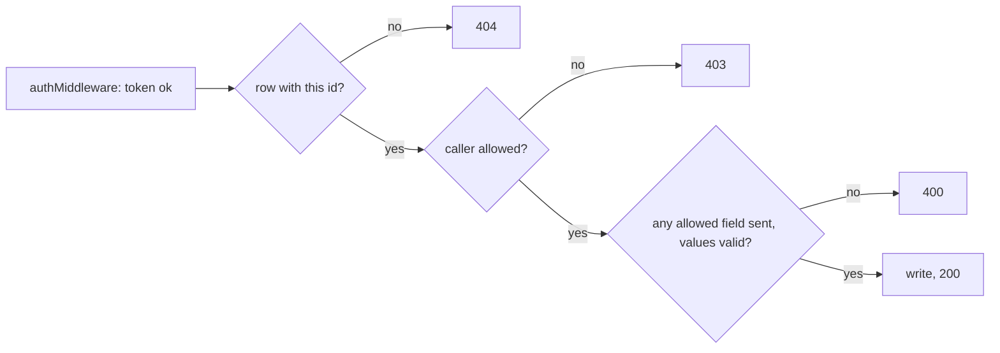
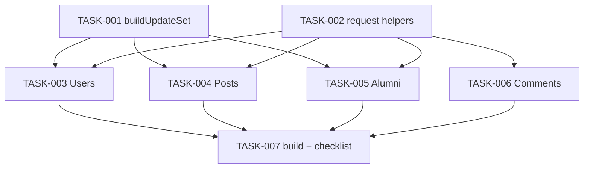

# REQ-fs-002-backend-security-data-loss-gaps — Review Packet

`Packet: 51KB · round 2 · 5 files in this round`

This packet contains the round-2 fix diff with full file context, the REQ spec, the REQ architecture, and the exploration blast radius and vault references. **Do not re-read these via Read — cite this packet.** Your own required reading (conventions, vault, source outside the diff) is not a packet gap; `Packet-gap` means the packet itself fell short.

## Round 2 — what changed since round 1

The owner chose to fix four findings. The diff below is ONLY the fix round (uncommitted working tree vs the round-1 commits).

| ID | Round-1 finding | Reviewer ids | Disposition |
|---|---|---|---|
| m1 | console.log of every row in PostQuery.getAllPosts and CommentQuery.getAllComments | QUAL-001, REFL-003 | fixed this round |
| m2 | PostController.deletePost and findPostById load all posts and compare ids inline | QUAL-002, QUAL-003, ARCH-003, REFL-004 | fixed this round |
| m5 | findAlumniById, updateAlumni, updateComment typed as always returning a row; updateAlumni nothing-to-write shape | ARCH-004 | fixed this round (types; shape kept and commented, gotcha G25) |
| t1 | stale comment on the post delete route | QUAL-005 | fixed this round (the PUT comment was also reworded for clarity) |
| M1, M2, m3, m4, m6, m7, m8 | see verification.md | — | not in this round: owner decision, recorded as follow-ups or wrap-up work |

Files: backend/src/api/controllers/PostController.ts backend/src/api/routes/PostRoutes.ts backend/src/dal/query/AlumniQuery.ts backend/src/dal/query/CommentQuery.ts backend/src/dal/query/PostQuery.ts

## Diff with full context (fix round, vs HEAD)

```diff
diff --git a/backend/src/api/controllers/PostController.ts b/backend/src/api/controllers/PostController.ts
index ba0fed62..78cf0d15 100644
--- a/backend/src/api/controllers/PostController.ts
+++ b/backend/src/api/controllers/PostController.ts
@@ -1,98 +1,96 @@
 import { Request, Response } from "express";
 import { PostManager } from "@alumni/businesslogic";
 import { PostDTO } from "@alumni/dal";
 import {
   findWrongType,
+  isAdmin,
   isSelf,
   isStringOrNull,
   pickSent,
 } from "../utils/requestHelpers";
 
 const postManager = new PostManager();
 
 // The only body keys an edit may change. user_id, id and anything else are dropped.
 const POST_UPDATE_FIELDS = ["caption", "media_url"] as const;
 
 export const createPost = async (req: Request, res: Response) => {
   try {
     const { caption, media_url } = req.body;
     const post = new PostDTO(req.user.sub, caption, media_url);
     const newPost = await postManager.createNewPost(post);
     res.status(201).json(newPost);
   } catch (error) {
     res.status(400).json({ error: (error as Error).message });
   }
 };
 
 export const getAllPosts = async (req: Request, res: Response) => {
   try {
     const posts = await postManager.getAllPosts();
     res.status(200).json(posts);
   } catch (error) {
     res.status(500).json({ error: (error as Error).message });
   }
 };
 
 export const findPostById = async (req: Request, res: Response) => {
   try {
     const id = Number(req.params.id);
-    const posts = await postManager.getAllPosts();
-    const post = posts.find((p) => p.id === id);
+    const post = await postManager.findPostById(id);
     if (!post) {
       return res.status(404).json({ error: "Post not found" });
     }
     res.status(200).json(post);
   } catch (error) {
     res.status(404).json({ error: (error as Error).message });
   }
 };
 
 export const updatePost = async (req: Request, res: Response) => {
   try {
     const id = Number(req.params.id);
     const existing = await postManager.findPostById(id);
     if (!existing) return res.status(404).json({ error: "Post not found" });
 
     // Author only. An admin may delete any post but edit only their own (ADR-02).
     if (!isSelf(req, existing.user_id)) {
       return res.status(403).json({ error: "Not authorized to edit this post" });
     }
 
     const fields = pickSent(req.body, POST_UPDATE_FIELDS);
     if (Object.keys(fields).length === 0) {
       return res.status(400).json({ error: "No fields to update" });
     }
     const wrongField = findWrongType(fields, isStringOrNull);
     if (wrongField) {
       return res.status(400).json({ error: `${wrongField} has the wrong type` });
     }
 
     const updated = await postManager.updatePost(id, fields as Partial<PostDTO>);
     if (!updated) return res.status(404).json({ error: "Post not found" });
     res.status(200).json(updated);
   } catch (error) {
     res.status(400).json({ error: (error as Error).message });
   }
 };
 
 export const deletePost = async (req: Request, res: Response) => {
   try {
     const id = Number(req.params.id);
-    const posts = await postManager.getAllPosts();
-    const existing = posts.find((p) => p.id === id);
+    const existing = await postManager.findPostById(id);
     if (!existing) return res.status(404).json({ error: "Post not found" });
 
-    const isOwner = existing.user_id === req.user.sub;
-    const isAdmin = req.user.role === "admin";
-    if (!isOwner && !isAdmin) {
+    // Author or admin (ADR-02).
+    if (!isSelf(req, existing.user_id) && !isAdmin(req)) {
       return res.status(403).json({ error: "Not authorized to delete this post" });
     }
 
     const post = new PostDTO(0);
     post.id = id;
     await postManager.deletePost(post);
     res.status(200).json({ message: "Post deleted successfully" });
   } catch (error) {
     res.status(400).json({ error: (error as Error).message });
   }
 };
\ No newline at end of file
diff --git a/backend/src/api/routes/PostRoutes.ts b/backend/src/api/routes/PostRoutes.ts
index ab1148ab..f2cd8691 100644
--- a/backend/src/api/routes/PostRoutes.ts
+++ b/backend/src/api/routes/PostRoutes.ts
@@ -1,18 +1,18 @@
 import { Router } from "express";
 import {
   createPost,
   getAllPosts,
   updatePost,
   deletePost,
 } from "../controllers/PostController";
 import { authMiddleware } from "../MiddleWare/authMiddleware";
 import { requireRole } from "../MiddleWare/roleMiddleware";
 
 const router = Router();
 
 router.post("/", authMiddleware, requireRole("alumni", "admin"), createPost);
 router.get("/", authMiddleware, getAllPosts);
-router.put("/:id", authMiddleware, updatePost);   // author only (admins too, ADR-02); checked in the controller
-router.delete("/:id", authMiddleware, deletePost); // ownership check ideally in controller
+router.put("/:id", authMiddleware, updatePost);   // author only, even for admins (ADR-02); checked in the controller
+router.delete("/:id", authMiddleware, deletePost); // author or admin; checked in the controller
 
 export default router;
\ No newline at end of file
diff --git a/backend/src/dal/query/AlumniQuery.ts b/backend/src/dal/query/AlumniQuery.ts
index ce6b22a3..14560850 100644
--- a/backend/src/dal/query/AlumniQuery.ts
+++ b/backend/src/dal/query/AlumniQuery.ts
@@ -1,84 +1,85 @@
 import pool from "../config/db.js";
 import { AlumniDTO } from "../dto/AlumniDTO.js";
 import { buildUpdateSet } from "./updateSet.js";
 
 // The only columns updateAlumni may write. user_id is not here on purpose.
 const UPDATABLE_COLUMNS = [
   "department",
   "graduation_year",
   "current_company",
   "job_title",
   "experience",
   "bio",
   "linkedin_url",
 ] as const;
 
 export class AlumniQuery {
   constructor() {}
   public async createAlumni(alumni: AlumniDTO): Promise<AlumniDTO> {
     const info = await pool.query(
       "INSERT INTO alumni (user_id, department, graduation_year, current_company, job_title, experience, bio, linkedin_url) VALUES ($1,$2,$3,$4,$5,$6,$7,$8) RETURNING *",
       [
         alumni.user_id,
         alumni.department,
         alumni.graduation_year,
         alumni.current_company,
         alumni.job_title,
         alumni.experience,
         alumni.bio,
         alumni.linkedin_url,
       ],
     );
     return info.rows[0];
   }
   public async findAlumniByEmail(
     email: string,
   ): Promise<AlumniDTO | undefined> {
     const info = await pool.query(
       `SELECT a.*, u.name, u.email, u.photo_url FROM alumni a LEFT JOIN "User" u ON u.id = a.user_id WHERE u.email = $1`,
       [email],
     );
     return info.rows[0];
   }
 
-  public async findAlumniById(id: number): Promise<AlumniDTO> {
+  public async findAlumniById(id: number): Promise<AlumniDTO | undefined> {
     const info = await pool.query(
       `SELECT a.*, u.name, u.email, u.photo_url FROM alumni a LEFT JOIN "User" u ON u.id = a.user_id WHERE a.id = $1`,
       [id],
     );
     return info.rows[0];
   }
 
   public async updateAlumni(
     id: number,
     alumni: Partial<AlumniDTO>,
-  ): Promise<AlumniDTO> {
+  ): Promise<AlumniDTO | undefined> {
     const { assignments, values } = buildUpdateSet(alumni, UPDATABLE_COLUMNS);
 
     // Nothing was sent: write nothing and return the row as it is, with the
     // alumni columns only, the same shape the UPDATE returns.
+    // Keep this a bare alumni SELECT, not the joined read: writes return alumni columns only (gotcha G25).
     if (assignments.length === 0) {
       const current = await pool.query(`SELECT * FROM alumni WHERE id = $1`, [
         id,
       ]);
       return current.rows[0];
     }
 
     const info = await pool.query(
       `UPDATE alumni SET ${assignments.join(", ")}, updated_at = NOW() WHERE id = $${values.length + 1} RETURNING *`,
       [...values, id],
     );
     return info.rows[0];
   }
 
   public async getAllAlumni(): Promise<AlumniDTO[]> {
     const info = await pool.query(
       `SELECT a.*, u.name, u.email, u.photo_url FROM alumni a LEFT JOIN "User" u ON u.id = a.user_id`,
     );
      const alumnis: AlumniDTO[] = [];
             for (const alumni of info.rows) {
                 alumnis.push(alumni);
             }
             return alumnis;
   }
 }
diff --git a/backend/src/dal/query/CommentQuery.ts b/backend/src/dal/query/CommentQuery.ts
index d23a1fdb..27020c11 100644
--- a/backend/src/dal/query/CommentQuery.ts
+++ b/backend/src/dal/query/CommentQuery.ts
@@ -1,42 +1,43 @@
 import pool from "../config/db";
 import { CommentDTO } from "../dto/CommentDTO";
 
 export class CommentQuery {
   constructor() {}
   public async createComment(comment: CommentDTO): Promise<CommentDTO> {
     const info = await pool.query(
       "INSERT INTO comment (user_id, posts_id,parent_id,content)VALUES ($1,$2,$3,$4) RETURNING * ",
       [comment.user_id, comment.posts_id, comment.parent_id, comment.content],
     );
     return info.rows[0];
   }
   public async getAllComments(): Promise<CommentDTO[]> {
     const info = await pool.query(
       "SELECT * FROM comment ORDER BY created_at DESC",
     );
      const comments: CommentDTO[] = [];
         for (const comment of info.rows) {
-            console.log(comment);
             comments.push(comment);
         }
         return comments;
   }
 
   public async findCommentById(id: number): Promise<CommentDTO | undefined> {
     const info = await pool.query("SELECT * FROM comment WHERE id = $1", [id]);
     return info.rows[0];
   }
 
-  public async updateComment(comment: CommentDTO): Promise<CommentDTO> {
+  public async updateComment(
+    comment: CommentDTO,
+  ): Promise<CommentDTO | undefined> {
     const info = await pool.query(
       `UPDATE comment SET content=$1, updated_at=NOW()
             WHERE id=$2 RETURNING *`,
       [comment.content, comment.id],
     );
     return info.rows[0];
   }
 
   public async deleteComment(comment: CommentDTO): Promise<void> {
     await pool.query("DELETE FROM comment WHERE id = $1", [comment.id]);
   }
 }
diff --git a/backend/src/dal/query/PostQuery.ts b/backend/src/dal/query/PostQuery.ts
index 2d820dcc..7d4ea90f 100644
--- a/backend/src/dal/query/PostQuery.ts
+++ b/backend/src/dal/query/PostQuery.ts
@@ -1,74 +1,73 @@
 import pool from "../config/db";
 import { PostDTO } from "../dto/PostDTO";
 import { buildUpdateSet } from "./updateSet";
 
 // The only columns an edit may write. Names are from the posts table in db/schema.md.
 const POST_UPDATE_COLUMNS = ["caption", "media_url"] as const;
 
 export class PostQuery {
   constructor() {}
   public async createPost(data: PostDTO): Promise<PostDTO> {
     const result: any = await pool.query(
       `INSERT INTO posts (user_id, caption, media_url)
             VALUES ($1, $2, $3) RETURNING *`,
       [data.user_id, data.caption, data.media_url],
     );
     return result.rows[0];
   }
 
     public async getAllPosts(): Promise<PostDTO[]> {
         const info = await pool.query(
             'SELECT * FROM posts ORDER BY created_at DESC'
         );
         const posts: PostDTO[] = [];
         for (const post of info.rows) {
-            console.log(post);
             posts.push(post);
         }
         return posts;
     }
   public async findPostById(id: number): Promise<PostDTO | null> {
     const result = await pool.query(`SELECT * FROM posts WHERE id=$1`, [id]);
     return result.rows[0] || null;
   }
   public async getPostsByUserId(post: PostDTO): Promise<PostDTO[]> {
     const result = await pool.query(
       `SELECT * FROM posts WHERE user_id = $1 ORDER BY created_at DESC`,
       [post.user_id],
     );
     return result.rows;
   }
   /**
    * Writes only the fields present in `data`. Returns the updated row, or
    * `null` when no post has this id. With nothing to write it runs no UPDATE
    * and returns the current row.
    */
   public async updatePost(
     id: number,
     data: Partial<PostDTO>,
   ): Promise<PostDTO | null> {
     const { assignments, values } = buildUpdateSet(
       data as Record<string, unknown>,
       POST_UPDATE_COLUMNS,
     );
     if (assignments.length === 0) {
       return this.findPostById(id);
     }
 
     const result = await pool.query(
       `UPDATE posts SET ${assignments.join(", ")}, updated_at = NOW()
       WHERE id = $${values.length + 1} RETURNING *`,
       [...values, id],
     );
     return result.rows[0] || null;
   }
   public async deletePost(post: PostDTO): Promise<void> {
     await pool.query(`DELETE FROM posts WHERE id = $1`, [post.id]);
   }
   public async updateCommentCount(post: PostDTO): Promise<void> {
     await pool.query(`UPDATE posts SET comment_count=$1 WHERE id=$2`, [
       post.comment_count,
       post.id,
     ]);
   }
 }
```

## REQ spec

# Close the security and data-loss gaps in the backend

| Field | Value |
|---|---|
| REQ | REQ-fs-002 |
| Status | validated |
| Phase | spec |
| Created | 2026-10-06 |
| Primary repo | alumni-details-system |
| Touched repos | alumni-details-system |
| Related | [[knowledge/gotchas#^g02\|G02]], [[knowledge/gotchas#^g09\|G09]], [[knowledge/gotchas#^g10\|G10]], [[knowledge/gotchas#^g14\|G14]], [[knowledge/gotchas#^g15\|G15]], [[knowledge/gotchas#^g17\|G17]], [[knowledge/gotchas#^g18\|G18]], [[knowledge/gotchas#^g19\|G19]], [[knowledge/gotchas#^g20\|G20]], [[knowledge/gotchas#^g22\|G22]], [[knowledge/gotchas#^g23\|G23]], [[architecture/adr-01-sign-up-role-is-student-or-alumni\|ADR-01]], [[architecture/adr-02-admin-deletes-any-post-edits-only-own\|ADR-02]], [[architecture/adr-03-one-alumni-profile-per-user-created-by-that-user\|ADR-03]] |

## Problem

The backend has holes that lose data or let one user act as another. They are all live today and the new frontend will be built on these endpoints.

- **Data loss.** `PUT /api/users/:id`, `PUT /api/posts/:id` and `PUT /api/alumni/:id` write every column on every call. A field the request leaves out is written as NULL: editing only a post's caption removes its media; editing one alumni field wipes the other six; a user edit without a password is rejected or wipes `name` / `photo_url` (G02, G09, G10).
- **Password hash in responses.** Sign-up, get all users, get by id, get by email and update all return the `password` column. `GET /api/users/:id` is open to any logged-in user, so anyone can read anyone's hash (G17). `UserQuery.getAllUsers` also prints every user row, hash included, to the server log.
- **Anyone can register as admin.** `POST /api/users` is public and stores whatever `role` the body says (G14).
- **Missing owner checks.** Any logged-in user can update any user (G18), any alumni profile (G19), and edit or delete any comment (G23). G19 and G23 became reachable when REQ-fs-001 fixed the SQL.
- **Author taken from the request.** New posts and comments use the `user_id` in the body, so a user can post or comment as someone else (G20, G22).
- **A write with no login.** `PUT /api/users/:id/login` has no token check. Anyone on the network can stamp any user's `login_at` (G15). Nothing in the repo calls this route.

## Goal

After this REQ, a partial update changes only the fields that were sent; no API response or server log contains a password hash; sign-up creates only student or alumni accounts; a user can change only their own user record, alumni profile and comments (admins as listed below); the author of a new post or comment is always the logged-in user; and no route that writes to the database can be called without a token, apart from sign-up and login. The database schema and the frontend are untouched.

## Non-goals

- No database schema change and no migration. No UNIQUE on `alumni.user_id`, no cascade deletes.
- No frontend change, legacy or new. No change to `@alumni/shared` types unless a backend type needs it to compile.
- No move to controller classes or a shared error middleware. Those conventions are target rules and are their own REQ; this REQ keeps the current controller style.
- No change to how deletes handle related rows ([[architecture/adr-06-deleting-rows-that-other-rows-reference|ADR-06]], G08). Deleting a comment that has replies still fails.

## Acceptance criteria

"Sent" means the key is present in the JSON body. "Owner" means the logged-in user (`sub` in the token) is the user the row belongs to.

### Partial updates (G02, G09, G10)

- [ ] AC1 — `PUT /api/users/:id` with only some of `name`, `email`, `password`, `photo_url` changes only those columns (plus `updated_at`). Every column not sent keeps its value.
- [ ] AC2 — `PUT /api/users/:id` without `password` leaves the stored hash unchanged; the user can still log in with the old password.
- [ ] AC3 — `PUT /api/users/:id` never changes `role`, whatever the body contains.
- [ ] AC4 — `PUT /api/posts/:id` with only `caption` keeps `media_url`, and with only `media_url` keeps `caption`. It never changes the post's `user_id`.
- [ ] AC5 — `PUT /api/alumni/:id` with any subset of `department`, `graduation_year`, `current_company`, `job_title`, `experience`, `bio`, `linkedin_url` changes only those columns. It never changes `user_id`.
- [ ] AC6 — On all three, a nullable field sent as `null` is cleared. `email` or `password` sent as `null` or an empty string is rejected with 400 and nothing is written.
- [ ] AC7 — On all three, a body with none of the updatable fields writes nothing to the row.

### Password never leaves the backend (G17)

- [ ] AC8 — No response from any endpoint contains a `password` key. This covers `POST /api/users`, `GET /api/users`, `GET /api/users/:id`, `GET /api/users/email/:email`, `PUT /api/users/:id`, and every posts, comments and alumni endpoint.
- [ ] AC9 — Login still works: `POST /api/auth/login` with correct credentials returns a token; with a wrong password it returns 401.
- [ ] AC10 — No code path writes a user row or a password hash to the console.

### Sign-up role (G14, ADR-01)

- [ ] AC11 — `POST /api/users` with `role` of `student` or `alumni` creates the user with that role.
- [ ] AC12 — `POST /api/users` with any other `role` (including `admin`, a different letter case, or no role) returns 400 and creates no user.

### Owner checks (G18, G19, G23)

- [ ] AC13 — `PUT /api/users/:id` succeeds only when the caller is that user or an admin. Anyone else gets 403 and nothing is written.
- [ ] AC14 — `PUT /api/alumni/:id` succeeds only when the caller owns that profile (`alumni.user_id` is the caller) or is an admin. Anyone else gets 403 and nothing is written.
- [ ] AC15 — `PUT /api/comments/:id` succeeds only for the comment's author. Everyone else, admins included, gets 403.
- [ ] AC16 — `DELETE /api/comments/:id` succeeds only for the comment's author or an admin. Anyone else gets 403 and the comment stays.
- [ ] AC17 — On the four routes above, an `:id` that matches no row returns 404, not 200. One exception, decided by the owner at the design gate (2026-10-06): on `PUT /api/users/:id` the 403 comes first, so a non-admin gets 403 for any id that is not their own, whether or not it exists; only an admin gets the 404.

### Author comes from the token (G20, G22)

- [ ] AC18 — `POST /api/posts` stores the caller's id as `user_id`. A `user_id` in the body is ignored.
- [ ] AC19 — `POST /api/comments` stores the caller's id as `user_id`. A `user_id` in the body is ignored.
- [ ] AC20 — `PUT /api/comments/:id` changes only `content`; it cannot move a comment to another user, post or parent.

### `PUT /api/users/:id/login` (G15)

- [ ] AC21 — The route is removed, together with the controller, Manager and Query code that only it uses. A request to it without a token can no longer change any row.

### Additions — not in the original request; the owner added all three at the spec gate (2026-10-06)

These are the same kind of hole, sitting next to the ones listed.

- [ ] AC22 — `PUT /api/posts/:id` succeeds only for the post's author; everyone else, admins included, gets 403, and a missing id gets 404 (G21, [[architecture/adr-02-admin-deletes-any-post-edits-only-own|ADR-02]]). Without this, AC4 repairs an endpoint that any logged-in user can still use on anyone's post.
- [ ] AC23 — `POST /api/alumni` stores the caller's id as `user_id`; a `user_id` in the body is ignored ([[architecture/adr-03-one-alumni-profile-per-user-created-by-that-user|ADR-03]]). Today an alumni can create a profile under another user's id.
- [ ] AC24 — `PUT /api/users/:id/logout` succeeds only when the caller is that user; anyone else gets 403. Today any logged-in user can stamp any user's `logout_at`.

### Whole-change checks

- [ ] AC25 — `npm run build` exits 0.
- [ ] AC26 — `db/schema.md` is unchanged and no SQL names a table or column that is not in it.
- [ ] AC27 — No file under `frontend/` changes.
- [ ] AC28 — Every SQL statement stays parameterized and inside `backend/src/dal/query/`; nothing skips the route → controller → Manager → Query order.

## Assumptions

- `req.user.sub` is the numeric `"User".id` and `req.user.role` is the stored role. Read from `UserController.login` and `authMiddleware`.
- Nothing calls `PUT /api/users/:id/login`: a search of `backend/src`, `frontend/src` and `shared/` finds only its own definition. `login_at` is shown nowhere. So removing the route breaks no caller. The owner chose "remove it" at the spec gate (2026-10-06); stamping `login_at` inside `POST /api/auth/login` was offered and not chosen.
- A field sent as `null` means "clear it" (AC6). This lets a user remove a photo or a bio. Confirmed by the owner at the spec gate (2026-10-06).
- Sign-up with a bad or missing role is rejected rather than quietly stored as `student` (AC12). ADR-01 allows either "reject or ignore"; the owner chose reject at the spec gate (2026-10-06).
- The legacy frontend may break where it relied on these holes (for example, sending only some fields is now safe, but sending `role: "admin"` at sign-up now fails). That is accepted: the legacy screens are being replaced.
- There is no test runner. "Done" means the build passes, the SQL is checked by eye against `db/schema.md`, and the owner runs a manual checklist against the real database ([[knowledge/lessons/LESSON-REQ-fs-001-1]]). Claude does not run database-changing commands in this session.

## Open questions

- [x] Which status code for an update whose body has no updatable field (AC7)? **400**, chosen by the owner at the design gate (2026-10-06).

## Out of scope (for now)

- G08 / ADR-06 — deleting a post with comments or a comment with replies.
- G11 — `comment_count` is never updated.
- G13 — comments take `post_id` in the body but return `posts_id`.
- G16, G27 — "not found" returning 200 on the endpoints this REQ does not add an owner check to (user and alumni lookups).
- G24 — no comments-by-post endpoint. G26 — alumni list has no order.
- "One alumni profile per user" (ADR-03) is still not enforced.
- `GET /api/users/:id` stays open to any logged-in user; it just stops returning the hash.
- `"User".email` is case-sensitive, so the same address in another letter case can register twice.
- Password strength rules, rate limiting on login, and the 1-hour token lifetime.
- `console.log` of post and comment rows in `PostQuery.getAllPosts` and `CommentQuery.getAllComments` (no password in them).

## Related

- Concepts: [[knowledge/concepts/user-join-read-shape]]
- Components: [[knowledge/components/dal-query-classes]]
- Lessons: [[knowledge/lessons/LESSON-REQ-fs-001-1]] (a passing build does not check SQL), [[knowledge/lessons/LESSON-REQ-fs-001-2]] (list what a fix makes reachable — the reason for AC22), [[knowledge/lessons/LESSON-REQ-fs-001-3]] (`req.body` passed straight through — `AlumniController.updateAlumni`), [[knowledge/lessons/LESSON-REQ-fs-001-4]] (rows printed to the log — AC10)
- ADRs: [[architecture/adr-01-sign-up-role-is-student-or-alumni|ADR-01]], [[architecture/adr-02-admin-deletes-any-post-edits-only-own|ADR-02]], [[architecture/adr-03-one-alumni-profile-per-user-created-by-that-user|ADR-03]], [[architecture/adr-06-deleting-rows-that-other-rows-reference|ADR-06]]
- Gotchas: G02, G09, G10, G14, G15, G17, G18, G19, G20, G21, G22, G23 in [[knowledge/gotchas]]

## Backlinks

_(populated by /wrapup or manually)_


## REQ architecture

# Close the security and data-loss gaps in the backend — Architecture

| Field | Value |
|---|---|
| REQ | REQ-fs-002 |
| Status | validated |
| Created | 2026-10-06 |
| Related ADRs | [[architecture/adr-01-sign-up-role-is-student-or-alumni\|ADR-01]], [[architecture/adr-02-admin-deletes-any-post-edits-only-own\|ADR-02]], [[architecture/adr-03-one-alumni-profile-per-user-created-by-that-user\|ADR-03]] |

## Summary

Four vertical changes, one per domain (users, posts, alumni, comments), on top of two small shared helpers. The Query classes stop writing columns that were not sent and stop selecting `password`. The controllers read the author from the token, check the owner before every update or delete, and validate the sign-up role. `PUT /api/users/:id/login` and its code are deleted. Nothing changes in the database schema, the frontend or `@alumni/shared`.

## Blast radius

| Path | Why touched | Risk |
|---|---|---|
| `backend/src/dal/query/updateSet.ts` (new) | One function that builds a `SET` list from the fields that were sent, using a fixed column list | medium |
| `backend/src/api/utils/requestHelpers.ts` (new) | `pickSent`, `isAdmin`, `isSelf` — shared by the four controllers | low |
| `backend/src/dal/query/UserQuery.ts` | Named columns without `password` everywhere; one login-only read with the hash; partial `updateUser`; drop the row log; delete `updateLoginTime` | high |
| `backend/src/dal/dto/UserDTO.ts`, `backend/src/dal/index.ts` | Add and export the type `PublicUserDTO` (a user without `password`) | low |
| `backend/src/businessLogic/src/UserManager.ts` | Add `findUserForLogin`; delete `updateLoginTime`; return types follow the Query | medium |
| `backend/src/api/controllers/UserController.ts` | Login uses `findUserForLogin`; sign-up role check; partial update with owner check and validation; logout owner check; delete `updateLoginTime` | high |
| `backend/src/api/routes/UserRoutes.ts` | Delete the `/:id/login` route and import; fix two stale comments | low |
| `backend/src/dal/query/PostQuery.ts` | Partial `updatePost(id, data)`; `findPostById(id)` takes a number | medium |
| `backend/src/businessLogic/src/PostManager.ts` | `updatePost(id, data)`; add `findPostById(id)` | low |
| `backend/src/api/controllers/PostController.ts` | `createPost` author from token; `updatePost` owner-only, partial | medium |
| `backend/src/api/routes/PostRoutes.ts` | Comment only (the check lives in the controller, as for delete) | low |
| `backend/src/dal/query/AlumniQuery.ts` | Partial `updateAlumni` | medium |
| `backend/src/api/controllers/AlumniController.ts` | `createAlumni` `user_id` from token; `updateAlumni` owner-or-admin, partial, no `req.body` pass-through | medium |
| `backend/src/api/routes/AlumniRoutes.ts` | Comment only | low |
| `backend/src/dal/query/CommentQuery.ts` | Add `findCommentById(id)` | low |
| `backend/src/businessLogic/src/CommentManager.ts` | Add `findCommentById(id)` | low |
| `backend/src/api/controllers/CommentController.ts` | `createComment` author from token; `updateComment` owner-only, content only; `deleteComment` owner or admin | medium |
| `backend/src/api/routes/CommentRoutes.ts` | Comment only | low |
| `docs/roadmap.md` | Row B2 status, at wrap-up (project rule) | low |

`AlumniManager.ts` is not touched: its `updateAlumni(id, Partial<AlumniDTO>)` and `findAlumniById(id)` already fit. No README or Postman file describes these endpoints (searched `postman/`, `.postman/`, `README.md`), so no other doc is in the radius.

## Approach

### 1. "Sent" is decided once, in the controller

A controller never hands `req.body` or a full DTO to an update. It calls `pickSent(req.body, ALLOWED)` with a hard-coded list of key names and gets back a plain object holding only the keys that are present in the body and not `undefined`. `null` is kept, so a nullable field sent as `null` is cleared (AC6). Keys outside the list — `role`, `user_id`, `id`, anything unknown — never reach the Manager (AC3, AC4, AC5).

| Endpoint | Allowed keys |
|---|---|
| `PUT /api/users/:id` | `name`, `email`, `password`, `photo_url` |
| `PUT /api/posts/:id` | `caption`, `media_url` |
| `PUT /api/alumni/:id` | `department`, `graduation_year`, `current_company`, `job_title`, `experience`, `bio`, `linkedin_url` |

If the picked object is empty the controller answers **400 `{ error: "No fields to update" }`** and writes nothing (AC7). The owner chose 400 at the design gate because a client that sends nothing useful has a bug it should hear about.

For users, `email` and `password`, when sent, must be non-empty strings, else 400 (AC6). The password is hashed only after that check.

Every other allowed field, when sent, must be a string or `null`; `graduation_year` must be an integer or `null`. A wrong type is 400 `{ error: "<field> has the wrong type" }` and nothing is written. Without this, `{"caption": {"x": 1}}` would be stored as JSON text and `graduation_year: "abc"` would come back as a raw database message (stress-test finding ADV-003).

### 2. The Query writes only those columns

`updateSet.ts` exports `buildUpdateSet(data, columns)`. It walks the Query class's own fixed column list — never the keys of `data` — and for each column present in `data` adds `column = $n` and pushes the value. So column names in the SQL always come from a constant in the source and values are always bound parameters (AC28). Each `update*` method appends `updated_at = NOW()`, the `WHERE id = $n` and `RETURNING`. If nothing was sent, the method runs no `UPDATE` and returns the current row; the controller has already answered 400, so this is a second guard only.

### 3. `password` is not selected, so it cannot leak

`UserQuery` gets one constant: `id, name, email, role, photo_url, login_at, logout_at, created_at, updated_at` (the `"User"` columns in `db/schema.md` minus `password`). `createUser`, `findUserById`, `findUserByEmail`, `updateUser` and `getAllUsers` use it in place of `*` and are typed as `PublicUserDTO` (`Omit<UserDTO, "password">`), so reading `.password` from them no longer compiles. One new method, `findUserWithPasswordByEmail`, selects the hash; only `UserManager.findUserForLogin` calls it, and only `UserController.login` calls that (AC8, AC9). The per-row `console.log` in `getAllUsers` is deleted (AC10). This is the same rule as [[knowledge/concepts/user-join-read-shape]].

### 4. Owner checks live in the controller, before the write

Same shape as the existing `PostController.deletePost`, but reading one row instead of the whole table:



| Route | Row read with | Allowed |
|---|---|---|
| `PUT /api/users/:id` | none needed: compare `:id` with the token | self or admin |
| `PUT /api/users/:id/logout` | none needed | self only |
| `PUT /api/alumni/:id` | `AlumniManager.findAlumniById` (exists) | `user_id` is the caller, or admin |
| `PUT /api/posts/:id` | `PostManager.findPostById` (new; the Query method exists) | `user_id` is the caller |
| `PUT /api/comments/:id` | `CommentManager.findCommentById` (new) | `user_id` is the caller |
| `DELETE /api/comments/:id` | `CommentManager.findCommentById` (new) | `user_id` is the caller, or admin |

**Users are the one exception to "404 before 403" (stress-test finding ADV-001).** The user check needs no row, so the 403 comes first: a non-admin calling `PUT /api/users/<an id that is not theirs>` gets 403 whether or not that user exists, and only an admin can get the 404. This is deliberate — it does not tell a non-admin which user ids exist — and it narrows AC17 for the users route. On every route, an update that returns no row is a 404 (AC17), which also covers a row deleted between the check and the write. Response bodies keep today's shape: `{ error: "<message>" }`.

`isAdmin(req)` and `isSelf(req, userId)` in `requestHelpers.ts` hold the two comparisons so the role string `"admin"` and the `req.user.sub` comparison are written once.

### 5. Author from the token

`createPost`, `createComment` and `createAlumni` build their DTO with `req.user.sub`. `user_id` is no longer read from the body (AC18, AC19, AC23).

`updateComment` reads only `content` from the body and must get a non-empty string, else 400. It builds the DTO from the row it already loaded for the owner check, so nothing else can change (AC20).

### 6. Sign-up role

`createUser` checks `role` against a constant list `["student", "alumni"]` with an exact match before hashing the password; anything else is 400 `{ error: "Role must be student or alumni" }` (AC11, AC12).

### 7. The login-stamp route

Deleted: the route line and import in `UserRoutes.ts`, `UserController.updateLoginTime`, `UserManager.updateLoginTime`, `UserQuery.updateLoginTime` (AC21). `TestManager.ts` mentions it in a commented-out line; that file is a scratch script and is left alone.

## Task DAG

### Tier 0
- `TASK-001` — DAL helper `buildUpdateSet`
- `TASK-002` — API helpers `pickSent`, `isAdmin`, `isSelf`

### Tier 1 (each owns its own files; no file is shared between them)
- `TASK-003` — Users: no password, partial update, sign-up role, owner checks, remove login route — depends on TASK-001, TASK-002
- `TASK-004` — Posts: author from token, owner-only partial update — depends on TASK-001, TASK-002
- `TASK-005` — Alumni: `user_id` from token, owner-or-admin partial update — depends on TASK-001, TASK-002
- `TASK-006` — Comments: author from token, owner checks, content-only edit — depends on TASK-002

### Tier 2
- `TASK-007` — Build, SQL check against `db/schema.md`, and the owner's manual test checklist — depends on TASK-003 to TASK-006



## Test strategy

There is no test runner, and adding one is on the roadmap as "Later", so this REQ adds no test files. What stands in:

- **Build.** `npm run build` exits 0 after every task and at the end (AC25). The `PublicUserDTO` type makes the compiler reject any code that reads `password` from a public user read.
- **Pure helpers, run without a database.** `buildUpdateSet` and `pickSent` have no imports from `pg` or Express. TASK-007 runs a throwaway `tsx` script from the session scratch folder (not committed) over the cases: nothing sent, one field, all fields, `null`, `undefined`, an unknown key, a key named like a column that is not in the list.
- **SQL by eye.** TASK-007 lists every changed SQL string and ticks each table and column against `db/schema.md` ([[knowledge/lessons/LESSON-REQ-fs-001-1]]), and writes out the SQL `buildUpdateSet` produces for two sample bodies per table.
- **Manual checklist for the owner.** TASK-007 writes `manual-test-checklist.md` in the REQ folder: one request per acceptance criterion, with the expected status and what to look for. The owner runs it against the real database; Claude does not run the API or any database command in this session. AC1–AC24 stay "not yet run" until the owner reports back.

## Convention alignment

Follows [[context/conventions]]:

- Route → Controller → Manager → Query order is kept; the two new reads (`findPostById`, `findCommentById`) go through their Managers.
- SQL stays in `dal/query/`, parameterized, with the real names from `db/schema.md`.
- Every non-public route keeps `authMiddleware`; the owner check is added "where needed".
- No endpoint returns `password`.
- File names: helpers are camelCase files with no role suffix because they are not a Query, DTO, Manager, Controller or Routes file. The naming rule lists only those five.

Deviations, both deliberate:

1. **Controllers stay exported functions with their own `try`/`catch`.** The class-based controllers and the shared error middleware are roadmap item B3 and a non-goal here. New status codes (403, 404) are returned directly, as `deletePost` does today.
2. **Owner checks and input checks sit in the controllers, not the Managers.** Putting them in a Manager would need typed errors and a place to map them to 400 / 403 / 404, which is the B3 error middleware. B3 can move them when it lands.

## Risks

| Risk | Likelihood | Mitigation |
|---|---|---|
| A changed SQL string is wrong and the build does not notice | med | Column list checked by eye in TASK-007; owner's manual run; SQL is not "done" before that |
| Dynamic `SET` list is seen as SQL built from input | low | Column names come only from a constant array in the Query class; `buildUpdateSet` never reads a key name from `data`; values are bound |
| Login breaks because the hash is no longer selected | med | One dedicated read for login; `PublicUserDTO` makes a wrong call fail to compile; AC9 is first on the manual checklist |
| The legacy frontend relied on a closed hole | low | It signs up as student / alumni and logs out its own user (`usersApi.ts`); it has no post, comment or alumni write screens. Accepted in the spec |
| The role in a token is up to 1 hour old | low | Unchanged behaviour; nothing in this REQ changes roles |
| An admin can change another user's email or password | by design | The request says "owner or an admin can update a user" |
| Two requests update the same row at once | low | Each writes only its own columns now, so they no longer wipe each other's fields |
| A user changes their own email or password without typing the current password, so a stolen token (valid 1 hour) can take the account over for good (ADV-004) | low | Accepted: not new — today any token can do this to any account. A "current password" check is its own REQ, with password reset |
| A non-numeric `:id` reaches PostgreSQL and comes back as 400 with the raw database message (ADV-003, second half) | low | Accepted: unchanged behaviour; raw database messages go away with the shared error middleware (roadmap B3) |
| The owner's manual run needs an admin account, and sign-up can no longer make one (ADV-002) | med | TASK-007's checklist starts with "have an admin": use an existing one, or the owner sets `role` on a test user by hand and logs in again |

## Stress-test (2026-10-06)

Full pass, because the change is about auth and touches about 19 files. Report: `architecture-adversary.md`. Result: 0 critical, 0 major, 4 minor.

| Finding | What | Handled |
|---|---|---|
| ADV-001 | AC17 says a missing user id is 404, but a non-admin gets 403 first | Documented as a deliberate exception in Approach 4; TASK-003 and the checklist test it as an admin; owner confirms |
| ADV-002 | The manual run needs an admin, and the API can no longer create one | Fixed: prerequisite added to TASK-007 |
| ADV-003 | `pickSent` checks presence, not type | Fixed for field types (Approach 1, TASK-002 to TASK-005); non-numeric ids accepted as a risk |
| ADV-004 | Self-update of email / password needs no current password | Accepted and written into Risks |

## Open questions

- [x] None open. The owner confirmed at the design gate (2026-10-06): 400 for an empty update; 403 before 404 on the users route.

## Related

- Spec: REQ-fs-002 — resolve the folder per `core/VAULT-LAYOUT.md`
- Concepts: [[knowledge/concepts/user-join-read-shape]], [[knowledge/concepts/partial-update-sent-fields]] (stub, new)
- Components: [[knowledge/components/dal-query-classes]], [[knowledge/components/api-controllers-and-routes]] (stub, new)
- Lessons checked: [[knowledge/lessons/LESSON-REQ-fs-001-1]] (build does not check SQL — test strategy), [[knowledge/lessons/LESSON-REQ-fs-001-2]] (list what a fix makes reachable — AC22 is in), [[knowledge/lessons/LESSON-REQ-fs-001-3]] (`req.body` pass-through — removed in TASK-005), [[knowledge/lessons/LESSON-REQ-fs-001-4]] (row logs — TASK-003)
- ADRs: [[architecture/adr-01-sign-up-role-is-student-or-alumni|ADR-01]], [[architecture/adr-02-admin-deletes-any-post-edits-only-own|ADR-02]], [[architecture/adr-03-one-alumni-profile-per-user-created-by-that-user|ADR-03]]. No new ADR: the partial-update rule was confirmed by the owner at the spec gate and is recorded as a concept page.


## Codebase exploration — blast radius + vault references

## 2. Blast radius

| Path | Why touched | Risk |
|---|---|---|
| `backend/src/dal/query/UserQuery.ts` | `updateUser` (lines 51–75): overwrites all four fields (name, photo_url, password, email) regardless of what the request sends. AC1, AC2, AC3 require conditional column updates. `createUser` (lines 8–24): returns password in RETURNING *; AC8 requires it omitted. `getAllUsers` (lines 78–91): logs every user row including password; AC10 requires removal. `updateLoginTime` (lines 103–110): AC21 requires deletion. `updateLogoutTime` (lines 113–120): AC24 requires owner check (called by frontend's useLogout). `findUserById` (lines 40–48): returns password; AC8 requires omission. | high |
| `backend/src/dal/query/PostQuery.ts` | `updatePost` (lines 39–46): overwrites both caption and media_url. AC4 requires conditional updates. `createPost` (lines 6–13): takes user_id from data; AC18 requires it ignored. | high |
| `backend/src/dal/query/CommentQuery.ts` | `updateComment` (lines 25–32): only updates content, which is correct (AC20). But no `findCommentById` method exists; AC15 and AC16 require one to check ownership before update/delete. `createComment` (lines 6–12): takes user_id from data; AC19 requires it ignored. | high |
| `backend/src/dal/query/AlumniQuery.ts` | `updateAlumni` (lines 39–57): overwrites all seven fields. AC5 requires conditional updates. `createAlumni` (lines 5–20): takes user_id from data; AC23 requires it ignored. Both queries return the base row only (no user join); AC5 and AC8 operate only on the alumni table, so no password exposure here. | high |
| `backend/src/businessLogic/src/UserManager.ts` | `updateUser` (lines 25–28): passes Partial<UserDTO> to the Query, but the Query still overwrites all fields. `updateLoginTime` (lines 40–42): AC21 requires deletion. `updateLogoutTime` (lines 44–46): AC24 requires owner check added in the controller. | high |
| `backend/src/businessLogic/src/PostManager.ts` | `updatePost` (lines 14–17): passes a full PostDTO to the Query, which overwrites both media fields. AC4, AC22 require conditional updates. | high |
| `backend/src/businessLogic/src/CommentManager.ts` | No methods reference ownership; AC15 and AC16 will need a new `findCommentById` method added here and in the Query. | medium |
| `backend/src/businessLogic/src/AlumniManager.ts` | `updateAlumni` (lines 25–28): passes Partial<AlumniDTO> but the Query overwrites all fields. | high |
| `backend/src/api/controllers/UserController.ts` | `createUser` (lines 34–44): returns the full user object (includes password); AC8 requires it omitted. Does not validate role. `updateUser` (lines 74–85): builds a full UserDTO from partial request fields; leaves them as `undefined` if not sent, then passes it to the Manager. AC1–AC3 and AC6 require validating that at least one field is sent, building a partial update SQL, and rejecting null/empty email and password. `findUserById` (lines 55–62): returns the user row including password; AC8 requires it omitted. `findUserByEmail` (lines 64–72): returns password; AC8 requires it omitted. `updateLoginTime` (lines 97–105): AC21 requires deletion. `updateLogoutTime` (lines 107–115): AC24 requires owner check. | high |
| `backend/src/api/controllers/PostController.ts` | `createPost` (lines 7–16): takes user_id from the body; AC18 requires it taken from `req.user.sub`. `updatePost` (lines 41–51): takes user_id from the body and overwrites both caption and media_url. AC4, AC22 require: conditional column updates and owner check (only post owner can edit). `findPostById` (lines 27–39): calls `getAllPosts()` to find a single post (inefficient); when AC22's owner check is added, this will need a direct `findPostById` call via PostManager. | high |
| `backend/src/api/controllers/CommentController.ts` | `createComment` (lines 7–16): takes user_id from the body; AC19 requires it taken from `req.user.sub`. `updateComment` (lines 27–37): takes user_id, post_id, parent_id from the body but should only allow changing content; AC20 requires blocking these fields and adding owner check. Needs a `findCommentById` call to check ownership. `deleteComment` (lines 39–48): deletes by id with no owner check; AC16 requires owner-or-admin check. Needs a `findCommentById` call. | high |
| `backend/src/api/controllers/AlumniController.ts` | `createAlumni` (lines 7–38): takes user_id from the body; AC23 requires it taken from `req.user.sub`. `updateAlumni` (lines 70–80): passes `req.body` directly to Manager without selecting fields; AC5 and AC6 require validating that at least one field is sent, rejecting null/empty required fields, and building conditional SQL. No owner check; AC14 requires owner-or-admin check. | high |
| `backend/src/api/routes/UserRoutes.ts` | Route `:id/login` (line 23): no `authMiddleware`. AC21 requires the entire route and its backing code to be removed. Route `:id/logout` (line 24): has `authMiddleware` but no owner check; AC24 requires one. | high |
| `backend/src/api/routes/PostRoutes.ts` | Route `/:id` PUT (line 15): has `authMiddleware` only; AC22 requires an owner check (matching deletePost's pattern). | high |
| `backend/src/api/routes/AlumniRoutes.ts` | Route `/:id` PUT (line 18): has `authMiddleware` only; AC14 requires owner-or-admin check. | high |
| `backend/src/api/routes/CommentRoutes.ts` | Route `/:id` PUT (line 9): has `authMiddleware` only; AC15 requires owner check. Route `/:id` DELETE (line 10): has `authMiddleware` only; AC16 requires owner-or-admin check. | high |
| `backend/src/dal/dto/UserDTO.ts` | Constructor (line 14): takes five arguments (name, email, password, role, photo_url), all required. AC6 requires building a UserDTO from partial fields without null-checking role (role is not sent). Constructor sets login_at, logout_at, created_at, updated_at (line 20–24) to `now`, which is wrong for updates. | high |
| `backend/src/dal/dto/PostDTO.ts` | Constructor (line 12): takes three arguments (userId, caption, mediaUrl), all required except caption and mediaUrl are optional. Good for partial updates. | low |
| `backend/src/dal/dto/CommentDTO.ts` | Constructor (line 10): takes four arguments (userId, postID, content, parentID), only parentID is optional. Will need to accept partial fields for AC20. | medium |
| `backend/src/dal/dto/AlumniDTO.ts` | Constructor (line 19–40): takes seven arguments, only the last six are optional. Takes graduation_year as a separate argument that is assigned afterward (line 31). Good structure for partial updates. | low |
| `frontend/src/services/usersApi.ts` | `logout` function (line 41–43): calls `PUT /api/users/:id/logout` with the user's token. This route has `authMiddleware`, so it can already read `req.user.sub`. AC24 requires it to reject if the id doesn't match. The frontend's useLogout.ts (line 26) calls this only for the logged-in user, so the frontend's behavior is already correct; the backend just needs the check. | low |
| `shared/types/user.types.ts` | No password field in `CreateUserDTO` (line 14–20), good. User type (line 1–12) includes password; AC8 doesn't require changes to shared types (it only affects responses). `login_at` and `logout_at` are optional Date; shared types are fine. | low |

## Vault references

Pages from the knowledge vault relevant to this REQ:

- [[knowledge/gotchas#^g02|G02]] — `updateAlumni` overwrites omitted fields to NULL (AC5 required this to be fixed).
- [[knowledge/gotchas#^g09|G09]] — Editing a user without password locks them out; `updateUser` overwrites all four fields (AC1–AC3 address this).
- [[knowledge/gotchas#^g10|G10]] — `updatePost` overwrites caption and media_url (AC4, AC22 address this).
- [[knowledge/gotchas#^g14|G14]] — Sign-up stores whatever role the body says, so anyone can register as admin (AC11–AC12 address this).
- [[knowledge/gotchas#^g15|G15]] — `PUT /api/users/:id/login` needs no login; anyone can stamp any user's login_at (AC21 removes it; the owner chose this at the spec gate).
- [[knowledge/gotchas#^g17|G17]] — User endpoints return the password hash (AC8 addresses this).
- [[knowledge/gotchas#^g18|G18]] — Any logged-in user can update any user (AC13 adds owner check).
- [[knowledge/gotchas#^g19|G19]] — Any logged-in user can update any alumni profile (AC14 adds owner-or-admin check).
- [[knowledge/gotchas#^g20|G20]] — `POST /api/posts` takes user_id from body (AC18 addresses this).
- [[knowledge/gotchas#^g21|G21]] — Any logged-in user can edit any post (AC22 adds owner-only check).
- [[knowledge/gotchas#^g22|G22]] — `POST /api/comments` takes user_id from body (AC19 addresses this).
- [[knowledge/gotchas#^g23|G23]] — Any logged-in user can edit or delete any comment (AC15–AC16 address this).
- [[knowledge/gotchas#^g25|G25]] — Alumni reads return name, email, photo_url (from join); writes return alumni columns only. AC5 updates alumni only, so no shape change.
- [[knowledge/concepts/user-join-read-shape]] — Rule for joining "User" in a read without exposing password. AC8 applies this to user reads and write responses.
- [[knowledge/components/dal-query-classes]] — Overview of Query class patterns. Partial updates must be done here; the build does not check SQL.
- [[knowledge/lessons/LESSON-REQ-fs-001-1]] — The build does not check SQL; each change must be verified by eye and run.
- [[knowledge/lessons/LESSON-REQ-fs-001-2]] — Fixing one gotcha can open another (e.g., fixing G02 SQL but not adding the owner check opens G19). AC22 is here because it was added at the spec gate to prevent the same issue.
- [[knowledge/lessons/LESSON-REQ-fs-001-3]] — `req.body` passed straight through (AlumniController.updateAlumni is an example). AC5 and AC6 require validating and building conditional SQL.
- [[knowledge/lessons/LESSON-REQ-fs-001-4]] — Rows printed to the log (UserQuery.getAllUsers, PostQuery.getAllPosts, CommentQuery.getAllComments). AC10 requires removal.
- [[architecture/adr-01-sign-up-role-is-student-or-alumni|ADR-01]] — Sign-up role is student or alumni; admin is never selectable. Backend must enforce it (AC11–AC12). Owner chose "reject" at the spec gate.
- [[architecture/adr-02-admin-deletes-any-post-edits-only-own|ADR-02]] — Admin can delete any post but edit only their own (AC22).
- [[architecture/adr-03-one-alumni-profile-per-user-created-by-that-user|ADR-03]] — A user creates only their own alumni profile; `user_id` comes from the logged-in user (AC23).


_(the full recon narrative is not here — it goes to reflector alone)_
