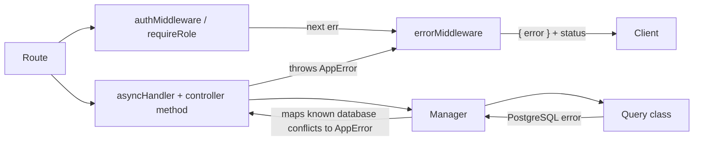
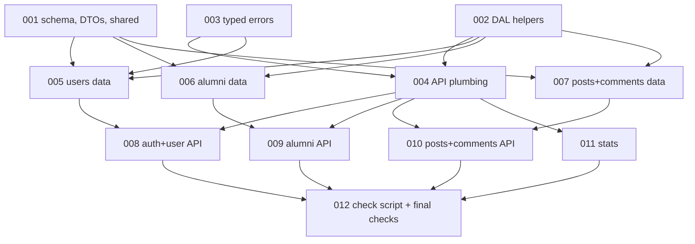

# Finish the backend API — Architecture

| Field | Value |
|---|---|
| REQ | REQ-fs-003 |
| Status | validated |
| Created | 2026-10-06 |
| Related ADRs | [[architecture/adr-11-typed-errors-and-one-error-middleware\|ADR-11]] (accepted 2026-10-06), [[architecture/adr-12-list-endpoints-answer-items-total-page-limit\|ADR-12]] (accepted 2026-10-06), [[architecture/adr-02-admin-deletes-any-post-edits-only-own\|ADR-02]], [[architecture/adr-03-one-alumni-profile-per-user-created-by-that-user\|ADR-03]], [[architecture/adr-05-post-list-returns-author-name-and-photo\|ADR-05]], [[architecture/adr-06-deleting-rows-that-other-rows-reference\|ADR-06]], [[architecture/adr-08-mentoring-and-field-stay-two-new-alumni-columns\|ADR-08]] |

## Summary

The four controller files become classes and a fifth, `AuthController`, takes login. Handlers stop catching errors: they throw typed errors (`NotFoundError`, `ConflictError`, ...) and one error middleware turns every error into `{ error }` with a status. Under that, the Query classes gain the two alumni columns, search and paging for alumni and users, joined reads for posts and comments, a comment count worked out when read, and deletes that take comments and replies with them in one transaction. A small `stats` slice is added top to bottom. A Node script checks the whole API over HTTP; the owner runs it. Layers stay routes → controllers → Managers → Query classes, and nothing under `frontend/` changes.

## Blast radius

| Path | Why touched | Risk |
|---|---|---|
| `backend/src/api/app.ts` | mount `/api/stats`; add the 404 handler and the error middleware after the routes | medium |
| `backend/src/api/controllers/UserController.ts` | class; no `try`/`catch`; list with search and paging; 404, 409 answers; `login` and `verifyToken` move out | high |
| `backend/src/api/controllers/AuthController.ts` (new) | `login` | medium (auth) |
| `backend/src/api/controllers/AlumniController.ts` | class; new fields; list, filters, `/me`; 409 on a second profile | high |
| `backend/src/api/controllers/PostController.ts` | class; paged list | medium |
| `backend/src/api/controllers/CommentController.ts` | class; comments of one post; checks on create | medium |
| `backend/src/api/controllers/StatsController.ts` (new) | counts | low |
| `backend/src/api/routes/{User,Auth,Alumni,Post,Comment}Routes.ts` | bind instance methods; new routes | medium |
| `backend/src/api/routes/StatsRoutes.ts` (new) | `GET /api/stats` | low |
| `backend/src/api/MiddleWare/authMiddleware.ts`, `roleMiddleware.ts` | pass errors to the error middleware; token check imports `utils/token.ts` | medium (auth) |
| `backend/src/api/MiddleWare/errorMiddleware.ts` (new) | the one error middleware and the 404 handler | high |
| `backend/src/api/utils/asyncHandler.ts` (new) | lets a rejected promise reach the error middleware (Express 4) | medium |
| `backend/src/api/utils/token.ts` (new) | `signToken`, `verifyToken` | medium (auth) |
| `backend/src/api/utils/requestHelpers.ts` | `parseId`, `parsePaging`, query-string and field checks | medium |
| `backend/src/businessLogic/src/errors.ts` (new), `index.ts` | the typed errors | low |
| `backend/src/businessLogic/src/{User,Alumni,Post,Comment}Manager.ts` | new pass-through methods; map database conflicts to typed errors | medium |
| `backend/src/businessLogic/src/StatsManager.ts` (new) | pass-through | low |
| `backend/src/dal/errors.ts` (new) | names the kind of a PostgreSQL error by its code | medium |
| `backend/src/dal/query/transaction.ts` (new) | `withTransaction` (in `query/` because it holds `BEGIN` / `COMMIT`; AC35) | medium |
| `backend/src/dal/query/listHelpers.ts` (new) | paging types, `LIKE` escaping | low |
| `backend/src/dal/query/updateSet.ts` | the one update input type (m4) | low |
| `backend/src/dal/query/{User,Alumni,Post,Comment}Query.ts` | new SQL (see Approach) | high |
| `backend/src/dal/query/StatsQuery.ts` (new) | counts | low |
| `backend/src/dal/dto/*.ts`, `dal/index.ts` | nullable fields, new alumni fields, author fields, exports | medium |
| `shared/types/alumni.types.ts`, `posts.types.ts`, `comment.types.ts`, `list.types.ts` (new) | the contract the new frontend will read | low |
| `db/schema.md` | two alumni columns, edited by hand from the owner's statement | low |
| `.adlc/context/architecture.md` | schema summary (AC13) | low |
| `scripts/api-check.mjs` (new) | the API check script | low |
| `docs/roadmap.md` | B3, B3a, B4, B5 done — at wrap-up | low |
| Root `CLAUDE.md` | says "there is no dedicated `AuthController`" and "login lives in `UserController`"; stale after this REQ. Proposed edit is shown to the owner at wrap-up | low |

Not touched: `frontend/`, `backend/src/server.ts`, `backend/src/api/server.ts`, `TestManager.ts`, `TestDal.ts`, `postman/` (its collections go stale; noted for wrap-up), the compiled `.js` / `.d.ts` files in `shared/` (the frontend imports only `user.types`, from source).

## Approach

### 1. Errors (ADR-11)

- **Typed errors** live in `businessLogic/src/errors.ts`, so both Managers and controllers can throw them: `AppError(status, message)` and `ValidationError` 400, `UnauthorizedError` 401, `ForbiddenError` 403, `NotFoundError` 404, `ConflictError` 409.
- **Express is 4.22**, which does not catch a rejected promise. `utils/asyncHandler.ts` exports `handler(controller, "method")`: it binds the method to its instance and forwards a rejection to `next`. No new dependency.
- **Controllers** are plain classes with the same method names as today's functions. A method reads the request, checks, calls a Manager, sends the answer. For a refusal it throws. Owner checks stay in the controllers with `isSelf` / `isAdmin`, in the same order as today (AC12).
- **`errorMiddleware`** (four arguments, registered last): `AppError` → its status and message; a JSON parse failure from `express.json()` → 400 `Request body is not valid JSON`; a PostgreSQL error named by `classifyDbError` → 400 `Invalid value in request` (bad value, missing required value) or 409 `Request conflicts with existing data` (unique, foreign key); anything else → 500 `Internal server error`. The last two groups are written to the server log with `console.error`; the client never sees the database text. A handler for unmatched `/api` URLs sits just before it and throws `NotFoundError("Route not found")`.
- **`dal/errors.ts`** exports `classifyDbError(err)`, which reads only the error's `code` and `constraint`. It is the single place that knows PostgreSQL codes. `UserManager` uses it to turn the `User_email_key` conflict into `ConflictError("This email is already registered")` and the foreign-key failure on delete into the ADR-06 message. That makes both answers correct even when two requests race.
- **`:id`** is read with `parseId(req.params.id)` at the top of each method: positive whole number or `ValidationError("Invalid id")`. It runs after the token check, so a caller with no token still gets 401.
- **Token code** moves to `utils/token.ts`. It reads `JWT_SECRET` inside the functions, not when the file loads: the root `.env` is loaded as a side effect of importing the DAL, and a file that reads the secret at load time depends on import order.

### 2. One update input type (m4, G31)

`updateSet.ts` exports `UpdateValue = string | number | boolean | null` and `UpdateFields<K> = Partial<Record<K, UpdateValue>>`. Each Query exports its column-name type; `updateUser`, `updatePost`, `updateAlumni` and their Managers take `UpdateFields<...>`. In the controller, `checkFields(sent, rules)` runs one rule per key and returns `UpdateFields<K>` or throws `ValidationError("<key> has the wrong type")`, so no cast is needed. DTO fields for nullable columns become `T | null`. The two field lists per update stay (G30, owner's decision).

### 3. Alumni columns, search and lists (ADR-12)

- `AlumniQuery`: one constant holds the joined read (`a.*`, `u.name`, `u.email`, `u.photo_url`, `LEFT JOIN "User"`) and every read uses it. `createAlumni` and the updatable list gain `mentorship_available` and `field`.
- `listAlumni(filter, page)` builds its `WHERE` from fixed pieces with bound values, runs a count and a page query, and orders by `a.id DESC`. `q` uses `ILIKE` with `%`, `_` and the backslash escaped by `likePattern`; the SQL has no `ESCAPE` clause, because backslash is PostgreSQL's default and a backslash typed in a template string is easy to lose. `department` and `field` are compared trimmed, and `/filters` returns them trimmed. `getFilterValues()` runs three `SELECT DISTINCT` reads. `findAlumniByUserId(userId)` returns the lowest `id`.
- `UserQuery.listUsers(filter, page)` works the same way over `PUBLIC_USER_COLUMNS`, ordered by `id`.
- `parsePaging(req.query)` in `requestHelpers.ts` applies the paging rules once (default 12, cap 50, 400 on a bad number). Controllers answer `{ items, total, page, limit }`.
- Route order in `AlumniRoutes`: `/filters`, `/me`, `/email/:email`, then `/:id`.
- A second profile: `AlumniQuery.createAlumni` takes a per-user advisory lock inside a transaction, checks for an existing profile, then inserts; it returns nothing when one exists and the controller throws `ConflictError`. The lock makes a double-clicked "create" safe without a schema change. A `UNIQUE` constraint would still be the stronger guard; that stays the owner's call (ADR-03).
- Managers take their parameter types from the Query methods (`Parameters<...>`), so three parallel tasks do not all need to add exports to `dal/index.ts`.
- `stats`: `StatsRoutes` → `StatsController` → `StatsManager` → `StatsQuery`, one statement with four counts.

### 4. Feed data and deletes

- **Post reads** name the post columns, join `"User"` for `name` and `photo_url`, and work out `comment_count` with a counting sub-query. The stored `posts.comment_count` column is not read or written any more: a number counted at read time cannot drift (G11). `createPost` and `updatePost` write, then return the row through the same joined read, so every post answer has one shape and a right count. The unused `updateCommentCount` and `getPostsByUserId` are removed from Query and Manager.
- **Comments of a post**: `CommentQuery.listCommentsByPost(postId)`, joined to `"User"`, oldest first. `CommentController.getCommentsByPost` is bound in `PostRoutes` at `/:id/comments` and answers 404 when the post does not exist.
- **Deletes** (answers ADR-06's open question: the transaction lives in the Query layer, because SQL lives only there). `CommentQuery.deleteComment(id)` is one statement with a recursive query that removes the comment and every reply under it. `PostQuery.deletePost(id)` uses `withTransaction`: remove the post's comments and everything under them, then the post; any failure rolls all of it back. `UserQuery.deleteUser(id)` stays one `DELETE` and reports whether a row went; the database's own foreign keys refuse a user with content, and `UserManager` turns that into the 409.
- **Comment create** checks in the controller: `post_id` is a positive whole number and the post exists (404); a `parent_id`, when sent, exists and is on the same post (400).

### 5. API check script

`scripts/api-check.mjs`, plain Node with the built-in `fetch`, no new dependency. It signs up its own test users with unique emails, runs the checks, prints `PASS` / `FAIL` per check and a summary, and exits 1 on any failure. Admin checks need an existing admin: the email and password come from environment variables, never from a file, and the script never prints a token or a password. Without them the admin checks are reported as skipped. It writes to the database it is pointed at and lists the test rows it could not remove.

## Task DAG

### Tier 0
- `TASK-001` — schema doc, DTOs and shared types
- `TASK-002` — DAL helpers: database error kinds, transaction, list helpers, update input type
- `TASK-003` — typed errors in businessLogic

### Tier 1
- `TASK-004` — API plumbing: async handler, token util, error middleware, request helpers, the two middlewares, `app.ts` — depends on 002, 003
- `TASK-005` — users data layer — depends on 001, 002, 003
- `TASK-006` — alumni data layer — depends on 001, 002
- `TASK-007` — posts and comments data layer — depends on 001, 002

### Tier 2
- `TASK-008` — auth and user controllers and routes — depends on 004, 005
- `TASK-009` — alumni controller and routes — depends on 004, 006
- `TASK-010` — post and comment controllers and routes — depends on 004, 007
- `TASK-011` — stats, top to bottom — depends on 004

### Tier 3
- `TASK-012` — API check script and the whole-REQ checks — depends on 008–011

No two tasks in one tier edit the same file. Between tier 1 and tier 2 the API workspace does not compile (Managers have new method names, controllers still call the old ones); tier 1 tasks prove themselves with `tsc` on `dal` and `businessLogic` only. `npm run build` must pass from the end of tier 2.

## Test strategy

There is no test runner (conventions). Three layers of proof:

1. **Compiler.** `npm run build`, plus `npx tsc --noEmit -p backend/src/dal` and `-p backend/src/businessLogic` (G28). Each task runs what applies to it.
2. **Reading the SQL.** Every new statement is checked against `db/schema.md` name by name, and every `$n` is counted against its value list ([[knowledge/lessons/LESSON-REQ-fs-001-1]]). TASK-012 repeats this across the whole diff.
3. **`scripts/api-check.mjs`** run by the owner against the real database, before the implement gate is approved. It covers AC2–AC10, AC12, AC14–AC16 and AC18–AC33. Claude never starts the API or runs the script.

## Convention alignment

- Layers: every new endpoint goes route → controller → Manager → Query. SQL only in `dal/query/`, parameterized, real names from `db/schema.md`.
- "Controllers are classes; routes bind instance methods" and "one shared error middleware; no per-method `try`/`catch` for HTTP mapping": built here.
- Every non-public route keeps `authMiddleware`; `GET /api/users` keeps `requireRole("admin")`.
- No endpoint returns `password`: the new joins name their `"User"` columns ([[knowledge/concepts/user-join-read-shape]]).
- File names follow `*Query.ts`, `*Manager.ts`, `*Controller.ts`, `*Routes.ts`.
- **One deviation to note:** Managers gain a `try`/`catch` in three places (`UserManager.createUser`, `updateUser`, `deleteUser`). It maps a database conflict to a typed error; it does not pick an HTTP answer for a request. This is the "validation" half of the Manager's job.
- No new npm dependency.

## Risks

| Risk | Likelihood | Mitigation |
|---|---|---|
| A handler bound without `handler(...)` swallows a rejection and the request hangs | med | TASK-012 searches every route file: each route's last argument must be a `handler(...)` call |
| New SQL has a typo the build cannot see | med | name-by-name check against `db/schema.md` in each data task and again in TASK-012; the owner's script run |
| A status code from REQ-fs-002 changes by accident in the rewrite | med | controllers keep method names, messages and check order; the script re-runs the REQ-fs-002 rules (AC12) |
| The recursive delete removes more than intended | low | it starts from one comment id, or from one post's comments, and follows `parent_id` only downward; the script checks a sibling comment survives |
| `JWT_SECRET` read before `.env` is loaded | low | `token.ts` reads it inside the functions |
| A value longer than a `varchar(100)` column now answers a generic 400 instead of the database text | low | accepted: the message is plain and no detail leaks; form limits belong to the frontend REQs |
| Two sign-ups or two profile creates at the same instant | low | email: the database constraint decides and the answer is still 409. Profile: a per-user advisory lock around check-and-insert |
| The hand-edited `db/schema.md` differs from the real table | low | the block is marked hand-edited; the owner can paste real `\d alumni` output |
| `postman/` collections are stale after this REQ | high | not fixed here; listed for wrap-up as a follow-up |

## Open questions

- [ ] Root `CLAUDE.md` describes the old auth layout. The corrected wording is proposed at wrap-up; the owner decides.
- [ ] `posts.comment_count` stays in the table but is unused. Dropping it is a schema change for the owner to decide later.
- [ ] `comment` has no index on `posts_id`. The counting sub-query and the comments-of-a-post read scan the table; fine at today's size. An index is a schema change for the owner to decide later.
- [ ] AC38 (roadmap rows) has no task on purpose: `/wrapup` updates `docs/roadmap.md`.

## Stress-test (2026-10-06)

A full pass ran before the design gate; the report is `architecture-adversary.md`. 0 critical, 2 major, 7 minor. All nine are handled:

| Finding | What it said | Handling |
|---|---|---|
| ADV-001 major | an `ESCAPE` clause with a backslash, typed in a template string, breaks every `q` search | fixed: no `ESCAPE` clause; TASK-002, 005, 006 |
| ADV-002 major | Managers needed types that three parallel tasks would each export from `dal/index.ts` | fixed: Managers use `Parameters<...>` of the Query method |
| ADV-003 minor | nullable-column list incomplete; nullable `role` breaks `signToken` typing | fixed: TASK-001 works row by row from `db/schema.md`; TASK-008 passes `role ?? ""` |
| ADV-004 minor | a missing `JWT_SECRET` would answer 401 | fixed: only token errors become 401; TASK-004 |
| ADV-005 minor | `BEGIN` / `COMMIT` outside `dal/query/` breaks AC35 as written | fixed: the helper lives in `dal/query/transaction.ts` |
| ADV-006 minor | a double-submitted profile create beats the 409 check | fixed: advisory lock in `AlumniQuery.createAlumni`; TASK-006, 009 |
| ADV-007 minor | filter values untrimmed, query values trimmed | fixed: both sides trimmed; TASK-006 |
| ADV-008 minor | `post_id` and `parent_id` read by different rules | fixed: both through `parseId`; TASK-010 |
| ADV-009 minor | AC38 has no task; no index on `comment(posts_id)` | accepted: wrap-up owns the roadmap; the index is noted above |

## Related

- Spec: REQ-fs-003 — resolve the folder per `core/VAULT-LAYOUT.md`
- Concepts: [[knowledge/concepts/partial-update-sent-fields]], [[knowledge/concepts/user-join-read-shape]]
- Components: [[knowledge/components/api-controllers-and-routes]], [[knowledge/components/dal-query-classes]]
- Lessons checked: [[knowledge/lessons/LESSON-REQ-fs-001-1]], [[knowledge/lessons/LESSON-REQ-fs-001-2]], [[knowledge/lessons/LESSON-REQ-fs-001-3]], [[knowledge/lessons/LESSON-REQ-fs-001-4]], [[knowledge/lessons/LESSON-REQ-fs-002-1]], [[knowledge/lessons/LESSON-REQ-fs-002-2]], [[knowledge/lessons/LESSON-REQ-fs-002-3]], [[knowledge/lessons/LESSON-REQ-fs-002-4]]
- Gotchas: G08, G11, G16, G24, G25, G26, G28, G29, G30, G31, G32, G34
- ADRs: ADR-11 and ADR-12 (accepted at this REQ's design gate); ADR-02, ADR-03, ADR-05, ADR-06, ADR-08 (in effect)
