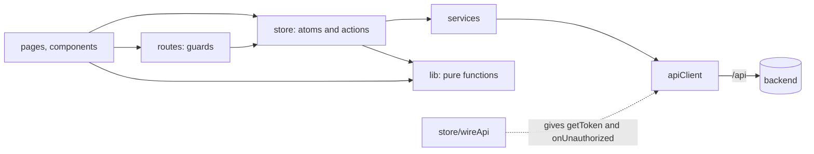
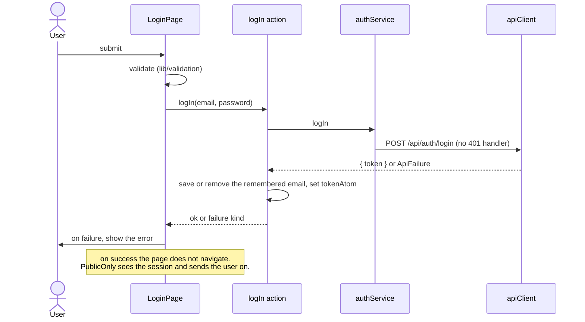
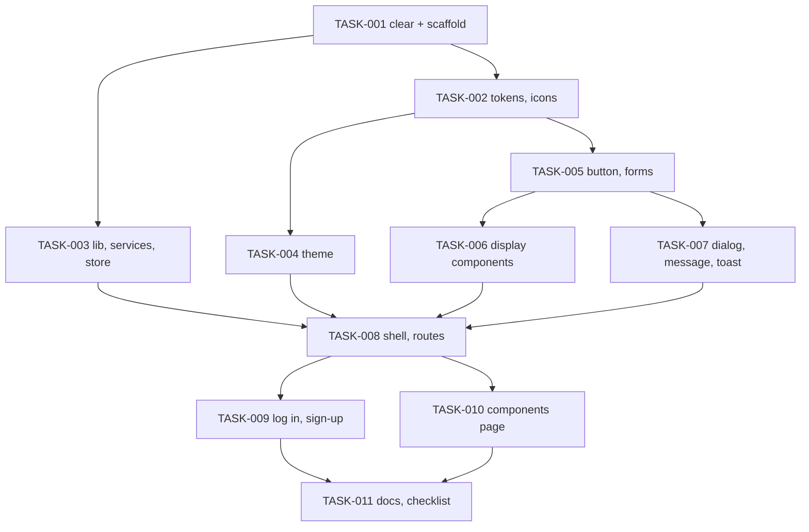

# New frontend, part 1 of 4: foundation, theme, base components, app shell, log in and sign-up — Architecture

| Field | Value |
|---|---|
| REQ | REQ-fs-004 |
| Status | validated (owner approved 2026-10-07) |
| Created | 2026-10-07 |
| Related ADRs | [[architecture/adr-13-frontend-structure-css-modules-on-tokens\|ADR-13]] (accepted), [[architecture/adr-14-session-and-theme-kept-in-the-browser\|ADR-14]] (accepted), [[architecture/adr-01-sign-up-role-is-student-or-alumni\|ADR-01]], [[architecture/adr-04-profile-photo-is-a-url-field\|ADR-04]], [[architecture/adr-07-design-direction-oak-ink-band\|ADR-07]], [[architecture/adr-09-white-label-app-name-from-one-constant\|ADR-09]], [[architecture/adr-10-about-page-last-privacy-and-password-reset-later\|ADR-10]], [[architecture/adr-11-typed-errors-and-one-error-middleware\|ADR-11]] |

## Summary

`frontend/src` is emptied and rebuilt. The legacy Ant Design app (51 files) is deleted, three packages leave `frontend/package.json` (`antd`, `@ant-design/icons`, `@fontsource-variable/inter`) and one arrives (`@fontsource-variable/hanken-grotesk`, the self-hosted font). The new code has four layers that depend one way: pages and components → store (Jotai atoms and actions) → services (one axios client) → the API. Styling is CSS Modules that read CSS custom properties from one token file. The theme is set on `<html data-theme>` by a small script in `index.html` before the first paint. Nothing under `backend/`, `shared/` or `db/` changes.

## Blast radius

| Path | Why touched | Risk |
|---|---|---|
| `frontend/src/**` (51 legacy files) | deleted; list under "Legacy files" | medium — the owner approved this exact list at the design gate, 2026-10-07 |
| `frontend/src/**` (new, about 95 files) | the new app; layout under "Approach" | medium |
| `frontend/package.json`, `package-lock.json` | three packages out, one in; `npm install` | medium — needs the network once |
| `frontend/index.html` | theme script in `<head>`, title placeholder, `lang` | low |
| `frontend/vite.config.ts` | a small plugin that writes the app name and the theme key into `index.html`; proxy unchanged | low |
| `frontend/public/favicon.svg` | replaced: today it is the Vite logo | low |
| `frontend/public/icons.svg` | deleted: nothing uses it | low |
| `scripts/frontend-style-check.mjs`, `scripts/frontend-lib-check.ts` | new checks (see "Test strategy") | low |
| `docs/frontend-patterns.md` | new (AC63) | low |
| `docs/roadmap.md`, root `CLAUDE.md`, `.adlc/context/design-system.md`, `.adlc/context/conventions.md`, `.adlc/context/architecture.md`, `.adlc/context/project-overview.md` | updated at wrap-up (AC64) | low |
| `backend/**`, `shared/**`, `db/**` | **not touched** | — |

`frontend/tsconfig*.json` and `frontend/eslint.config.js` need no change. `frontend/README.md` (the Vite template text) is left alone.

### Legacy files (to delete)

Everything tracked under `frontend/src/` today, plus one public file:

- `frontend/src/App.tsx`, `main.tsx`
- `frontend/src/assets/` — `hero.png`, `react.svg`, `vite.svg`
- `frontend/src/components/auth/` — `LoginForm.tsx`, `SignUpForm.tsx`
- `frontend/src/components/common/` — `AsyncContent.tsx`, `Can.tsx`, `ConfirmDelete.tsx`, `DataTable.tsx`, `EmptyState.tsx`, `ErrorState.tsx`, `FormModal.tsx`, `LoadingState.tsx`, `PageHeader.tsx`, `RoleTag.tsx`, `UserAvatar.tsx`
- `frontend/src/components/layout/` — `AppLayout.tsx`, `AuthLayout.tsx`, `HeaderUserMenu.tsx`, `SideMenu.tsx`
- `frontend/src/constants/` — `roles.ts`, `validation.ts`
- `frontend/src/hooks/` — `useCurrentUser.ts`, `useIsMobile.ts`, `useLogout.ts`, `useRequest.ts`
- `frontend/src/pages/` — `admin/UserManagementPage.tsx`, `alumni/AlumniDetailPage.tsx`, `alumni/AlumniListPage.tsx`, `auth/LoginPage.tsx`, `auth/SignUpPage.tsx`, `dashboard/DashboardPage.tsx`, `dev/ComponentPreviewPage.tsx`, `errors/ForbiddenPage.tsx`, `errors/NotFoundPage.tsx`, `posts/PostsFeedPage.tsx`, `profile/ProfilePage.tsx`
- `frontend/src/routes/` — `RequireAuth.tsx`, `RequireRole.tsx`, `paths.ts`
- `frontend/src/services/` — `apiClient.ts`, `authApi.ts`, `usersApi.ts`
- `frontend/src/store/authAtom.ts`
- `frontend/src/theme/` — `roleColors.ts`, `theme.ts`
- `frontend/src/types/` — `api.ts`, `auth.ts`
- `frontend/src/utils/jwt.ts`
- `frontend/public/icons.svg`

Some new files reuse a legacy path (`App.tsx`, `main.tsx`, `routes/paths.ts`, `services/apiClient.ts`). They are written new, not edited. The ideas worth keeping from the legacy code are the token decoder (payload only, never the signature) and the "this 401 means wrong password, not expired session" flag on the login call.

## Approach

### Folder layout (`frontend/src`)

```
main.tsx                 mounts the app: store provider, styles, font
App.tsx                  the route table, pages loaded on demand
config/
  app.ts                 APP_NAME, CONTACT_EMAIL            (ADR-09)
  storageKeys.ts         the three browser storage keys     (ADR-14)
styles/
  tokens.css             every token, light and dark
  base.css               reset, body, headings, focus ring, reduced motion
lib/                     pure functions, no React, no browser globals at import
  token.ts               read a token's payload and expiry
  validation.ts          field validators that return a message or null
  initials.ts            "Nadia Rahman" -> "NR"
  browserStorage.ts      get / set / remove that never throw
services/
  apiClient.ts           the one axios instance
  apiError.ts            turns any failure into one ApiFailure shape
  authService.ts         logIn
  userService.ts         signUp, getUser, logOut
store/
  appStore.ts            the one Jotai store
  sessionAtoms.ts        token, session, auth notice
  sessionActions.ts      logIn, signUp, logOut actions
  profileAtoms.ts        the logged-in user's name and photo
  themeAtoms.ts          theme choice and the applied theme
  toastAtoms.ts          the toast list
  wireApi.ts             connects the store to apiClient, once
routes/
  paths.ts               every address in one object
  RequireAuth.tsx        logged-in guard
  RequireAdmin.tsx       admin guard
  PublicOnly.tsx         sends a logged-in user away from log in and sign-up
hooks/
  useDocumentTitle.ts
icons/                   one small component per icon
components/
  ui/<Name>/<Name>.tsx + <Name>.module.css      base components
  shell/                 AppShell, Header, PhoneMenu, Band, Footer, ThemeSwitch, SkipLink
  auth/                  AuthLayout (band panel beside the form)
pages/
  LoginPage/, SignUpPage/, DashboardPage/, DirectoryPage/, AlumniProfilePage/,
  FeedPage/, MyProfilePage/, UsersPage/, NotFoundPage/, NoAccessPage/, dev/ComponentsPage/
components/shell/BeingBuilt/    the shared "This page is being built" block
```

Naming: components and their folders are PascalCase; every other file is camelCase; a stylesheet has the name of its component plus `.module.css`. There is no barrel file (`index.ts`) for components: a file is imported by its path, so two tasks never edit the same list.

### Layers



- A component never imports `axios` or anything from `services/`. It reads atoms and calls actions.
- `services/` knows nothing about the store. `store/wireApi.ts` hands `apiClient` two functions at start-up: how to read the token, and what to do on a 401.
- `lib/` is pure, so it can be run from the command line without a browser.

### Tokens and styles (ADR-13)

`styles/tokens.css` holds every token. The 27 color tokens keep the README names. The names this REQ adds:

| Group | Tokens |
|---|---|
| Font | `--font-family`; `--weight-regular` 400, `--weight-medium` 500, `--weight-semibold` 600, `--weight-bold` 700 |
| Type size and line height | `--text-band` 60px (36px phone) / `--leading-band` 1 (1.05 phone); `--text-display` 44 / 1.05; `--text-h1` 32 / 1.15; `--text-h2` 24 / 1.2; `--text-h3` 18 / 1.3; `--text-body` 16 / 1.5; `--text-small` 14 / 1.45; `--text-caption` 13 / 1.4 (each with a matching `--leading-*`) |
| Letter spacing | `--tracking-band` -0.035em (-0.03em phone); `--tracking-tight` -0.03em (display, H1); `--tracking-snug` -0.02em (H2, app name) |
| Spacing | `--space-1` 4px, `--space-2` 8, `--space-3` 12, `--space-4` 16, `--space-5` 24, `--space-6` 32, `--space-7` 48, `--space-8` 64 |
| Shape | `--radius` 2px; `--border-edge` 1.5px; `--border-line` 1px; `--focus-width` 3px; `--focus-offset` 2px |
| Controls | `--control-h` 44px; `--control-h-sm` 36px; `--control-h-lg` 48px; `--check-size` 20px |
| Layout | `--header-h` 72px (60px phone); `--content-max` 1200px; `--gutter` 32px (16px phone); `--band-overlap` 56px (52px phone); `--bar-w` 72px; `--bar-h` 8px; `--nav-marker` 4px; `--form-max` 420px; `--dialog-max` 440px; `--measure` 620px |
| Sizes | `--icon-sm` 16px, `--icon-md` 18px, `--icon-lg` 24px; `--avatar-sm` 32px, `--avatar-md` 44px, `--avatar-lg` 72px |
| Layers | `--z-header` 100, `--z-toast` 400 (dialogs and the phone menu use the browser's top layer and need no number) |

Rules:

- A component stylesheet holds no color value and no `px` or `em` literal. Every size is a token. A size that is not on a scale gets a named token in `tokens.css` with a comment that says where it comes from. `scripts/frontend-style-check.mjs` enforces this.
- Light values sit on `:root, [data-theme="light"]`; dark values on `[data-theme="dark"]`. `color-scheme` is set in both blocks. Components never read the theme.
- Tokens that change on phone (`--header-h`, `--gutter`, `--text-band`, `--band-overlap`) are redefined once in `tokens.css` inside the phone media query, so components do not repeat the rule.
- **Phone layout starts below 768px** (`max-width: 767.98px`). CSS variables cannot be used in a media query, so this number is the one literal allowed in component stylesheets, always written the same way. The log-in and sign-up pages stack by wrapping (as `login.html` does), not by this breakpoint.
- The dialog backdrop is `color-mix(in srgb, var(--band) 60%, transparent)`: no new color.
- Hover for a table row is `--sunken` (`system.html` says so). A pressed button looks like its hover. No warning or info color is added.

### Sizes in the pictures that are not on the README scale

The README says: where a screen and the README disagree, the README wins and the owner is told. The pictures use sizes the README's type and spacing scales do not have. The plan snaps each to the nearest step:

| In the pictures | Built as | Why |
|---|---|---|
| 15px text in inputs, nav links, dialog text | 16px (Body) in inputs and running text; 14px (Small) on buttons and nav links | 15 is not in the type scale; 16px in inputs also stops phones from zooming in on focus |
| 17px and 18px app name | 18px (H3 size), weight 700 | scale |
| 19px band sub text | 18px, weight 400 | scale |
| 64px log-in headline | 60px (band heading) | scale |
| 12px initials in the 32px avatar | 13px (Caption) | scale |
| paddings and gaps of 6, 10, 14, 20, 40, 56px | nearest spacing step (8, 8 or 12, 12 or 16, 24, 48, 48) | spacing scale; card padding becomes 24px, as the README's card row says |
| 40px theme buttons in the header | 36px (small control) | control heights are 44, 36, 48 |
| phone accent bar 48×6px | 72×8px | README section 4 gives one size |
| header user block drawn as a menu button with a chevron | a link to My profile, no chevron | README section 4 |
| select drawn as a button with a list | a real `<select>`, styled, with the chevron icon | README section 10: real elements |
| "Quiet" button (system.html) | built as a fourth variant, `quiet`; the danger text button is `quiet` in the danger color | drawn in the system picture, used by later screens |

_Decided by the owner at the design gate, 2026-10-07: snap to the README scale._

### Theme (ADR-14)

- The choice (`light`, `dark`, `system`) is kept in `localStorage` under `ua.theme`. Nothing saved means `system`.
- A short classic script in the `<head>` of `index.html` reads the key, works out light or dark (asking `matchMedia` for `system`), and sets `data-theme` on `<html>` before the stylesheet paints. If storage cannot be read it falls back to system.
- `vite.config.ts` gets a 15-line plugin that replaces `%APP_NAME%` and `%THEME_STORAGE_KEY%` in `index.html` with the constants from `src/config/`. So the app name and the key are each written once. Those two config files hold plain constants only (no DOM), because the Vite config imports them.
- At run time `store/themeAtoms.ts` holds the choice, writes it to storage, sets `data-theme`, and listens to `prefers-color-scheme` while the choice is `system`.
- `ThemeSwitch` has two looks: three icon buttons (header, log in, sign-up) and three text buttons (phone menu). The chosen one has `aria-pressed="true"` and the `--action` color.

### Session (ADR-14)



- **Token.** Kept in `localStorage` under `ua.token`, mirrored in `tokenAtom`. `sessionAtom` is derived: `{ userId, role, expiresAt }` or `null`. `role` is `"student" | "alumni" | "admin" | null`; an unknown role gives `null`, and the user is still logged in ([[knowledge/gotchas#^g42|G42]]). The frontend reads the payload only; the server checks the signature.
- **Ending a session: one action.** `endSessionAtom` clears the token and the profile and sets the auth notice to `sessionEnded`. Everything that finds a dead session uses it: the 401 handler, the guard, and the start-up check. Nothing else clears a session except Log out.
- **Expiry.** A token past its `exp`, or one that cannot be read, counts as no session. At start-up (`wireApi`) such a stored token is ended before the first render. `RequireAuth` checks the clock on every render of a guarded route and, when the token has run out, redirects and runs `endSessionAtom` in an effect. So an expired session always shows "Your session has ended. Log in again.", whether it was found at load, by a click, or by a 401.
- **401 rule.** `apiClient` calls `onUnauthorized` when a response is 401 and the request was not marked `skipAuthHandling` (log in, sign-up and log out are marked) and the token on that request is still the current token. `onUnauthorized` dispatches `endSessionAtom`.
- **Auth notice.** One atom, `null | "sessionEnded" | "loggedOut"`. The log-in page shows "Your session has ended. Log in again." for `sessionEnded` and nothing for `loggedOut`. A successful log in clears it.
- **Where the user lands after log in: one decider.** `RequireAuth` puts the return address (`state.from`) on its redirect, except when the notice is `loggedOut` (the token and the notice change in the same store update, so the guard sees both). `PublicOnly` is the only code that navigates after a log in: when a session appears it goes to `state.from` if there is one, else to the Dashboard. The log-in and sign-up pages never navigate on success. This removes the race between a page's own `navigate` and the guard's redirect.
- **Other tabs.** A `storage` event listener keeps `tokenAtom` in step, so logging out in one tab logs out the others.
- **Log out.** Calls `PUT /api/users/:id/logout` (failure ignored), then clears the token and the profile, sets the notice to `loggedOut`, and goes to log in.
- **Profile.** `profileAtom` is `{ status: "idle" | "loading" | "ready" | "error", user }`. `AppShell` loads it when the session's user id changes; `loadProfileAtom` first sets `loading` with `user: null`, so one user's name is never shown to the next. The header shows a skeleton while loading and a plain avatar on error (AC41).
- **Remembered email.** `ua.rememberedEmail` in `localStorage`. `logInAtom` takes `rememberEmail` and, on success and before it sets the token, writes the email or removes the key. The page may already be unmounting by then, so the page does not do it.
- **What is sent.** Email and name are trimmed; the password is never trimmed. The email's letter case is kept as typed (the database treats case as different). Name and email inputs carry `maxLength={100}` (the columns are `varchar(100)`).

### Errors

`services/apiError.ts` turns anything thrown by axios into `ApiFailure = { kind: "network" } | { kind: "http", status: number }`. Screens choose their own words by `kind` and `status`; they never show the server's text. Log in: 401 → "The email or password is not correct." Sign-up: 409 → the Email field error. Everything else → "Something went wrong. Try again."

### Routes

| Address | Page | Guard |
|---|---|---|
| `/login` | Log in | public only |
| `/signup` | Sign-up | public only |
| `/` | goes to `/dashboard` | logged in |
| `/dashboard` | Dashboard (being built) | logged in |
| `/directory` | Directory (being built) | logged in |
| `/directory/:id` | Alumni profile (being built) | logged in |
| `/feed` | Feed (being built) | logged in |
| `/profile` | My profile (being built, with Log out) | logged in |
| `/users` | Users (being built) | admin; others see "You do not have access to this page" |
| `/dev/components` | Components page | development build only |
| anything else | Page not found | logged in (a visitor is sent to log in first) |

`BrowserRouter` with `React.lazy` per page and one `Suspense` inside the shell, so the header stays while a page loads. Every route has its own page file (`pages/DashboardPage/`, `DirectoryPage/`, `AlumniProfilePage/`, `FeedPage/`, `MyProfilePage/`, `UsersPage/`), so the build really has one file per page (AC6) and parts 2 to 4 replace a file each. On a route change the shell moves focus to the page's `<h1>` and the tab title changes. The legacy app had log in at `/`; that address now leads to the Dashboard or, for a visitor, to `/login`.

### Components

- **Field wiring.** `Field` gives a control its `<label>`, help text and error text, with ids from `useId`, `aria-describedby` and `aria-invalid`. `TextInput`, `PasswordInput`, `Select` and `Textarea` all use it.
- **Forms.** No form library. A page holds its values in state, runs the validators from `lib/validation.ts` on submit, shows the messages, and focuses the first field with an error. Forms carry `noValidate` so the browser's own bubbles do not appear.
- **Button.** One component: `variant` `primary | secondary | quiet | danger`, `tone="danger"` for the quiet red text button, `size` `md | sm | lg`, `busy`. While busy it has `aria-busy` and `aria-disabled`, ignores presses and shows `busyLabel` if given. No spinner.
- **Dialog and phone menu.** Both use the native `<dialog>` element opened with `showModal()`. The browser then keeps focus inside, closes on Escape, makes the page behind inert and returns focus on close.
- **Toast.** `toastAtoms.ts` holds a short list; `ToastViewport` (mounted once, in `App.tsx`) shows them in a `role="status"` region at the bottom corner. A toast leaves after 5 seconds, waits while it is hovered or focused, and has a Dismiss button.
- **Table.** Generic `Table<T>` with a `columns` list. Each cell carries its column name in `data-label`; in the phone layout the row turns into a card and CSS shows the label before the value.
- **Pagination.** Real `<button>`s in a `<nav aria-label="Pages">`; the current one has `aria-current="page"`.
- **Avatar.** Shows `` when a photo link is given and it starts with `http://` or `https://`; `onError` swaps to initials. The `` has `referrerPolicy="no-referrer"` and `loading="lazy"`, so a photo host does not learn which page was open. An `http://` photo on an `https://` site may be blocked by the browser; it then falls back to initials, which is intended.
- **Icons.** One small React component per icon in `src/icons/`, drawn from the SVG paths in the design files, `stroke="currentColor"`, 2px stroke, `aria-hidden`. No icon package.
- **Being built.** One `BeingBuilt` component (in `components/shell/`) takes a heading and a sub text. Each unbuilt route has its own thin page file that renders it with its own words.

### Font

`@fontsource-variable/hanken-grotesk`, imported once in `main.tsx`. It is one variable font file served from our own build, so no request leaves for a font service. `--font-family` is `'Hanken Grotesk Variable', 'Hanken Grotesk', 'Segoe UI', Helvetica, sans-serif`. If the package cannot be installed, the implementer stops and asks; it does not fall back to a font service on its own.

## Task DAG

### Tier 0
- `TASK-001` — Remove the legacy app, change packages, scaffold an app that builds

### Tier 1
- `TASK-002` — Tokens, base styles, font, icons, the style check
- `TASK-003` — Pure library, services, session store, the library check

### Tier 2
- `TASK-004` — Theme: boot script, theme store, ThemeSwitch
- `TASK-005` — Button, Link and form controls

### Tier 3
- `TASK-006` — Tag, Avatar, Card, Table, Pagination, loading / empty / error states
- `TASK-007` — Dialog, Message, Toast

### Tier 4
- `TASK-008` — App shell, routes and guards, being-built pages

### Tier 5
- `TASK-009` — Log in and sign-up pages
- `TASK-010` — Components page (development only)

### Tier 6
- `TASK-011` — `docs/frontend-patterns.md`, manual checklist, final checks



## Test strategy

There is no test runner, and this REQ does not add one. Proof comes from five places:

1. **`npm run build`** from the repo root exits 0 (it runs `tsc -b`, so type errors fail it). Run at the end of every task.
2. **`scripts/frontend-lib-check.ts`** (new, run with `npx tsx`): runs the pure functions alone and exits non-zero on a wrong answer. It covers the validators (each message of AC46 and AC53, plus values that must pass), the token reader (good token, expired, no `exp`, broken base64, unknown role, non-numeric `sub`), and initials. Each case is written from the spec, and includes inputs the code could get wrong ([[knowledge/lessons/LESSON-REQ-fs-003-4]], [[knowledge/lessons/LESSON-REQ-fs-003-2]]).
3. **`scripts/frontend-style-check.mjs`** (new, run with `node`): fails if any file under `frontend/src` except `styles/tokens.css` holds a color literal; if a `*.module.css` holds a `px` or `em` literal outside the one breakpoint line; if `antd` or `axios` is imported outside `services/`; if "University Alumni" or the contact email appears outside `config/app.ts`; if a `.tsx` has `onClick` on a `div` or `span`. Proves AC1, AC3, AC8, AC11, AC60 by machine.
4. **Build output check** for AC6 and AC31: `frontend/dist/assets` has a separate file per page, and no file contains the text of the components page.
5. **Browser.** The review phase runs the app and compares log in, sign-up, the shell and the components page with the pictures in both themes at 1440px, 768px and 360px. The owner runs `manual-checklist.md` (AC65) against the real backend.

## Convention alignment

- Jotai atoms in `src/store/`; API calls in `src/services/` with relative `/api` paths; no API call in a UI component; types from `@alumni/shared` — as [[context/conventions]] "Frontend" says.
- No UI library, no CSS framework, no new `antd` import ([[architecture/adr-07-design-direction-oak-ink-band|ADR-07]]).
- App name and contact email from one config file ([[architecture/adr-09-white-label-app-name-from-one-constant|ADR-09]]).
- Compiler rules obeyed: `verbatimModuleSyntax` (`import type`), `erasableSyntaxOnly` (no enums; unions of string literals), `noUnusedLocals`, `noUnusedParameters`.
- Frontend file naming was "for `/architect` to propose" in [[context/conventions]]; the proposal is in ADR-13.
- **One addition, not a deviation:** a new package, `@fontsource-variable/hanken-grotesk`. It replaces `@fontsource-variable/inter` and is not a UI library. It needs the owner's yes at this gate.
- No magic strings: addresses in `routes/paths.ts`, storage keys in `config/storageKeys.ts`, messages as named constants beside the form that shows them.

## Risks

| Risk | Likelihood | Mitigation |
|---|---|---|
| `npm install` fails (no network, or the font package name is wrong) | low | TASK-001 checks with `npm view` first; on failure it stops and asks |
| The token is in `localStorage`, so a script injected into the page could read it | low | No `dangerouslySetInnerHTML`; React escapes text; photo links must start with `http(s)://`; the token lasts one hour. A cookie the script cannot read needs a backend change, which is out of scope. Recorded in ADR-14 |
| A deep link such as `/login` gives 404 on Apache if it has no fallback to `index.html` | medium | Not new: the legacy app already used `/dashboard` and `/signup`. On the manual checklist: reload on `/login` on the deployed site |
| The Vite config importing two files from `src/config` breaks `tsc -b` for the node project | low | TASK-001 proves it with a build. Fallback: write the two values in `index.html` and let the style check compare them with the constants |
| Snapping picture sizes to the scale makes a screen look different from its picture | medium | The table above is shown to the owner at this gate; the browser review compares both |
| Parallel tasks need a token that `tokens.css` lacks | medium | TASK-002 writes the full list above first; a later task appends to a marked block and says so in its notes |
| Without a real backend and database the review cannot log in | medium | Pure parts are checked by script; the owner's manual checklist covers the rest |
| Native `<dialog>` and `color-mix` need a browser from 2023 or later | low | Accepted; all current browsers have both |
| An inline script would be blocked by a strict Content-Security-Policy | low | There is no CSP today. If one is added later, move the script to a file in `public/` (noted in ADR-14) |

## Stress-test (2026-10-07)

A separate agent attacked this plan before the gate; its report is `architecture-adversary.md`. Four findings held up, 0 critical, 1 major, 3 minor. All four are fixed in this document and in the tasks:

| Finding | Severity | What was wrong | Fix |
|---|---|---|---|
| ADV-001 | major | The log-in page and the `PublicOnly` guard both navigated after a log in, so where the user landed depended on timing; and the "ignore the return address after a log out" check read the notice after it was cleared | One decider: `PublicOnly`. `RequireAuth` leaves the return address out after a log out. Pages never navigate on success. Two checklist steps added (TASK-003, 008, 009, 011) |
| ADV-002 | minor | A token the guard found expired only redirected: nothing was cleared and no message shown | One `endSessionAtom` used by the 401 handler, the guard and a start-up check; the profile resets on a user change (TASK-003, 008) |
| ADV-003 | minor | Six routes shared one page file, so "one file per page" could not be checked | A thin page file per route (TASK-008) |
| ADV-004 | minor | A photo link loaded from any host and sent the page address with it | `referrerPolicy="no-referrer"` and `loading="lazy"` on the avatar image (TASK-006) |

One wording change to the spec follows from ADV-002: AC42 now says an expired token at load shows the session-ended message.

## Open questions

- [ ] The real contact email (the placeholder stays until the owner gives it).
- [ ] Whether a buyer may change tokens (their own accent color): not decided here; [[context/design-system]] leaves it open.

## Related

- Spec: REQ-fs-004 — resolve the folder per `core/VAULT-LAYOUT.md`
- Exploration: `exploration.md` in this folder. Two corrections to it: `PUT /api/users/:id/logout` answers an **empty** 200 (G41), not a user; and the legacy code is deleted, not followed, apart from the two ideas named above.
- Concepts: (none yet)
- Components: [[knowledge/components/frontend-app]] (stub)
- Lessons checked: [[knowledge/lessons/LESSON-REQ-fs-003-4]], [[knowledge/lessons/LESSON-REQ-fs-003-2]], [[knowledge/lessons/LESSON-REQ-fs-002-3]], [[knowledge/lessons/LESSON-REQ-fs-003-6]] (shared types are the contract; this REQ only reads them)
- Gotchas: [[knowledge/gotchas#^g38|G38]], [[knowledge/gotchas#^g41|G41]], [[knowledge/gotchas#^g42|G42]], [[knowledge/gotchas#^g34|G34]]
- ADRs: ADR-13 and ADR-14 (accepted 2026-10-07); ADR-01, ADR-04, ADR-07, ADR-09, ADR-10, ADR-11
- Design: `docs/design/README.md`, `docs/design/screens/`

## Added during review (recorded at wrap-up, 2026-10-07)

The folder layout above is the plan. Review round 1 added seven files, all placed by the layer rules (finding ARCH-004):

| File | Why |
|---|---|
| `hooks/useModalDialog.ts` | the native-dialog logic that `ui/Dialog` and `shell/PhoneMenu` had each copied |
| `hooks/useFormError.ts` | the error message, its focus effect and the double-submit guard of both auth pages |
| `config/layout.ts` | the phone-layout query, written once for TypeScript (style-check rule j pins the CSS copies to it) |
| `config/text.ts` | the one `LOADING_TEXT` |
| `lib/returnAddress.ts` | the open-redirect guard, moved out of `PublicOnly` so the library check reaches it |
| `lib/pageRange.ts` | the page-number logic, moved out of `Pagination` for the same reason |
| `components/shell/navLabels.ts` | the "Main" and "My profile" labels shared by Header and PhoneMenu |

Also changed by the fixes: `lib/token.ts` gained `isLiveSession` and `isAdmin`; `services/apiClient.ts` gained the `withoutToken` flag; `routes/paths.ts` gained `AFTER_LOG_IN_STATE`; the root `package.json` gained the script `check:frontend` (the one edit outside `frontend/`, `scripts/` and `docs/`, approved with "fix all"). Everything else is as planned.
