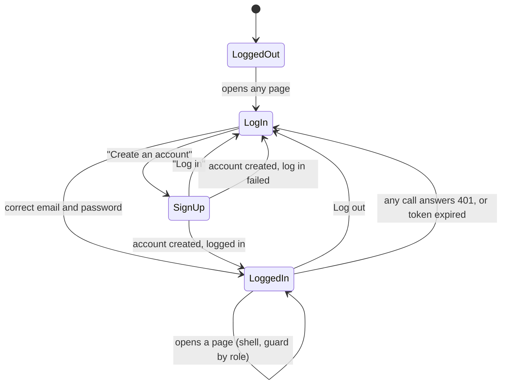

# New frontend, part 1 of 4: foundation, theme, base components, app shell, log in and sign-up

| Field | Value |
|---|---|
| REQ | REQ-fs-004 |
| Status | validated (owner approved 2026-10-07) |
| Phase | spec |
| Created | 2026-10-07 |
| Primary repo | alumni-details-system |
| Touched repos | alumni-details-system |
| Roadmap rows | F1, F2, F3, F4, F5 (`docs/roadmap.md`) |
| Related | [[context/design-system]], [[architecture/adr-01-sign-up-role-is-student-or-alumni\|ADR-01]], [[architecture/adr-04-profile-photo-is-a-url-field\|ADR-04]], [[architecture/adr-07-design-direction-oak-ink-band\|ADR-07]], [[architecture/adr-09-white-label-app-name-from-one-constant\|ADR-09]], [[architecture/adr-10-about-page-last-privacy-and-password-reset-later\|ADR-10]], [[architecture/adr-11-typed-errors-and-one-error-middleware\|ADR-11]] |

## Problem

The backend is finished for the redesign (REQ-fs-001 to REQ-fs-003), but nothing a user sees has changed. `frontend/src` is still the legacy Ant Design app: 30 files import `antd`, only log in and sign-up do real work, and the other six pages are stubs of 15 to 29 lines. It has no design tokens, no dark theme, no phone layout, and it does not look like the approved design ("Oak, ink band", `docs/design/`). Every later screen (directory, profiles, feed, dashboard, users) needs the same base first: tokens, theme, components, the page shell and a logged-in user.

## Goal

After this REQ `frontend/src` is a new, clean codebase with no UI library. It has every design token for light and dark, a theme switch (light, dark, system) with no flash on load, the base components of the design system, the app shell (header, band, footer, phone menu, route guards), and working log in and sign-up screens that match `login.html` and `signup.html` in both themes. A user can sign up, log in, see the shell with their name, switch theme, and log out. Pages that later parts build show "This page is being built" inside the shell. `docs/frontend-patterns.md` records each pattern used. The backend and the database are untouched.

## Non-goals

- No directory, alumni profile, My profile form, feed, dashboard or users screen. Parts 2 to 4 build them.
- No backend change and no database change. If a screen needs something the API does not give, stop and ask.
- No change to `shared/` types. If a type is missing or wrong, stop and ask.
- No About page, Privacy page or password reset ([[architecture/adr-10-about-page-last-privacy-and-password-reset-later|ADR-10]]). The footer has no "About" link.
- No test runner. Proof is `npm run build`, a browser review, and a manual checklist the owner runs.

## Acceptance criteria

"Phone layout" means the narrow layout of `docs/design/README.md` section 4; the width where it switches is proposed at the design gate.

### Part 1 — Foundation (roadmap F1)

- [ ] **AC1.** `frontend/src` is rebuilt. No file in it imports `antd`, `@ant-design/icons` or `@fontsource-variable/inter`, and the three packages are gone from `frontend/package.json`. No UI library and no CSS framework is added. Styles are CSS Modules that read CSS custom properties.
- [ ] **AC2.** Every legacy file in `frontend/src` is either replaced by new code or deleted. The list of files to delete is shown to the owner and approved before any file is deleted.
- [ ] **AC3.** State is in Jotai atoms under `src/store/`. API calls are in `src/services/` and use relative `/api` paths. No UI component calls the API directly or imports `axios`.
- [ ] **AC4.** There is one API client. It adds the token to every request when the user is logged in. When any call other than log in answers 401, the user is logged out and sent to the log-in page, which shows "Your session has ended. Log in again."
- [ ] **AC5.** Request and response types come from `@alumni/shared` (`LoginUserDTO`, `LoginResponse`, `SignUpUserDTO`, `PublicUser`, `ApiError`). No copy of them is written in `frontend/src`. Nothing imports the legacy `User` or `CreateUserDTO` types.
- [ ] **AC6.** Every page is loaded on demand: the production build puts each page in its own file, and the first load of the log-in page does not download the code of the other pages.
- [ ] **AC7.** `npm run build` exits 0 from the repo root.
- [ ] **AC8.** The app name and the alumni office contact email are two exported constants in one config file. The text "University Alumni" and the email appear nowhere else in `frontend/src`. The browser tab title uses the app name constant.

### Part 2 — Tokens and theme (roadmap F2)

- [ ] **AC9.** All 27 color tokens of `docs/design/README.md` section 2 exist as CSS variables with the exact light and dark values. The set is switched by a `data-theme` attribute on the root element, and `color-scheme` is set to match.
- [ ] **AC10.** Type sizes, weights, the eight spacing steps, the radius, the two border widths, control heights, header heights, content width and layer order (z-index) are tokens too. Their names are proposed at the design gate.
- [ ] **AC11.** No component stylesheet and no `.tsx` file contains a color value (hex, `rgb`, `hsl` or a named color). Sizes and spacing in components come from tokens.
- [ ] **AC12.** The font is Hanken Grotesk in weights 400, 500, 600 and 700, with the fallback `'Segoe UI', Helvetica, sans-serif`.
- [ ] **AC13.** The theme has three choices: light, dark, system. With nothing saved, it is system. System follows `prefers-color-scheme` and changes live when the operating system setting changes.
- [ ] **AC14.** The choice is saved in the browser and is still there after a reload and after closing the browser.
- [ ] **AC15.** The saved theme is applied before the first paint. Reloading with dark saved never shows a light page first, on any route, including a slow connection.
- [ ] **AC16.** Components never branch on the theme. They read tokens only.

### Part 3 — Base components (roadmap F3)

Each one follows its row in `docs/design/README.md` section 5 and its picture in `system.html` and `system-dark.html`.

- [ ] **AC17.** Button: primary, secondary, danger as a solid button and danger as a text button; sizes 44px, 36px and 48px; hover as in [[context/design-system]] "Hover"; a disabled state; a busy state that cannot be pressed twice. It is a real `<button>`.
- [ ] **AC18.** TextInput, Select and Textarea: label above, help or error text below, a disabled state (`--sunken`, `--muted`), an error state. The label is a real `<label>` tied to the control. The error text is tied to the control so a screen reader reads it.
- [ ] **AC19.** Checkbox: a real checkbox with a label, plus the variant that sits in an `--accent-soft` box.
- [ ] **AC20.** Tag: plain, mentoring, and role (Student, Alumni, Admin). Every tag carries words.
- [ ] **AC21.** Avatar: square, initials on `--accent-soft`; shows the photo when a photo link is given, and falls back to initials when the photo fails to load.
- [ ] **AC22.** Card: `--surface`, 1.5px `--edge` border, padding of 24 or 32px.
- [ ] **AC23.** Table: head row `--sunken`, 1px row dividers; in the phone layout each row becomes a card that shows each value with its column name.
- [ ] **AC24.** Pagination: Previous, page numbers, Next and "Page X of Y". The current page uses `--action`. Previous is disabled on the first page and Next on the last.
- [ ] **AC25.** Dialog: centered card with a heading, one sentence and two buttons. Opening moves focus into it, Tab stays inside it, Escape closes it, and closing returns focus to the control that opened it. It is announced as a dialog.
- [ ] **AC26.** Message: error (`--danger-soft`) and success (`--success-soft`), each with words. An error message is announced by a screen reader when it appears.
- [ ] **AC27.** Toast: `--action` background, shows a short text, leaves by itself after a few seconds, can be closed by keyboard, and is announced by a screen reader.
- [ ] **AC28.** States: a loading state made of skeleton blocks filled with `--sunken` (no spinner), an empty state that says what to do next, and an error state with a "Try again" button.
- [ ] **AC29.** Link: a real `<a>`, hover `--accent-soft-text`.
- [ ] **AC30.** Icons are line icons with a 2px stroke that use `currentColor`. No emoji anywhere.
- [ ] **AC31.** A components page, reachable only in development and left out of the production build, shows every component and state above in the current theme, so each can be compared with `system.html` and `system-dark.html`.

### Part 4 — App shell (roadmap F4)

- [ ] **AC32.** Header, desktop: 72px, `--surface`, 1.5px bottom border. Left: the app name and the links Dashboard, Directory, Feed, plus Users only for an admin. The current link is bold with a 4px accent line under it. Right: the theme switch (three icon buttons; the chosen one uses `--action` and is marked as pressed) and the user's avatar and name, which link to My profile.
- [ ] **AC33.** Header, phone layout: 60px with the app name and a menu button. The menu opens full screen, as in `phone-menu.html`: large links, the theme switch as three text buttons (Light, Dark, System), the user block, and Log out. Escape and the close button close it, focus stays inside while it is open, and choosing a link closes it.
- [ ] **AC34.** Band: a full-width `--band` block with a 72×8px accent bar, the page heading and one line of sub text. The heading is 60px on desktop and 36px in the phone layout. The first card overlaps the band by 56px (52px in the phone layout).
- [ ] **AC35.** Footer: the app name on the left. No "About" link.
- [ ] **AC36.** A "Skip to content" link is the first stop for the keyboard on every shell page.
- [ ] **AC37.** A visitor who is not logged in and opens any page except log in and sign-up is sent to log in. After logging in they land on the page they asked for.
- [ ] **AC38.** A logged-in user who opens log in or sign-up is sent to the Dashboard.
- [ ] **AC39.** A logged-in user who is not an admin and opens Users sees a "You do not have access to this page" state inside the shell. No admin-only request is sent.
- [ ] **AC40.** Dashboard, Directory, Alumni profile, Feed, My profile and Users each show the band with their heading and a card with "This page is being built" inside the shell. An address that matches no page shows a "Page not found" state with a link to the Dashboard.
- [ ] **AC41.** The user's name and photo in the header come from the API (`GET /api/users/:id` with the id from the token). While it loads the header shows a skeleton. If it fails, the header still works and shows a plain avatar.
- [ ] **AC42.** A reload keeps the user logged in until the token expires (the backend sets one hour). A token that is already expired at load counts as logged out, and the log-in page shows the session-ended message of AC4.
- [ ] **AC43.** Log out is in the phone menu, and on the My profile "being built" page until part 3 builds the real one. It calls `PUT /api/users/:id/logout`, then removes the token and goes to log in. If that call fails the user is still logged out.

### Part 5 — Log in and sign-up (roadmap F5)

- [ ] **AC44.** The log-in page matches `login.html` and `login-dark.html`: the band panel with the app name, the accent bar, the headline and two lines of text; the theme switch at the top right; the heading "Log in"; Email; Password with a Show / Hide button; the "Remember my email on this device" checkbox; the "Log in" button (48px, primary); "New here? Create an account".
- [ ] **AC45.** Under the form the page shows "Forgot your password? Contact the alumni office." with the contact email from the config constant as a `mailto:` link.
- [ ] **AC46.** Log in validates on submit. Empty email: "Enter your email." Email with a wrong shape: "Enter a valid email, like name@example.com." Empty password: "Enter your password." Each error shows under its field, in words, and focus moves to the first field with an error. No request is sent while there is an error.
- [ ] **AC47.** A wrong email or password shows one error message above the fields: "The email or password is not correct." It does not say which one. The password is sent exactly as typed, without trimming.
- [ ] **AC48.** When the server cannot be reached or answers 500, the form shows "Something went wrong. Try again." and keeps what the user typed.
- [ ] **AC49.** While a request runs the button is busy and a second press does nothing.
- [ ] **AC50.** With "Remember my email" ticked, a successful log in saves the email in the browser and the next visit fills it in. Unticked, a saved email is removed. The password is never saved.
- [ ] **AC51.** The sign-up page matches `signup.html`, and the same layout with the dark tokens: Full name, Email, Password with the help text "At least 8 characters.", the choice "I am a" with Student and Graduate (Student chosen at first), "Photo link (optional)", the "Create account" button, and "Already have an account? Log in".
- [ ] **AC52.** The role choice is a real radio group with a legend. Graduate sends `role: "alumni"`; Student sends `role: "student"`. No other role can be sent.
- [ ] **AC53.** Sign-up validates on submit, each error under its field: empty name "Enter your full name."; empty or wrongly shaped email as in AC46; password under 8 characters "Use at least 8 characters."; a photo link that is filled in but does not start with `http://` or `https://` "Enter a link that starts with https://". An empty photo link is sent as no photo.
- [ ] **AC54.** When the email is already registered (the server answers 409) the error "This email is already registered." shows under the Email field.
- [ ] **AC55.** After a successful sign-up the user is logged in with the same email and password and lands on the Dashboard, with the toast "Account created". If that log in fails, they land on the log-in page with the success message "Account created. Log in to continue."
- [ ] **AC56.** In the phone layout the band panel and the form stack in one column, and nothing on either page needs sideways scrolling at 360px.

### Part 6 — Quality bar

- [ ] **AC57.** Every page and the components page work at 360px wide with no sideways scroll and no cut-off text, and at 200% zoom on a 1280px wide window.
- [ ] **AC58.** Every control and link can be reached and used with the keyboard alone, in an order that follows the page. Each shows the focus ring (3px `--focus`, offset 2px) when focused by keyboard.
- [ ] **AC59.** Text and control contrast meet WCAG AA in both themes. `--accent` is never text and never the only border on a light surface.
- [ ] **AC60.** Controls are real `<button>`, `<a>`, `<label>`, `<input>`, `<select>` and `<textarea>` elements. No clickable `
` or ``.
- [ ] **AC61.** No shadows and no gradients. Motion happens only as an answer to a user action, and none at all when `prefers-reduced-motion` is set.
- [ ] **AC62.** Each page sets its own browser tab title ("Log in · University Alumni", with the name from the constant), and each page has one `<h1>`.

### Part 7 — Records

- [ ] **AC63.** `docs/frontend-patterns.md` exists. For each design pattern used it says what the pattern is, where it lives (file paths), and why it was chosen. It is written so parts 2 to 4 can add to it.
- [ ] **AC64.** `docs/roadmap.md` marks F1 to F5 done at wrap-up. The root `CLAUDE.md` frontend lines and [[context/design-system]] (component paths, token file, the values this REQ decided) are updated at wrap-up.
- [ ] **AC65.** A manual checklist for the owner covers what a build cannot prove: sign up as Student and as Graduate, log in, wrong password, taken email, theme switch and reload, phone menu, keyboard-only pass, log out, and an expired session.

## Flow

## Assumptions

- The whole legacy `frontend/src` can go in this part. Only log in and sign-up do real work there; the other pages are stubs, so nothing a user relies on is lost. This is why `antd` leaves `package.json` now and not in part 4. _(Decided by the owner at the spec gate, 2026-10-07: remove all now.)_
- Sign-up logs the user in (AC55). _(Decided by the owner at the spec gate, 2026-10-07.)_
- The contact email value comes from the owner. Until then the constant holds the placeholder `alumni-office@example.com`. _(Decided by the owner at the spec gate, 2026-10-07: placeholder for now.)_
- The API behaves as REQ-fs-003 left it: `POST /api/auth/login` answers `{ token }` or 401 `{ error }`; the token holds `sub` and `role` and lasts one hour; `POST /api/users` answers the new user or 409 for a taken email; `GET /api/users/:id` answers a `PublicUser`; `PUT /api/users/:id/logout` answers an empty 200 ([[knowledge/gotchas#^g41|G41]]). Read from the code on 2026-10-07.
- A user whose token has no known role ([[knowledge/gotchas#^g42|G42]]) is treated as logged in with no admin link and no access to Users.
- The backend does not check the password length at sign-up. The 8-character rule is only in the form, as the design shows.
- The frontend can check a token's expiry time but not its signature. The server stays the judge: a token the server refuses leads to AC4.
- The dev proxy in `frontend/vite.config.ts` stays as it is. `VITE_API_URL` stays unused.
- Adding a package is allowed only where the owner approves it at the design gate (for example a self-hosted copy of the font). `STATUS: needs verification`

## Open questions

None block the spec. These are design choices that [[context/design-system]] leaves to "the REQ that builds it"; `/architect` proposes each and the owner approves at the design gate:

- [ ] The width where the phone layout starts.
- [ ] Token names for type, spacing, shape and layer order; the token file path; the config file path.
- [ ] How the font is loaded (self-hosted or a font service).
- [ ] Where the token and the theme choice are kept in the browser, and under which keys.
- [ ] The icon set (drawn in the repo, or a package).
- [ ] File and folder naming in `frontend/src`, and the page addresses (the legacy app has log in at `/`).
- [ ] A pressed color for buttons and a hover color for table rows.

## Out of scope (for now)

- Directory, profile, My profile, feed, dashboard, users (parts 2 to 4; roadmap F6 to F9).
- Polish and performance pass (F10), About page (F11).
- Automated tests, password reset by email, Privacy page, deployment (roadmap "Later").
- Rebuilding the stale compiled files in `shared/` ([[knowledge/gotchas#^g38|G38]]).
- Deciding who may see an alumni's email ([[knowledge/gotchas#^g42|G42]]).

## Related

- Concepts: (none yet for the frontend)
- Components: (none yet for the frontend; this REQ is the first touch)
- Lessons: [[knowledge/lessons/LESSON-REQ-fs-003-4]] (a check must be able to fail — the manual checklist and the browser review must include cases the code could get wrong), [[knowledge/lessons/LESSON-REQ-fs-003-2]] (when code cannot be run here, run its pure parts alone — validation and token-expiry rules), [[knowledge/lessons/LESSON-REQ-fs-002-3]] (one shared helper, no small copies beside it)
- Gotchas: [[knowledge/gotchas#^g38|G38]], [[knowledge/gotchas#^g41|G41]], [[knowledge/gotchas#^g42|G42]], [[knowledge/gotchas#^g34|G34]] (the 409 text for a taken email)
- ADRs: [[architecture/adr-01-sign-up-role-is-student-or-alumni|ADR-01]], [[architecture/adr-04-profile-photo-is-a-url-field|ADR-04]], [[architecture/adr-07-design-direction-oak-ink-band|ADR-07]], [[architecture/adr-09-white-label-app-name-from-one-constant|ADR-09]], [[architecture/adr-10-about-page-last-privacy-and-password-reset-later|ADR-10]], [[architecture/adr-11-typed-errors-and-one-error-middleware|ADR-11]]
- Design: `docs/design/README.md`, `docs/design/screens/login.html`, `login-dark.html`, `signup.html`, `phone-menu.html`, `system.html`, `system-dark.html`

## Backlinks

_(populated by /wrapup or manually)_
