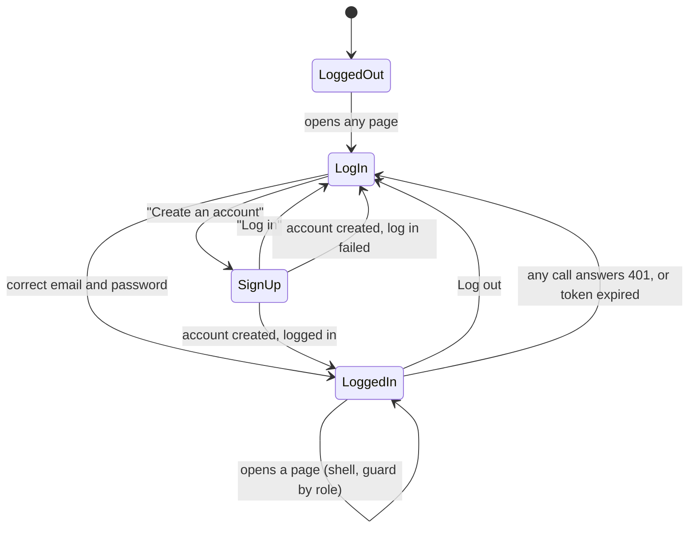
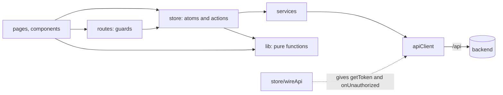
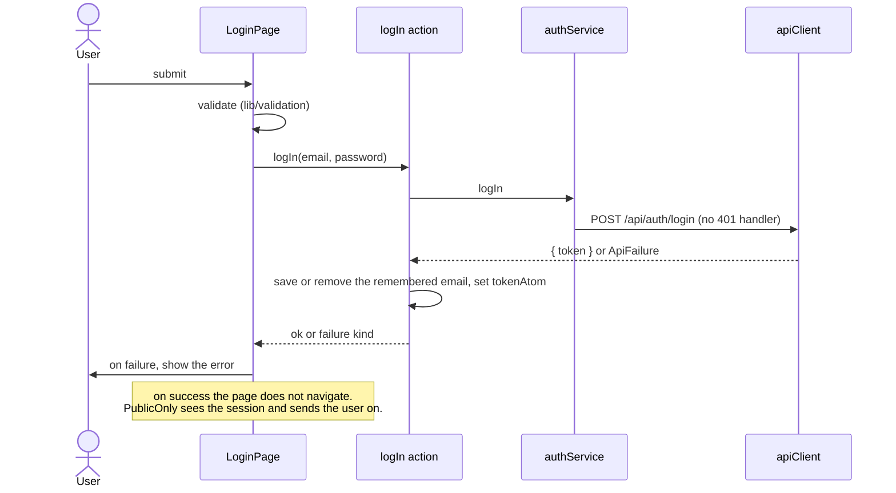
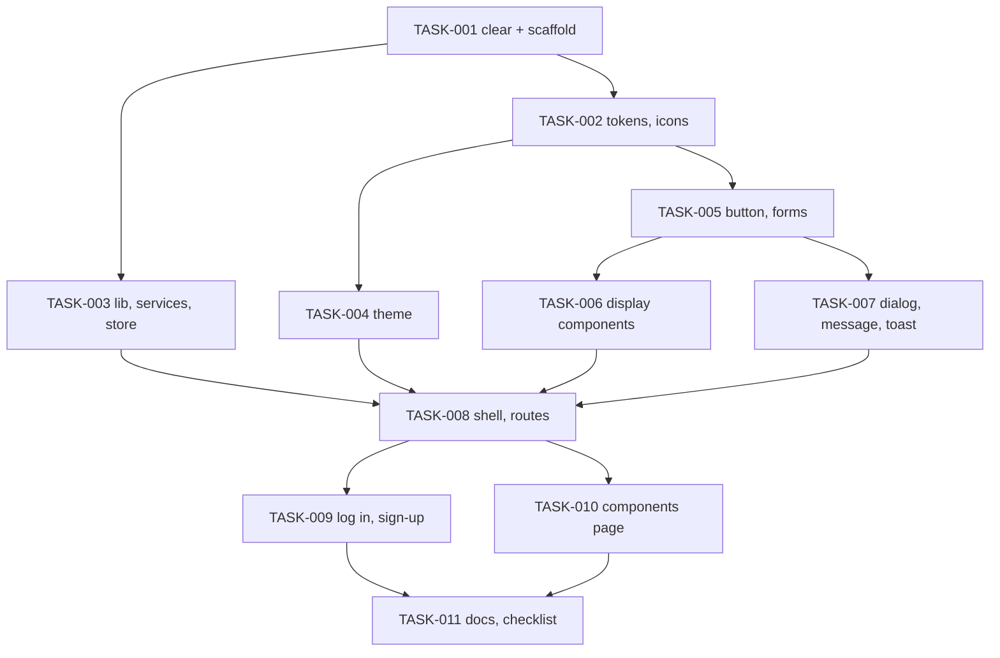

# REQ-fs-004-frontend-foundation-shell-auth — Review Packet

`Packet: 177KB · round 2 · 32 files in this round · diff 126KB · excluded: docs/frontend-patterns.md, package-lock.json, scripts/_tmpfail.ts (a stray test file, to be deleted by the owner), .adlc/**`

This round-2 packet holds only what the fixes changed. The spec, architecture and exploration sections below are the same as in round 1. Round 1's diff is not repeated: you already read it, and the fixes build on it. The fixes are uncommitted on the feature branch (committed state is HEAD, 14 commits past `redesign`). **Do not re-read these via Read — cite this packet.** Your own required reading (conventions, the vault, the files outside the diff) is not a packet gap.

## Round 2 — what changed since round 1

The owner chose "fix all" at the verify gate. Two implementers fixed the 16 actionable findings; the 8 "your call" findings were not touched (m2, m5, m13, m15, m16, m17, m18, t3). Digest of what was fixed, with where to look:

| ID | Was | Fixed in |
|----|-----|----------|
| M1 | dialog logic copied between Dialog and PhoneMenu | new hooks/useModalDialog.ts; Dialog.tsx, PhoneMenu.tsx |
| M2 | redirect guard and pageRange unchecked | new lib/returnAddress.ts, lib/pageRange.ts; scripts/frontend-lib-check.ts (72 to 108 cases) |
| m1 | log in busy forever on an already-expired token | store/sessionActions.ts `requestToken` |
| m3 | log out had no time limit | services/userService.ts (5000 ms) |
| m4 | log-in and sign-up sent an old token | services/apiClient.ts (`withoutToken` flag), authService.ts, userService.ts |
| m6 | form constants and focus effect copied | lib/validation.ts, new hooks/useFormError.ts, LoginPage, SignUpPage |
| m7 | repeated literals | new config/text.ts, new components/shell/navLabels.ts; App, PublicOnly, Skeleton, AppShell, Header, PhoneMenu |
| m8 | checks not wired, two gaps | scripts/frontend-style-check.mjs (rules i, j; f extended), root package.json `check:frontend` |
| m9 | "session is live" written three times | lib/token.ts `isLiveSession`, `isAdmin`; PublicOnly, RequireAuth, RequireAdmin, wireApi |
| m10 | phone breakpoint repeated in TypeScript | new config/layout.ts; PhoneMenu; style-check rule j |
| m11 | header wrapped to 145px at 768 to 850px | Header.module.css (one row; the name shrinks with an ellipsis) |
| m12 | pagination lost focus at the ends | Pagination.tsx |
| m14 | focus left on page top after a log-in redirect | PublicOnly.tsx, AppShell.tsx, routes/paths.ts (`AFTER_LOG_IN_STATE`) |
| t1, t2, t4 | wrong comments; clipped focus ring | App.tsx, themeAtoms.ts, Header.module.css |

Re-check your own findings. Also look for what the fixes themselves may have broken (new duplication, a changed rule, a lost behaviour). Known tradeoff to judge: in the worst case (admin with a long name at 768px) the header name shrinks to about 10px, so only the avatar reads.

## Diff with full context (changed files only, vs HEAD)

```diff
diff --git a/frontend/src/App.tsx b/frontend/src/App.tsx
index 7caea451..2a08a5a8 100644
--- a/frontend/src/App.tsx
+++ b/frontend/src/App.tsx
@@ -1,72 +1,76 @@
 import { Suspense, lazy } from "react";
 import { BrowserRouter, Navigate, Route, Routes } from "react-router-dom";
+import { LOADING_TEXT } from "./config/text";
 import { AppShell } from "./components/shell/AppShell/AppShell";
 import { ToastViewport } from "./components/ui/Toast/ToastViewport";
 import { ANY_OTHER_PATH, PATHS } from "./routes/paths";
 import { PublicOnly } from "./routes/PublicOnly";
 import { RequireAdmin } from "./routes/RequireAdmin";
 import { RequireAuth } from "./routes/RequireAuth";
 
 // Every page is its own file in the build and is fetched when first shown (AC6).
 // NoAccessPage is loaded the same way by RequireAdmin.
 const LoginPage = lazy(() => import("./pages/LoginPage/LoginPage"));
 const SignUpPage = lazy(() => import("./pages/SignUpPage/SignUpPage"));
 const DashboardPage = lazy(() => import("./pages/DashboardPage/DashboardPage"));
 const DirectoryPage = lazy(() => import("./pages/DirectoryPage/DirectoryPage"));
 const AlumniProfilePage = lazy(() => import("./pages/AlumniProfilePage/AlumniProfilePage"));
 const FeedPage = lazy(() => import("./pages/FeedPage/FeedPage"));
 const MyProfilePage = lazy(() => import("./pages/MyProfilePage/MyProfilePage"));
 const UsersPage = lazy(() => import("./pages/UsersPage/UsersPage"));
 const NotFoundPage = lazy(() => import("./pages/NotFoundPage/NotFoundPage"));
 
 // Development only. In a production build the condition is false at build
 // time, so the import is dropped and the page file is not in the bundle (AC31).
 const ComponentsPage = import.meta.env.DEV
   ? lazy(() => import("./pages/dev/ComponentsPage/ComponentsPage"))
   : null;
 
 // The route table. The three guards do all the sending-on (architecture.md,
-// "Routes"): no page navigates after a log in or a log out.
+// "Routes"): after a log in or a log out no page navigates, with one
+// exception: SignUpPage sends the user to log in when the account was created
+// but the log in that follows failed. PublicOnly is the only code that
+// navigates after a successful log in.
 export default function App() {
   return (
     <BrowserRouter>
       <Routes>
         <Route element={<PublicOnly />}>
           <Route path={PATHS.login} element={<LoginPage />} />
           <Route path={PATHS.signup} element={<SignUpPage />} />
         </Route>
 
         {/* Outside the guards and the shell: it needs no session. */}
         {ComponentsPage !== null ? (
           <Route
             path={PATHS.devComponents}
             element={
-              <Suspense fallback={<p className="visuallyHidden">Loading</p>}>
+              <Suspense fallback={<p className="visuallyHidden">{LOADING_TEXT}</p>}>
                 <ComponentsPage />
               </Suspense>
             }
           />
         ) : null}
 
         <Route element={<RequireAuth />}>
           <Route element={<AppShell />}>
             <Route path={PATHS.home} element={<Navigate to={PATHS.dashboard} replace />} />
             <Route path={PATHS.dashboard} element={<DashboardPage />} />
             <Route path={PATHS.directory} element={<DirectoryPage />} />
             <Route path={PATHS.alumniProfile} element={<AlumniProfilePage />} />
             <Route path={PATHS.feed} element={<FeedPage />} />
             <Route path={PATHS.myProfile} element={<MyProfilePage />} />
             <Route element={<RequireAdmin />}>
               <Route path={PATHS.users} element={<UsersPage />} />
             </Route>
             <Route path={ANY_OTHER_PATH} element={<NotFoundPage />} />
           </Route>
         </Route>
       </Routes>
 
       {/* After the pages in the document, so the skip link stays the first
           stop for the keyboard. It is fixed to the corner of the screen. */}
       <ToastViewport />
     </BrowserRouter>
   );
 }
diff --git a/frontend/src/components/shell/AppShell/AppShell.tsx b/frontend/src/components/shell/AppShell/AppShell.tsx
index 1c6b293b..9052ac21 100644
--- a/frontend/src/components/shell/AppShell/AppShell.tsx
+++ b/frontend/src/components/shell/AppShell/AppShell.tsx
@@ -1,80 +1,98 @@
 import { useAtomValue, useSetAtom, useStore } from "jotai";
-import { Suspense, useEffect, useRef } from "react";
+import { Suspense, useEffect, useRef, useState } from "react";
+import type { RefObject } from "react";
 import { Outlet, useLocation } from "react-router-dom";
-import { PATHS } from "../../../routes/paths";
+import { LOADING_TEXT } from "../../../config/text";
+import { PATHS, isAfterLogIn } from "../../../routes/paths";
 import { loadProfileAtom, profileAtom } from "../../../store/profileAtoms";
 import { sessionAtom } from "../../../store/sessionAtoms";
 import { Card } from "../../ui/Card/Card";
 import { Skeleton, SkeletonGroup } from "../../ui/Skeleton/Skeleton";
 import { Footer } from "../Footer/Footer";
 import { Header } from "../Header/Header";
 import { PageLayout } from "../PageLayout/PageLayout";
 import { SkipLink } from "../SkipLink/SkipLink";
 import styles from "./AppShell.module.css";
 
 const MAIN_ID = "main-content";
 
 /** Shown in place of a page while its code is fetched. The header stays. */
 function PageLoading() {
   return (
-    <PageLayout heading="Loading">
+    <PageLayout heading={LOADING_TEXT}>
       <Card>
         <SkeletonGroup>
           <Skeleton shape="title" />
           <Skeleton shape="line" />
           <Skeleton shape="line" />
         </SkeletonGroup>
       </Card>
     </PageLayout>
   );
 }
 
+/**
+ * Rendered next to the page inside Suspense, so its effect runs only once the
+ * page is really there (a lazy page that is still loading shows the fallback
+ * and commits none of its siblings). Moves focus to the page heading.
+ */
+function FocusHeading({ mainRef }: { mainRef: RefObject<HTMLElement | null> }) {
+  useEffect(() => {
+    mainRef.current?.querySelector("h1")?.focus();
+  }, [mainRef]);
+  return null;
+}
+
 /**
  * The frame around every page a logged-in user sees: skip link, header, the
  * page, footer. It also loads the user's own profile for the header.
  */
 export function AppShell() {
   const userId = useAtomValue(sessionAtom)?.userId ?? null;
   const profileStatus = useAtomValue(profileAtom).status;
   const loadProfile = useSetAtom(loadProfileAtom);
   const store = useStore();
-  const { pathname } = useLocation();
+  const { pathname, state } = useLocation();
+  // PublicOnly sent the user here after a log in: a new page for them, so
+  // focus goes to its heading, as for an in-app move. Read once, at mount.
+  const [focusAfterLogIn] = useState(() => isAfterLogIn(state));
   const mainRef = useRef<HTMLElement>(null);
   const shownPath = useRef(pathname);
 
   // The session actions set the profile back to "idle" whenever the user
   // changes, so "idle" means: this user's profile has not been asked for yet.
   // The status is read from the store at that moment, not from this render:
   // in development React runs an effect twice, and the second run must see
   // that the first one already asked.
   useEffect(() => {
     if (userId !== null && store.get(profileAtom).status === "idle") {
       void loadProfile();
     }
   }, [userId, profileStatus, store, loadProfile]);
 
   // A new page: move focus to its heading, so a keyboard or screen reader
   // user starts at the top of it. Not on the first load.
   useEffect(() => {
     const previousPath = shownPath.current;
     shownPath.current = pathname;
     // PATHS.home shows nothing and only sends the user on to the Dashboard.
     if (previousPath === pathname || previousPath === PATHS.home) {
       return;
     }
     mainRef.current?.querySelector("h1")?.focus();
   }, [pathname]);
 
   return (
     <div className={styles.shell}>
       <SkipLink targetId={MAIN_ID} />
       <Header />
       <main ref={mainRef} id={MAIN_ID} className={styles.main} tabIndex={-1}>
         <Suspense fallback={<PageLoading />}>
           <Outlet />
+          {focusAfterLogIn ? <FocusHeading mainRef={mainRef} /> : null}
         </Suspense>
       </main>
       <Footer />
     </div>
   );
 }
diff --git a/frontend/src/components/shell/Header/Header.module.css b/frontend/src/components/shell/Header/Header.module.css
index ffa6fd3e..cc2c66b9 100644
--- a/frontend/src/components/shell/Header/Header.module.css
+++ b/frontend/src/components/shell/Header/Header.module.css
@@ -1,142 +1,152 @@
 /*
  * The header of directory.html (wide) and phone-directory.html (phone).
  * Tokens only. --header-h and --gutter change on a phone through tokens.css.
  */
 .header {
   border-bottom: var(--border-edge) solid var(--edge);
   background: var(--surface);
 }
 
-/* Wraps to a second row when the links and the user do not fit side by side. */
+/* One row at every width from the phone breakpoint up. What gives way is the
+   name beside the avatar (see .userName): it is cut with "…". */
 .inner {
   display: flex;
-  flex-wrap: wrap;
   align-items: center;
   justify-content: space-between;
   gap: 0 var(--space-5);
   max-width: var(--content-max);
   min-height: var(--header-h);
   margin: 0 auto;
   padding: 0 var(--gutter);
 }
 
 .start {
   display: flex;
-  flex-wrap: wrap;
   align-items: center;
   gap: 0 var(--space-7);
-  min-width: 0;
+  flex-shrink: 0;
 }
 
 .appName {
   color: var(--text);
   font-size: var(--text-h3);
   line-height: var(--leading-h3);
   font-weight: var(--weight-bold);
   letter-spacing: var(--tracking-snug);
   text-decoration: none;
 }
 
 .nav {
   display: flex;
   gap: var(--space-1);
+  flex-shrink: 0;
 }
 
 .navLink {
   position: relative;
   display: flex;
   align-items: center;
   height: var(--header-h);
   padding: 0 var(--space-3);
   color: var(--muted);
   font-size: var(--text-small);
   line-height: var(--leading-small);
   font-weight: var(--weight-medium);
   text-decoration: none;
   white-space: nowrap;
 }
 
+/* The ring sits inside the 72px link, clear of the window top and of the
+   marker below: the ring width plus the marker height, in from every side. */
+.navLink:focus-visible {
+  outline-offset: calc(-1 * (var(--focus-width) + var(--nav-marker)));
+}
+
 .navLink[aria-current="page"] {
   color: var(--text);
   font-weight: var(--weight-bold);
 }
 
 /* The marker of the current link: a line at the bottom edge. A drawn box,
    not a shadow (no shadows). It sits beside dark text, so the accent is
    never the only signal. */
 .navLink[aria-current="page"]::after {
   content: "";
   position: absolute;
   inset-inline: 0;
   bottom: 0;
   height: var(--nav-marker);
   background: var(--accent);
 }
 
 .end {
   display: flex;
   align-items: center;
   gap: var(--space-4);
   min-height: var(--header-h);
+  min-width: 0;
 }
 
 /* The link to My profile: avatar and name. */
 .user {
   display: flex;
   align-items: center;
   gap: var(--space-2);
   min-height: var(--control-h);
   padding: 0 var(--space-2);
+  min-width: 0;
   border-radius: var(--radius);
   color: var(--text);
   font-size: var(--text-small);
   line-height: var(--leading-small);
   font-weight: var(--weight-semibold);
   text-decoration: none;
 }
 
-/* A long name is cut with "…", so the header keeps its shape. */
+/* A long name is cut with "…", so the header keeps its shape. It is the one
+   thing that shrinks when the row is tight. */
 .userName {
+  min-width: 0;
   max-width: calc(var(--space-8) * 3);
   overflow: hidden;
   text-overflow: ellipsis;
   white-space: nowrap;
 }
 
 /* The room the skeleton takes while the name loads. */
 .userLoading {
   width: calc(var(--space-8) * 2);
 }
 
 .menuButton {
   display: none;
   align-items: center;
   justify-content: center;
   width: var(--control-h);
   height: var(--control-h);
   margin: 0;
   padding: 0;
   border: 0;
   border-radius: var(--radius);
   background: transparent;
   color: var(--text);
   cursor: pointer;
 }
 
 /* Phone: the app name and the menu button only. */
 @media (max-width: 767.98px) {
   .inner {
     flex-wrap: nowrap;
     padding: 0 var(--space-2) 0 var(--gutter);
   }
 
   .nav,
   .end {
     display: none;
   }
 
   .menuButton {
     display: flex;
     flex-shrink: 0;
   }
 }
diff --git a/frontend/src/components/shell/Header/Header.tsx b/frontend/src/components/shell/Header/Header.tsx
index 095ab5f1..00dc1be2 100644
--- a/frontend/src/components/shell/Header/Header.tsx
+++ b/frontend/src/components/shell/Header/Header.tsx
@@ -1,123 +1,123 @@
 import { useAtomValue } from "jotai";
 import { useCallback, useState } from "react";
 import { Link as RouterLink, NavLink } from "react-router-dom";
 import { APP_NAME } from "../../../config/app";
 import { MenuIcon } from "../../../icons/MenuIcon";
+import { isAdmin } from "../../../lib/token";
 import { PATHS } from "../../../routes/paths";
 import { profileAtom } from "../../../store/profileAtoms";
 import type { Profile } from "../../../store/profileAtoms";
 import { sessionAtom } from "../../../store/sessionAtoms";
 import { Avatar } from "../../ui/Avatar/Avatar";
 import { Skeleton, SkeletonGroup, SkeletonStack } from "../../ui/Skeleton/Skeleton";
+import { MAIN_NAV_LABEL, MY_PROFILE_LABEL } from "../navLabels";
 import { PhoneMenu } from "../PhoneMenu/PhoneMenu";
 import type { PhoneMenuLink } from "../PhoneMenu/PhoneMenu";
 import { ThemeSwitch } from "../ThemeSwitch/ThemeSwitch";
 import styles from "./Header.module.css";
 
-const MY_PROFILE = "My profile";
-
 const EVERYONE_LINKS: readonly PhoneMenuLink[] = [
   { to: PATHS.dashboard, label: "Dashboard" },
   { to: PATHS.directory, label: "Directory" },
   { to: PATHS.feed, label: "Feed" },
 ];
 
 // Users is for admins only. The page has its own guard (RequireAdmin).
 const ADMIN_LINKS: readonly PhoneMenuLink[] = [
   ...EVERYONE_LINKS,
   { to: PATHS.users, label: "Users" },
 ];
 
 /** What the link to My profile holds: the avatar and the name (AC41). */
 function UserBlock({ profile }: { profile: Profile }) {
   // "idle" is the moment before the shell asks for the profile.
   if (profile.status === "idle" || profile.status === "loading") {
     return (
       <>
-        <span className="visuallyHidden">{MY_PROFILE}</span>
+        <span className="visuallyHidden">{MY_PROFILE_LABEL}</span>
         <div className={styles.userLoading}>
           <SkeletonGroup layout="row">
             <Skeleton shape="avatar-sm" />
             <SkeletonStack>
               <Skeleton shape="line" />
             </SkeletonStack>
           </SkeletonGroup>
         </div>
       </>
     );
   }
 
   const name = profile.user?.name?.trim() || null;
 
   // The call failed, or the user has no name: a plain avatar and plain words.
   if (name === null) {
     return (
       <>
         <Avatar size="sm" name={null} photoUrl={profile.user?.photo_url} />
-        {MY_PROFILE}
+        {MY_PROFILE_LABEL}
       </>
     );
   }
 
   return (
     <>
       <Avatar size="sm" name={name} photoUrl={profile.user?.photo_url} />
       <span className={styles.userName}>{name}</span>
-      <span className="visuallyHidden">, {MY_PROFILE}</span>
+      <span className="visuallyHidden">, {MY_PROFILE_LABEL}</span>
     </>
   );
 }
 
 /**
  * The header of every shell page (AC32, AC33). Wide screens: app name, main
  * links, theme switch, the user. Below 768px: the app name and a menu button
  * that opens the full-screen menu.
  */
 export function Header() {
   const session = useAtomValue(sessionAtom);
   const profile = useAtomValue(profileAtom);
   const [menuOpen, setMenuOpen] = useState(false);
 
-  const links = session?.role === "admin" ? ADMIN_LINKS : EVERYONE_LINKS;
+  const links = isAdmin(session) ? ADMIN_LINKS : EVERYONE_LINKS;
   const closeMenu = useCallback(() => setMenuOpen(false), []);
 
   return (
     <header className={styles.header}>
       <div className={styles.inner}>
         <div className={styles.start}>
           <RouterLink className={styles.appName} to={PATHS.dashboard}>
             {APP_NAME}
           </RouterLink>
-          <nav className={styles.nav} aria-label="Main">
+          <nav className={styles.nav} aria-label={MAIN_NAV_LABEL}>
             {links.map(({ to, label }) => (
               // NavLink sets aria-current="page" on the current one.
               <NavLink key={to} className={styles.navLink} to={to}>
                 {label}
               </NavLink>
             ))}
           </nav>
         </div>
 
         <div className={styles.end}>
           <ThemeSwitch variant="icons" />
           <RouterLink className={styles.user} to={PATHS.myProfile}>
             <UserBlock profile={profile} />
           </RouterLink>
         </div>
 
         <button
           type="button"
           className={styles.menuButton}
           aria-label="Open menu"
           aria-haspopup="dialog"
           aria-expanded={menuOpen}
           onClick={() => setMenuOpen(true)}
         >
           <MenuIcon size="lg" />
         </button>
       </div>
 
       <PhoneMenu open={menuOpen} onClose={closeMenu} links={links} profile={profile} />
     </header>
   );
 }
diff --git a/frontend/src/components/shell/PhoneMenu/PhoneMenu.tsx b/frontend/src/components/shell/PhoneMenu/PhoneMenu.tsx
index d645d11f..82787ebb 100644
--- a/frontend/src/components/shell/PhoneMenu/PhoneMenu.tsx
+++ b/frontend/src/components/shell/PhoneMenu/PhoneMenu.tsx
@@ -1,211 +1,159 @@
 import { useSetAtom } from "jotai";
-import { useEffect, useId, useLayoutEffect, useRef, useState } from "react";
+import { useEffect, useId, useRef, useState } from "react";
 import { NavLink, useLocation } from "react-router-dom";
 import { APP_NAME } from "../../../config/app";
+import { PHONE_LAYOUT_QUERY } from "../../../config/layout";
+import { useModalDialog } from "../../../hooks/useModalDialog";
 import { CloseIcon } from "../../../icons/CloseIcon";
 import { PATHS } from "../../../routes/paths";
 import type { Profile } from "../../../store/profileAtoms";
 import { logOutAtom } from "../../../store/sessionActions";
 import { Avatar } from "../../ui/Avatar/Avatar";
 import { Button } from "../../ui/Button/Button";
 import { Skeleton, SkeletonGroup, SkeletonStack } from "../../ui/Skeleton/Skeleton";
+import { MAIN_NAV_LABEL, MY_PROFILE_LABEL } from "../navLabels";
 import { ThemeSwitch } from "../ThemeSwitch/ThemeSwitch";
 import styles from "./PhoneMenu.module.css";
 
 export type PhoneMenuLink = {
   to: string;
   label: string;
 };
 
 export type PhoneMenuProps = {
   open: boolean;
   // Asked for by Escape, the close button, a chosen link, a route change and
   // a window that grew past the phone layout. The caller answers by setting
   // `open` to false; the menu does not close on its own.
   onClose: () => void;
   /** The main links, in order. The menu adds My profile after them. */
   links: readonly PhoneMenuLink[];
   profile: Profile;
 };
 
-// The phone layout, written as in every stylesheet (architecture.md,
-// "Tokens and styles"). The menu closes when the window stops matching it.
-const PHONE_LAYOUT_QUERY = "(max-width: 767.98px)";
-
 /** Who is logged in: avatar, name, email. Nothing when the profile call failed. */
 function Person({ profile }: { profile: Profile }) {
   if (profile.status === "idle" || profile.status === "loading") {
     return (
       <SkeletonGroup layout="row">
         <Skeleton shape="avatar-md" />
         <SkeletonStack>
           <Skeleton shape="title" />
           <Skeleton shape="line" />
         </SkeletonStack>
       </SkeletonGroup>
     );
   }
 
   const { user } = profile;
   if (user === null) {
     return null;
   }
 
   const name = user.name?.trim() || null;
 
   return (
     <div className={styles.person}>
       <Avatar size="md" name={name} photoUrl={user.photo_url} />
       <div className={styles.personText}>
         {name !== null ? <div className={styles.name}>{name}</div> : null}
         <div className={styles.email}>{user.email}</div>
       </div>
     </div>
   );
 }
 
 /**
  * The full-screen menu of the phone layout (AC33, phone-menu.html). A native
  * <dialog> opened with showModal(): the browser moves focus inside, keeps Tab
  * inside, closes on Escape and gives focus back to the menu button.
  * It has its own look; it does not share the card of ui/Dialog.
  */
 export function PhoneMenu({ open, onClose, links, profile }: PhoneMenuProps) {
-  const dialogRef = useRef<HTMLDialogElement>(null);
+  const dialogRef = useModalDialog({ open, onClose });
   const titleId = useId();
   const { pathname } = useLocation();
   const logOut = useSetAtom(logOutAtom);
   const [loggingOut, setLoggingOut] = useState(false);
 
-  // The listeners below are added once, so they read the newest props here.
+  // The effects below read the newest props here (the route-change effect must
+  // not run again when they change).
   const latest = useRef({ open, onClose });
   useEffect(() => {
     latest.current = { open, onClose };
   });
 
-  useEffect(() => {
-    const dialog = dialogRef.current;
-    if (dialog === null) {
-      return;
-    }
-    // showModal() throws on a dialog that is already open.
-    if (open && !dialog.open) {
-      dialog.showModal();
-    } else if (!open && dialog.open) {
-      dialog.close();
-    }
-  }, [open]);
-
-  useEffect(() => {
-    const dialog = dialogRef.current;
-    if (dialog === null) {
-      return;
-    }
-
-    // Escape. The caller owns `open`, so the browser's own close is held back.
-    function handleCancel(event: Event) {
-      event.preventDefault();
-      latest.current.onClose();
-    }
-
-    // The browser closed it anyway (a second Escape in a row is not held
-    // back). Not our own close(): by then `open` is already false.
-    function handleClose() {
-      if (latest.current.open) {
-        latest.current.onClose();
-      }
-    }
-
-    dialog.addEventListener("cancel", handleCancel);
-    dialog.addEventListener("close", handleClose);
-    return () => {
-      dialog.removeEventListener("cancel", handleCancel);
-      dialog.removeEventListener("close", handleClose);
-    };
-  }, []);
-
-  // Removed from the page while open (after Log out): close first, while the
-  // element is still in the page. A layout effect, because a plain effect
-  // cleans up after the element is gone.
-  useLayoutEffect(() => {
-    const dialog = dialogRef.current;
-    return () => {
-      if (dialog !== null && dialog.open) {
-        dialog.close();
-      }
-    };
-  }, []);
-
   // The page changed (a link here, or the browser's Back button).
   useEffect(() => {
     if (latest.current.open) {
       latest.current.onClose();
     }
   }, [pathname]);
 
   // The window grew past the phone layout: the header shows the links again.
   useEffect(() => {
     if (!open) {
       return;
     }
+    // The menu closes when the window stops matching the phone layout.
     const phoneLayout = window.matchMedia(PHONE_LAYOUT_QUERY);
     function handleChange() {
       if (!phoneLayout.matches) {
         latest.current.onClose();
       }
     }
     phoneLayout.addEventListener("change", handleChange);
     return () => phoneLayout.removeEventListener("change", handleChange);
   }, [open]);
 
   // The route guard sends the user to log in when the session is gone, and
   // this menu leaves the page with the shell. Nothing navigates here.
   function handleLogOut() {
     setLoggingOut(true);
     void logOut();
   }
 
   return (
     <dialog ref={dialogRef} className={styles.menu} aria-labelledby={titleId}>
       <h2 id={titleId} className="visuallyHidden">
         Menu
       </h2>
 
       <div className={styles.top}>
         <div className={styles.appName}>{APP_NAME}</div>
         <button
           type="button"
           className={styles.closeButton}
           aria-label="Close menu"
           onClick={onClose}
         >
           <CloseIcon size="lg" />
         </button>
       </div>
 
-      <nav className={styles.links} aria-label="Main">
-        {[...links, { to: PATHS.myProfile, label: "My profile" }].map(({ to, label }) => (
+      <nav className={styles.links} aria-label={MAIN_NAV_LABEL}>
+        {[...links, { to: PATHS.myProfile, label: MY_PROFILE_LABEL }].map(({ to, label }) => (
           // Also closes when the link leads to the page that is already open.
           <NavLink key={to} className={styles.link} to={to} onClick={onClose}>
             {label}
           </NavLink>
         ))}
       </nav>
 
       <div className={styles.theme}>
         {/* The switch names itself "Theme" for a screen reader. */}
         <div className={styles.themeLabel} aria-hidden="true">
           Theme
         </div>
         <ThemeSwitch variant="text" />
       </div>
 
       <div className={styles.account}>
         <Person profile={profile} />
         <Button size="lg" fullWidth busy={loggingOut} onClick={handleLogOut}>
           Log out
         </Button>
       </div>
     </dialog>
   );
 }
diff --git a/frontend/src/components/ui/Dialog/Dialog.tsx b/frontend/src/components/ui/Dialog/Dialog.tsx
index f5623b47..d2c2e0a5 100644
--- a/frontend/src/components/ui/Dialog/Dialog.tsx
+++ b/frontend/src/components/ui/Dialog/Dialog.tsx
@@ -1,102 +1,44 @@
-import { useEffect, useId, useLayoutEffect, useRef } from "react";
+import { useId } from "react";
 import type { ReactNode } from "react";
+import { useModalDialog } from "../../../hooks/useModalDialog";
 import styles from "./Dialog.module.css";
 
 export type DialogProps = {
   open: boolean;
   // Asked for by Escape (and by the caller's own Cancel button). The caller
   // answers by setting `open` to false; the dialog does not close on its own.
   onClose: () => void;
   title: string;
   // The one sentence under the heading.
   children: ReactNode;
   // The buttons, in reading order: Cancel first, the action second.
   actions: ReactNode;
 };
 
 /**
  * A centered card over the page, on the native <dialog> opened with
  * showModal(). The browser then moves focus inside, keeps Tab inside, makes
  * the page behind inert, and gives focus back to the opener on close.
  */
 export function Dialog({ open, onClose, title, children, actions }: DialogProps) {
-  const dialogRef = useRef<HTMLDialogElement>(null);
+  const dialogRef = useModalDialog({ open, onClose });
   const titleId = useId();
   const textId = useId();
 
-  // The listeners below are added once, so they read the newest props here.
-  const latest = useRef({ open, onClose });
-  useEffect(() => {
-    latest.current = { open, onClose };
-  });
-
-  useEffect(() => {
-    const dialog = dialogRef.current;
-    if (dialog === null) {
-      return;
-    }
-    // showModal() throws on a dialog that is already open.
-    if (open && !dialog.open) {
-      dialog.showModal();
-    } else if (!open && dialog.open) {
-      dialog.close();
-    }
-  }, [open]);
-
-  useEffect(() => {
-    const dialog = dialogRef.current;
-    if (dialog === null) {
-      return;
-    }
-
-    // Escape. The caller owns `open`, so the browser's own close is held back.
-    function handleCancel(event: Event) {
-      event.preventDefault();
-      latest.current.onClose();
-    }
-
-    // The browser closed it anyway (a second Escape in a row is not held
-    // back). Not our own close(): by then `open` is already false.
-    function handleClose() {
-      if (latest.current.open) {
-        latest.current.onClose();
-      }
-    }
-
-    dialog.addEventListener("cancel", handleCancel);
-    dialog.addEventListener("close", handleClose);
-    return () => {
-      dialog.removeEventListener("cancel", handleCancel);
-      dialog.removeEventListener("close", handleClose);
-    };
-  }, []);
-
-  // Removed from the page while open: close first, while the element is still
-  // in the page, so focus goes back to the opener. A layout effect, because a
-  // plain effect cleans up after the element is gone.
-  useLayoutEffect(() => {
-    const dialog = dialogRef.current;
-    return () => {
-      if (dialog !== null && dialog.open) {
-        dialog.close();
-      }
-    };
-  }, []);
-
   return (
     <dialog
       ref={dialogRef}
       className={styles.dialog}
       aria-labelledby={titleId}
       aria-describedby={textId}
     >
       <h2 id={titleId} className={styles.title}>
         {title}
       </h2>
       <div id={textId} className={styles.text}>
         {children}
       </div>
       <div className={styles.actions}>{actions}</div>
     </dialog>
   );
 }
diff --git a/frontend/src/components/ui/Pagination/Pagination.tsx b/frontend/src/components/ui/Pagination/Pagination.tsx
index f3b77bb6..e939f5c6 100644
--- a/frontend/src/components/ui/Pagination/Pagination.tsx
+++ b/frontend/src/components/ui/Pagination/Pagination.tsx
@@ -1,115 +1,88 @@
+import { useEffect, useRef } from "react";
+import { clampPage, pageRange } from "../../../lib/pageRange";
 import { Button } from "../Button/Button";
 import styles from "./Pagination.module.css";
 
-// Up to this many pages, every page number is shown.
-const MAX_PAGES_SHOWN_IN_FULL = 7;
-const GAP_TEXT = "…";
-
-export type PageRangeItem = number | "gap";
-
-/**
- * The page numbers to show. Up to 7 pages: all of them. More: the first, the
- * last, the current page and its two neighbours, with "gap" where pages are
- * left out. A gap never stands for one page only; that page is shown instead.
- *
- *   pageRange(1, 3)   -> [1, 2, 3]
- *   pageRange(1, 25)  -> [1, 2, "gap", 25]
- *   pageRange(4, 25)  -> [1, 2, 3, 4, 5, "gap", 25]
- *   pageRange(12, 25) -> [1, "gap", 11, 12, 13, "gap", 25]
- *
- * A page outside 1..pageCount is treated as the nearest page inside.
- * Fewer than 1 page gives [].
- */
-export function pageRange(page: number, pageCount: number): PageRangeItem[] {
-  const last = Number.isFinite(pageCount) ? Math.floor(pageCount) : 0;
-  if (last < 1) {
-    return [];
-  }
-  const current = clampPage(page, last);
-
-  if (last <= MAX_PAGES_SHOWN_IN_FULL) {
-    return Array.from({ length: last }, (_, index) => index + 1);
-  }
-
-  const shown = [1, current - 1, current, current + 1, last].filter(
-    (value, index, all) => value >= 1 && value <= last && all.indexOf(value) === index,
-  );
-
-  const items: PageRangeItem[] = [];
-  let previous = 0;
-  for (const value of shown) {
-    const leftOut = value - previous - 1;
-    if (leftOut === 1) {
-      items.push(value - 1);
-    } else if (leftOut > 1) {
-      items.push("gap");
-    }
-    items.push(value);
-    previous = value;
-  }
-  return items;
-}
-
-function clampPage(page: number, last: number): number {
-  if (!Number.isFinite(page)) {
-    return 1;
-  }
-  return Math.min(Math.max(Math.floor(page), 1), last);
-}
+const GAP_TEXT = "…";
 
 export type PaginationProps = {
   // Counted from 1.
   page: number;
   pageCount: number;
   onChange: (page: number) => void;
 };
 
 export function Pagination({ page, pageCount, onChange }: PaginationProps) {
+  const navRef = useRef<HTMLElement>(null);
+  const keepFocus = useRef(false);
+
+  // Next or Previous that reaches the last or first page turns itself
+  // disabled, and focus would fall to the page body. Once the new page is
+  // shown, focus goes to the current page number instead.
+  useEffect(() => {
+    if (keepFocus.current) {
+      keepFocus.current = false;
+      navRef.current?.querySelector<HTMLElement>('[aria-current="page"]')?.focus();
+    }
+  }, [page]);
+
   const items = pageRange(page, pageCount);
   // One page or none: there is nowhere to go, so nothing is shown.
   if (items.length <= 1) {
     return null;
   }
   const last = Math.floor(pageCount);
   const current = clampPage(page, last);
 
   return (
-    <nav className={styles.nav} aria-label="Pages">
+    <nav ref={navRef} className={styles.nav} aria-label="Pages">
       <ul className={styles.list}>
         <li>
-          <Button disabled={current === 1} onClick={() => onChange(current - 1)}>
+          <Button
+            disabled={current === 1}
+            onClick={() => {
+              keepFocus.current = current - 1 === 1;
+              onChange(current - 1);
+            }}
+          >
             Previous
           </Button>
         </li>
         {items.map((item, index) =>
           item === "gap" ? (
             // A gap sits right after page 1 or right before the last page.
             <li key={index === 1 ? "gap-start" : "gap-end"} className={styles.gap} aria-hidden="true">
               {GAP_TEXT}
             </li>
           ) : (
             <li key={item}>
               <button
                 type="button"
                 className={styles.page}
                 aria-label={`Page ${item}`}
                 aria-current={item === current ? "page" : undefined}
                 onClick={item === current ? undefined : () => onChange(item)}
               >
                 {item}
               </button>
             </li>
           ),
         )}
         <li>
-          <Button disabled={current === last} onClick={() => onChange(current + 1)}>
+          <Button
+            disabled={current === last}
+            onClick={() => {
+              keepFocus.current = current + 1 === last;
+              onChange(current + 1);
+            }}
+          >
             Next
           </Button>
         </li>
       </ul>
       <p className={styles.status}>
         Page {current} of {last}
       </p>
     </nav>
   );
 }
diff --git a/frontend/src/components/ui/Skeleton/Skeleton.tsx b/frontend/src/components/ui/Skeleton/Skeleton.tsx
index cf0fde35..e4b192f0 100644
--- a/frontend/src/components/ui/Skeleton/Skeleton.tsx
+++ b/frontend/src/components/ui/Skeleton/Skeleton.tsx
@@ -1,42 +1,43 @@
 import type { ReactNode } from "react";
+import { LOADING_TEXT } from "../../../config/text";
 import styles from "./Skeleton.module.css";
 
 export type SkeletonShape = "line" | "title" | "avatar-sm" | "avatar-md" | "block";
 
 const SHAPE_CLASS: Record<SkeletonShape, string> = {
   line: styles.line,
   title: styles.title,
   "avatar-sm": styles.avatarSm,
   "avatar-md": styles.avatarMd,
   block: styles.block,
 };
 
 export type SkeletonProps = {
   shape?: SkeletonShape;
 };
 
 /** One still block. Put it inside a SkeletonGroup, which tells a screen reader. */
 export function Skeleton({ shape = "line" }: SkeletonProps) {
   return <span className={`${styles.skeleton} ${SHAPE_CLASS[shape]}`} aria-hidden="true" />;
 }
 
 export type SkeletonGroupProps = {
   // "stack": blocks under each other. "row": side by side, like an avatar and its lines.
   layout?: "stack" | "row";
   children: ReactNode;
 };
 
 /** The loading state of a list, a card or a block: busy, with the word "Loading". */
 export function SkeletonGroup({ layout = "stack", children }: SkeletonGroupProps) {
   return (
     <div className={`${styles.group} ${styles[layout]}`} aria-busy="true">
-      <span className="visuallyHidden">Loading</span>
+      <span className="visuallyHidden">{LOADING_TEXT}</span>
       {children}
     </div>
   );
 }
 
 /** A column of blocks inside a "row" group. It says nothing itself. */
 export function SkeletonStack({ children }: { children: ReactNode }) {
   return <div className={`${styles.group} ${styles.stack}`}>{children}</div>;
 }
diff --git a/frontend/src/lib/token.ts b/frontend/src/lib/token.ts
index ffdb9147..6ca79be1 100644
--- a/frontend/src/lib/token.ts
+++ b/frontend/src/lib/token.ts
@@ -1,72 +1,82 @@
 // Reads what a login token says about its user. Payload only: the frontend
 // never checks the signature, the server does (ADR-14).
 
 export type Role = "student" | "alumni" | "admin";
 
 export interface Session {
   userId: number;
   // null when the token carries no role or one we do not know (G42).
   // Such a user is still logged in.
   role: Role | null;
   // Milliseconds since 1970, or null when the token has no expiry.
   expiresAt: number | null;
 }
 
 const ROLES: readonly Role[] = ["student", "alumni", "admin"];
 const TOKEN_PART_COUNT = 3;
 const PAYLOAD_PART_INDEX = 1;
 const BASE64_BLOCK_LENGTH = 4;
 const MS_PER_SECOND = 1000;
 
 function decodeBase64Url(text: string): string {
   const base64 = text.replaceAll("-", "+").replaceAll("_", "/");
   const missing =
     (BASE64_BLOCK_LENGTH - (base64.length % BASE64_BLOCK_LENGTH)) %
     BASE64_BLOCK_LENGTH;
   const binary = atob(base64 + "=".repeat(missing));
   const bytes = Uint8Array.from(binary, (char) => char.charCodeAt(0));
   return new TextDecoder("utf-8", { fatal: true }).decode(bytes);
 }
 
 function toRole(value: unknown): Role | null {
   return ROLES.find((role) => role === value) ?? null;
 }
 
 /** The session a token describes, or null when the token cannot be read. */
 export function readToken(token: string): Session | null {
   const parts = token.split(".");
   if (parts.length !== TOKEN_PART_COUNT) {
     return null;
   }
 
   let payload: unknown;
   try {
     payload = JSON.parse(decodeBase64Url(parts[PAYLOAD_PART_INDEX]));
   } catch {
     return null;
   }
   if (typeof payload !== "object" || payload === null || Array.isArray(payload)) {
     return null;
   }
 
   const { sub, role, exp } = payload as Record<string, unknown>;
   // The backend always signs a number, so "12" is refused.
   if (typeof sub !== "number" || !Number.isSafeInteger(sub)) {
     return null;
   }
 
   let expiresAt: number | null = null;
   if (exp !== undefined) {
     if (typeof exp !== "number" || !Number.isFinite(exp)) {
       return null;
     }
     expiresAt = exp * MS_PER_SECOND;
   }
 
   return { userId: sub, role: toRole(role), expiresAt };
 }
 
 /** True from the expiry moment on. A session with no expiry never expires here. */
 export function isExpired(session: Session, now: number): boolean {
   return session.expiresAt !== null && now >= session.expiresAt;
 }
+
+/** A session that exists and has not run out on this clock. */
+export function isLiveSession(session: Session | null, now: number): session is Session {
+  return session !== null && !isExpired(session, now);
+}
+
+/** True only for a known admin role. A null session or a null role is not an admin. */
+export function isAdmin(session: Session | null): boolean {
+  return session?.role === "admin";
+}
diff --git a/frontend/src/lib/validation.ts b/frontend/src/lib/validation.ts
index f2a727ca..fa85433c 100644
--- a/frontend/src/lib/validation.ts
+++ b/frontend/src/lib/validation.ts
@@ -1,55 +1,61 @@
 // Field validators for the forms. Each takes the text as typed and returns
 // the message to show under the field, or null when the value is fine.
 
 export const EMAIL_REQUIRED_MESSAGE = "Enter your email.";
 export const EMAIL_INVALID_MESSAGE = "Enter a valid email, like name@example.com.";
 export const PASSWORD_REQUIRED_MESSAGE = "Enter your password.";
 export const NAME_REQUIRED_MESSAGE = "Enter your full name.";
 export const PASSWORD_TOO_SHORT_MESSAGE = "Use at least 8 characters.";
 export const PHOTO_LINK_INVALID_MESSAGE = "Enter a link that starts with https://";
 
 export const MIN_PASSWORD_LENGTH = 8;
 
+// The same length as the "User" email column (varchar(100)).
+export const MAX_EMAIL_LENGTH = 100;
+
+// Shown when a request failed in a way the user cannot fix by editing a field.
+export const GENERAL_ERROR_MESSAGE = "Something went wrong. Try again.";
+
 // Something, an @, something, a dot, something; no spaces and one @ only.
 const EMAIL_SHAPE = /^[^\s@]+@[^\s@]+\.[^\s@]+$/;
 const WEB_LINK_START = /^https?:\/\//i;
 
 /** True when the text starts with http:// or https://. */
 export function isWebLink(value: string): boolean {
   return WEB_LINK_START.test(value);
 }
 
 /** Judged after trimming. The letter case is left alone. */
 export function validateEmail(value: string): string | null {
   const email = value.trim();
   if (email === "") {
     return EMAIL_REQUIRED_MESSAGE;
   }
   return EMAIL_SHAPE.test(email) ? null : EMAIL_INVALID_MESSAGE;
 }
 
 /** Log in: any password that is not empty. Never trimmed. */
 export function validateLoginPassword(value: string): string | null {
   return value === "" ? PASSWORD_REQUIRED_MESSAGE : null;
 }
 
 /** Judged after trimming. */
 export function validateName(value: string): string | null {
   return value.trim() === "" ? NAME_REQUIRED_MESSAGE : null;
 }
 
 /** Sign-up: counts the characters as typed, spaces included. Never trimmed. */
 export function validateNewPassword(value: string): string | null {
   return Array.from(value).length < MIN_PASSWORD_LENGTH
     ? PASSWORD_TOO_SHORT_MESSAGE
     : null;
 }
 
 /** Empty is fine (no photo). Anything else must be a web link. */
 export function validatePhotoLink(value: string): string | null {
   const link = value.trim();
   if (link === "") {
     return null;
   }
   return isWebLink(link) ? null : PHOTO_LINK_INVALID_MESSAGE;
 }
diff --git a/frontend/src/pages/LoginPage/LoginPage.tsx b/frontend/src/pages/LoginPage/LoginPage.tsx
index 9ae9d314..bea2d3d9 100644
--- a/frontend/src/pages/LoginPage/LoginPage.tsx
+++ b/frontend/src/pages/LoginPage/LoginPage.tsx
@@ -1,222 +1,213 @@
 import { useAtomValue, useSetAtom } from "jotai";
-import { useEffect, useRef, useState } from "react";
+import { useRef, useState } from "react";
 import type { FormEvent } from "react";
 import { useLocation } from "react-router-dom";
 import { AuthLayout } from "../../components/auth/AuthLayout/AuthLayout";
 import { Button } from "../../components/ui/Button/Button";
 import { Checkbox } from "../../components/ui/Checkbox/Checkbox";
 import { Link } from "../../components/ui/Link/Link";
 import { Message } from "../../components/ui/Message/Message";
 import { PasswordInput } from "../../components/ui/PasswordInput/PasswordInput";
 import { TextInput } from "../../components/ui/TextInput/TextInput";
 import { CONTACT_EMAIL } from "../../config/app";
 import { REMEMBERED_EMAIL_STORAGE_KEY } from "../../config/storageKeys";
 import { useDocumentTitle } from "../../hooks/useDocumentTitle";
+import { useFormError } from "../../hooks/useFormError";
 import { readStored } from "../../lib/browserStorage";
-import { validateEmail, validateLoginPassword } from "../../lib/validation";
+import {
+  GENERAL_ERROR_MESSAGE,
+  MAX_EMAIL_LENGTH,
+  validateEmail,
+  validateLoginPassword,
+} from "../../lib/validation";
 import { PATHS } from "../../routes/paths";
 import { logInAtom } from "../../store/sessionActions";
 import { authNoticeAtom } from "../../store/sessionAtoms";
 import styles from "./LoginPage.module.css";
 
 const PAGE_TITLE = "Log in";
 const HEADLINE = "Stay close to the people you studied with.";
 const SUB_TEXT = "Find graduates, follow their news and ask for advice.";
 const LEAD_TEXT = "Use the email you signed up with.";
 
 const EMAIL_LABEL = "Email";
 const PASSWORD_LABEL = "Password";
 const REMEMBER_LABEL = "Remember my email on this device";
 const SUBMIT_LABEL = "Log in";
 const SUBMIT_BUSY_LABEL = "Logging in…";
 
 const NEW_HERE_TEXT = "New here? ";
 const SIGN_UP_LINK_TEXT = "Create an account";
 const FORGOT_PASSWORD_TEXT = "Forgot your password? Contact the alumni office. ";
 
 // It does not say which of the two was wrong (AC47).
 const WRONG_CREDENTIALS_MESSAGE = "The email or password is not correct.";
-const GENERAL_ERROR_MESSAGE = "Something went wrong. Try again.";
 const SESSION_ENDED_MESSAGE = "Your session has ended. Log in again.";
 const ACCOUNT_CREATED_MESSAGE = "Account created. Log in to continue.";
 
 // What the server answers to a wrong email or password.
 const WRONG_CREDENTIALS_STATUS = 401;
 
-// The same length as the "User" columns (varchar(100)).
-const MAX_EMAIL_LENGTH = 100;
-
 type FieldErrors = {
   email: string | null;
   password: string | null;
 };
 
 const NO_ERRORS: FieldErrors = { email: null, password: null };
 
 /**
  * True when the sign-up page sent the user here after it made the account but
  * could not log in (SignUpPage navigates with `{ accountCreated: true }`).
  * Router state can be anything, so it is checked.
  */
 function cameFromSignUp(state: unknown): boolean {
   return (
     typeof state === "object" &&
     state !== null &&
     (state as { accountCreated?: unknown }).accountCreated === true
   );
 }
 
 export default function LoginPage() {
   useDocumentTitle(PAGE_TITLE);
 
   const logIn = useSetAtom(logInAtom);
   const authNotice = useAtomValue(authNoticeAtom);
   const location = useLocation();
 
   // Read once, when the page opens.
   const [rememberedEmail] = useState(() => readStored(REMEMBERED_EMAIL_STORAGE_KEY) ?? "");
   const [email, setEmail] = useState(rememberedEmail);
   const [password, setPassword] = useState("");
   const [rememberEmail, setRememberEmail] = useState(rememberedEmail !== "");
 
   const [errors, setErrors] = useState<FieldErrors>(NO_ERRORS);
-  // A new object for every failed request, so focus moves to the message each time.
-  const [formError, setFormError] = useState<{ text: string } | null>(null);
+  const { formError, setFormError, formErrorRef, sending } = useFormError();
   const [busy, setBusy] = useState(false);
   // The notices say why the user is here. They go once a request was sent.
   const [requestSent, setRequestSent] = useState(false);
 
-  // Set in the same tick as the submit, so a second submit cannot slip in
-  // before the busy state is drawn.
-  const sending = useRef(false);
   const emailRef = useRef<HTMLInputElement>(null);
   const passwordRef = useRef<HTMLInputElement>(null);
-  const formErrorRef = useRef<HTMLDivElement>(null);
-
-  useEffect(() => {
-    if (formError !== null) {
-      formErrorRef.current?.focus();
-    }
-  }, [formError]);
 
   async function handleSubmit(event: FormEvent<HTMLFormElement>) {
     event.preventDefault();
     if (sending.current) {
       return;
     }
 
     const found: FieldErrors = {
       email: validateEmail(email),
       password: validateLoginPassword(password),
     };
     setErrors(found);
     setFormError(null);
     if (found.email !== null) {
       emailRef.current?.focus();
       return;
     }
     if (found.password !== null) {
       passwordRef.current?.focus();
       return;
     }
 
     sending.current = true;
     setBusy(true);
     setRequestSent(true);
 
     // The password goes as typed. The action remembers or forgets the email.
     const result = await logIn({ email: email.trim(), password, rememberEmail });
     if (result.ok) {
       // Nothing more here: the PublicOnly guard sends the user on, and this
       // page may already be gone.
       return;
     }
 
     sending.current = false;
     setBusy(false);
     const wrongCredentials =
       result.failure.kind === "http" && result.failure.status === WRONG_CREDENTIALS_STATUS;
     setFormError({ text: wrongCredentials ? WRONG_CREDENTIALS_MESSAGE : GENERAL_ERROR_MESSAGE });
   }
 
   const showSessionEnded = !requestSent && authNotice === "sessionEnded";
   const showAccountCreated = !requestSent && cameFromSignUp(location.state);
 
   return (
     <AuthLayout headline={HEADLINE} sub={SUB_TEXT}>
       <form className={styles.form} noValidate onSubmit={handleSubmit}>
         {showSessionEnded ? <Message tone="error">{SESSION_ENDED_MESSAGE}</Message> : null}
         {showAccountCreated ? <Message tone="success">{ACCOUNT_CREATED_MESSAGE}</Message> : null}
 
         <div className={styles.intro}>
           <h1 className={styles.title}>{PAGE_TITLE}</h1>
           <p className={styles.lead}>{LEAD_TEXT}</p>
         </div>
 
         {formError !== null ? (
           <Message ref={formErrorRef} tone="error">
             {formError.text}
           </Message>
         ) : null}
 
         <TextInput
           ref={emailRef}
           label={EMAIL_LABEL}
           type="email"
           name="email"
           autoComplete="email"
           size="lg"
           maxLength={MAX_EMAIL_LENGTH}
           value={email}
           error={errors.email}
           onChange={(event) => {
             setEmail(event.target.value);
             setErrors((current) => ({ ...current, email: null }));
           }}
         />
         <PasswordInput
           ref={passwordRef}
           label={PASSWORD_LABEL}
           name="password"
           autoComplete="current-password"
           size="lg"
           value={password}
           error={errors.password}
           onChange={(event) => {
             setPassword(event.target.value);
             setErrors((current) => ({ ...current, password: null }));
           }}
         />
         <Checkbox
           label={REMEMBER_LABEL}
           name="rememberEmail"
           checked={rememberEmail}
           onChange={(event) => setRememberEmail(event.target.checked)}
         />
         <Button
           type="submit"
           variant="primary"
           size="lg"
           fullWidth
           busy={busy}
           busyLabel={SUBMIT_BUSY_LABEL}
         >
           {SUBMIT_LABEL}
         </Button>
 
         <div className={styles.footer}>
           <p>
             {NEW_HERE_TEXT}
             <Link to={PATHS.signup} strong>
               {SIGN_UP_LINK_TEXT}
             </Link>
           </p>
           <p>
             {FORGOT_PASSWORD_TEXT}
             <Link href={`mailto:${CONTACT_EMAIL}`}>{CONTACT_EMAIL}</Link>
           </p>
         </div>
       </form>
     </AuthLayout>
   );
 }
diff --git a/frontend/src/pages/SignUpPage/SignUpPage.tsx b/frontend/src/pages/SignUpPage/SignUpPage.tsx
index f2b03779..52c21eaa 100644
--- a/frontend/src/pages/SignUpPage/SignUpPage.tsx
+++ b/frontend/src/pages/SignUpPage/SignUpPage.tsx
@@ -1,268 +1,259 @@
 import { useSetAtom } from "jotai";
-import { useEffect, useRef, useState } from "react";
+import { useRef, useState } from "react";
 import type { FormEvent } from "react";
 import { useNavigate } from "react-router-dom";
 import type { SignUpUserDTO } from "@alumni/shared";
 import { AuthLayout } from "../../components/auth/AuthLayout/AuthLayout";
 import { Button } from "../../components/ui/Button/Button";
 import { Link } from "../../components/ui/Link/Link";
 import { Message } from "../../components/ui/Message/Message";
 import { PasswordInput } from "../../components/ui/PasswordInput/PasswordInput";
 import { RadioCards } from "../../components/ui/RadioCards/RadioCards";
 import type { RadioCardOption } from "../../components/ui/RadioCards/RadioCards";
 import { TextInput } from "../../components/ui/TextInput/TextInput";
 import { useDocumentTitle } from "../../hooks/useDocumentTitle";
+import { useFormError } from "../../hooks/useFormError";
 import {
+  GENERAL_ERROR_MESSAGE,
+  MAX_EMAIL_LENGTH,
+  MIN_PASSWORD_LENGTH,
   validateEmail,
   validateName,
   validateNewPassword,
   validatePhotoLink,
 } from "../../lib/validation";
 import { PATHS } from "../../routes/paths";
 import { signUpAtom } from "../../store/sessionActions";
 import { showToastAtom } from "../../store/toastAtoms";
 import styles from "./SignUpPage.module.css";
 
 const PAGE_TITLE = "Create an account";
 const HEADLINE = "Join your alumni network.";
 const SUB_TEXT =
   "Students can look up graduates and ask for advice. Alumni can share news and offer mentoring.";
 
 const NAME_LABEL = "Full name";
 const EMAIL_LABEL = "Email";
 const PASSWORD_LABEL = "Password";
-const PASSWORD_HELP = "At least 8 characters.";
+const PASSWORD_HELP = `At least ${MIN_PASSWORD_LENGTH} characters.`;
 const ROLE_LEGEND = "I am a";
 const PHOTO_LABEL = "Photo link";
 const OPTIONAL_NOTE = "(optional)";
 const PHOTO_PLACEHOLDER = "https://";
 const SUBMIT_LABEL = "Create account";
 const SUBMIT_BUSY_LABEL = "Creating account…";
 
 const HAVE_ACCOUNT_TEXT = "Already have an account? ";
 const LOG_IN_LINK_TEXT = "Log in";
 
 const EMAIL_TAKEN_MESSAGE = "This email is already registered.";
-const GENERAL_ERROR_MESSAGE = "Something went wrong. Try again.";
 const ACCOUNT_CREATED_TOAST = "Account created";
 
 // What the server answers when the email is already registered.
 const EMAIL_TAKEN_STATUS = 409;
 
-// The same length as the "User" columns (varchar(100)).
+// The same length as the "User" name column (varchar(100)).
 const MAX_NAME_LENGTH = 100;
-const MAX_EMAIL_LENGTH = 100;
 
 type SignUpRole = SignUpUserDTO["role"];
 
 // "Graduate" is saved as the role "alumni" (ADR-01). Admin is not a choice.
 const ROLE_OPTIONS: RadioCardOption<SignUpRole>[] = [
   { value: "student", label: "Student" },
   { value: "alumni", label: "Graduate" },
 ];
 const FIRST_ROLE: SignUpRole = "student";
 const ROLE_GROUP_NAME = "role";
 
 type FieldName = "name" | "email" | "password" | "photo";
 type FieldErrors = Record<FieldName, string | null>;
 
 const NO_ERRORS: FieldErrors = { name: null, email: null, password: null, photo: null };
 // The order of the fields on the page: focus goes to the first one with an error.
 const FIELD_ORDER: readonly FieldName[] = ["name", "email", "password", "photo"];
 
 export default function SignUpPage() {
   useDocumentTitle(PAGE_TITLE);
 
   const signUp = useSetAtom(signUpAtom);
   const showToast = useSetAtom(showToastAtom);
   const navigate = useNavigate();
 
   const [name, setName] = useState("");
   const [email, setEmail] = useState("");
   const [password, setPassword] = useState("");
   const [role, setRole] = useState<SignUpRole>(FIRST_ROLE);
   const [photo, setPhoto] = useState("");
 
   const [errors, setErrors] = useState<FieldErrors>(NO_ERRORS);
-  // A new object for every failed request, so focus moves to the message each time.
-  const [formError, setFormError] = useState<{ text: string } | null>(null);
+  const { formError, setFormError, formErrorRef, sending } = useFormError();
   const [busy, setBusy] = useState(false);
 
-  // Set in the same tick as the submit, so a second submit cannot slip in
-  // before the busy state is drawn.
-  const sending = useRef(false);
   const nameRef = useRef<HTMLInputElement>(null);
   const emailRef = useRef<HTMLInputElement>(null);
   const passwordRef = useRef<HTMLInputElement>(null);
   const photoRef = useRef<HTMLInputElement>(null);
-  const formErrorRef = useRef<HTMLDivElement>(null);
 
   const fieldRefs = { name: nameRef, email: emailRef, password: passwordRef, photo: photoRef };
 
-  useEffect(() => {
-    if (formError !== null) {
-      formErrorRef.current?.focus();
-    }
-  }, [formError]);
-
   function clearError(field: FieldName) {
     setErrors((current) => (current[field] === null ? current : { ...current, [field]: null }));
   }
 
   async function handleSubmit(event: FormEvent<HTMLFormElement>) {
     event.preventDefault();
     if (sending.current) {
       return;
     }
 
     const found: FieldErrors = {
       name: validateName(name),
       email: validateEmail(email),
       password: validateNewPassword(password),
       photo: validatePhotoLink(photo),
     };
     setErrors(found);
     setFormError(null);
     const firstWrong = FIELD_ORDER.find((field) => found[field] !== null);
     if (firstWrong !== undefined) {
       fieldRefs[firstWrong].current?.focus();
       return;
     }
 
     // The password goes as typed. An empty photo link is not sent at all.
     const photoLink = photo.trim();
     const input: SignUpUserDTO = {
       name: name.trim(),
       email: email.trim(),
       password,
       role,
       ...(photoLink === "" ? {} : { photo_url: photoLink }),
     };
 
     sending.current = true;
     setBusy(true);
 
     const result = await signUp(input);
     if (result.ok && result.loggedIn) {
       // The PublicOnly guard sends the user on to the Dashboard; this page
       // may already be gone, so it sets no state of its own.
       showToast(ACCOUNT_CREATED_TOAST);
       return;
     }
     if (result.ok) {
       // The account exists but the log in failed, so there is no session and
       // no guard will move the user: the one navigation a page does itself.
       // LoginPage reads this state and shows "Account created. Log in to continue."
       navigate(PATHS.login, { replace: true, state: { accountCreated: true } });
       return;
     }
 
     sending.current = false;
     setBusy(false);
     if (result.failure.kind === "http" && result.failure.status === EMAIL_TAKEN_STATUS) {
       setErrors((current) => ({ ...current, email: EMAIL_TAKEN_MESSAGE }));
       emailRef.current?.focus();
       return;
     }
     setFormError({ text: GENERAL_ERROR_MESSAGE });
   }
 
   return (
     <AuthLayout headline={HEADLINE} sub={SUB_TEXT}>
       <form className={styles.form} noValidate onSubmit={handleSubmit}>
         <h1 className={styles.title}>{PAGE_TITLE}</h1>
 
         {formError !== null ? (
           <Message ref={formErrorRef} tone="error">
             {formError.text}
           </Message>
         ) : null}
 
         <TextInput
           ref={nameRef}
           label={NAME_LABEL}
           name="name"
           autoComplete="name"
           size="lg"
           maxLength={MAX_NAME_LENGTH}
           value={name}
           error={errors.name}
           onChange={(event) => {
             setName(event.target.value);
             clearError("name");
           }}
         />
         <TextInput
           ref={emailRef}
           label={EMAIL_LABEL}
           type="email"
           name="email"
           autoComplete="email"
           size="lg"
           maxLength={MAX_EMAIL_LENGTH}
           value={email}
           error={errors.email}
           onChange={(event) => {
             setEmail(event.target.value);
             clearError("email");
           }}
         />
         <PasswordInput
           ref={passwordRef}
           label={PASSWORD_LABEL}
           name="password"
           autoComplete="new-password"
           size="lg"
           help={PASSWORD_HELP}
           value={password}
           error={errors.password}
           onChange={(event) => {
             setPassword(event.target.value);
             clearError("password");
           }}
         />
         <RadioCards
           legend={ROLE_LEGEND}
           name={ROLE_GROUP_NAME}
           options={ROLE_OPTIONS}
           value={role}
           onChange={setRole}
         />
         <TextInput
           ref={photoRef}
           label={PHOTO_LABEL}
           optionalNote={OPTIONAL_NOTE}
           type="url"
           name="photo_url"
           size="lg"
           placeholder={PHOTO_PLACEHOLDER}
           value={photo}
           error={errors.photo}
           onChange={(event) => {
             setPhoto(event.target.value);
             clearError("photo");
           }}
         />
         <Button
           type="submit"
           variant="primary"
           size="lg"
           fullWidth
           busy={busy}
           busyLabel={SUBMIT_BUSY_LABEL}
         >
           {SUBMIT_LABEL}
         </Button>
 
         <div className={styles.footer}>
           <p>
             {HAVE_ACCOUNT_TEXT}
             <Link to={PATHS.login} strong>
               {LOG_IN_LINK_TEXT}
             </Link>
           </p>
         </div>
       </form>
     </AuthLayout>
   );
 }
diff --git a/frontend/src/routes/PublicOnly.tsx b/frontend/src/routes/PublicOnly.tsx
index 5b58aef0..0c32e8aa 100644
--- a/frontend/src/routes/PublicOnly.tsx
+++ b/frontend/src/routes/PublicOnly.tsx
@@ -1,53 +1,35 @@
 import { useAtomValue } from "jotai";
 import { Suspense } from "react";
 import { Navigate, Outlet, useLocation } from "react-router-dom";
-import type { To } from "react-router-dom";
-import { isExpired } from "../lib/token";
+import { LOADING_TEXT } from "../config/text";
+import { readReturnAddress } from "../lib/returnAddress";
+import { isLiveSession } from "../lib/token";
 import { sessionAtom } from "../store/sessionAtoms";
-import { PATHS } from "./paths";
-
-/**
- * The address RequireAuth handed over, or null. Router state can be anything,
- * so every part is checked. Only an address inside the app is accepted.
- */
-function readReturnAddress(state: unknown): To | null {
-  if (typeof state !== "object" || state === null) {
-    return null;
-  }
-  const from: unknown = (state as { from?: unknown }).from;
-  if (typeof from !== "object" || from === null) {
-    return null;
-  }
-  const { pathname, search, hash } = from as Record<string, unknown>;
-  if (typeof pathname !== "string" || !pathname.startsWith("/") || pathname.startsWith("//")) {
-    return null;
-  }
-  return {
-    pathname,
-    search: typeof search === "string" ? search : "",
-    hash: typeof hash === "string" ? hash : "",
-  };
-}
+import { AFTER_LOG_IN_STATE, PATHS } from "./paths";
 
 /**
  * Log in and sign-up are for visitors. A logged-in user is sent on: to the
  * page they first asked for, else to the Dashboard. This is the only code
  * that navigates after a log in; the pages themselves never do.
  */
 export function PublicOnly() {
   const session = useAtomValue(sessionAtom);
   const location = useLocation();
 
   // An expired session is not a session: RequireAuth would send it straight back.
-  const isLive = session !== null && !isExpired(session, Date.now());
-
-  if (isLive) {
-    return <Navigate to={readReturnAddress(location.state) ?? PATHS.dashboard} replace />;
+  if (isLiveSession(session, Date.now())) {
+    return (
+      <Navigate
+        to={readReturnAddress(location.state) ?? PATHS.dashboard}
+        replace
+        state={AFTER_LOG_IN_STATE}
+      />
+    );
   }
 
   return (
-    <Suspense fallback={<p className="visuallyHidden">Loading</p>}>
+    <Suspense fallback={<p className="visuallyHidden">{LOADING_TEXT}</p>}>
       <Outlet />
     </Suspense>
   );
 }
diff --git a/frontend/src/routes/RequireAdmin.tsx b/frontend/src/routes/RequireAdmin.tsx
index 411d3048..554adc75 100644
--- a/frontend/src/routes/RequireAdmin.tsx
+++ b/frontend/src/routes/RequireAdmin.tsx
@@ -1,22 +1,23 @@
 import { useAtomValue } from "jotai";
 import { lazy } from "react";
 import { Outlet } from "react-router-dom";
+import { isAdmin } from "../lib/token";
 import { sessionAtom } from "../store/sessionAtoms";
 
 const NoAccessPage = lazy(() => import("../pages/NoAccessPage/NoAccessPage"));
 
 /**
  * The admin guard. Anyone else sees the no-access page inside the shell; the
  * admin page is never rendered for them, so it sends no request.
  * It sits inside RequireAuth and the shell, which supply the session and the
  * Suspense for the lazy page.
  */
 export function RequireAdmin() {
   const session = useAtomValue(sessionAtom);
 
-  if (session?.role !== "admin") {
+  if (!isAdmin(session)) {
     return <NoAccessPage />;
   }
 
   return <Outlet />;
 }
diff --git a/frontend/src/routes/RequireAuth.tsx b/frontend/src/routes/RequireAuth.tsx
index 4a074914..39605eed 100644
--- a/frontend/src/routes/RequireAuth.tsx
+++ b/frontend/src/routes/RequireAuth.tsx
@@ -1,40 +1,40 @@
 import { useAtomValue, useSetAtom } from "jotai";
 import { useEffect } from "react";
 import { Navigate, Outlet, useLocation } from "react-router-dom";
-import { isExpired } from "../lib/token";
+import { isLiveSession } from "../lib/token";
 import { endSessionAtom } from "../store/sessionActions";
 import { authNoticeAtom, sessionAtom, tokenAtom } from "../store/sessionAtoms";
 import { PATHS } from "./paths";
 
 /**
  * The logged-in guard. With no live session it sends the visitor to log in
  * and hands over the address they asked for (`state.from`), so PublicOnly can
  * bring them back after the log in. After a log out there is no return
  * address: the next log in lands on the Dashboard.
  */
 export function RequireAuth() {
   const token = useAtomValue(tokenAtom);
   const session = useAtomValue(sessionAtom);
   const notice = useAtomValue(authNoticeAtom);
   const endSession = useSetAtom(endSessionAtom);
   const location = useLocation();
 
   // The session atom has no clock, so the expiry is judged here, on each render.
-  const isLive = session !== null && !isExpired(session, Date.now());
+  const isLive = isLiveSession(session, Date.now());
   // A token is still stored, but it has run out or cannot be read.
   const isDeadSession = token !== null && !isLive;
 
   // Never during render: ending the session writes the store.
   useEffect(() => {
     if (isDeadSession) {
       endSession();
     }
   }, [isDeadSession, endSession]);
 
   if (!isLive) {
     const state = notice === "loggedOut" ? null : { from: location };
     return <Navigate to={PATHS.login} replace state={state} />;
   }
 
   return <Outlet />;
 }
diff --git a/frontend/src/routes/paths.ts b/frontend/src/routes/paths.ts
index 37144199..331ea416 100644
--- a/frontend/src/routes/paths.ts
+++ b/frontend/src/routes/paths.ts
@@ -1,18 +1,30 @@
 // Every address of the app, in one place. No address is written anywhere else.
 export const PATHS = {
   login: "/login",
   signup: "/signup",
   // Only sends the user on to the Dashboard.
   home: "/",
   dashboard: "/dashboard",
   directory: "/directory",
   alumniProfile: "/directory/:id",
   feed: "/feed",
   myProfile: "/profile",
   users: "/users",
   // Development build only (TASK-010 adds the route).
   devComponents: "/dev/components",
 } as const;
 
 // The route pattern for an address that matches no page.
 export const ANY_OTHER_PATH = "*";
+
+// Router state PublicOnly attaches when it sends a user on after a log in, so
+// the shell can move focus to the page heading (an in-app move does that too).
+export const AFTER_LOG_IN_STATE = { afterLogIn: true } as const;
+
+export function isAfterLogIn(state: unknown): boolean {
+  return (
+    typeof state === "object" &&
+    state !== null &&
+    (state as { afterLogIn?: unknown }).afterLogIn === true
+  );
+}
diff --git a/frontend/src/services/apiClient.ts b/frontend/src/services/apiClient.ts
index cfddaf13..1a9c0661 100644
--- a/frontend/src/services/apiClient.ts
+++ b/frontend/src/services/apiClient.ts
@@ -1,65 +1,70 @@
 import axios from "axios";
 
 // The one API client. Paths are relative (/api/...): the Vite dev server and
 // Apache forward them to the backend.
 //
 // This file knows nothing about the store. store/wireApi.ts hands it two
 // functions at start-up: how to read the token, and what to do on a 401.
 
 declare module "axios" {
   // The type parameters must repeat the ones axios declares.
   // eslint-disable-next-line @typescript-eslint/no-explicit-any, @typescript-eslint/no-unused-vars
   interface AxiosRequestConfig<D = any, P = any> {
     /**
      * Set on calls where a 401 is not "your session has ended": log in
      * (wrong password), sign-up and log out.
      */
     skipAuthHandling?: boolean;
+    /**
+     * Set on log in and sign-up: the stored token is not sent with them (an
+     * old token must not travel with a new log in). Log out still sends it.
+     */
+    withoutToken?: boolean;
     /** Written by the client: the token this request was sent with. */
     sentToken?: string;
   }
 }
 
 export interface ApiClientHooks {
   /** The current login token, or null when nobody is logged in. */
   getToken: () => string | null;
   /** Called when the server refuses the current token. */
   onUnauthorized: () => void;
 }
 
 const UNAUTHORIZED_STATUS = 401;
 
 let hooks: ApiClientHooks = {
   getToken: () => null,
   onUnauthorized: () => undefined,
 };
 
 export function configureApiClient(next: ApiClientHooks): void {
   hooks = next;
 }
 
 export const apiClient = axios.create();
 
 apiClient.interceptors.request.use((config) => {
-  const token = hooks.getToken();
+  const token = config.withoutToken === true ? null : hooks.getToken();
   if (token !== null) {
     config.headers.set("Authorization", `Bearer ${token}`);
     config.sentToken = token;
   }
   return config;
 });
 
 apiClient.interceptors.response.use(undefined, (error: unknown) => {
   if (
     axios.isAxiosError(error) &&
     error.response?.status === UNAUTHORIZED_STATUS &&
     error.config !== undefined &&
     error.config.skipAuthHandling !== true &&
     error.config.sentToken !== undefined &&
     // An answer to an older token says nothing about the one in use now.
     error.config.sentToken === hooks.getToken()
   ) {
     hooks.onUnauthorized();
   }
   return Promise.reject(error);
 });
diff --git a/frontend/src/services/authService.ts b/frontend/src/services/authService.ts
index dfd601c2..7fdca5e7 100644
--- a/frontend/src/services/authService.ts
+++ b/frontend/src/services/authService.ts
@@ -1,12 +1,13 @@
 import type { LoginResponse, LoginUserDTO } from "@alumni/shared";
 import { apiClient } from "./apiClient";
 
 const LOGIN_PATH = "/api/auth/login";
 
 /** A 401 here means a wrong email or password, not an ended session. */
 export async function logIn(body: LoginUserDTO): Promise<LoginResponse> {
   const response = await apiClient.post<LoginResponse>(LOGIN_PATH, body, {
     skipAuthHandling: true,
+    withoutToken: true,
   });
   return response.data;
 }
diff --git a/frontend/src/services/userService.ts b/frontend/src/services/userService.ts
index aca99520..c8e16e0a 100644
--- a/frontend/src/services/userService.ts
+++ b/frontend/src/services/userService.ts
@@ -1,24 +1,29 @@
 import type { PublicUser, SignUpUserDTO } from "@alumni/shared";
 import { apiClient } from "./apiClient";
 
 const USERS_PATH = "/api/users";
+// A hung server must not keep the user logged in: the action clears the
+// session when this call fails or times out.
+const LOGOUT_TIMEOUT_MS = 5000;
 
 /** Public: creates the user. It does not log them in. */
 export async function signUp(body: SignUpUserDTO): Promise<PublicUser> {
   const response = await apiClient.post<PublicUser>(USERS_PATH, body, {
     skipAuthHandling: true,
+    withoutToken: true,
   });
   return response.data;
 }
 
 export async function getUser(id: number): Promise<PublicUser> {
   const response = await apiClient.get<PublicUser>(`${USERS_PATH}/${id}`);
   return response.data;
 }
 
 /** Records the log-out time on the server. The answer is an empty 200 (G41). */
 export async function logOut(id: number): Promise<void> {
   await apiClient.put(`${USERS_PATH}/${id}/logout`, undefined, {
     skipAuthHandling: true,
+    timeout: LOGOUT_TIMEOUT_MS,
   });
 }
diff --git a/frontend/src/store/sessionActions.ts b/frontend/src/store/sessionActions.ts
index cbab0beb..bb430274 100644
--- a/frontend/src/store/sessionActions.ts
+++ b/frontend/src/store/sessionActions.ts
@@ -1,169 +1,171 @@
 import { atom } from "jotai";
 import type { SignUpUserDTO } from "@alumni/shared";
 import { REMEMBERED_EMAIL_STORAGE_KEY } from "../config/storageKeys";
 import { removeStored, writeStored } from "../lib/browserStorage";
-import { readToken } from "../lib/token";
+import { isLiveSession, readToken } from "../lib/token";
 import { toApiFailure } from "../services/apiError";
 import type { ApiFailure } from "../services/apiError";
 import { logIn } from "../services/authService";
 import { logOut, signUp } from "../services/userService";
 import { IDLE_PROFILE, profileAtom } from "./profileAtoms";
 import {
   adoptStoredTokenAtom,
   authNoticeAtom,
   sessionAtom,
   tokenAtom,
 } from "./sessionAtoms";
 import type { AuthNotice } from "./sessionAtoms";
 
 // The session actions. Each is a write-only atom that returns a result and
 // never throws. None of them navigates: the route guards do that when they
 // see the session change (architecture.md, "Session").
 //
 // Jotai tells its listeners once per synchronous write. After an `await` every
 // `set` would tell them on its own, so each change of more than one atom goes
 // through one of the two small atoms below. The guards then never see a
 // half-changed session.
 
 export interface LogInInput {
   email: string;
   password: string;
   rememberEmail: boolean;
 }
 
 export type LogInResult = { ok: true } | { ok: false; failure: ApiFailure };
 
 export type SignUpResult =
   | { ok: true; loggedIn: boolean }
   | { ok: false; failure: ApiFailure };
 
 type TokenResult =
   | { ok: true; token: string }
   | { ok: false; failure: ApiFailure };
 
 // A 200 that carries no readable token (for example a proxy answering with a
 // web page). There is no status worth showing, so it counts as "network".
 const UNREADABLE_ANSWER: ApiFailure = { kind: "network" };
 
 const clearSessionAtom = atom(null, (_get, set, notice: AuthNotice) => {
   set(tokenAtom, null);
   set(profileAtom, IDLE_PROFILE);
   set(authNoticeAtom, notice);
 });
 
 // The token goes last: setting it is what makes the PublicOnly guard leave.
 const startSessionAtom = atom(null, (_get, set, token: string) => {
   set(profileAtom, IDLE_PROFILE);
   set(authNoticeAtom, null);
   set(tokenAtom, token);
 });
 
 // The password is sent exactly as typed.
 async function requestToken(email: string, password: string): Promise<TokenResult> {
   try {
     const { token } = await logIn({ email, password });
-    if (typeof token !== "string" || readToken(token) === null) {
+    // A token that is already expired on this clock would be ended at once
+    // by the guards, leaving the form busy: it counts as unreadable too.
+    if (typeof token !== "string" || !isLiveSession(readToken(token), Date.now())) {
       return { ok: false, failure: UNREADABLE_ANSWER };
     }
     return { ok: true, token };
   } catch (error) {
     return { ok: false, failure: toApiFailure(error) };
   }
 }
 
 /**
  * Logs in. The email is trimmed and its letter case kept. On success the
  * email is remembered or forgotten first, because the log-in page may be gone
  * the moment the token is set.
  */
 export const logInAtom = atom(
   null,
   async (_get, set, input: LogInInput): Promise<LogInResult> => {
     const email = input.email.trim();
     const result = await requestToken(email, input.password);
     if (!result.ok) {
       return result;
     }
 
     if (input.rememberEmail) {
       writeStored(REMEMBERED_EMAIL_STORAGE_KEY, email);
     } else {
       removeStored(REMEMBERED_EMAIL_STORAGE_KEY);
     }
     set(startSessionAtom, result.token);
     return { ok: true };
   },
 );
 
 /**
  * Creates the user, then logs in with the same email and password. Name,
  * email and photo link are trimmed; an empty name or photo link is sent as
  * null. `loggedIn: false` means the account exists but the log in failed.
  * The remembered email is left as it is.
  */
 export const signUpAtom = atom(
   null,
   async (_get, set, input: SignUpUserDTO): Promise<SignUpResult> => {
     const body: SignUpUserDTO = {
       email: input.email.trim(),
       password: input.password,
       role: input.role,
       name: input.name?.trim() || null,
       photo_url: input.photo_url?.trim() || null,
     };
 
     try {
       await signUp(body);
     } catch (error) {
       return { ok: false, failure: toApiFailure(error) };
     }
 
     const result = await requestToken(body.email, body.password);
     if (!result.ok) {
       return { ok: true, loggedIn: false };
     }
     set(startSessionAtom, result.token);
     return { ok: true, loggedIn: true };
   },
 );
 
 /**
  * Tells the server, then logs out here whatever the server said (AC43).
  * Token, profile and the "loggedOut" notice change in one store update.
  */
 export const logOutAtom = atom(null, async (get, set): Promise<void> => {
   const session = get(sessionAtom);
   if (session !== null) {
     try {
       await logOut(session.userId);
     } catch {
       // The user asked to leave; a failed call does not keep them in.
     }
   }
   set(clearSessionAtom, "loggedOut");
 });
 
 /**
  * Ends a dead session: a 401, a token that ran out, a stored token that
  * cannot be read. The only way such a session is cleared; the log-in page
  * then shows the session-ended message.
  */
 export const endSessionAtom = atom(null, (_get, set) => {
   set(clearSessionAtom, "sessionEnded");
 });
 
 /**
  * Another tab logged in or out: follow it. The profile is dropped when the
  * user is no longer the same one, so the old name is never shown to the new
  * user. The notice is left alone.
  */
 export const tokenChangedElsewhereAtom = atom(
   null,
   (get, set, token: string | null) => {
     const userIdBefore = get(sessionAtom)?.userId;
     set(adoptStoredTokenAtom, token);
     if (get(sessionAtom)?.userId !== userIdBefore) {
       set(profileAtom, IDLE_PROFILE);
     }
   },
 );
diff --git a/frontend/src/store/themeAtoms.ts b/frontend/src/store/themeAtoms.ts
index 2d7cad31..d2b5e040 100644
--- a/frontend/src/store/themeAtoms.ts
+++ b/frontend/src/store/themeAtoms.ts
@@ -1,99 +1,100 @@
 import { atom } from "jotai";
 import { THEME_STORAGE_KEY } from "../config/storageKeys";
 import { readStored, writeStored } from "../lib/browserStorage";
 import { appStore } from "./appStore";
 
 export type ThemeChoice = "light" | "dark" | "system";
 
 type AppliedTheme = "light" | "dark";
 
 const SYSTEM_DARK_QUERY = "(prefers-color-scheme: dark)";
 
 /** Anything other than the three choices counts as system (also nothing saved). */
 function toThemeChoice(stored: string | null): ThemeChoice {
   return stored === "light" || stored === "dark" || stored === "system"
     ? stored
     : "system";
 }
 
 /** The system's own answer. Light when the browser cannot say. */
 function systemTheme(): AppliedTheme {
   try {
     return window.matchMedia(SYSTEM_DARK_QUERY).matches ? "dark" : "light";
   } catch {
     return "light";
   }
 }
 
 /**
  * Sets data-theme on <html> to light or dark. tokens.css does the rest;
  * no component reads the theme. The script in index.html does the same
  * before the first paint, so the two must agree.
  */
 export function applyTheme(choice: ThemeChoice): void {
   document.documentElement.dataset.theme =
     choice === "system" ? systemTheme() : choice;
 }
 
 const storedChoiceAtom = atom<ThemeChoice>(
   toThemeChoice(readStored(THEME_STORAGE_KEY)),
 );
 
 /**
  * The theme choice (ADR-14). Setting it saves it (system is saved as
  * "system") and applies it at once.
  */
 export const themeChoiceAtom = atom(
   (get) => get(storedChoiceAtom),
   (_get, set, choice: ThemeChoice) => {
     set(storedChoiceAtom, choice);
     writeStored(THEME_STORAGE_KEY, choice);
     applyTheme(choice);
   },
 );
 
 function followSystem(): void {
   if (appStore.get(storedChoiceAtom) === "system") {
     applyTheme("system");
   }
 }
 
 // Takes over a choice made in another tab. It does not write storage again,
 // so two tabs cannot keep answering each other.
 function followOtherTabs(event: StorageEvent): void {
   // A null key means the whole storage was cleared.
   if (event.key !== THEME_STORAGE_KEY && event.key !== null) {
     return;
   }
   const choice = toThemeChoice(event.key === null ? null : event.newValue);
   appStore.set(storedChoiceAtom, choice);
   applyTheme(choice);
 }
 
-// The listeners, added once, when this module is first loaded. Every page has
-// a ThemeSwitch, which imports this file, so no start-up call is needed.
+// The listeners, added once, when this module is first loaded. main.tsx
+// imports this file before the first render, so no start-up call is needed
+// (not every page has a ThemeSwitch).
 function startThemeSync(): () => void {
   applyTheme(appStore.get(storedChoiceAtom));
 
   let systemQuery: MediaQueryList | null = null;
   try {
     systemQuery = window.matchMedia(SYSTEM_DARK_QUERY);
     systemQuery.addEventListener("change", followSystem);
   } catch {
     // A browser that cannot tell: the page stays as it was applied.
     systemQuery = null;
   }
   window.addEventListener("storage", followOtherTabs);
 
   return () => {
     systemQuery?.removeEventListener("change", followSystem);
     window.removeEventListener("storage", followOtherTabs);
   };
 }
 
 const stopThemeSync = startThemeSync();
 
 // Development only: when this file is hot-reloaded, the old listeners go.
 if (import.meta.hot) {
   import.meta.hot.dispose(stopThemeSync);
 }
diff --git a/frontend/src/store/wireApi.ts b/frontend/src/store/wireApi.ts
index f5cb7790..8c62385a 100644
--- a/frontend/src/store/wireApi.ts
+++ b/frontend/src/store/wireApi.ts
@@ -1,47 +1,47 @@
 import { TOKEN_STORAGE_KEY } from "../config/storageKeys";
-import { isExpired, readToken } from "../lib/token";
+import { isLiveSession, readToken } from "../lib/token";
 import { configureApiClient } from "../services/apiClient";
 import { appStore } from "./appStore";
 import { endSessionAtom, tokenChangedElsewhereAtom } from "./sessionActions";
 import { tokenAtom } from "./sessionAtoms";
 
 let wired = false;
 
 function endStoredSessionIfDead(): void {
   const token = appStore.get(tokenAtom);
   if (token === null) {
     return;
   }
   const session = readToken(token);
-  if (session === null || isExpired(session, Date.now())) {
+  if (!isLiveSession(session, Date.now())) {
     appStore.set(endSessionAtom);
   }
 }
 
 function followOtherTabs(event: StorageEvent): void {
   // A null key means the whole storage was cleared.
   if (event.key === TOKEN_STORAGE_KEY) {
     appStore.set(tokenChangedElsewhereAtom, event.newValue);
   } else if (event.key === null) {
     appStore.set(tokenChangedElsewhereAtom, null);
   }
 }
 
 /**
  * Connects the store to the API client. main.tsx calls it once, before the
  * first render, so a stored token that is expired or unreadable is ended
  * before any page shows.
  */
 export function wireApi(): void {
   if (wired) {
     return;
   }
   wired = true;
 
   configureApiClient({
     getToken: () => appStore.get(tokenAtom),
     onUnauthorized: () => appStore.set(endSessionAtom),
   });
   endStoredSessionIfDead();
   window.addEventListener("storage", followOtherTabs);
 }
diff --git a/package.json b/package.json
index 2b0d14c1..974a1174 100644
--- a/package.json
+++ b/package.json
@@ -1,29 +1,30 @@
 {
   "name": "alumni-system",
   "version": "1.0.0",
   "private": true,
   "workspaces": [
     "backend/src/api",
     "backend/src/businessLogic",
     "frontend",
     "backend/src/dal",
     "shared"
   ],
   "scripts": {
     "dev:api": "npm run dev --workspace=@alumni/api",
     "dev:frontend": "npm run dev --workspace=@alumni/frontend",
     "dev": "npm run dev:api & npm run dev:frontend",
-    "build": "npm run build --workspace=@alumni/api && npm run build --workspace=@alumni/frontend"
+    "build": "npm run build --workspace=@alumni/api && npm run build --workspace=@alumni/frontend",
+    "check:frontend": "node scripts/frontend-style-check.mjs && npx tsx scripts/frontend-lib-check.ts"
   },
   "dependencies": {
     "bcrypt": "^6.0.0",
     "dotenv": "^17.4.2",
     "jsonwebtoken": "^9.0.3",
     "pg": "^8.22.0"
   },
   "devDependencies": {
     "@types/bcrypt": "^6.0.0",
     "@types/jsonwebtoken": "^9.0.10",
     "@types/pg": "^8.23.1"
   }
 }
diff --git a/scripts/frontend-lib-check.ts b/scripts/frontend-lib-check.ts
index 1c533f75..b0a6f393 100644
--- a/scripts/frontend-lib-check.ts
+++ b/scripts/frontend-lib-check.ts
@@ -1,187 +1,235 @@
 // Checks the pure functions in frontend/src/lib/ without a browser.
 // Run from the repo root:  npx tsx scripts/frontend-lib-check.ts
 // Exit code 0 when every case passes, 1 when any fails.
 //
 // The cases are written from the spec (REQ-fs-004: AC42, AC46, AC53 and the
 // TASK-003 list), not from the code. The expected messages are typed out here
 // on purpose: importing the constants would compare the code with itself.
 //
 // It imports only from frontend/src/lib/. It reads no file and calls no API.
 
 import { initialsOf } from "../frontend/src/lib/initials.ts";
-import { isExpired, readToken } from "../frontend/src/lib/token.ts";
+import { pageRange } from "../frontend/src/lib/pageRange.ts";
+import { readReturnAddress } from "../frontend/src/lib/returnAddress.ts";
+import { isAdmin, isExpired, isLiveSession, readToken } from "../frontend/src/lib/token.ts";
 import {
   validateEmail,
   validateLoginPassword,
   validateName,
   validateNewPassword,
   validatePhotoLink,
 } from "../frontend/src/lib/validation.ts";
 
 let passed = 0;
 let failed = 0;
 
 function check(name: string, got: unknown, want: unknown): void {
   const gotText = JSON.stringify(got);
   const wantText = JSON.stringify(want);
   if (gotText === wantText) {
     passed += 1;
     return;
   }
   failed += 1;
   console.log(`FAIL  ${name}\n      got  ${gotText}\n      want ${wantText}`);
 }
 
 // ---- Validators -----------------------------------------------------------
 
 const EMAIL_EMPTY = "Enter your email.";
 const EMAIL_SHAPE = "Enter a valid email, like name@example.com.";
 const PASSWORD_EMPTY = "Enter your password.";
 const NAME_EMPTY = "Enter your full name.";
 const PASSWORD_SHORT = "Use at least 8 characters.";
 const PHOTO_LINK = "Enter a link that starts with https://";
 
 check("email: empty", validateEmail(""), EMAIL_EMPTY);
 check("email: only spaces", validateEmail("   "), EMAIL_EMPTY);
 check("email: a@b.co passes", validateEmail("a@b.co"), null);
 check("email: spaces around a good one pass", validateEmail("  a@b.co  "), null);
 check("email: capital letters pass", validateEmail("Nadia.Rahman@Example.com"), null);
 check("email: a@b has no dot part", validateEmail("a@b"), EMAIL_SHAPE);
 check("email: @b.co has no name", validateEmail("@b.co"), EMAIL_SHAPE);
 check("email: a b@c.de has a space", validateEmail("a b@c.de"), EMAIL_SHAPE);
 check("email: no @ at all", validateEmail("nadia.example.com"), EMAIL_SHAPE);
 check("email: two @", validateEmail("a@b@c.de"), EMAIL_SHAPE);
 check("email: ends with a dot", validateEmail("a@b."), EMAIL_SHAPE);
 
 check("login password: empty", validateLoginPassword(""), PASSWORD_EMPTY);
 check("login password: one letter passes", validateLoginPassword("x"), null);
 check("login password: one space passes (never trimmed)", validateLoginPassword(" "), null);
 
 check("name: empty", validateName(""), NAME_EMPTY);
 check("name: only spaces", validateName("    "), NAME_EMPTY);
 check("name: spaces around it pass", validateName("  Nadia Rahman  "), null);
 check("name: non-ASCII letters pass", validateName("Åsa Öberg"), null);
 
 check("new password: empty", validateNewPassword(""), PASSWORD_SHORT);
 check("new password: 7 characters", validateNewPassword("abcdefg"), PASSWORD_SHORT);
 check("new password: 8 characters pass", validateNewPassword("abcdefgh"), null);
 check("new password: 8 spaces pass (no trim)", validateNewPassword("        "), null);
 check("new password: 7 letters and a space pass", validateNewPassword("abcdefg "), null);
 check("new password: 20 characters pass", validateNewPassword("abcdefghijklmnopqrst"), null);
 
 check("photo link: empty is fine", validatePhotoLink(""), null);
 check("photo link: https passes", validatePhotoLink("https://x.y/z.png"), null);
 check("photo link: http passes", validatePhotoLink("http://x.y/z.png"), null);
 check("photo link: ftp", validatePhotoLink("ftp://x"), PHOTO_LINK);
 check("photo link: javascript", validatePhotoLink("javascript:alert(1)"), PHOTO_LINK);
 check("photo link: www without https", validatePhotoLink("www.x.com"), PHOTO_LINK);
 check("photo link: https later in the text", validatePhotoLink("x https://x.y/z.png"), PHOTO_LINK);
 check(
   "photo link: javascript with https inside",
   validatePhotoLink("javascript:alert('https://x.y')"),
   PHOTO_LINK,
 );
 check("photo link: data link", validatePhotoLink("data:image/png;base64,AAAA"), PHOTO_LINK);
 
 // ---- Token reader ---------------------------------------------------------
 
 function base64Url(text: string): string {
   return Buffer.from(text, "utf8").toString("base64url");
 }
 
 const HEADER = base64Url(JSON.stringify({ alg: "HS256", typ: "JWT" }));
 const SIGNATURE = "not-checked-by-the-frontend";
 
 function tokenWith(payload: unknown): string {
   return `${HEADER}.${base64Url(JSON.stringify(payload))}.${SIGNATURE}`;
 }
 
 const EXP_SECONDS = 2_000_000_000;
 const EXP_MS = 2_000_000_000_000;
 
 const valid = readToken(tokenWith({ sub: 12, role: "alumni", iat: 1, exp: EXP_SECONDS }));
 check("token: valid", valid, { userId: 12, role: "alumni", expiresAt: EXP_MS });
 check("token: student role", readToken(tokenWith({ sub: 1, role: "student", exp: EXP_SECONDS }))?.role, "student");
 check("token: admin role", readToken(tokenWith({ sub: 1, role: "admin", exp: EXP_SECONDS }))?.role, "admin");
 if (valid !== null) {
   check("token: not expired one ms before", isExpired(valid, EXP_MS - 1), false);
   check("token: expired at the expiry moment", isExpired(valid, EXP_MS), true);
   check("token: expired after", isExpired(valid, EXP_MS + 1), true);
 }
 
 const old = readToken(tokenWith({ sub: 12, role: "student", exp: 1000 }));
 check("token: an expired token is still read", old, { userId: 12, role: "student", expiresAt: 1_000_000 });
 if (old !== null) {
   check("token: expired token is expired now", isExpired(old, Date.now()), true);
 }
 
 const noExp = readToken(tokenWith({ sub: 12, role: "admin" }));
 check("token: no exp", noExp, { userId: 12, role: "admin", expiresAt: null });
 if (noExp !== null) {
   check("token: no exp never expires here", isExpired(noExp, Date.now()), false);
 }
 
 check(
   'token: role "" is logged in with no role (G42)',
   readToken(tokenWith({ sub: 12, role: "", exp: EXP_SECONDS })),
   { userId: 12, role: null, expiresAt: EXP_MS },
 );
 check(
   'token: role "teacher" is logged in with no role',
   readToken(tokenWith({ sub: 12, role: "teacher", exp: EXP_SECONDS })),
   { userId: 12, role: null, expiresAt: EXP_MS },
 );
 check(
   'token: role "Admin" is not admin',
   readToken(tokenWith({ sub: 12, role: "Admin", exp: EXP_SECONDS }))?.role,
   null,
 );
 check(
   "token: no role at all",
   readToken(tokenWith({ sub: 12, exp: EXP_SECONDS })),
   { userId: 12, role: null, expiresAt: EXP_MS },
 );
 
 check('token: sub "12" is refused', readToken(tokenWith({ sub: "12", role: "admin", exp: EXP_SECONDS })), null);
 check("token: sub 1.5 is refused", readToken(tokenWith({ sub: 1.5, role: "admin", exp: EXP_SECONDS })), null);
 check("token: no sub is refused", readToken(tokenWith({ role: "admin", exp: EXP_SECONDS })), null);
 check("token: sub null is refused", readToken(tokenWith({ sub: null, role: "admin" })), null);
 check('token: exp "soon" is refused', readToken(tokenWith({ sub: 12, role: "admin", exp: "soon" })), null);
 
 const goodPayload = base64Url(JSON.stringify({ sub: 12, role: "admin", exp: EXP_SECONDS }));
 check("token: two parts", readToken(`${HEADER}.${goodPayload}`), null);
 check("token: four parts", readToken(`${HEADER}.${goodPayload}.${SIGNATURE}.x`), null);
 check("token: empty text", readToken(""), null);
 check("token: plain word", readToken("hello"), null);
 check("token: payload is not base64", readToken(`${HEADER}.!!!not base64!!!.${SIGNATURE}`), null);
 check("token: payload is not JSON", readToken(`${HEADER}.${base64Url("hello")}.${SIGNATURE}`), null);
 check("token: payload is a list", readToken(tokenWith([12])), null);
 check("token: payload is null", readToken(tokenWith(null)), null);
 check("token: payload is a number", readToken(tokenWith(12)), null);
 check("token: empty payload part", readToken(`${HEADER}..${SIGNATURE}`), null);
 
 // Non-ASCII letters make bytes above 127 and, here, the base64url letters
 // "-" or "_" that plain base64 does not have.
 const nonAsciiToken = tokenWith({ sub: 7, role: "alumni", name: "Åsa Öberg-Nyström ÿÿÿ ???>>>", exp: EXP_SECONDS });
 check("token: the test token really uses - or _", /[-_]/.test(nonAsciiToken.split(".")[1]), true);
 check(
   "token: non-ASCII name in the payload",
   readToken(nonAsciiToken),
   { userId: 7, role: "alumni", expiresAt: EXP_MS },
 );
 
 // ---- Initials -------------------------------------------------------------
 
 check('initials: "Nadia Rahman"', initialsOf("Nadia Rahman"), "NR");
 check('initials: "  nadia  "', initialsOf("  nadia  "), "N");
 check('initials: "Anna Maria Berg"', initialsOf("Anna Maria Berg"), "AB");
 check('initials: ""', initialsOf(""), "");
 check("initials: null", initialsOf(null), "");
 check("initials: only spaces", initialsOf("   "), "");
 check("initials: lower case, many spaces", initialsOf("nadia    rahman"), "NR");
 check("initials: non-ASCII first letter", initialsOf("åsa öberg"), "ÅÖ");
 
+// ---- Live session and admin ---------------------------------------------
+
+const liveSession = { userId: 1, role: "admin" as const, expiresAt: 5000 };
+check("live: before the expiry", isLiveSession(liveSession, 4999), true);
+check("live: at the expiry moment", isLiveSession(liveSession, 5000), false);
+check("live: after the expiry", isLiveSession(liveSession, 9000), false);
+check("live: no expiry", isLiveSession({ userId: 1, role: null, expiresAt: null }, 9e15), true);
+check("live: no session", isLiveSession(null, 0), false);
+check("admin: role admin", isAdmin({ userId: 1, role: "admin", expiresAt: null }), true);
+check("admin: role alumni", isAdmin({ userId: 1, role: "alumni", expiresAt: null }), false);
+check("admin: role student", isAdmin({ userId: 1, role: "student", expiresAt: null }), false);
+check("admin: unknown role (null)", isAdmin({ userId: 1, role: null, expiresAt: null }), false);
+check("admin: no session", isAdmin(null), false);
+
+// ---- Return address ------------------------------------------------------
+
+check("return: normal address", readReturnAddress({ from: { pathname: "/feed", search: "?x=1", hash: "#a" } }), { pathname: "/feed", search: "?x=1", hash: "#a" });
+check("return: pathname only", readReturnAddress({ from: { pathname: "/feed" } }), { pathname: "/feed", search: "", hash: "" });
+check("return: // is refused", readReturnAddress({ from: { pathname: "//x" } }), null);
+check("return: slash-backslash is refused", readReturnAddress({ from: { pathname: "/\\x" } }), null);
+check("return: no pathname", readReturnAddress({ from: { search: "?x=1" } }), null);
+check("return: pathname not text", readReturnAddress({ from: { pathname: 5 } }), null);
+check("return: pathname without a leading /", readReturnAddress({ from: { pathname: "feed" } }), null);
+check("return: full URL is refused", readReturnAddress({ from: { pathname: "https://evil.example/" } }), null);
+check("return: state is null", readReturnAddress(null), null);
+check("return: state is a string", readReturnAddress("/feed"), null);
+check("return: state without from", readReturnAddress({}), null);
+check("return: from is a string", readReturnAddress({ from: "/feed" }), null);
+check("return: from is null", readReturnAddress({ from: null }), null);
+check("return: search not text", readReturnAddress({ from: { pathname: "/feed", search: 3, hash: "#a" } }), { pathname: "/feed", search: "", hash: "#a" });
+check("return: hash not text", readReturnAddress({ from: { pathname: "/feed", search: "?x=1", hash: {} } }), { pathname: "/feed", search: "?x=1", hash: "" });
+
+// ---- Page range -----------------------------------------------------------
+
+check("pageRange(1, 3)", pageRange(1, 3), [1, 2, 3]);
+check("pageRange(1, 25)", pageRange(1, 25), [1, 2, "gap", 25]);
+check("pageRange(4, 25)", pageRange(4, 25), [1, 2, 3, 4, 5, "gap", 25]);
+check("pageRange(12, 25)", pageRange(12, 25), [1, "gap", 11, 12, 13, "gap", 25]);
+check("pageRange: 7 pages are all shown", pageRange(4, 7), [1, 2, 3, 4, 5, 6, 7]);
+check("pageRange: 0 pages", pageRange(1, 0), []);
+check("pageRange: negative pages", pageRange(1, -3), []);
+check("pageRange: NaN pages", pageRange(1, NaN), []);
+check("pageRange: NaN page counts as 1", pageRange(NaN, 25), [1, 2, "gap", 25]);
+check("pageRange: page above the last counts as the last", pageRange(99, 25), [1, "gap", 24, 25]);
+check("pageRange: page below 1 counts as 1", pageRange(-5, 25), [1, 2, "gap", 25]);
+
 // ---- Result ---------------------------------------------------------------
 
 console.log(`frontend-lib-check: ${passed} passed, ${failed} failed`);
 process.exit(failed === 0 ? 0 : 1);
diff --git a/scripts/frontend-style-check.mjs b/scripts/frontend-style-check.mjs
index f871090d..a8f4462b 100644
--- a/scripts/frontend-style-check.mjs
+++ b/scripts/frontend-style-check.mjs
@@ -1,422 +1,527 @@
 // Style check for the new frontend (REQ-fs-004). Plain Node, no packages.
 //
 //   node scripts/frontend-style-check.mjs
 //
 // Reads every text file under frontend/src and prints one line per finding,
 // with the file and the line. Exit 1 on any finding, 0 on none.
 // It reads files only: it writes nothing and calls nothing.
 //
 // The rules:
 //   a  no color literal outside styles/tokens.css
 //   b  no px / em / rem number in a *.module.css or in styles/base.css
 //   c  no import of antd, @ant-design or @fontsource-variable/inter
 //   d  no import of axios or services/ from components, pages, routes, hooks, icons
 //   e  the app name and the contact email are written only in config/app.ts
-//   f  no onClick on a <div> or a <span>
+//   f  no onClick and no role="button" on a <div> or a <span>
 //   g  no dangerouslySetInnerHTML
 //   h  no box-shadow, no gradient, no "outline: none" in a stylesheet
+//   i  an address of routes/paths.ts, or a text starting with "ua.", written as
+//      a string only in routes/paths.ts and config/storageKeys.ts
+//   j  every max-width media query line in a stylesheet equals the phone
+//      layout of config/layout.ts
 
 import { readFileSync, readdirSync, statSync } from "node:fs";
 import path from "node:path";
 import { fileURLToPath } from "node:url";
 
 const REPO_ROOT = path.resolve(path.dirname(fileURLToPath(import.meta.url)), "..");
 const SRC_DIR = path.join(REPO_ROOT, "frontend", "src");
 
 const TOKENS_FILE = "styles/tokens.css";
 const BASE_FILE = "styles/base.css";
 const APP_CONFIG_FILE = "config/app.ts";
 const CONFIG_CONSTANTS = ["APP_NAME", "CONTACT_EMAIL"];
 
-// The one size literal a component stylesheet may hold: CSS variables cannot be
-// used in a media query. Always written this way (architecture.md, "Tokens and styles").
-const BREAKPOINT_LINE = "@media (max-width: 767.98px)";
+const PATHS_FILE = "routes/paths.ts";
+const STORAGE_KEYS_FILE = "config/storageKeys.ts";
+const LAYOUT_FILE = "config/layout.ts";
+// A text starting with this is a storage key (config/storageKeys.ts).
+const STORAGE_KEY_PREFIX = "ua.";
 
 const TEXT_EXTENSIONS = new Set([
   ".ts", ".tsx", ".js", ".jsx", ".mjs", ".cjs", ".css", ".html", ".svg", ".json", ".md",
 ]);
 const SCRIPT_EXTENSIONS = new Set([".ts", ".tsx", ".js", ".jsx", ".mjs", ".cjs"]);
 
 // Folders whose files may not reach the API themselves (rule d).
 const UI_FOLDERS = ["components/", "pages/", "routes/", "hooks/", "icons/"];
 
 const BANNED_PACKAGES = ["antd", "@ant-design", "@fontsource-variable/inter"];
 
 const RULES = {
   a: "color literal outside styles/tokens.css",
   b: "px / em / rem literal in a component stylesheet or base.css",
   c: "import of antd, @ant-design or @fontsource-variable/inter",
   d: "import of axios or services/ from a UI folder",
   e: "app name or contact email outside config/app.ts",
-  f: "onClick on a <div> or <span>",
+  f: "onClick or role=\"button\" on a <div> or <span>",
   g: "dangerouslySetInnerHTML",
   h: "box-shadow, gradient or outline removed in a stylesheet",
+  i: "address or storage key written as a string outside routes/paths.ts and config/storageKeys.ts",
+  j: "max-width media query that differs from config/layout.ts",
 };
 
 // The CSS named colors (CSS Color Module Level 4). "transparent", "currentColor"
 // and "inherit" are not in the list: they carry no color value of their own.
 const NAMED_COLORS = new Set(
   (
     "aliceblue antiquewhite aqua aquamarine azure beige bisque black blanchedalmond blue " +
     "blueviolet brown burlywood cadetblue chartreuse chocolate coral cornflowerblue cornsilk " +
     "crimson cyan darkblue darkcyan darkgoldenrod darkgray darkgreen darkgrey darkkhaki " +
     "darkmagenta darkolivegreen darkorange darkorchid darkred darksalmon darkseagreen " +
     "darkslateblue darkslategray darkslategrey darkturquoise darkviolet deeppink deepskyblue " +
     "dimgray dimgrey dodgerblue firebrick floralwhite forestgreen fuchsia gainsboro ghostwhite " +
     "gold goldenrod gray green greenyellow grey honeydew hotpink indianred indigo ivory khaki " +
     "lavender lavenderblush lawngreen lemonchiffon lightblue lightcoral lightcyan " +
     "lightgoldenrodyellow lightgray lightgreen lightgrey lightpink lightsalmon lightseagreen " +
     "lightskyblue lightslategray lightslategrey lightsteelblue lightyellow lime limegreen linen " +
     "magenta maroon mediumaquamarine mediumblue mediumorchid mediumpurple mediumseagreen " +
     "mediumslateblue mediumspringgreen mediumturquoise mediumvioletred midnightblue mintcream " +
     "mistyrose moccasin navajowhite navy oldlace olive olivedrab orange orangered orchid " +
     "palegoldenrod palegreen paleturquoise palevioletred papayawhip peachpuff peru pink plum " +
     "powderblue purple rebeccapurple red rosybrown royalblue saddlebrown salmon sandybrown " +
     "seagreen seashell sienna silver skyblue slateblue slategray slategrey snow springgreen " +
     "steelblue tan teal thistle tomato turquoise violet wheat white whitesmoke yellow yellowgreen"
   ).split(" "),
 );
 
 // "#fff", "#ffff", "#ffffff", "#ffffffff". Not "&#8217;" (a character code).
 const HEX_COLOR = /(?<![&\w])#(?:[0-9a-fA-F]{8}|[0-9a-fA-F]{6}|[0-9a-fA-F]{3,4})(?![\w-])/;
 const COLOR_FUNCTION = /(?<![\w-])(?:rgba?|hsla?|hwb|lab|lch|oklab|oklch)\s*\(/i;
 // A named color given to a style property or an SVG attribute in a script file:
 //   style={{ color: "red" }}   fill="black"   stroke={'white'}
 const SCRIPT_COLOR_PROPERTY =
   /(?<![\w-])(?:color|background|backgroundColor|borderColor|border\w*Color|outlineColor|fill|stroke|stopColor|floodColor|caretColor|accentColor|textDecorationColor)\s*[:=]\s*\{?\s*["'`]\s*([a-zA-Z]+)\s*["'`]/g;
 
 const SIZE_LITERAL = /(?<![\w#.-])[+-]?(?:\d+\.?\d*|\.\d+)(?:px|rem|em)(?![\w-])/;
 
 const IMPORT_SPECIFIER =
   /(?:\bfrom\s*|\bimport\s*\(?\s*|\brequire\s*\(\s*|@import\s+(?:url\(\s*)?)["'`]([^"'`]+)["'`]/g;
 
 const CLICKABLE_TAG = /<(div|span)(?![\w.-])/g;
 const BANNED_STYLE = [
   { pattern: /(?<![\w-])box-shadow\s*:/i, what: "box-shadow" },
   { pattern: /gradient\s*\(/i, what: "gradient(" },
   { pattern: /(?<![\w-])outline\s*:\s*(?:none|0(?:px|em|rem)?)(?![\w.%])/i, what: "outline removed" },
 ];
 
 const findings = [];
 const counts = Object.fromEntries(Object.keys(RULES).map((rule) => [rule, 0]));
 
 function report(rule, file, line, detail) {
   counts[rule] += 1;
   findings.push({ rule, file, line, detail });
 }
 
 function walk(dir) {
   const files = [];
   for (const name of readdirSync(dir).sort()) {
     if (name === "node_modules") continue;
     const full = path.join(dir, name);
     if (statSync(full).isDirectory()) files.push(...walk(full));
     else files.push(full);
   }
   return files;
 }
 
 // Replaces every comment with spaces, keeping the line breaks, so line numbers
 // stay right and a comment can never cause a finding in rules a, b, c, d, g, h.
 function blank(text) {
   return text.replace(/[^\n]/g, " ");
 }
 
 function stripCssComments(text) {
   return text.replace(/\/\*[\s\S]*?\*\//g, blank);
 }
 
 function stripScriptComments(text) {
   let out = "";
   let i = 0;
   let quote = null; // the string we are inside: ", ' or `
   while (i < text.length) {
     const ch = text[i];
     const next = text[i + 1];
     if (quote) {
       out += ch;
       if (ch === "\\" && next !== undefined) {
         out += next;
         i += 2;
         continue;
       }
       // A ' or " string cannot cross a line. This also stops an apostrophe in
       // JSX text ("Don't") from hiding the lines after it.
       if (ch === quote || (ch === "\n" && quote !== "`")) quote = null;
       i += 1;
       continue;
     }
     if (ch === '"' || ch === "'" || ch === "`") {
       quote = ch;
       out += ch;
       i += 1;
       continue;
     }
     if (ch === "/" && next === "*") {
       const end = text.indexOf("*/", i + 2);
       const stop = end === -1 ? text.length : end + 2;
       out += blank(text.slice(i, stop));
       i = stop;
       continue;
     }
     // "//" starts a comment, except in "http://" written as plain JSX text.
     if (ch === "/" && next === "/" && text[i - 1] !== ":") {
       const end = text.indexOf("\n", i);
       const stop = end === -1 ? text.length : end;
       out += blank(text.slice(i, stop));
       i = stop;
       continue;
     }
     out += ch;
     i += 1;
   }
   return out;
 }
 
 function lineOf(text, index) {
   let line = 1;
   for (let i = 0; i < index; i += 1) if (text[i] === "\n") line += 1;
   return line;
 }
 
 // Reads the constants of config/app.ts so their values are not written twice.
 function readConfigValues() {
   const file = path.join(SRC_DIR, APP_CONFIG_FILE);
   let text;
   try {
     text = readFileSync(file, "utf8");
   } catch {
     return { error: `cannot read frontend/src/${APP_CONFIG_FILE}` };
   }
   const values = [];
   for (const name of CONFIG_CONSTANTS) {
     const match = text.match(new RegExp(`export\\s+const\\s+${name}\\s*=\\s*(["'\`])(.+?)\\1`));
     if (!match || match[2].trim() === "") {
       return { error: `cannot find a text value for ${name} in frontend/src/${APP_CONFIG_FILE}` };
     }
     values.push({ name, value: match[2] });
   }
   return { values };
 }
 
+// The phone layout query of config/layout.ts, as the line a stylesheet writes.
+// It is also the one size literal a component stylesheet may hold: CSS
+// variables cannot be used in a media query (architecture.md, "Tokens and styles").
+function readBreakpointLine() {
+  let text;
+  try {
+    text = readFileSync(path.join(SRC_DIR, LAYOUT_FILE), "utf8");
+  } catch {
+    return { error: `cannot read frontend/src/${LAYOUT_FILE}` };
+  }
+  const match = text.match(/export\s+const\s+PHONE_LAYOUT_QUERY\s*=\s*(["'`])(.+?)\1/);
+  if (!match || !match[2].trim().startsWith("(")) {
+    return { error: `cannot find the text value of PHONE_LAYOUT_QUERY in frontend/src/${LAYOUT_FILE}` };
+  }
+  return { line: `@media ${match[2].trim()}` };
+}
+
+// The address values of the PATHS object of routes/paths.ts. The bare "/" (the
+// home address) is left out: it is also the path separator ("a/b".split("/")),
+// so a rule on it would flag code that is not an address.
+function readPathValues() {
+  let text;
+  try {
+    text = readFileSync(path.join(SRC_DIR, PATHS_FILE), "utf8");
+  } catch {
+    return { error: `cannot read frontend/src/${PATHS_FILE}` };
+  }
+  const body = text.match(/export\s+const\s+PATHS\s*=\s*\{([\s\S]*?)\}\s*as\s+const/);
+  if (!body) {
+    return { error: `cannot find the PATHS object in frontend/src/${PATHS_FILE}` };
+  }
+  const values = [...stripScriptComments(body[1]).matchAll(/:\s*(["'`])([^"'`]+)\1/g)]
+    .map((match) => match[2])
+    .filter((value) => value.length > 1);
+  if (values.length === 0) {
+    return { error: `found no address in the PATHS object of frontend/src/${PATHS_FILE}` };
+  }
+  return { values };
+}
+
 // ----- rule a ---------------------------------------------------------------
 
 function checkColorLiterals(rel, lines) {
   lines.forEach((line, index) => {
     const hex = line.match(HEX_COLOR);
     if (hex) report("a", rel, index + 1, `hex color ${hex[0]}`);
     const fn = line.match(COLOR_FUNCTION);
     if (fn) report("a", rel, index + 1, `color function ${fn[0].replace(/\s+/g, "")}`);
   });
 }
 
 // A CSS value with the parts that are names, not values, taken out.
 function cssValueWords(value) {
   const cleaned = value
     .replace(/(["'])(?:\\.|(?!\1).)*\1/g, " ")
     .replace(/url\([^)]*\)/gi, " ")
     .replace(/--[\w-]+/g, " ");
   return cleaned.match(/[a-zA-Z][\w-]*/g) ?? [];
 }
 
 function checkCssNamedColors(rel, lines) {
   let inValue = false; // true while a declaration runs on over several lines
   lines.forEach((line, index) => {
     let value = null;
     if (inValue) {
       value = line;
     } else if (!line.includes("{")) {
       const declaration = line.match(/^\s*(--)?[\w-]+\s*:(.*)$/);
       // "a:hover," is one line of a selector list, not a declaration.
       const isSelector = /^\s*[\w-]+:\S.*,\s*$/.test(line);
       if (declaration && !isSelector) value = declaration[2];
     } else {
       // "a { color: red; }" on one line: look inside the braces.
       const inside = line.slice(line.indexOf("{") + 1);
       const declaration = inside.match(/^\s*(--)?[\w-]+\s*:(.*)$/);
       if (declaration) value = declaration[2];
     }
     if (value === null) return;
     inValue = !/[;}]/.test(value);
     for (const word of cssValueWords(value)) {
       if (NAMED_COLORS.has(word.toLowerCase())) {
         report("a", rel, index + 1, `named color "${word}"`);
       }
     }
   });
 }
 
 function checkScriptNamedColors(rel, lines) {
   lines.forEach((line, index) => {
     for (const match of line.matchAll(SCRIPT_COLOR_PROPERTY)) {
       if (NAMED_COLORS.has(match[1].toLowerCase())) {
         report("a", rel, index + 1, `named color "${match[1]}"`);
       }
     }
   });
 }
 
 // ----- rule b ---------------------------------------------------------------
 
-function checkSizeLiterals(rel, lines) {
+function checkSizeLiterals(rel, lines, breakpointLine) {
   lines.forEach((line, index) => {
     const trimmed = line.trim().replace(/\s*\{$/, "");
-    if (trimmed === BREAKPOINT_LINE) return;
+    if (trimmed === breakpointLine) return;
     const match = line.match(SIZE_LITERAL);
     if (match) report("b", rel, index + 1, `size literal ${match[0]} (use a token)`);
   });
 }
 
 // ----- rules c and d --------------------------------------------------------
 
 function isPackage(specifier, name) {
   return specifier === name || specifier.startsWith(`${name}/`);
 }
 
 function checkImports(rel, text) {
   const inUiFolder = UI_FOLDERS.some((folder) => rel.startsWith(folder));
   for (const match of text.matchAll(IMPORT_SPECIFIER)) {
     const specifier = match[1];
     const line = lineOf(text, match.index);
     const banned = BANNED_PACKAGES.find((name) => isPackage(specifier, name));
     if (banned) report("c", rel, line, `import of "${specifier}"`);
     if (!inUiFolder) continue;
     if (isPackage(specifier, "axios")) {
       report("d", rel, line, `import of "${specifier}" (API calls live in services/)`);
     } else if (/(?:^|\/)services(?:\/|$)/.test(specifier)) {
       report("d", rel, line, `import of "${specifier}" (read atoms and call actions instead)`);
     }
   }
 }
 
 // ----- rule e ---------------------------------------------------------------
 
 function checkConfigValues(rel, rawLines, configValues) {
   rawLines.forEach((line, index) => {
     for (const { name, value } of configValues) {
       if (line.includes(value)) report("e", rel, index + 1, `the value of ${name} (import it from config/app)`);
     }
   });
 }
 
 // ----- rule f ---------------------------------------------------------------
 
 // Returns the text of the opening tag that starts at `start`, up to its ">".
 // Text inside {...} and inside strings is replaced by spaces, so only real
-// attribute names are left.
+// attribute names are left. The result is as long as the text it was made
+// from, so a position in it is a position in the file (counted from `start`).
 function openingTagAttributes(text, start) {
   let depth = 0;
   let quote = null;
   let out = "";
   for (let i = start; i < text.length; i += 1) {
     const ch = text[i];
     if (quote) {
-      if (ch === "\\") i += 1;
-      else if (ch === quote) quote = null;
+      if (ch === "\\") {
+        i += 1;
+        out += " ";
+      } else if (ch === quote) quote = null;
       out += ch === "\n" ? "\n" : " ";
       continue;
     }
     if (ch === '"' || ch === "'" || ch === "`") {
       quote = ch;
       out += " ";
       continue;
     }
     if (ch === "{") depth += 1;
     else if (ch === "}") depth -= 1;
     else if (ch === ">" && depth === 0) return out;
     out += depth === 0 || ch === "\n" ? ch : " ";
   }
   return out;
 }
 
 function checkClickableBoxes(rel, text) {
   for (const match of text.matchAll(CLICKABLE_TAG)) {
     const attributes = openingTagAttributes(text, match.index + match[0].length);
+    const tagStart = match.index + match[0].length;
     const handler = attributes.search(/(?<![\w-])onClick(?![\w-])/);
-    if (handler === -1) continue;
-    const line = lineOf(text, match.index + match[0].length + handler);
-    report("f", rel, line, `onClick on a <${match[1]}> (use a real <button> or <a>)`);
+    if (handler !== -1) {
+      const line = lineOf(text, tagStart + handler);
+      report("f", rel, line, `onClick on a <${match[1]}> (use a real <button> or <a>)`);
+    }
+    // The strings are blanked in `attributes`, so the value is read from the file.
+    const role = attributes.search(/(?<![\w-])role\s*=/);
+    if (role !== -1 && /^role\s*=\s*\{?\s*["'`]button["'`]/.test(text.slice(tagStart + role))) {
+      const line = lineOf(text, tagStart + role);
+      report("f", rel, line, `role="button" on a <${match[1]}> (use a real <button>)`);
+    }
   }
 }
 
 // ----- rules g and h --------------------------------------------------------
 
 function checkUnsafeHtml(rel, lines) {
   lines.forEach((line, index) => {
     if (line.includes("dangerouslySetInnerHTML")) report("g", rel, index + 1, "dangerouslySetInnerHTML");
   });
 }
 
 function checkBannedStyles(rel, lines) {
   lines.forEach((line, index) => {
     for (const { pattern, what } of BANNED_STYLE) {
       if (pattern.test(line)) report("h", rel, index + 1, what);
     }
   });
 }
 
+// ----- rule i ---------------------------------------------------------------
+
+// A string that is exactly an address of PATHS, or starts with "ua.". Only
+// quoted text that starts with "/" or "ua." is looked at, so an apostrophe in
+// JSX text cannot pair up with a quote far away and make a false literal.
+function checkAddressLiterals(rel, lines, pathValues) {
+  lines.forEach((line, index) => {
+    for (const match of line.matchAll(/(["'`])((?:\/|ua\.)[^"'`$\\]*)\1/g)) {
+      const value = match[2];
+      if (pathValues.includes(value)) {
+        report("i", rel, index + 1, `the address "${value}" (use PATHS from routes/paths)`);
+      } else if (value.startsWith(STORAGE_KEY_PREFIX)) {
+        report("i", rel, index + 1, `the storage key "${value}" (use config/storageKeys)`);
+      }
+    }
+  });
+}
+
+// ----- rule j ---------------------------------------------------------------
+
+function checkBreakpointLines(rel, lines, breakpointLine) {
+  lines.forEach((line, index) => {
+    const trimmed = line.trim().replace(/\s*\{$/, "");
+    if (/^@media\b.*max-width/.test(trimmed) && trimmed !== breakpointLine) {
+      report("j", rel, index + 1, `"${trimmed}" is not "${breakpointLine}" (config/layout.ts)`);
+    }
+  });
+}
+
 // ----- run ------------------------------------------------------------------
 
 function main() {
   let files;
   try {
     files = walk(SRC_DIR);
   } catch {
     console.error(`frontend-style-check: cannot read ${SRC_DIR}`);
     process.exit(1);
   }
 
   const config = readConfigValues();
   if (config.error) {
     console.error(`frontend-style-check: ${config.error}. Rule e cannot run, so the check fails.`);
     process.exit(1);
   }
 
+  const layout = readBreakpointLine();
+  if (layout.error) {
+    console.error(`frontend-style-check: ${layout.error}. Rules b and j cannot run, so the check fails.`);
+    process.exit(1);
+  }
+  const addresses = readPathValues();
+  if (addresses.error) {
+    console.error(`frontend-style-check: ${addresses.error}. Rule i cannot run, so the check fails.`);
+    process.exit(1);
+  }
+
   let checked = 0;
   for (const file of files) {
     const ext = path.extname(file).toLowerCase();
     if (!TEXT_EXTENSIONS.has(ext)) continue;
     checked += 1;
 
     const rel = path.relative(SRC_DIR, file).split(path.sep).join("/");
     const raw = readFileSync(file, "utf8");
     const isCss = ext === ".css";
     const isScript = SCRIPT_EXTENSIONS.has(ext);
     const text = isCss ? stripCssComments(raw) : isScript ? stripScriptComments(raw) : raw;
     const lines = text.split("\n");
 
     if (rel !== TOKENS_FILE) {
       checkColorLiterals(rel, lines);
       if (isCss) checkCssNamedColors(rel, lines);
       if (isScript) checkScriptNamedColors(rel, lines);
     }
-    if (rel.endsWith(".module.css") || rel === BASE_FILE) checkSizeLiterals(rel, lines);
+    if (rel.endsWith(".module.css") || rel === BASE_FILE) {
+      checkSizeLiterals(rel, lines, layout.line);
+    }
+    if (isCss) checkBreakpointLines(rel, lines, layout.line);
+    if (isScript && rel !== PATHS_FILE && rel !== STORAGE_KEYS_FILE) {
+      checkAddressLiterals(rel, lines, addresses.values);
+    }
     if (isCss || isScript) checkImports(rel, text);
     if (rel !== APP_CONFIG_FILE) checkConfigValues(rel, raw.split("\n"), config.values);
     if (ext === ".tsx" || ext === ".jsx") checkClickableBoxes(rel, text);
     if (isScript) checkUnsafeHtml(rel, lines);
     if (isCss) checkBannedStyles(rel, lines);
   }
 
   if (checked === 0) {
     console.error("frontend-style-check: found no file to check under frontend/src, so the check fails.");
     process.exit(1);
   }
 
   findings.sort(
     (x, y) => x.file.localeCompare(y.file) || x.line - y.line || x.rule.localeCompare(y.rule),
   );
   for (const { rule, file, line, detail } of findings) {
     console.log(`FAIL [${rule}] frontend/src/${file}:${line}  ${detail}`);
   }
   if (findings.length > 0) console.log("");
 
   console.log(`frontend-style-check: ${checked} files checked`);
   for (const [rule, title] of Object.entries(RULES)) {
     console.log(`  ${rule}  ${String(counts[rule]).padStart(3)}  ${title}`);
   }
   console.log(findings.length === 0 ? "PASS: no findings" : `FAIL: ${findings.length} finding(s)`);
   process.exit(findings.length === 0 ? 0 : 1);
 }
 
 main();
```

## New files (untracked — full contents)

### frontend/src/components/shell/navLabels.ts

```
// Names shared by the header and the phone menu.

// The accessible name of the main navigation.
export const MAIN_NAV_LABEL = "Main";

// The link to the user's own profile.
export const MY_PROFILE_LABEL = "My profile";

```

### frontend/src/config/layout.ts

```
// The phone layout, written as in every stylesheet (architecture.md,
// "Tokens and styles"). CSS cannot read a variable in a media query, so each
// module stylesheet writes "@media " + this value; the style check (rule i)
// fails when a stylesheet line differs from it.
export const PHONE_LAYOUT_QUERY = "(max-width: 767.98px)";

```

### frontend/src/config/text.ts

```
// Words the app shows or reads out in more than one place.

// The loading message, for the screen and for a screen reader.
export const LOADING_TEXT = "Loading";

```

### frontend/src/hooks/useFormError.ts

```
import { useEffect, useRef, useState } from "react";
import type { MutableRefObject, RefObject } from "react";

export type FormError = { text: string };

export type FormErrorState = {
  formError: FormError | null;
  setFormError: (error: FormError | null) => void;
  // Goes on the <Message> that shows the error.
  formErrorRef: RefObject<HTMLDivElement>;
  // Set in the same tick as the submit, so a second submit cannot slip in
  // before the busy state is drawn.
  sending: MutableRefObject<boolean>;
};

/**
 * What the two auth forms share: the message above the fields and the guard
 * against a second submit. Focus moves to the message each time one is set.
 */
export function useFormError(): FormErrorState {
  // A new object for every failed request, so focus moves to the message each time.
  const [formError, setFormError] = useState<FormError | null>(null);
  const sending = useRef(false);
  const formErrorRef = useRef<HTMLDivElement>(null);

  useEffect(() => {
    if (formError !== null) {
      formErrorRef.current?.focus();
    }
  }, [formError]);

  return { formError, setFormError, formErrorRef, sending };
}

```

### frontend/src/hooks/useModalDialog.ts

```
import { useEffect, useLayoutEffect, useRef } from "react";
import type { RefObject } from "react";

export type ModalDialogOptions = {
  open: boolean;
  // Asked for by Escape. The caller answers by setting `open` to false; the
  // dialog does not close on its own.
  onClose: () => void;
};

/**
 * Drives a native <dialog> from an `open` flag: showModal() when it turns true,
 * close() when it turns false. The browser then moves focus inside, keeps Tab
 * inside, makes the page behind inert and gives focus back to the opener.
 * Attach the returned ref to the <dialog>. The caller keeps its own markup.
 */
export function useModalDialog({
  open,
  onClose,
}: ModalDialogOptions): RefObject<HTMLDialogElement> {
  const dialogRef = useRef<HTMLDialogElement>(null);

  // The listeners below are added once, so they read the newest props here.
  const latest = useRef({ open, onClose });
  useEffect(() => {
    latest.current = { open, onClose };
  });

  useEffect(() => {
    const dialog = dialogRef.current;
    if (dialog === null) {
      return;
    }
    // showModal() throws on a dialog that is already open.
    if (open && !dialog.open) {
      dialog.showModal();
    } else if (!open && dialog.open) {
      dialog.close();
    }
  }, [open]);

  useEffect(() => {
    const dialog = dialogRef.current;
    if (dialog === null) {
      return;
    }

    // Escape. The caller owns `open`, so the browser's own close is held back.
    function handleCancel(event: Event) {
      event.preventDefault();
      latest.current.onClose();
    }

    // The browser closed it anyway (a second Escape in a row is not held
    // back). Not our own close(): by then `open` is already false.
    function handleClose() {
      if (latest.current.open) {
        latest.current.onClose();
      }
    }

    dialog.addEventListener("cancel", handleCancel);
    dialog.addEventListener("close", handleClose);
    return () => {
      dialog.removeEventListener("cancel", handleCancel);
      dialog.removeEventListener("close", handleClose);
    };
  }, []);

  // Removed from the page while open: close first, while the element is still
  // in the page, so focus goes back to the opener. A layout effect, because a
  // plain effect cleans up after the element is gone.
  useLayoutEffect(() => {
    const dialog = dialogRef.current;
    return () => {
      if (dialog !== null && dialog.open) {
        dialog.close();
      }
    };
  }, []);

  return dialogRef;
}

```

### frontend/src/lib/pageRange.ts

```
// Which page numbers a pager shows.

// Up to this many pages, every page number is shown.
const MAX_PAGES_SHOWN_IN_FULL = 7;

export type PageRangeItem = number | "gap";

/**
 * The page numbers to show. Up to 7 pages: all of them. More: the first, the
 * last, the current page and its two neighbours, with "gap" where pages are
 * left out. A gap never stands for one page only; that page is shown instead.
 *
 *   pageRange(1, 3)   -> [1, 2, 3]
 *   pageRange(1, 25)  -> [1, 2, "gap", 25]
 *   pageRange(4, 25)  -> [1, 2, 3, 4, 5, "gap", 25]
 *   pageRange(12, 25) -> [1, "gap", 11, 12, 13, "gap", 25]
 *
 * A page outside 1..pageCount is treated as the nearest page inside.
 * Fewer than 1 page gives [].
 */
export function pageRange(page: number, pageCount: number): PageRangeItem[] {
  const last = Number.isFinite(pageCount) ? Math.floor(pageCount) : 0;
  if (last < 1) {
    return [];
  }
  const current = clampPage(page, last);

  if (last <= MAX_PAGES_SHOWN_IN_FULL) {
    return Array.from({ length: last }, (_, index) => index + 1);
  }

  const shown = [1, current - 1, current, current + 1, last].filter(
    (value, index, all) => value >= 1 && value <= last && all.indexOf(value) === index,
  );

  const items: PageRangeItem[] = [];
  let previous = 0;
  for (const value of shown) {
    const leftOut = value - previous - 1;
    if (leftOut === 1) {
      items.push(value - 1);
    } else if (leftOut > 1) {
      items.push("gap");
    }
    items.push(value);
    previous = value;
  }
  return items;
}

/** The nearest page inside 1..last. A page that is not a number counts as 1. */
export function clampPage(page: number, last: number): number {
  if (!Number.isFinite(page)) {
    return 1;
  }
  return Math.min(Math.max(Math.floor(page), 1), last);
}

```

### frontend/src/lib/returnAddress.ts

```
// The address a visitor asked for before being sent to log in.

export interface ReturnAddress {
  pathname: string;
  search: string;
  hash: string;
}

/**
 * The address RequireAuth handed over, or null. Router state can be anything,
 * so every part is checked. Only an address inside the app is accepted: the
 * path must start with one "/" and not be "//" or "/\" (both can mean another
 * site to a browser). A search or hash that is not text becomes "".
 */
export function readReturnAddress(state: unknown): ReturnAddress | null {
  if (typeof state !== "object" || state === null) {
    return null;
  }
  const from: unknown = (state as { from?: unknown }).from;
  if (typeof from !== "object" || from === null) {
    return null;
  }
  const { pathname, search, hash } = from as Record<string, unknown>;
  if (
    typeof pathname !== "string" ||
    !pathname.startsWith("/") ||
    pathname.startsWith("//") ||
    pathname.startsWith("/\\")
  ) {
    return null;
  }
  return {
    pathname,
    search: typeof search === "string" ? search : "",
    hash: typeof hash === "string" ? hash : "",
  };
}

```

## REQ spec

# New frontend, part 1 of 4: foundation, theme, base components, app shell, log in and sign-up

| Field | Value |
|---|---|
| REQ | REQ-fs-004 |
| Status | validated (owner approved 2026-10-07) |
| Phase | spec |
| Created | 2026-10-07 |
| Primary repo | alumni-details-system |
| Touched repos | alumni-details-system |
| Roadmap rows | F1, F2, F3, F4, F5 (`docs/roadmap.md`) |
| Related | [[context/design-system]], [[architecture/adr-01-sign-up-role-is-student-or-alumni\|ADR-01]], [[architecture/adr-04-profile-photo-is-a-url-field\|ADR-04]], [[architecture/adr-07-design-direction-oak-ink-band\|ADR-07]], [[architecture/adr-09-white-label-app-name-from-one-constant\|ADR-09]], [[architecture/adr-10-about-page-last-privacy-and-password-reset-later\|ADR-10]], [[architecture/adr-11-typed-errors-and-one-error-middleware\|ADR-11]] |

## Problem

The backend is finished for the redesign (REQ-fs-001 to REQ-fs-003), but nothing a user sees has changed. `frontend/src` is still the legacy Ant Design app: 30 files import `antd`, only log in and sign-up do real work, and the other six pages are stubs of 15 to 29 lines. It has no design tokens, no dark theme, no phone layout, and it does not look like the approved design ("Oak, ink band", `docs/design/`). Every later screen (directory, profiles, feed, dashboard, users) needs the same base first: tokens, theme, components, the page shell and a logged-in user.

## Goal

After this REQ `frontend/src` is a new, clean codebase with no UI library. It has every design token for light and dark, a theme switch (light, dark, system) with no flash on load, the base components of the design system, the app shell (header, band, footer, phone menu, route guards), and working log in and sign-up screens that match `login.html` and `signup.html` in both themes. A user can sign up, log in, see the shell with their name, switch theme, and log out. Pages that later parts build show "This page is being built" inside the shell. `docs/frontend-patterns.md` records each pattern used. The backend and the database are untouched.

## Non-goals

- No directory, alumni profile, My profile form, feed, dashboard or users screen. Parts 2 to 4 build them.
- No backend change and no database change. If a screen needs something the API does not give, stop and ask.
- No change to `shared/` types. If a type is missing or wrong, stop and ask.
- No About page, Privacy page or password reset ([[architecture/adr-10-about-page-last-privacy-and-password-reset-later|ADR-10]]). The footer has no "About" link.
- No test runner. Proof is `npm run build`, a browser review, and a manual checklist the owner runs.

## Acceptance criteria

"Phone layout" means the narrow layout of `docs/design/README.md` section 4; the width where it switches is proposed at the design gate.

### Part 1 — Foundation (roadmap F1)

- [ ] **AC1.** `frontend/src` is rebuilt. No file in it imports `antd`, `@ant-design/icons` or `@fontsource-variable/inter`, and the three packages are gone from `frontend/package.json`. No UI library and no CSS framework is added. Styles are CSS Modules that read CSS custom properties.
- [ ] **AC2.** Every legacy file in `frontend/src` is either replaced by new code or deleted. The list of files to delete is shown to the owner and approved before any file is deleted.
- [ ] **AC3.** State is in Jotai atoms under `src/store/`. API calls are in `src/services/` and use relative `/api` paths. No UI component calls the API directly or imports `axios`.
- [ ] **AC4.** There is one API client. It adds the token to every request when the user is logged in. When any call other than log in answers 401, the user is logged out and sent to the log-in page, which shows "Your session has ended. Log in again."
- [ ] **AC5.** Request and response types come from `@alumni/shared` (`LoginUserDTO`, `LoginResponse`, `SignUpUserDTO`, `PublicUser`, `ApiError`). No copy of them is written in `frontend/src`. Nothing imports the legacy `User` or `CreateUserDTO` types.
- [ ] **AC6.** Every page is loaded on demand: the production build puts each page in its own file, and the first load of the log-in page does not download the code of the other pages.
- [ ] **AC7.** `npm run build` exits 0 from the repo root.
- [ ] **AC8.** The app name and the alumni office contact email are two exported constants in one config file. The text "University Alumni" and the email appear nowhere else in `frontend/src`. The browser tab title uses the app name constant.

### Part 2 — Tokens and theme (roadmap F2)

- [ ] **AC9.** All 27 color tokens of `docs/design/README.md` section 2 exist as CSS variables with the exact light and dark values. The set is switched by a `data-theme` attribute on the root element, and `color-scheme` is set to match.
- [ ] **AC10.** Type sizes, weights, the eight spacing steps, the radius, the two border widths, control heights, header heights, content width and layer order (z-index) are tokens too. Their names are proposed at the design gate.
- [ ] **AC11.** No component stylesheet and no `.tsx` file contains a color value (hex, `rgb`, `hsl` or a named color). Sizes and spacing in components come from tokens.
- [ ] **AC12.** The font is Hanken Grotesk in weights 400, 500, 600 and 700, with the fallback `'Segoe UI', Helvetica, sans-serif`.
- [ ] **AC13.** The theme has three choices: light, dark, system. With nothing saved, it is system. System follows `prefers-color-scheme` and changes live when the operating system setting changes.
- [ ] **AC14.** The choice is saved in the browser and is still there after a reload and after closing the browser.
- [ ] **AC15.** The saved theme is applied before the first paint. Reloading with dark saved never shows a light page first, on any route, including a slow connection.
- [ ] **AC16.** Components never branch on the theme. They read tokens only.

### Part 3 — Base components (roadmap F3)

Each one follows its row in `docs/design/README.md` section 5 and its picture in `system.html` and `system-dark.html`.

- [ ] **AC17.** Button: primary, secondary, danger as a solid button and danger as a text button; sizes 44px, 36px and 48px; hover as in [[context/design-system]] "Hover"; a disabled state; a busy state that cannot be pressed twice. It is a real `<button>`.
- [ ] **AC18.** TextInput, Select and Textarea: label above, help or error text below, a disabled state (`--sunken`, `--muted`), an error state. The label is a real `<label>` tied to the control. The error text is tied to the control so a screen reader reads it.
- [ ] **AC19.** Checkbox: a real checkbox with a label, plus the variant that sits in an `--accent-soft` box.
- [ ] **AC20.** Tag: plain, mentoring, and role (Student, Alumni, Admin). Every tag carries words.
- [ ] **AC21.** Avatar: square, initials on `--accent-soft`; shows the photo when a photo link is given, and falls back to initials when the photo fails to load.
- [ ] **AC22.** Card: `--surface`, 1.5px `--edge` border, padding of 24 or 32px.
- [ ] **AC23.** Table: head row `--sunken`, 1px row dividers; in the phone layout each row becomes a card that shows each value with its column name.
- [ ] **AC24.** Pagination: Previous, page numbers, Next and "Page X of Y". The current page uses `--action`. Previous is disabled on the first page and Next on the last.
- [ ] **AC25.** Dialog: centered card with a heading, one sentence and two buttons. Opening moves focus into it, Tab stays inside it, Escape closes it, and closing returns focus to the control that opened it. It is announced as a dialog.
- [ ] **AC26.** Message: error (`--danger-soft`) and success (`--success-soft`), each with words. An error message is announced by a screen reader when it appears.
- [ ] **AC27.** Toast: `--action` background, shows a short text, leaves by itself after a few seconds, can be closed by keyboard, and is announced by a screen reader.
- [ ] **AC28.** States: a loading state made of skeleton blocks filled with `--sunken` (no spinner), an empty state that says what to do next, and an error state with a "Try again" button.
- [ ] **AC29.** Link: a real `<a>`, hover `--accent-soft-text`.
- [ ] **AC30.** Icons are line icons with a 2px stroke that use `currentColor`. No emoji anywhere.
- [ ] **AC31.** A components page, reachable only in development and left out of the production build, shows every component and state above in the current theme, so each can be compared with `system.html` and `system-dark.html`.

### Part 4 — App shell (roadmap F4)

- [ ] **AC32.** Header, desktop: 72px, `--surface`, 1.5px bottom border. Left: the app name and the links Dashboard, Directory, Feed, plus Users only for an admin. The current link is bold with a 4px accent line under it. Right: the theme switch (three icon buttons; the chosen one uses `--action` and is marked as pressed) and the user's avatar and name, which link to My profile.
- [ ] **AC33.** Header, phone layout: 60px with the app name and a menu button. The menu opens full screen, as in `phone-menu.html`: large links, the theme switch as three text buttons (Light, Dark, System), the user block, and Log out. Escape and the close button close it, focus stays inside while it is open, and choosing a link closes it.
- [ ] **AC34.** Band: a full-width `--band` block with a 72×8px accent bar, the page heading and one line of sub text. The heading is 60px on desktop and 36px in the phone layout. The first card overlaps the band by 56px (52px in the phone layout).
- [ ] **AC35.** Footer: the app name on the left. No "About" link.
- [ ] **AC36.** A "Skip to content" link is the first stop for the keyboard on every shell page.
- [ ] **AC37.** A visitor who is not logged in and opens any page except log in and sign-up is sent to log in. After logging in they land on the page they asked for.
- [ ] **AC38.** A logged-in user who opens log in or sign-up is sent to the Dashboard.
- [ ] **AC39.** A logged-in user who is not an admin and opens Users sees a "You do not have access to this page" state inside the shell. No admin-only request is sent.
- [ ] **AC40.** Dashboard, Directory, Alumni profile, Feed, My profile and Users each show the band with their heading and a card with "This page is being built" inside the shell. An address that matches no page shows a "Page not found" state with a link to the Dashboard.
- [ ] **AC41.** The user's name and photo in the header come from the API (`GET /api/users/:id` with the id from the token). While it loads the header shows a skeleton. If it fails, the header still works and shows a plain avatar.
- [ ] **AC42.** A reload keeps the user logged in until the token expires (the backend sets one hour). A token that is already expired at load counts as logged out, and the log-in page shows the session-ended message of AC4.
- [ ] **AC43.** Log out is in the phone menu, and on the My profile "being built" page until part 3 builds the real one. It calls `PUT /api/users/:id/logout`, then removes the token and goes to log in. If that call fails the user is still logged out.

### Part 5 — Log in and sign-up (roadmap F5)

- [ ] **AC44.** The log-in page matches `login.html` and `login-dark.html`: the band panel with the app name, the accent bar, the headline and two lines of text; the theme switch at the top right; the heading "Log in"; Email; Password with a Show / Hide button; the "Remember my email on this device" checkbox; the "Log in" button (48px, primary); "New here? Create an account".
- [ ] **AC45.** Under the form the page shows "Forgot your password? Contact the alumni office." with the contact email from the config constant as a `mailto:` link.
- [ ] **AC46.** Log in validates on submit. Empty email: "Enter your email." Email with a wrong shape: "Enter a valid email, like name@example.com." Empty password: "Enter your password." Each error shows under its field, in words, and focus moves to the first field with an error. No request is sent while there is an error.
- [ ] **AC47.** A wrong email or password shows one error message above the fields: "The email or password is not correct." It does not say which one. The password is sent exactly as typed, without trimming.
- [ ] **AC48.** When the server cannot be reached or answers 500, the form shows "Something went wrong. Try again." and keeps what the user typed.
- [ ] **AC49.** While a request runs the button is busy and a second press does nothing.
- [ ] **AC50.** With "Remember my email" ticked, a successful log in saves the email in the browser and the next visit fills it in. Unticked, a saved email is removed. The password is never saved.
- [ ] **AC51.** The sign-up page matches `signup.html`, and the same layout with the dark tokens: Full name, Email, Password with the help text "At least 8 characters.", the choice "I am a" with Student and Graduate (Student chosen at first), "Photo link (optional)", the "Create account" button, and "Already have an account? Log in".
- [ ] **AC52.** The role choice is a real radio group with a legend. Graduate sends `role: "alumni"`; Student sends `role: "student"`. No other role can be sent.
- [ ] **AC53.** Sign-up validates on submit, each error under its field: empty name "Enter your full name."; empty or wrongly shaped email as in AC46; password under 8 characters "Use at least 8 characters."; a photo link that is filled in but does not start with `http://` or `https://` "Enter a link that starts with https://". An empty photo link is sent as no photo.
- [ ] **AC54.** When the email is already registered (the server answers 409) the error "This email is already registered." shows under the Email field.
- [ ] **AC55.** After a successful sign-up the user is logged in with the same email and password and lands on the Dashboard, with the toast "Account created". If that log in fails, they land on the log-in page with the success message "Account created. Log in to continue."
- [ ] **AC56.** In the phone layout the band panel and the form stack in one column, and nothing on either page needs sideways scrolling at 360px.

### Part 6 — Quality bar

- [ ] **AC57.** Every page and the components page work at 360px wide with no sideways scroll and no cut-off text, and at 200% zoom on a 1280px wide window.
- [ ] **AC58.** Every control and link can be reached and used with the keyboard alone, in an order that follows the page. Each shows the focus ring (3px `--focus`, offset 2px) when focused by keyboard.
- [ ] **AC59.** Text and control contrast meet WCAG AA in both themes. `--accent` is never text and never the only border on a light surface.
- [ ] **AC60.** Controls are real `<button>`, `<a>`, `<label>`, `<input>`, `<select>` and `<textarea>` elements. No clickable `<div>` or `<span>`.
- [ ] **AC61.** No shadows and no gradients. Motion happens only as an answer to a user action, and none at all when `prefers-reduced-motion` is set.
- [ ] **AC62.** Each page sets its own browser tab title ("Log in · University Alumni", with the name from the constant), and each page has one `<h1>`.

### Part 7 — Records

- [ ] **AC63.** `docs/frontend-patterns.md` exists. For each design pattern used it says what the pattern is, where it lives (file paths), and why it was chosen. It is written so parts 2 to 4 can add to it.
- [ ] **AC64.** `docs/roadmap.md` marks F1 to F5 done at wrap-up. The root `CLAUDE.md` frontend lines and [[context/design-system]] (component paths, token file, the values this REQ decided) are updated at wrap-up.
- [ ] **AC65.** A manual checklist for the owner covers what a build cannot prove: sign up as Student and as Graduate, log in, wrong password, taken email, theme switch and reload, phone menu, keyboard-only pass, log out, and an expired session.

## Flow



## Assumptions

- The whole legacy `frontend/src` can go in this part. Only log in and sign-up do real work there; the other pages are stubs, so nothing a user relies on is lost. This is why `antd` leaves `package.json` now and not in part 4. _(Decided by the owner at the spec gate, 2026-10-07: remove all now.)_
- Sign-up logs the user in (AC55). _(Decided by the owner at the spec gate, 2026-10-07.)_
- The contact email value comes from the owner. Until then the constant holds the placeholder `alumni-office@example.com`. _(Decided by the owner at the spec gate, 2026-10-07: placeholder for now.)_
- The API behaves as REQ-fs-003 left it: `POST /api/auth/login` answers `{ token }` or 401 `{ error }`; the token holds `sub` and `role` and lasts one hour; `POST /api/users` answers the new user or 409 for a taken email; `GET /api/users/:id` answers a `PublicUser`; `PUT /api/users/:id/logout` answers an empty 200 ([[knowledge/gotchas#^g41|G41]]). Read from the code on 2026-10-07.
- A user whose token has no known role ([[knowledge/gotchas#^g42|G42]]) is treated as logged in with no admin link and no access to Users.
- The backend does not check the password length at sign-up. The 8-character rule is only in the form, as the design shows.
- The frontend can check a token's expiry time but not its signature. The server stays the judge: a token the server refuses leads to AC4.
- The dev proxy in `frontend/vite.config.ts` stays as it is. `VITE_API_URL` stays unused.
- Adding a package is allowed only where the owner approves it at the design gate (for example a self-hosted copy of the font). `STATUS: needs verification`

## Open questions

None block the spec. These are design choices that [[context/design-system]] leaves to "the REQ that builds it"; `/architect` proposes each and the owner approves at the design gate:

- [ ] The width where the phone layout starts.
- [ ] Token names for type, spacing, shape and layer order; the token file path; the config file path.
- [ ] How the font is loaded (self-hosted or a font service).
- [ ] Where the token and the theme choice are kept in the browser, and under which keys.
- [ ] The icon set (drawn in the repo, or a package).
- [ ] File and folder naming in `frontend/src`, and the page addresses (the legacy app has log in at `/`).
- [ ] A pressed color for buttons and a hover color for table rows.

## Out of scope (for now)

- Directory, profile, My profile, feed, dashboard, users (parts 2 to 4; roadmap F6 to F9).
- Polish and performance pass (F10), About page (F11).
- Automated tests, password reset by email, Privacy page, deployment (roadmap "Later").
- Rebuilding the stale compiled files in `shared/` ([[knowledge/gotchas#^g38|G38]]).
- Deciding who may see an alumni's email ([[knowledge/gotchas#^g42|G42]]).

## Related

- Concepts: (none yet for the frontend)
- Components: (none yet for the frontend; this REQ is the first touch)
- Lessons: [[knowledge/lessons/LESSON-REQ-fs-003-4]] (a check must be able to fail — the manual checklist and the browser review must include cases the code could get wrong), [[knowledge/lessons/LESSON-REQ-fs-003-2]] (when code cannot be run here, run its pure parts alone — validation and token-expiry rules), [[knowledge/lessons/LESSON-REQ-fs-002-3]] (one shared helper, no small copies beside it)
- Gotchas: [[knowledge/gotchas#^g38|G38]], [[knowledge/gotchas#^g41|G41]], [[knowledge/gotchas#^g42|G42]], [[knowledge/gotchas#^g34|G34]] (the 409 text for a taken email)
- ADRs: [[architecture/adr-01-sign-up-role-is-student-or-alumni|ADR-01]], [[architecture/adr-04-profile-photo-is-a-url-field|ADR-04]], [[architecture/adr-07-design-direction-oak-ink-band|ADR-07]], [[architecture/adr-09-white-label-app-name-from-one-constant|ADR-09]], [[architecture/adr-10-about-page-last-privacy-and-password-reset-later|ADR-10]], [[architecture/adr-11-typed-errors-and-one-error-middleware|ADR-11]]
- Design: `docs/design/README.md`, `docs/design/screens/login.html`, `login-dark.html`, `signup.html`, `phone-menu.html`, `system.html`, `system-dark.html`

## Backlinks

_(populated by /wrapup or manually)_


## REQ architecture

# New frontend, part 1 of 4: foundation, theme, base components, app shell, log in and sign-up — Architecture

| Field | Value |
|---|---|
| REQ | REQ-fs-004 |
| Status | validated (owner approved 2026-10-07) |
| Created | 2026-10-07 |
| Related ADRs | [[architecture/adr-13-frontend-structure-css-modules-on-tokens\|ADR-13]] (accepted), [[architecture/adr-14-session-and-theme-kept-in-the-browser\|ADR-14]] (accepted), [[architecture/adr-01-sign-up-role-is-student-or-alumni\|ADR-01]], [[architecture/adr-04-profile-photo-is-a-url-field\|ADR-04]], [[architecture/adr-07-design-direction-oak-ink-band\|ADR-07]], [[architecture/adr-09-white-label-app-name-from-one-constant\|ADR-09]], [[architecture/adr-10-about-page-last-privacy-and-password-reset-later\|ADR-10]], [[architecture/adr-11-typed-errors-and-one-error-middleware\|ADR-11]] |

## Summary

`frontend/src` is emptied and rebuilt. The legacy Ant Design app (51 files) is deleted, three packages leave `frontend/package.json` (`antd`, `@ant-design/icons`, `@fontsource-variable/inter`) and one arrives (`@fontsource-variable/hanken-grotesk`, the self-hosted font). The new code has four layers that depend one way: pages and components → store (Jotai atoms and actions) → services (one axios client) → the API. Styling is CSS Modules that read CSS custom properties from one token file. The theme is set on `<html data-theme>` by a small script in `index.html` before the first paint. Nothing under `backend/`, `shared/` or `db/` changes.

## Blast radius

| Path | Why touched | Risk |
|---|---|---|
| `frontend/src/**` (51 legacy files) | deleted; list under "Legacy files" | medium — the owner approved this exact list at the design gate, 2026-10-07 |
| `frontend/src/**` (new, about 95 files) | the new app; layout under "Approach" | medium |
| `frontend/package.json`, `package-lock.json` | three packages out, one in; `npm install` | medium — needs the network once |
| `frontend/index.html` | theme script in `<head>`, title placeholder, `lang` | low |
| `frontend/vite.config.ts` | a small plugin that writes the app name and the theme key into `index.html`; proxy unchanged | low |
| `frontend/public/favicon.svg` | replaced: today it is the Vite logo | low |
| `frontend/public/icons.svg` | deleted: nothing uses it | low |
| `scripts/frontend-style-check.mjs`, `scripts/frontend-lib-check.ts` | new checks (see "Test strategy") | low |
| `docs/frontend-patterns.md` | new (AC63) | low |
| `docs/roadmap.md`, root `CLAUDE.md`, `.adlc/context/design-system.md`, `.adlc/context/conventions.md`, `.adlc/context/architecture.md`, `.adlc/context/project-overview.md` | updated at wrap-up (AC64) | low |
| `backend/**`, `shared/**`, `db/**` | **not touched** | — |

`frontend/tsconfig*.json` and `frontend/eslint.config.js` need no change. `frontend/README.md` (the Vite template text) is left alone.

### Legacy files (to delete)

Everything tracked under `frontend/src/` today, plus one public file:

- `frontend/src/App.tsx`, `main.tsx`
- `frontend/src/assets/` — `hero.png`, `react.svg`, `vite.svg`
- `frontend/src/components/auth/` — `LoginForm.tsx`, `SignUpForm.tsx`
- `frontend/src/components/common/` — `AsyncContent.tsx`, `Can.tsx`, `ConfirmDelete.tsx`, `DataTable.tsx`, `EmptyState.tsx`, `ErrorState.tsx`, `FormModal.tsx`, `LoadingState.tsx`, `PageHeader.tsx`, `RoleTag.tsx`, `UserAvatar.tsx`
- `frontend/src/components/layout/` — `AppLayout.tsx`, `AuthLayout.tsx`, `HeaderUserMenu.tsx`, `SideMenu.tsx`
- `frontend/src/constants/` — `roles.ts`, `validation.ts`
- `frontend/src/hooks/` — `useCurrentUser.ts`, `useIsMobile.ts`, `useLogout.ts`, `useRequest.ts`
- `frontend/src/pages/` — `admin/UserManagementPage.tsx`, `alumni/AlumniDetailPage.tsx`, `alumni/AlumniListPage.tsx`, `auth/LoginPage.tsx`, `auth/SignUpPage.tsx`, `dashboard/DashboardPage.tsx`, `dev/ComponentPreviewPage.tsx`, `errors/ForbiddenPage.tsx`, `errors/NotFoundPage.tsx`, `posts/PostsFeedPage.tsx`, `profile/ProfilePage.tsx`
- `frontend/src/routes/` — `RequireAuth.tsx`, `RequireRole.tsx`, `paths.ts`
- `frontend/src/services/` — `apiClient.ts`, `authApi.ts`, `usersApi.ts`
- `frontend/src/store/authAtom.ts`
- `frontend/src/theme/` — `roleColors.ts`, `theme.ts`
- `frontend/src/types/` — `api.ts`, `auth.ts`
- `frontend/src/utils/jwt.ts`
- `frontend/public/icons.svg`

Some new files reuse a legacy path (`App.tsx`, `main.tsx`, `routes/paths.ts`, `services/apiClient.ts`). They are written new, not edited. The ideas worth keeping from the legacy code are the token decoder (payload only, never the signature) and the "this 401 means wrong password, not expired session" flag on the login call.

## Approach

### Folder layout (`frontend/src`)

```
main.tsx                 mounts the app: store provider, styles, font
App.tsx                  the route table, pages loaded on demand
config/
  app.ts                 APP_NAME, CONTACT_EMAIL            (ADR-09)
  storageKeys.ts         the three browser storage keys     (ADR-14)
styles/
  tokens.css             every token, light and dark
  base.css               reset, body, headings, focus ring, reduced motion
lib/                     pure functions, no React, no browser globals at import
  token.ts               read a token's payload and expiry
  validation.ts          field validators that return a message or null
  initials.ts            "Nadia Rahman" -> "NR"
  browserStorage.ts      get / set / remove that never throw
services/
  apiClient.ts           the one axios instance
  apiError.ts            turns any failure into one ApiFailure shape
  authService.ts         logIn
  userService.ts         signUp, getUser, logOut
store/
  appStore.ts            the one Jotai store
  sessionAtoms.ts        token, session, auth notice
  sessionActions.ts      logIn, signUp, logOut actions
  profileAtoms.ts        the logged-in user's name and photo
  themeAtoms.ts          theme choice and the applied theme
  toastAtoms.ts          the toast list
  wireApi.ts             connects the store to apiClient, once
routes/
  paths.ts               every address in one object
  RequireAuth.tsx        logged-in guard
  RequireAdmin.tsx       admin guard
  PublicOnly.tsx         sends a logged-in user away from log in and sign-up
hooks/
  useDocumentTitle.ts
icons/                   one small component per icon
components/
  ui/<Name>/<Name>.tsx + <Name>.module.css      base components
  shell/                 AppShell, Header, PhoneMenu, Band, Footer, ThemeSwitch, SkipLink
  auth/                  AuthLayout (band panel beside the form)
pages/
  LoginPage/, SignUpPage/, DashboardPage/, DirectoryPage/, AlumniProfilePage/,
  FeedPage/, MyProfilePage/, UsersPage/, NotFoundPage/, NoAccessPage/, dev/ComponentsPage/
components/shell/BeingBuilt/    the shared "This page is being built" block
```

Naming: components and their folders are PascalCase; every other file is camelCase; a stylesheet has the name of its component plus `.module.css`. There is no barrel file (`index.ts`) for components: a file is imported by its path, so two tasks never edit the same list.

### Layers



- A component never imports `axios` or anything from `services/`. It reads atoms and calls actions.
- `services/` knows nothing about the store. `store/wireApi.ts` hands `apiClient` two functions at start-up: how to read the token, and what to do on a 401.
- `lib/` is pure, so it can be run from the command line without a browser.

### Tokens and styles (ADR-13)

`styles/tokens.css` holds every token. The 27 color tokens keep the README names. The names this REQ adds:

| Group | Tokens |
|---|---|
| Font | `--font-family`; `--weight-regular` 400, `--weight-medium` 500, `--weight-semibold` 600, `--weight-bold` 700 |
| Type size and line height | `--text-band` 60px (36px phone) / `--leading-band` 1 (1.05 phone); `--text-display` 44 / 1.05; `--text-h1` 32 / 1.15; `--text-h2` 24 / 1.2; `--text-h3` 18 / 1.3; `--text-body` 16 / 1.5; `--text-small` 14 / 1.45; `--text-caption` 13 / 1.4 (each with a matching `--leading-*`) |
| Letter spacing | `--tracking-band` -0.035em (-0.03em phone); `--tracking-tight` -0.03em (display, H1); `--tracking-snug` -0.02em (H2, app name) |
| Spacing | `--space-1` 4px, `--space-2` 8, `--space-3` 12, `--space-4` 16, `--space-5` 24, `--space-6` 32, `--space-7` 48, `--space-8` 64 |
| Shape | `--radius` 2px; `--border-edge` 1.5px; `--border-line` 1px; `--focus-width` 3px; `--focus-offset` 2px |
| Controls | `--control-h` 44px; `--control-h-sm` 36px; `--control-h-lg` 48px; `--check-size` 20px |
| Layout | `--header-h` 72px (60px phone); `--content-max` 1200px; `--gutter` 32px (16px phone); `--band-overlap` 56px (52px phone); `--bar-w` 72px; `--bar-h` 8px; `--nav-marker` 4px; `--form-max` 420px; `--dialog-max` 440px; `--measure` 620px |
| Sizes | `--icon-sm` 16px, `--icon-md` 18px, `--icon-lg` 24px; `--avatar-sm` 32px, `--avatar-md` 44px, `--avatar-lg` 72px |
| Layers | `--z-header` 100, `--z-toast` 400 (dialogs and the phone menu use the browser's top layer and need no number) |

Rules:

- A component stylesheet holds no color value and no `px` or `em` literal. Every size is a token. A size that is not on a scale gets a named token in `tokens.css` with a comment that says where it comes from. `scripts/frontend-style-check.mjs` enforces this.
- Light values sit on `:root, [data-theme="light"]`; dark values on `[data-theme="dark"]`. `color-scheme` is set in both blocks. Components never read the theme.
- Tokens that change on phone (`--header-h`, `--gutter`, `--text-band`, `--band-overlap`) are redefined once in `tokens.css` inside the phone media query, so components do not repeat the rule.
- **Phone layout starts below 768px** (`max-width: 767.98px`). CSS variables cannot be used in a media query, so this number is the one literal allowed in component stylesheets, always written the same way. The log-in and sign-up pages stack by wrapping (as `login.html` does), not by this breakpoint.
- The dialog backdrop is `color-mix(in srgb, var(--band) 60%, transparent)`: no new color.
- Hover for a table row is `--sunken` (`system.html` says so). A pressed button looks like its hover. No warning or info color is added.

### Sizes in the pictures that are not on the README scale

The README says: where a screen and the README disagree, the README wins and the owner is told. The pictures use sizes the README's type and spacing scales do not have. The plan snaps each to the nearest step:

| In the pictures | Built as | Why |
|---|---|---|
| 15px text in inputs, nav links, dialog text | 16px (Body) in inputs and running text; 14px (Small) on buttons and nav links | 15 is not in the type scale; 16px in inputs also stops phones from zooming in on focus |
| 17px and 18px app name | 18px (H3 size), weight 700 | scale |
| 19px band sub text | 18px, weight 400 | scale |
| 64px log-in headline | 60px (band heading) | scale |
| 12px initials in the 32px avatar | 13px (Caption) | scale |
| paddings and gaps of 6, 10, 14, 20, 40, 56px | nearest spacing step (8, 8 or 12, 12 or 16, 24, 48, 48) | spacing scale; card padding becomes 24px, as the README's card row says |
| 40px theme buttons in the header | 36px (small control) | control heights are 44, 36, 48 |
| phone accent bar 48×6px | 72×8px | README section 4 gives one size |
| header user block drawn as a menu button with a chevron | a link to My profile, no chevron | README section 4 |
| select drawn as a button with a list | a real `<select>`, styled, with the chevron icon | README section 10: real elements |
| "Quiet" button (system.html) | built as a fourth variant, `quiet`; the danger text button is `quiet` in the danger color | drawn in the system picture, used by later screens |

_Decided by the owner at the design gate, 2026-10-07: snap to the README scale._

### Theme (ADR-14)

- The choice (`light`, `dark`, `system`) is kept in `localStorage` under `ua.theme`. Nothing saved means `system`.
- A short classic script in the `<head>` of `index.html` reads the key, works out light or dark (asking `matchMedia` for `system`), and sets `data-theme` on `<html>` before the stylesheet paints. If storage cannot be read it falls back to system.
- `vite.config.ts` gets a 15-line plugin that replaces `%APP_NAME%` and `%THEME_STORAGE_KEY%` in `index.html` with the constants from `src/config/`. So the app name and the key are each written once. Those two config files hold plain constants only (no DOM), because the Vite config imports them.
- At run time `store/themeAtoms.ts` holds the choice, writes it to storage, sets `data-theme`, and listens to `prefers-color-scheme` while the choice is `system`.
- `ThemeSwitch` has two looks: three icon buttons (header, log in, sign-up) and three text buttons (phone menu). The chosen one has `aria-pressed="true"` and the `--action` color.

### Session (ADR-14)



- **Token.** Kept in `localStorage` under `ua.token`, mirrored in `tokenAtom`. `sessionAtom` is derived: `{ userId, role, expiresAt }` or `null`. `role` is `"student" | "alumni" | "admin" | null`; an unknown role gives `null`, and the user is still logged in ([[knowledge/gotchas#^g42|G42]]). The frontend reads the payload only; the server checks the signature.
- **Ending a session: one action.** `endSessionAtom` clears the token and the profile and sets the auth notice to `sessionEnded`. Everything that finds a dead session uses it: the 401 handler, the guard, and the start-up check. Nothing else clears a session except Log out.
- **Expiry.** A token past its `exp`, or one that cannot be read, counts as no session. At start-up (`wireApi`) such a stored token is ended before the first render. `RequireAuth` checks the clock on every render of a guarded route and, when the token has run out, redirects and runs `endSessionAtom` in an effect. So an expired session always shows "Your session has ended. Log in again.", whether it was found at load, by a click, or by a 401.
- **401 rule.** `apiClient` calls `onUnauthorized` when a response is 401 and the request was not marked `skipAuthHandling` (log in, sign-up and log out are marked) and the token on that request is still the current token. `onUnauthorized` dispatches `endSessionAtom`.
- **Auth notice.** One atom, `null | "sessionEnded" | "loggedOut"`. The log-in page shows "Your session has ended. Log in again." for `sessionEnded` and nothing for `loggedOut`. A successful log in clears it.
- **Where the user lands after log in: one decider.** `RequireAuth` puts the return address (`state.from`) on its redirect, except when the notice is `loggedOut` (the token and the notice change in the same store update, so the guard sees both). `PublicOnly` is the only code that navigates after a log in: when a session appears it goes to `state.from` if there is one, else to the Dashboard. The log-in and sign-up pages never navigate on success. This removes the race between a page's own `navigate` and the guard's redirect.
- **Other tabs.** A `storage` event listener keeps `tokenAtom` in step, so logging out in one tab logs out the others.
- **Log out.** Calls `PUT /api/users/:id/logout` (failure ignored), then clears the token and the profile, sets the notice to `loggedOut`, and goes to log in.
- **Profile.** `profileAtom` is `{ status: "idle" | "loading" | "ready" | "error", user }`. `AppShell` loads it when the session's user id changes; `loadProfileAtom` first sets `loading` with `user: null`, so one user's name is never shown to the next. The header shows a skeleton while loading and a plain avatar on error (AC41).
- **Remembered email.** `ua.rememberedEmail` in `localStorage`. `logInAtom` takes `rememberEmail` and, on success and before it sets the token, writes the email or removes the key. The page may already be unmounting by then, so the page does not do it.
- **What is sent.** Email and name are trimmed; the password is never trimmed. The email's letter case is kept as typed (the database treats case as different). Name and email inputs carry `maxLength={100}` (the columns are `varchar(100)`).

### Errors

`services/apiError.ts` turns anything thrown by axios into `ApiFailure = { kind: "network" } | { kind: "http", status: number }`. Screens choose their own words by `kind` and `status`; they never show the server's text. Log in: 401 → "The email or password is not correct." Sign-up: 409 → the Email field error. Everything else → "Something went wrong. Try again."

### Routes

| Address | Page | Guard |
|---|---|---|
| `/login` | Log in | public only |
| `/signup` | Sign-up | public only |
| `/` | goes to `/dashboard` | logged in |
| `/dashboard` | Dashboard (being built) | logged in |
| `/directory` | Directory (being built) | logged in |
| `/directory/:id` | Alumni profile (being built) | logged in |
| `/feed` | Feed (being built) | logged in |
| `/profile` | My profile (being built, with Log out) | logged in |
| `/users` | Users (being built) | admin; others see "You do not have access to this page" |
| `/dev/components` | Components page | development build only |
| anything else | Page not found | logged in (a visitor is sent to log in first) |

`BrowserRouter` with `React.lazy` per page and one `Suspense` inside the shell, so the header stays while a page loads. Every route has its own page file (`pages/DashboardPage/`, `DirectoryPage/`, `AlumniProfilePage/`, `FeedPage/`, `MyProfilePage/`, `UsersPage/`), so the build really has one file per page (AC6) and parts 2 to 4 replace a file each. On a route change the shell moves focus to the page's `<h1>` and the tab title changes. The legacy app had log in at `/`; that address now leads to the Dashboard or, for a visitor, to `/login`.

### Components

- **Field wiring.** `Field` gives a control its `<label>`, help text and error text, with ids from `useId`, `aria-describedby` and `aria-invalid`. `TextInput`, `PasswordInput`, `Select` and `Textarea` all use it.
- **Forms.** No form library. A page holds its values in state, runs the validators from `lib/validation.ts` on submit, shows the messages, and focuses the first field with an error. Forms carry `noValidate` so the browser's own bubbles do not appear.
- **Button.** One component: `variant` `primary | secondary | quiet | danger`, `tone="danger"` for the quiet red text button, `size` `md | sm | lg`, `busy`. While busy it has `aria-busy` and `aria-disabled`, ignores presses and shows `busyLabel` if given. No spinner.
- **Dialog and phone menu.** Both use the native `<dialog>` element opened with `showModal()`. The browser then keeps focus inside, closes on Escape, makes the page behind inert and returns focus on close.
- **Toast.** `toastAtoms.ts` holds a short list; `ToastViewport` (mounted once, in `App.tsx`) shows them in a `role="status"` region at the bottom corner. A toast leaves after 5 seconds, waits while it is hovered or focused, and has a Dismiss button.
- **Table.** Generic `Table<T>` with a `columns` list. Each cell carries its column name in `data-label`; in the phone layout the row turns into a card and CSS shows the label before the value.
- **Pagination.** Real `<button>`s in a `<nav aria-label="Pages">`; the current one has `aria-current="page"`.
- **Avatar.** Shows `` when a photo link is given and it starts with `http://` or `https://`; `onError` swaps to initials. The `` has `referrerPolicy="no-referrer"` and `loading="lazy"`, so a photo host does not learn which page was open. An `http://` photo on an `https://` site may be blocked by the browser; it then falls back to initials, which is intended.
- **Icons.** One small React component per icon in `src/icons/`, drawn from the SVG paths in the design files, `stroke="currentColor"`, 2px stroke, `aria-hidden`. No icon package.
- **Being built.** One `BeingBuilt` component (in `components/shell/`) takes a heading and a sub text. Each unbuilt route has its own thin page file that renders it with its own words.

### Font

`@fontsource-variable/hanken-grotesk`, imported once in `main.tsx`. It is one variable font file served from our own build, so no request leaves for a font service. `--font-family` is `'Hanken Grotesk Variable', 'Hanken Grotesk', 'Segoe UI', Helvetica, sans-serif`. If the package cannot be installed, the implementer stops and asks; it does not fall back to a font service on its own.

## Task DAG

### Tier 0
- `TASK-001` — Remove the legacy app, change packages, scaffold an app that builds

### Tier 1
- `TASK-002` — Tokens, base styles, font, icons, the style check
- `TASK-003` — Pure library, services, session store, the library check

### Tier 2
- `TASK-004` — Theme: boot script, theme store, ThemeSwitch
- `TASK-005` — Button, Link and form controls

### Tier 3
- `TASK-006` — Tag, Avatar, Card, Table, Pagination, loading / empty / error states
- `TASK-007` — Dialog, Message, Toast

### Tier 4
- `TASK-008` — App shell, routes and guards, being-built pages

### Tier 5
- `TASK-009` — Log in and sign-up pages
- `TASK-010` — Components page (development only)

### Tier 6
- `TASK-011` — `docs/frontend-patterns.md`, manual checklist, final checks



## Test strategy

There is no test runner, and this REQ does not add one. Proof comes from five places:

1. **`npm run build`** from the repo root exits 0 (it runs `tsc -b`, so type errors fail it). Run at the end of every task.
2. **`scripts/frontend-lib-check.ts`** (new, run with `npx tsx`): runs the pure functions alone and exits non-zero on a wrong answer. It covers the validators (each message of AC46 and AC53, plus values that must pass), the token reader (good token, expired, no `exp`, broken base64, unknown role, non-numeric `sub`), and initials. Each case is written from the spec, and includes inputs the code could get wrong ([[knowledge/lessons/LESSON-REQ-fs-003-4]], [[knowledge/lessons/LESSON-REQ-fs-003-2]]).
3. **`scripts/frontend-style-check.mjs`** (new, run with `node`): fails if any file under `frontend/src` except `styles/tokens.css` holds a color literal; if a `*.module.css` holds a `px` or `em` literal outside the one breakpoint line; if `antd` or `axios` is imported outside `services/`; if "University Alumni" or the contact email appears outside `config/app.ts`; if a `.tsx` has `onClick` on a `div` or `span`. Proves AC1, AC3, AC8, AC11, AC60 by machine.
4. **Build output check** for AC6 and AC31: `frontend/dist/assets` has a separate file per page, and no file contains the text of the components page.
5. **Browser.** The review phase runs the app and compares log in, sign-up, the shell and the components page with the pictures in both themes at 1440px, 768px and 360px. The owner runs `manual-checklist.md` (AC65) against the real backend.

## Convention alignment

- Jotai atoms in `src/store/`; API calls in `src/services/` with relative `/api` paths; no API call in a UI component; types from `@alumni/shared` — as [[context/conventions]] "Frontend" says.
- No UI library, no CSS framework, no new `antd` import ([[architecture/adr-07-design-direction-oak-ink-band|ADR-07]]).
- App name and contact email from one config file ([[architecture/adr-09-white-label-app-name-from-one-constant|ADR-09]]).
- Compiler rules obeyed: `verbatimModuleSyntax` (`import type`), `erasableSyntaxOnly` (no enums; unions of string literals), `noUnusedLocals`, `noUnusedParameters`.
- Frontend file naming was "for `/architect` to propose" in [[context/conventions]]; the proposal is in ADR-13.
- **One addition, not a deviation:** a new package, `@fontsource-variable/hanken-grotesk`. It replaces `@fontsource-variable/inter` and is not a UI library. It needs the owner's yes at this gate.
- No magic strings: addresses in `routes/paths.ts`, storage keys in `config/storageKeys.ts`, messages as named constants beside the form that shows them.

## Risks

| Risk | Likelihood | Mitigation |
|---|---|---|
| `npm install` fails (no network, or the font package name is wrong) | low | TASK-001 checks with `npm view` first; on failure it stops and asks |
| The token is in `localStorage`, so a script injected into the page could read it | low | No `dangerouslySetInnerHTML`; React escapes text; photo links must start with `http(s)://`; the token lasts one hour. A cookie the script cannot read needs a backend change, which is out of scope. Recorded in ADR-14 |
| A deep link such as `/login` gives 404 on Apache if it has no fallback to `index.html` | medium | Not new: the legacy app already used `/dashboard` and `/signup`. On the manual checklist: reload on `/login` on the deployed site |
| The Vite config importing two files from `src/config` breaks `tsc -b` for the node project | low | TASK-001 proves it with a build. Fallback: write the two values in `index.html` and let the style check compare them with the constants |
| Snapping picture sizes to the scale makes a screen look different from its picture | medium | The table above is shown to the owner at this gate; the browser review compares both |
| Parallel tasks need a token that `tokens.css` lacks | medium | TASK-002 writes the full list above first; a later task appends to a marked block and says so in its notes |
| Without a real backend and database the review cannot log in | medium | Pure parts are checked by script; the owner's manual checklist covers the rest |
| Native `<dialog>` and `color-mix` need a browser from 2023 or later | low | Accepted; all current browsers have both |
| An inline script would be blocked by a strict Content-Security-Policy | low | There is no CSP today. If one is added later, move the script to a file in `public/` (noted in ADR-14) |

## Stress-test (2026-10-07)

A separate agent attacked this plan before the gate; its report is `architecture-adversary.md`. Four findings held up, 0 critical, 1 major, 3 minor. All four are fixed in this document and in the tasks:

| Finding | Severity | What was wrong | Fix |
|---|---|---|---|
| ADV-001 | major | The log-in page and the `PublicOnly` guard both navigated after a log in, so where the user landed depended on timing; and the "ignore the return address after a log out" check read the notice after it was cleared | One decider: `PublicOnly`. `RequireAuth` leaves the return address out after a log out. Pages never navigate on success. Two checklist steps added (TASK-003, 008, 009, 011) |
| ADV-002 | minor | A token the guard found expired only redirected: nothing was cleared and no message shown | One `endSessionAtom` used by the 401 handler, the guard and a start-up check; the profile resets on a user change (TASK-003, 008) |
| ADV-003 | minor | Six routes shared one page file, so "one file per page" could not be checked | A thin page file per route (TASK-008) |
| ADV-004 | minor | A photo link loaded from any host and sent the page address with it | `referrerPolicy="no-referrer"` and `loading="lazy"` on the avatar image (TASK-006) |

One wording change to the spec follows from ADV-002: AC42 now says an expired token at load shows the session-ended message.

## Open questions

- [ ] The real contact email (the placeholder stays until the owner gives it).
- [ ] Whether a buyer may change tokens (their own accent color): not decided here; [[context/design-system]] leaves it open.

## Related

- Spec: REQ-fs-004 — resolve the folder per `core/VAULT-LAYOUT.md`
- Exploration: `exploration.md` in this folder. Two corrections to it: `PUT /api/users/:id/logout` answers an **empty** 200 (G41), not a user; and the legacy code is deleted, not followed, apart from the two ideas named above.
- Concepts: (none yet)
- Components: [[knowledge/components/frontend-app]] (stub)
- Lessons checked: [[knowledge/lessons/LESSON-REQ-fs-003-4]], [[knowledge/lessons/LESSON-REQ-fs-003-2]], [[knowledge/lessons/LESSON-REQ-fs-002-3]], [[knowledge/lessons/LESSON-REQ-fs-003-6]] (shared types are the contract; this REQ only reads them)
- Gotchas: [[knowledge/gotchas#^g38|G38]], [[knowledge/gotchas#^g41|G41]], [[knowledge/gotchas#^g42|G42]], [[knowledge/gotchas#^g34|G34]]
- ADRs: ADR-13 and ADR-14 (accepted 2026-10-07); ADR-01, ADR-04, ADR-07, ADR-09, ADR-10, ADR-11
- Design: `docs/design/README.md`, `docs/design/screens/`


## Codebase exploration — blast radius + vault references

## 2. Blast radius

| Path | Why touched | Risk |
|---|---|---|
| `frontend/src/` (all .tsx, .ts files) | Complete rebuild; all 30 files with antd imports are removed or replaced | **high** — entire codebase changes |
| `frontend/package.json` | Remove `antd`, `@ant-design/icons`, `@fontsource-variable/inter`; keep axios, jotai, react-router-dom | **high** — deps change; build may fail if sizes/names differ |
| `frontend/vite.config.ts` | Dev proxy `/api` stays; only lint config may need CSS Module typing. `VITE_API_URL` stays unused per CLAUDE.md | **low** — no changes needed |
| `frontend/tsconfig.app.json` | No changes; already has `types: ["vite/client"]` for CSS Module typing and `allowArbitraryExtensions: true`. Compiler rules (`verbatimModuleSyntax`, `erasableSyntaxOnly`, `noUnusedLocals`) already set | **low** |
| `frontend/eslint.config.js` | No changes needed; does not mention antd or Inter font | **low** |
| `frontend/index.html` | Update `<title>` to use app name constant (AC62); remove any antd or font-related meta tags | **low** — title string only |
| `backend/src/api/routes/*.ts`, `backend/src/api/controllers/*.ts` | Frontend calls login, sign-up, get user, logout endpoints; no code changes needed; will be consumed by the frontend API service layer | **low** — API is already built (REQ-fs-003) |
| `shared/types/user.types.ts` | Frontend imports `LoginUserDTO`, `SignUpUserDTO`, `LoginResponse`, `PublicUser`, `ApiError` from `@alumni/shared` (AC5); no changes needed | **low** — types already exist; new frontend uses them correctly |
| `.adlc/context/design-system.md` | Needs update at wrap-up to record token names, token file path, config file path (AC64) | **medium** — vault maintenance, not source |
| `CLAUDE.md` (root) | Frontend section needs update at wrap-up to reflect new patterns (token/theme storage keys, page addresses; AC64) | **medium** — vault maintenance, not source |
| `docs/roadmap.md` | Mark F1 to F5 done at wrap-up (AC64) | **low** — vault only |
| `docs/frontend-patterns.md` | Create at wrap-up (AC63) to document each design pattern: where it lives, why chosen | **low** — new file, vault only |

## Vault references

- [[knowledge/gotchas#^g04|G04]] — alumni reads need joins; frontend will call the API, which is fixed in REQ-fs-003
- [[knowledge/gotchas#^g29|G29]], [[knowledge/gotchas#^g34|G34]] — error response shape is now `{ error }` everywhere (fixed by REQ-fs-003); frontend must match
- [[knowledge/gotchas#^g41|G41]] — logout response is 200 with the user record (no token refresh), per ADR-11
- [[knowledge/lessons/LESSON-REQ-fs-003-2]] — when code cannot be run, test the pure parts (validation, JWT decoding); applies to frontend validation rules
- [[architecture/adr-11-typed-errors-and-one-error-middleware|ADR-11]] — error middleware (backend) produces one shape; frontend must match


_(the full recon narrative is not here — it goes to reflector alone)_
