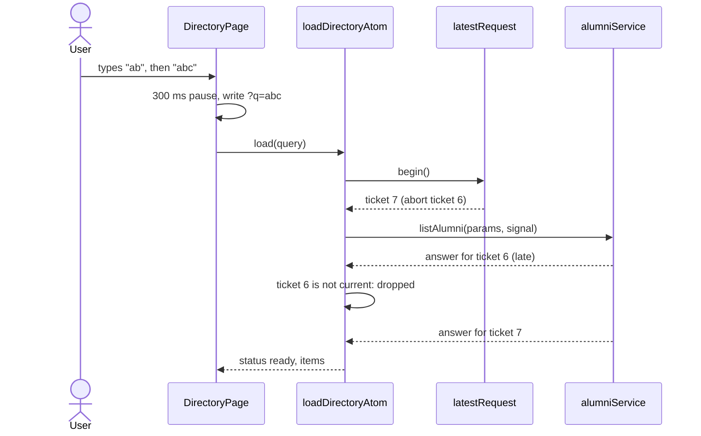
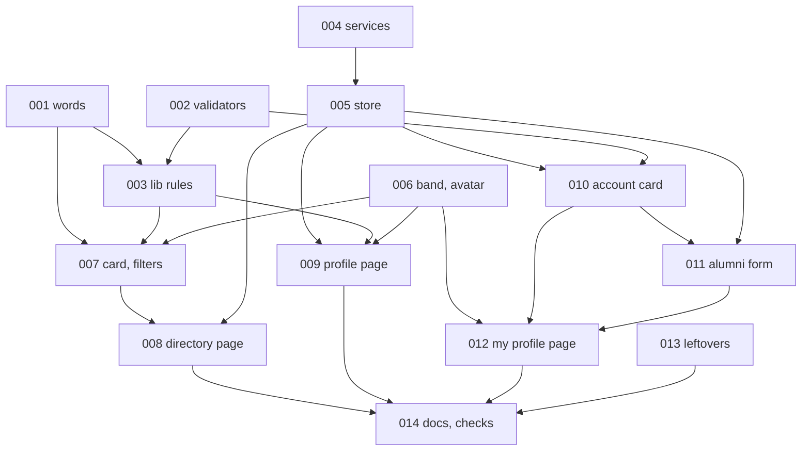

# New frontend, part 2: alumni directory, alumni profile and My profile — Architecture

| Field | Value |
|---|---|
| REQ | REQ-fs-005 |
| Status | drafting |
| Created | 2026-10-08 |
| Related ADRs | none new. [[architecture/adr-03-one-alumni-profile-per-user-created-by-that-user\|ADR-03]], [[architecture/adr-07-design-direction-oak-ink-band\|ADR-07]], [[architecture/adr-12-list-endpoints-answer-items-total-page-limit\|ADR-12]], [[architecture/adr-13-frontend-structure-css-modules-on-tokens\|ADR-13]], [[architecture/adr-14-session-and-theme-kept-in-the-browser\|ADR-14]] stay in effect. The new patterns go into `docs/frontend-patterns.md` (no library or backend decision is made, so no ADR). |

## Summary

Three screens are built on the part 1 foundation: the directory (`/directory`), one person's profile (`/directory/:id`) and My profile (`/profile`). The frontend only grows: one new service file, three new store files, two new pure-function files and a few new components. The backend, the database and `shared/` types are not touched. The directory keeps its search, filters and page in the address and loads through one "latest request wins" helper that cancels the older call. The two profile forms follow the part 1 form pattern (state in the component, pure validators, a result-returning store action). A new shared band for profiles lets the profile page and My profile use the same markup.

## Corrections to the exploration report

`exploration.md` was checked against the code. Where it is wrong, this file wins:

- **Cancellation (AC10).** `apiClient` needs no change: axios already takes a `signal` on every call. The real gap is `toApiFailure`, which would turn a cancelled call into a `network` failure and show an error. A new `isCancelled(error)` in `services/apiError.ts` fixes that; `apiClient.ts` is not edited.
- **File names.** The service is `alumniService.ts` (like `authService.ts`), not `alumni.ts`. Components live in PascalCase folders; the report's `ui/Tag.tsx` style paths are wrong.
- **Components.** "No change needed" is true for `Card`, `Field`, `TextInput`, `Select`, `Textarea`, `Checkbox` (it has `boxed`), `Message`, `EmptyState`, `ErrorState`, `Skeleton`, `Pagination`, `Link`. It is not true for `Avatar` (no size above 72px; the profile band needs 120px) and `PageLayout`/`Band` (they take only a heading and a sub line, but the profile band holds a back link, an avatar, tags and links). Both get a small, shared extension (TASK-006).
- **Words.** Its idea that address parameters also apply to My profile is wrong (directory only), and "AC45/AC53" references do not exist in the spec.

## Blast radius

| Path | Why touched | Risk |
|---|---|---|
| `frontend/src/config/text.ts` | All new words of the three pages, grouped by page (AC38) | low |
| `frontend/src/lib/validation.ts` | Add graduation year, long-text, bio and link-length validators; add a maximum to `validateName` and `validatePhotoLink` (sign-up gets the same limit, see Risks) | med |
| `frontend/src/lib/alumniForm.ts` | New. Form values, defaults, `Alumni`→form, validation of the whole form, form→request body | med |
| `frontend/src/lib/directoryQuery.ts` | New. Read/write the directory address, request params, active filter count, last page | med |
| `frontend/src/lib/alumniDisplay.ts` | New. Name, "Title at Company", "Class of 2019" and "Not given" builders | low |
| `frontend/src/lib/directoryReturn.ts` | New. Reads the "came from the directory" router state safely | low |
| `scripts/frontend-lib-check.ts` | New cases for every new lib function and the changed validators | low |
| `frontend/src/services/alumniService.ts` | New. List, filters, me, by id, create, update | low |
| `frontend/src/services/userService.ts` | Add `updateUser` | low |
| `frontend/src/services/apiError.ts` | Add `isCancelled` | low |
| `frontend/src/routes/paths.ts` | Add `alumniProfilePath(id)` next to `PATHS` | low |
| `frontend/src/store/latestRequest.ts` | New. One helper: abort the older call, ignore its late answer | med |
| `frontend/src/store/alumniAtoms.ts` | New. Directory list, filter options, one viewed profile, my profile: state and loaders | med |
| `frontend/src/store/alumniActions.ts` | New. Save profile (create or edit, 409 handling), save account | med |
| `frontend/src/store/profileAtoms.ts` | Add `setProfileUserAtom` so a saved name/photo reaches the header (AC28) | low |
| `frontend/src/store/sessionActions.ts` | Reset the alumni atoms when a session starts or ends, so one user's profile or the directory is never shown to the next | med |
| `frontend/src/styles/tokens.css` | Add `--avatar-xl` (120px wide screens, 96px on phone) in "Added by later tasks" | low |
| `frontend/src/components/ui/Avatar/Avatar.tsx` + `.module.css` | Add size `xl` | low |
| `frontend/src/components/shell/PageLayout/PageLayout.tsx` | Optional `band` slot that replaces the default band (the heading still sets the tab title) | med |
| `frontend/src/components/shell/ProfileBand/ProfileBand.tsx` + `.module.css` | New. The band of the profile and My profile; takes the band look from `Band.module.css` with `composes` | med |
| `frontend/src/components/alumni/AlumniCard/` | New. Result card and its loading card | med |
| `frontend/src/components/alumni/DirectoryFilters/` | New. Search row, filters, phone panel | high |
| `frontend/src/components/profile/AccountCard/` | New. Account form | med |
| `frontend/src/components/profile/AlumniProfileCard/` | New. Alumni profile form | high |
| `frontend/src/components/profile/saveFailureText.ts` | New. One failure→words function for both cards | low |
| `frontend/src/pages/DirectoryPage/`, `AlumniProfilePage/`, `MyProfilePage/` | Replace the placeholders; each gets a `.module.css` | high |
| `frontend/src/pages/dev/ComponentsPage/ComponentsPage.tsx` | Sections for the new components (pattern 22) | low |
| `frontend/README.md`, `shared/types/user.types.ts`, `shared/index.ts` (comments), `.adlc/context/conventions.md` | AC45 to AC47 | low |
| `docs/frontend-patterns.md` | New numbered sections (AC48) | low |
| `docs/roadmap.md` | Rows F6 and F7 to Done at wrap-up only | low |

Not touched: `backend/`, `db/`, `shared/types/alumni.types.ts`, `App.tsx` (the routes already exist), `AppShell`, `Header`, `apiClient.ts`, `toastAtoms.ts`, `frontend/package.json`.

## Approach

**Layers (pattern 1).** Pages and components read atoms and call actions. Only `store/` imports `services/`. `lib/` holds every rule that is more than a line and has cases in the library check.

**Directory (AC1 to AC14).**

- The address is the truth. `DirectoryPage` reads `useSearchParams()` through `readDirectoryQuery` (lib). A bad value falls back to its default there, so the page never sees a bad query (AC7). Changing a control writes a new address through `writeDirectoryQuery`, which leaves out defaults and page 1 (AC5).
- Write rule: changing a filter, the checkbox or the page *pushes* a history entry and resets the page to 1 (except a page change). Typing in search *replaces* the entry, so Back does not step through every pause. This narrows spec choice 3 ("every new filter state is an entry") for the search text only; it is listed for the gate.
- A search box has its own text state and a 300 ms timer that writes the address. Enter or the Search button writes it at once. When the address changes by itself (Back, a pasted link) and differs from what the user last typed, the box takes the new value.
- The list loads in an effect keyed on the canonical address string. The effect calls `loadDirectoryAtom(query)`. That action asks `latestRequest` for a ticket: the older call is aborted, and any answer whose ticket is not the latest is dropped. A cancelled call changes nothing and shows no error (AC10). The atom holds `{ status, query, page }`, where status is `loading`, `ready` or `error`; while loading, no items are kept, so old results are never shown as new (AC9).
- Filter options load once on mount through `loadFiltersAtom`; a failure leaves the first option and shows a retry (AC4).
- A page past the end (ready, total above 0, page above the last page) replaces the address with the last page (AC7).
- After the user changes page, focus goes to the count line from the page's own effect, which runs after `Pagination`'s effect and so wins over its focus rule (AC8). The count line is a polite live region and always in the page (AC44).
- Phone filters (AC13) need no JavaScript media query: the "Filters" button is only drawn under the phone query, and the panel is `display: none` there while closed (so it is out of the tab order and the reading order); the open state is a `useState` in the component and an `aria-expanded` on the button. On wide screens the panel is always shown and the button is hidden.
- Card (AC2): `AlumniCard` is a `Card` with `Avatar` (md; the picture's 56px sits between steps, nearest step used), name, job line, tags, "View profile" `Link`. The link carries router state `{ directorySearch }` so the profile page can return to the same filters (AC17).
- Loading (AC9): one `SkeletonGroup` around twelve skeleton cards, so a screen reader hears "Loading" once.

**Alumni profile (AC15 to AC20).** `AlumniProfilePage` reads `:id`, refuses anything that is not digits (no request, not-found state), then calls `loadAlumniAtom(id)` (also through `latestRequest`, so moving between two profiles cannot show the wrong one). Status: `loading`, `ready`, `notFound` (404), `error`. `ProfileBand` is rendered in every status at the same place in the tree, so the `<h1>` is the same DOM node and keyboard focus is not lost when the data arrives. The tab title is the heading passed to `PageLayout`: the name when loaded. Two columns on a wide screen (About; Details), one on a phone. `linkedin_url` becomes a link only if `isWebLink`; it opens in a new tab with `rel="noopener noreferrer"` and a hidden "(opens in a new tab)". Email is a `mailto:` link.

**My profile (AC21 to AC33).**

- The Account card reads the header's `profileAtom` (the user the shell already loads) and offers a retry through the existing `loadProfileAtom`. Save calls `saveAccountAtom`, which calls `PUT /api/users/:id` and, on success, writes the answer into `profileAtom` through `setProfileUserAtom` (the header updates, AC28).
- The Alumni profile card is rendered for the `alumni` and `admin` roles only (`sessionAtom.role`); a student's page never calls `/api/alumni/me` (AC22). `loadMyAlumniAtom` sets `loading`, then `ready` (a profile), `none` (404) or `error` (anything else). `saveAlumniProfileAtom` creates (`POST`) when the state is `none` and edits (`PUT /:id`) when it is `ready`; it returns `{ ok: true }` or `{ ok: false, failure }`. On a 409 while creating it first reloads the existing profile, so the next render is the edit form (AC30).
- `lib/alumniForm.ts` holds the whole form's rules: values as typed (all strings plus the checkbox), `alumniToForm`, `validateAlumniForm(values, thisYear)` and `alumniFormToBody` (trimmed; empty is `null`; all nine fields always sent, so clearing works; `user_id` never sent, AC25).
- The two cards share the part 1 form skeleton (`useFormError`, `noValidate`, first error gets focus, busy button, double-submit guard) and one `saveFailureText` function for the card-level message. Each card has its own `useFormError`, so one card's failure does not touch the other.
- Order on the page: Alumni profile card first (it overlaps the band), then Account (as drawn). A student's Account card is first. The band shows avatar, name, email and the role tag as in the picture; the Account card also has a read-only "Role" row, because the request asked for the role in the Account card. "See my public profile" sits in the band and appears only when a profile exists.

**Shared pieces, one copy each (AC36, L-REQ-fs-002-3).** `latestRequest` (three loaders), `ProfileBand` (two pages), `saveFailureText` (two cards), the address helper `alumniProfilePath` (cards and My profile), `alumniDisplay` builders (card, profile, band), `validation.ts` (sign-up and the new forms: `validateName` and `validatePhotoLink` are reused, not copied).

**Words (AC38).** All page words are in `config/text.ts`, grouped by page. Validator messages stay as exported constants in `lib/validation.ts`, where part 1 put them, so the library check can reach them (pattern 16). This narrows AC38 for validator messages only; it is listed for the gate. `lib/alumniDisplay.ts` imports a few plain word constants from `config/text.ts`.

### Diagrams

STATUS: needs verification (designed, not built).

## Task DAG

### Tier 0
- `TASK-001` — all new words in `config/text.ts`
- `TASK-002` — validators and the alumni form rules in `lib/`, with library-check cases
- `TASK-004` — services and the profile address helper
- `TASK-006` — avatar size, `PageLayout` band slot, `ProfileBand`
- `TASK-013` — leftovers: README, stale comments, conventions Comments section

### Tier 1
- `TASK-003` — directory address, display and return-state rules in `lib/`, with cases (depends on TASK-001, TASK-002)
- `TASK-005` — store: `latestRequest`, alumni atoms and actions, header update, session resets (depends on TASK-004)

### Tier 2
- `TASK-007` — `AlumniCard`, its skeleton and `DirectoryFilters` (depends on TASK-001, TASK-003, TASK-006)
- `TASK-009` — alumni profile page (depends on TASK-001, TASK-003, TASK-005, TASK-006)
- `TASK-010` — `AccountCard` and `saveFailureText` (depends on TASK-001, TASK-002, TASK-005)
- `TASK-011` — `AlumniProfileCard` (depends on TASK-001, TASK-002, TASK-005, TASK-010)

### Tier 3
- `TASK-008` — directory page (depends on TASK-005, TASK-007)
- `TASK-012` — My profile page (depends on TASK-006, TASK-010, TASK-011)

### Tier 4
- `TASK-014` — components page, patterns doc, checks, browser review on a mock API, owner checklist (depends on TASK-008, TASK-009, TASK-012, TASK-013)

## Test strategy

There is no test runner (conventions.md, Testing). Proof, in this order:

1. **Library check** (`npx tsx scripts/frontend-lib-check.ts`). New cases, with expected answers written from the spec, for: `readDirectoryQuery` (absent, empty, `page=0`, `page=abc`, `page=2`, `mentoring=true`, `mentoring=yes`, `graduation_year=2019`, `graduation_year=abc`, repeated keys, whitespace), `writeDirectoryQuery` (defaults left out, page 1 left out, round trip with the reader), `toListParams`, `activeFilterCount`, `lastPage`, `readDirectorySearch` (hostile router state), `jobLine`/`classLabel`/`displayName` (missing parts), the validators (year 1949, 1950, this year + 6, + 7, `abc`, empty; text 100 and 101 characters; bio 2000 and 2001; link `ftp://`, 500 and 501 characters), `alumniFormToBody` (empty becomes `null`, year becomes a number, all nine keys present, no `user_id`), `alumniToForm`. One case that must fail is run once against a wrong expectation to prove the script can fail (L-REQ-fs-004-6).
2. **Build and style check.** `npm run build` (types) and `node scripts/frontend-style-check.mjs` before every gate from implement on.
3. **Browser review on a mock API** (ui-reviewer, and TASK-014). The mock is a throwaway script in the session scratchpad, never in the repo, and the Vite proxy is pointed at it (L-REQ-fs-004-5: first find out what listens on port 3000). Cases: directory at 360, 768 and 1280px in both themes; search, filters, page, Back, a shared link, a page past the end, an empty result, a failed list and a failed filters call, a slow first answer arriving after a fast second one (AC10); profile found, 404, 500, long words; My profile as student, as alumni with no profile (create), with a profile (edit), a 409, a 403, a validation error, a double click; real Tab-key focus order (L-REQ-fs-004-4).
4. **Owner checklist** (`manual-checklist.md`) for the real backend, a screen reader and what the mock cannot prove.

## Convention alignment

- Backend untouched; layers, tokens, CSS Modules with no literals, no UI library, no new package, no `any`, `import type` for types, no barrel files, camelCase non-component files, PascalCase component folders: as in part 1.
- Every list and form has loading, empty and error states (directory list, filter options, profile, both cards).
- API calls only in `services/`, called only from `store/`.
- **Deviations, each listed for the gate:** (1) validator messages stay in `lib/validation.ts`, not `config/text.ts`; (2) search typing replaces the history entry; (3) directory card avatar is 44px, not the picture's 56px (nearest token step, as part 1 did); (4) `validateName` and `validatePhotoLink` gain a length limit, so sign-up now also refuses over-long values; (5) the profile band avatar is 120px (96px on a phone), My profile uses the same (the picture shows 96px); (6) `field` is capped at 100 characters although its column is `text` (it follows the other fields; the spec's choice 15 already says so); (7) two spec sentences were clarified, not changed in meaning: AC7 (a `graduation_year` that is not four digits is ignored; a well-formed value missing from the options is kept and shown) and AC21 (the avatar and name are in the band as drawn; the Account card has the read-only Role row).

### Deviations found during build and review (added at wrap-up)

- (8) Save profile and Save account, and Discard changes, are disabled until a value differs from the saved one (a new profile can always be saved). Not in the plan; the UI reviewer asked for it (UI-001) and the owner approved the fix round.
- (9) Enter and the Search button also replace the history entry, not only typing (ARCH-002; open item m10).
- (10) The pages clear their stored data when they close (`clearDirectoryAtom`, `clearViewedAlumniAtom`, `clearMyAlumniAtom`), so the "kept when the user comes back" reason for storing the list in an atom no longer holds; the reasons now are one reader for list, count line and retry, and the session reset (pattern 23).
- Blast radius additions: `lib/mailtoLink.ts`, `lib/profileId.ts`, `lib/loadFailure.ts`, `lib/saveFailure.ts`, `ui/Link/Link.tsx` (router `state`), `shell/Header` and `PhoneMenu` (the shared trimmed-text helper), `shared/index.ts` (one comment), `scripts/frontend-style-check.mjs` (rule k). `components/profile/saveFailureText.ts` was planned, built and then removed.

## Stress test (architecture-adversary, full pass)

8 findings: 0 critical, 3 major, 5 minor. All 8 are fixed in the tasks; none is only accepted. The adversary also checked, and found nothing in: the backend contract, the validator limits against `db/schema.md`, the `Pagination` focus order, the CSS-only phone panel on resize, StrictMode with `latestRequest`.

| Finding | What it was | Handled in |
|---|---|---|
| ADV-001 major | A user switch made in another tab left the old user's profile loaded; an admin's save would overwrite it | TASK-005 resets in `tokenChangedElsewhereAtom`; TASK-011 keys the card on the user id |
| ADV-002 major | Remounting the form lost focus after a create and hid the 409 message | TASK-011 keeps the form mounted and resets values in place; TASK-005 adds a quiet reload |
| ADV-003 major | Debounce could drop a filter picked within 300 ms and erase a typed trailing space | TASK-008 builds the address from live params, cancels the timer on any other change, compares trimmed values |
| ADV-004 minor | The reader dropped long values and JS-trimmed filters; the server strips spaces only | TASK-003 |
| ADV-005 minor | A filter value not in the options showed as "All" | TASK-007 adds it as an extra option; AC7 wording |
| ADV-006 minor | AC21 put the avatar in the Account card; the picture puts it in the band | AC21 wording |
| ADV-007 minor | Old results for a frame; focus moved on Back | TASK-008 derives the status from the address; focus only from `Pagination` |
| ADV-008 minor | New limits meet old stored data | TASK-011 per-field messages; deviation 6 listed |

Full report: `architecture-adversary.md`.

## Risks

| Risk | Likelihood | Mitigation |
|---|---|---|
| Typing, the debounce timer and the address fight each other (input jumps back, a loop of writes) | med | Input text is its own state; the address is written only from the timer, Enter, or a control; the input is overwritten from the address only when the address differs from the last value the user committed. Covered by the browser review (type fast, Back, forward). |
| React StrictMode runs effects twice in dev, so two list calls start | med | `latestRequest` aborts the first; both the abort and the ticket make it harmless (G48). Checked in dev. |
| `Pagination`'s own focus rule fights the "focus the count" rule | med | The page's effect runs after the child's and sets focus last; checked with a real Tab key. |
| A saved profile overwritten by a form that never loaded | med | The form is not rendered unless the profile call answered `ready` or 404 (AC31). |
| Two profiles for one user (G37) | low | `/me` and the edit use the same lowest id; not detected, not merged (spec assumption). |
| Longer limits in `validateName` change sign-up | low | Same limit as the database column; cases added; sign-up is in the library check already. |
| The profile band swaps its content and loses focus | low | Same component at the same place in every status. |
| Words in the card link ("View profile") are the same for every card | low | Each link has an accessible name that includes the person's name (AC2). |
| `PageLayout`'s first-child overlap breaks with a band of a different height | low | The slot only replaces the band's inside; it keeps the same outer padding rule through `composes`. Checked at 360px and 200% zoom. |
| G42: email shown to every logged-in user | known | Shown as drawn; one row and one link to remove. |

## Open questions

- [ ] None block the build. The five deviations above need a nod at the gate.

## Related

- Spec: REQ-fs-005
- Concepts: [[knowledge/concepts/paged-list-query]], [[knowledge/concepts/frontend-session-flow]], [[knowledge/concepts/partial-update-sent-fields]]
- Components: [[knowledge/components/frontend-app]]
- Lessons checked: [[knowledge/lessons/LESSON-REQ-fs-002-3-new-helper-convert-every-sibling|L-REQ-fs-002-3]], [[knowledge/lessons/LESSON-REQ-fs-004-1-router-state-survives-a-reload|L-REQ-fs-004-1]] (router state is untrusted), [[knowledge/lessons/LESSON-REQ-fs-004-2-one-rule-one-function-in-lib|L-REQ-fs-004-2]], [[knowledge/lessons/LESSON-REQ-fs-004-3-401-flag-token-header-timeout|L-REQ-fs-004-3]], [[knowledge/lessons/LESSON-REQ-fs-004-4-check-focus-for-real|L-REQ-fs-004-4]], [[knowledge/lessons/LESSON-REQ-fs-004-5-find-out-what-listens-on-the-api-port|L-REQ-fs-004-5]], [[knowledge/lessons/LESSON-REQ-fs-004-6-a-check-that-reads-only-tracked-files|L-REQ-fs-004-6]], [[knowledge/lessons/LESSON-REQ-fs-004-7-delete-a-module-close-its-mentions|L-REQ-fs-004-7]]
- Gotchas: [[knowledge/gotchas#^g34|G34]], [[knowledge/gotchas#^g37|G37]], [[knowledge/gotchas#^g42|G42]], [[knowledge/gotchas#^g48|G48]], [[knowledge/gotchas#^g49|G49]], [[knowledge/gotchas#^g50|G50]]
- ADRs: listed in the header
