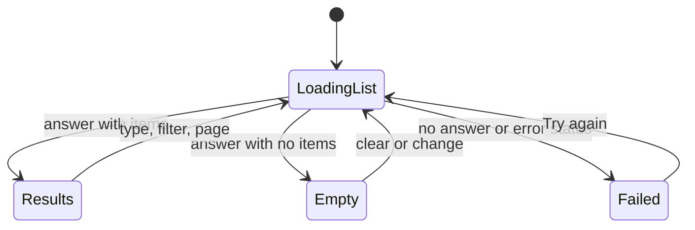
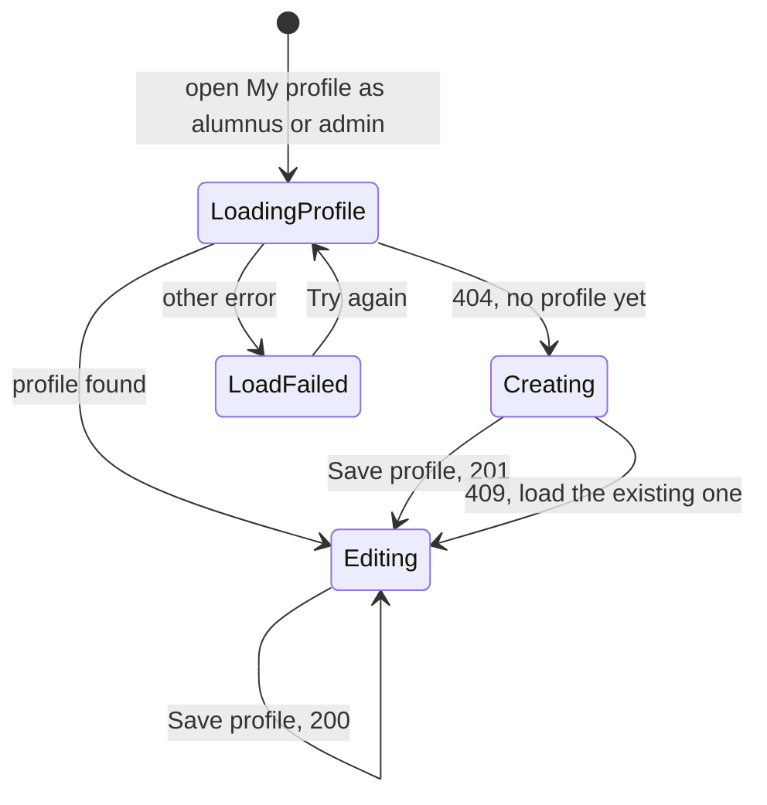

# New frontend, part 2: alumni directory, alumni profile and My profile

| Field | Value |
|---|---|
| REQ | REQ-fs-005 |
| Status | validated (owner approved 2026-10-08) |
| Phase | spec |
| Created | 2026-10-08 |
| Primary repo | alumni-details-system |
| Touched repos | alumni-details-system |
| Roadmap rows | F6 (Alumni directory) and F7 (Alumni profile and My profile) in `docs/roadmap.md`. See "Open points for the owner", item 1: the request said F6 to F8, but F8 is the post feed. |
| Related | [[context/design-system]], [[architecture/adr-03-one-alumni-profile-per-user-created-by-that-user\|ADR-03]], [[architecture/adr-04-profile-photo-is-a-url-field\|ADR-04]], [[architecture/adr-07-design-direction-oak-ink-band\|ADR-07]], [[architecture/adr-08-mentoring-and-field-stay-two-new-alumni-columns\|ADR-08]], [[architecture/adr-09-white-label-app-name-from-one-constant\|ADR-09]], [[architecture/adr-11-typed-errors-and-one-error-middleware\|ADR-11]], [[architecture/adr-12-list-endpoints-answer-items-total-page-limit\|ADR-12]], [[knowledge/concepts/paged-list-query]], [[knowledge/gotchas#^g37\|G37]], [[knowledge/gotchas#^g42\|G42]], [[knowledge/lessons/LESSON-REQ-fs-002-3-new-helper-convert-every-sibling\|L-REQ-fs-002-3]] |

## Problem

Part 1 gave the app a shell, a theme and log in, but the three screens that make this an alumni system are still "This page is being built": the directory, one person's profile, and My profile. A student cannot find a graduate. An alumnus cannot create or edit their own profile, so the directory has nothing to show. Nobody can change their own name. The backend for all of this is finished (REQ-fs-001 to REQ-fs-003) and nothing in the frontend calls it yet.

## Goal

A logged-in user can search and filter the alumni directory, page through the results, share the link to a filtered page, and open one person's profile. On My profile, every user sees their account (and can change their name and photo link, and log out). An alumnus or admin also sees the alumni profile form: it creates their profile the first time and edits it after that. The three pages match `directory.html`, `directory-dark.html`, `profile.html`, `profile-dark.html`, `my-profile.html`, `phone-directory.html` and `phone-menu.html` in both themes, from 360px wide. The three "being built" placeholders for these routes are gone. The backend and the database are untouched.

## Non-goals

- **No post feed, no "Recent posts" block on the profile.** The profile picture shows recent posts; that needs the feed (roadmap F8). The block is left out until the feed REQ.
- No dashboard, no users page, no About page, no Privacy page, no password reset.
- No backend change, no database change, no change to `shared/` types. A real gap is reported at the spec or architecture gate, not fixed quietly.
- No new package. No UI library, no form library, no data-fetching library (`docs/frontend-patterns.md`, pattern 16).
- No change to log in, sign-up or the shell, except what the three pages need (a profile link helper, My profile content). The words of the log-in and sign-up pages stay where they are (see "Open points", item 3).
- No email change, no password change, no photo upload (ADR-04: a photo is a link).
- No "unsaved changes" warning when leaving My profile.
- No sorting control in the directory. The backend order (newest first) is the order shown.

## Acceptance criteria

"Phone layout" means the narrow layout of `docs/design/README.md` section 4 (below 768px, `config/layout.ts`). "Words" means text a user reads, including button labels, error messages and screen-reader names.

### A. Directory (roadmap F6)

- [ ] **AC1.** The route `/directory` shows the directory inside the shell: band with heading "Alumni directory" and the sub line from `directory.html`, a search box, filters for Department, Graduation year, Field and "Only show alumni open to mentoring", a count line ("86 alumni"), result cards, and pagination.
- [ ] **AC2.** Each result card shows: avatar (photo when `photo_url` is set, else initials), name, job title, company, and plain tags for department, "Class of <year>" and field. Fields that are empty are left out, not shown as blank or "null". A card of someone open to mentoring carries the "Open to mentoring" tag. Each card has a "View profile" link to that person's profile page. The whole card is not one big link; "View profile" is the link, and its accessible name includes the person's name.
- [ ] **AC3.** Typing in search sends the request after the user stops typing for 300 ms (one request per pause, not one per key). Pressing Enter or the Search button sends it at once. Search matches what the API matches (name, company, job title); the page sends the text as typed, trimmed.
- [ ] **AC4.** The Department, Graduation year and Field options come from `GET /api/alumni/filters`, in the order the API sends them. Each select has an "All departments" / "Any year" / "Any field" first option. Changing a filter sends the request at once. If the options call fails, the selects stay usable with only their first option and a message with "Try again" says the options could not be loaded; the list still works.
- [ ] **AC5.** The search text, the three filters, the mentoring checkbox and the page number are kept in the address as query parameters (`q`, `department`, `graduation_year`, `field`, `mentoring=true`, `page`). Opening that address in a new tab shows the same filtered, same page result with the controls filled in. A parameter that is absent or empty is not written to the address. Page 1 is not written.
- [ ] **AC6.** Changing the search text or any filter returns to page 1. Using the browser Back button steps back through earlier filter states and pages.
- [ ] **AC7.** A bad value in the address does not break the page: `page` that is not a whole number of 1 or more is treated as 1; `mentoring` with any value other than `true` is ignored; a `graduation_year` that is not exactly four digits is ignored. A filter value that is well formed but not among the options (options still loading, options failed, an old link) is kept and shown in its select, not hidden. A `page` beyond the last page replaces the address with the last page (when there are results) instead of showing an empty page.
- [ ] **AC8.** Pagination shows Previous, page numbers, Next and "Page X of N", using the existing Pagination component. It is hidden when there is one page or none. Moving to another page moves keyboard focus to the result count line, and does not leave focus on a button that has disappeared.
- [ ] **AC9.** While a request is running, the list shows skeleton cards (the number of cards of a full page) and the count line says it is loading. Controls stay usable. The previous results are not shown as if they were the new ones.
- [ ] **AC10.** A response that arrives after a newer request was sent is ignored: typing "ab", then "abc" quickly, always ends showing the result for "abc", whichever answer arrives last. The older request is cancelled (aborted) when it is still running. A cancelled request shows no error.
- [ ] **AC11.** Empty result: an empty state that says nothing matched and gives a next step. With search or filters set, the next step is a "Clear search and filters" button that resets the controls and the address. With none set (the directory itself is empty), it says no alumni have joined yet and gives no clear button.
- [ ] **AC12.** Failed request: an error state with "Try again", which repeats the same request. The words differ for "no answer from the server" and "the server refused" (pattern 9). The server's own error text is never shown. The controls stay on the screen and usable.
- [ ] **AC13.** In the phone layout the search box and its button stay visible, and the other filters sit behind a "Filters" button that opens and closes the filter panel. The button says how many filters are active ("Filters (2)") and exposes whether the panel is open to a screen reader. The panel is not hidden from keyboard users when open and is not reachable by Tab when closed.
- [ ] **AC14.** A student, an alumnus and an admin all see the same directory.

### B. Alumni profile (roadmap F7, part 1)

- [ ] **AC15.** The route `/directory/:id` shows one person: band with large avatar, the name, "Open to mentoring" tag when true, and a line "Job title at Company" (just the part that exists); plain tags for department, class year and field; a "Back to directory" link above the band content; contact links; an "About" card with the bio; a "Details" card with Department, Graduation year, Field, Company, Job title, Experience, Email and Mentoring ("Open to students" or "Not at the moment"). A detail with no value shows "Not given" in the muted style. Nothing outside `db/schema.md` is shown.
- [ ] **AC16.** Contact links: "Email <first name>" is a `mailto:` link when the email is present. "LinkedIn profile" is shown only when `linkedin_url` is a web link (`http` or `https`); it opens in a new tab with `rel="noopener noreferrer"` and says so to a screen reader ("opens in a new tab"). A link that is not a web link is never rendered as a link.
- [ ] **AC17.** "Back to directory" returns to the directory with the filters and page the user left (the address is kept), when the user came from the directory in this tab. Opening the profile in a fresh tab and pressing the link goes to the plain directory.
- [ ] **AC18.** States: while loading, a skeleton in the shape of the page; an id that is not a whole number or an answer 404 shows a not-found state ("This profile does not exist" with a link back to the directory) and the page's heading is still unique; any other failure shows an error state with "Try again". No request is sent for an id that is not a whole number.
- [ ] **AC19.** The browser tab title is "<Name> · <App name>" once the profile is loaded, and "Alumni profile · <App name>" before. When the name is missing the profile shows "Name not given".
- [ ] **AC20.** All user-supplied text (name, bio, company and the rest) is shown as text. Nothing is inserted as HTML. A long unbroken word does not break the layout at 360px or at 200% zoom.

### C. My profile (roadmap F7, part 2)

- [ ] **AC21.** The route `/profile` shows, for every role, an Account card: a read-only "Role" row with the role tag, "Full name" (editable), "Email" (disabled, with "Ask an admin to change your email."), "Photo link (optional)" with help "Without a photo, your initials are shown.", a "Save account" button and a "Log out" button.
- [ ] **AC22.** A student sees only the Account card. A student's page sends no request to `/api/alumni/me`.
- [ ] **AC23.** An alumnus or admin also sees the "Alumni profile" card with: Department, Graduation year, Field, Company, Job title, Experience, LinkedIn link (optional), Bio, and the "I am open to mentoring students" checkbox inside the accent-soft box; buttons "Save profile" and "Discard changes". The card loads the user's profile with `GET /api/alumni/me` and shows a loading state while it does.
- [ ] **AC24.** If that call answers 404 (no profile yet), the form is shown empty and "Save profile" creates the profile with `POST /api/alumni`. If a profile exists, the form is filled and "Save profile" edits it with `PUT /api/alumni/:id`. After a create, the next save is an edit.
- [ ] **AC25.** A save sends every field of the form (an emptied text field is sent as `null`, so clearing a field really clears it). `user_id` is never sent.
- [ ] **AC26.** Validation runs on submit, not while typing. Each error is words under its field, linked to the field for screen readers, and keyboard focus moves to the first field with an error. No request is sent while any error stands; an error clears when that field is edited. The rules are in "Choices I made" below.
- [ ] **AC27.** A successful profile save shows the toast "Profile saved". A successful account save shows the toast "Account saved". The button name and the toast use the same word ("Save profile" leads to "Profile saved"; "Save account" leads to "Account saved"). The form then shows the saved values and "Discard changes" returns to them.
- [ ] **AC28.** After a successful account save the name and photo in the header change at once, without a reload.
- [ ] **AC29.** "Discard changes" puts every field back to the last saved values (or to empty when there is no profile yet) and clears the errors. It does not ask for confirmation and sends no request.
- [ ] **AC30.** A failed save shows a message in the card (not only a toast), says what to do, keeps everything the user typed, and re-enables the buttons. A double click on a Save button sends one request. The two cards save independently: a failed profile save does not touch the account card.
  - 409 on create ("You already have an alumni profile"): the page loads the existing profile into the form and tells the user it already existed and to check the details and save again.
  - 403 or 404 on edit: a message says the profile can no longer be saved, with "Try again" that reloads it.
  - 401: handled by the existing session-ended flow; no extra message.
  - No answer from the server, or any other status: "Something went wrong. Try again." style message (pattern 9).
- [ ] **AC31.** If the profile call fails with anything but 404, the Alumni profile card shows an error state with "Try again" and no form (so a save cannot overwrite a profile that failed to load). The Account card still works.
- [ ] **AC32.** When a profile exists, a link "See my public profile" opens `/directory/<id>`. It is not shown before the profile exists.
- [ ] **AC33.** "Log out" is on the Account card and works as in part 1 (the guard does the redirect; the page does not navigate).

### D. All three pages

- [ ] **AC34.** Each page is a real page file; the "being built" placeholder text no longer appears for `/directory`, `/directory/:id` or `/profile`. `BeingBuilt` is still used by the routes that are not built yet (feed, dashboard, users), so it stays.
- [ ] **AC35.** Every list and form has loading, empty and error states (the directory list, the filter options, the profile, the My profile card). Nothing shows a blank area while loading.
- [ ] **AC36.** The parts that already exist are reused: Band (through PageLayout), Card, Tag, RoleTag, Avatar, Field, TextInput, Select, Checkbox, Pagination, Skeleton, EmptyState, ErrorState, Message, Toast, Dialog (if a dialog is needed at all), Button, Link. No second copy of any of them. Where two places in this REQ need the same new thing, it is one shared piece used by both. At the end, a search of the new files for a repeated block finds none (L-REQ-fs-002-3).
- [ ] **AC37.** State follows the part 1 pattern: shared state in Jotai atoms under `src/store/` with actions that return a result and never throw; API calls only in `src/services/` with relative `/api` paths and types from `@alumni/shared`; no page or component imports `axios` or anything from `services/`. Screen-only state (typed text, panel open) stays in the component.
- [ ] **AC38.** All words the three pages show come from the one text config file (`frontend/src/config/text.ts`), including error messages, empty-state text and screen-reader names. The app name comes from the one constant. The style check (rule e) still passes.
- [ ] **AC39.** No hard-coded color, size or spacing value in any new stylesheet or `.tsx` file; everything is a design token. No `box-shadow`, no gradient, no `outline: none`. The style check passes.
- [ ] **AC40.** Both themes are correct on all three pages: text meets WCAG AA contrast (the tokens are already checked; new combinations are checked again), and the three pages show no color the other theme's picture does not.
- [ ] **AC41.** Layout holds from 360px wide up and at 200% zoom: no horizontal page scroll, no overlapping text, tags and long words wrap.
- [ ] **AC42.** Every control and link (search, selects, checkbox, Filters button, card link, pagination, form fields, buttons, mailto and LinkedIn links) is reachable with the keyboard, in an order that matches the screen, with the visible focus ring. When a view changes under the user (new result page, a saved form), focus is not lost.
- [ ] **AC43.** Motion respects `prefers-reduced-motion`. Skeleton pulse and any filter-panel transition stop or become instant.
- [ ] **AC44.** A screen reader hears the result count and the loading, empty and error changes (a polite live region), the state of the Filters button, and the field errors on My profile.

### E. Leftovers from part 1

- [ ] **AC45.** `frontend/README.md` is a short real README: what the frontend is, how to run it (from the repo root), a map of the folders under `frontend/src`, and a link to `docs/frontend-patterns.md`. No Vite template text remains. It does not name the app (the name lives only in the config constant) and does not mention `.env` contents.
- [ ] **AC46.** The two comments "Kept as it is for the legacy frontend…" in `shared/types/user.types.ts` no longer say "legacy frontend". They say what is true today (the legacy frontend is gone; `User` and `CreateUserDTO` carry `password` and are not exported from `index.ts`; new code uses `PublicUser` and `SignUpUserDTO`/`UpdateUserDTO`). Comments only: no type, field or export changes.
- [ ] **AC47.** The "Comments" section of `.adlc/context/conventions.md` is written (it is empty template prompts today): when a comment is expected, when it is noise, and the TODO format. It is marked `STATUS: needs verification` until the owner confirms it.

### F. Docs and checks

- [ ] **AC48.** `docs/frontend-patterns.md` gets a new numbered section for each new pattern this REQ introduces (at least: a list loaded into atoms with its three states and stale-response handling; filters and page kept in the address; a load-then-edit form that creates or edits; dates and the profile link helper if used), written after the code works, with real paths that exist. `docs/roadmap.md` rows F6 and F7 are marked Done at wrap-up.
- [ ] **AC49.** `npm run build`, `node scripts/frontend-style-check.mjs` and `npx tsx scripts/frontend-lib-check.ts` all exit 0 before each gate from implement onward. New pure functions (reading and writing the address parameters, the form validators, page-count and name/line builders if they exist) are in `frontend/src/lib/` and have cases in `scripts/frontend-lib-check.ts`, with the expected answers written from this spec, not from the code.
- [ ] **AC50.** `git grep -n --untracked "antd" -- frontend/src frontend/package.json` still prints nothing. `frontend/package.json` has no new dependency.
- [ ] **AC51.** A manual checklist for the owner (`manual-checklist.md` in this REQ's folder) lists what a script cannot prove: the real backend, the three pages in both themes at 360px, 768px and 1280px, a screen reader pass, the keyboard order.
- [ ] **AC52.** Any browser check run during this REQ is first pointed at a mock API, never at a backend whose database is unknown (L-REQ-fs-004-5). No `.env` file is read or printed, no database command is run, nothing is pushed.

## Flow

## Assumptions

- The backend is as the vault describes it and needs no change for these pages: `GET /api/alumni` (paged, filters `q`, `department`, `graduation_year`, `field`, `mentoring=true`, `page`, `limit`), `GET /api/alumni/filters`, `GET /api/alumni/me`, `GET /api/alumni/:id`, `POST /api/alumni`, `PUT /api/alumni/:id`, `PUT /api/users/:id`. Read from `AlumniController.ts`, `AlumniRoutes.ts`, `UserRoutes.ts` and `shared/types` on 2026-10-08, not run. `STATUS: needs verification` against the real backend (owner's checklist).
- The part 1 owner checklist (`manual-checklist.md` of REQ-fs-004) has not been run against the real backend yet (`now.md`). This REQ is built and checked against a mock; real-backend proof stays with the owner. `STATUS: needs verification`.
- `GET /api/alumni/me` answers 404 with `{ "error": "Alumni profile not found" }` when the user has none. The page tells "no profile" from "failed" by status 404 only, not by the message text.
- `PUT /api/users/:id` with `{ name, photo_url }` answers the updated user without the password column (`PublicUser`). The header reads the logged-in user from the same store atom that My profile updates.
- Column limits are real: `department`, `current_company`, `job_title` and `experience` are `varchar(100)`; `User.name` is `varchar(100)`. A longer value would be refused by the database (and G34 says its raw message can still reach the client), so the forms must stop it first. `field`, `bio`, `linkedin_url` and `photo_url` are `text` with no database limit.
- G37: a user may already have two profiles from before the lock; `/me` returns the lowest id and the edit uses that id. The page does not try to detect or merge duplicates.
- G42 (any logged-in user can read every alumnus's email) is still undecided by the owner. The approved profile picture shows the email, so the page shows it. If the owner decides otherwise later, it is one `Details` row and one link.
- The session knows the user's id and role (`sessionAtom`, from the token); the role decides whether the alumni profile card is shown. An admin has the same card as an alumnus. The server remains the real check.
- `graduation_year` in the filter options is a list of numbers; `department` and `field` are lists of strings, already trimmed and sorted A to Z (ADR-08).
- No automated test runner exists; proof is the three commands, a mock-API browser review and the owner's checklist (conventions.md, Testing).

### Choices I made (the common standard, where the request left it open)

These were open in the request or in the design. I took the usual answer so you can read them in one place. Say which to change at the gate.

| # | Open point | Choice |
|---|---|---|
| 1 | Search debounce | 300 ms; Enter or the button sends at once |
| 2 | Page size | 12, the API default; the page does not send `limit` |
| 3 | Address parameters | `q`, `department`, `graduation_year`, `field`, `mentoring=true`, `page`; defaults and empty values left out; a new filter state is a history entry, a page past the end is a replace |
| 4 | Changing a filter | Goes back to page 1 |
| 5 | Filters that apply | At once on change (no "Apply" button); search has its own button |
| 6 | Phone filter panel | Inline panel under the search row, not a dialog; the "Filters" button shows an active count |
| 7 | After a page change | Focus goes to the count line; the page scrolls to the top of the results |
| 8 | Skeleton count | 12 cards (one full page) |
| 9 | Stale responses | The older request is aborted; any answer that still arrives late is ignored by a request number |
| 10 | Card link | "View profile" is the link (as in the design), not the whole card |
| 11 | Empty names | "Name not given"; empty details "Not given" |
| 12 | Mentoring detail wording | "Open to students" / "Not at the moment" (the first is from the design) |
| 13 | LinkedIn / photo link rule | Must start with `http://` or `https://` (the existing `isWebLink`); maximum 500 characters |
| 14 | Graduation year rule | Optional; four digits; from 1950 to this year plus 6 (a student in the last years) |
| 15 | Text length limits | `department`, `current company`, `job title`, `experience`, `field` and `full name`: 100 characters (the column size; `field` follows the others); `bio`: 2000 characters |
| 16 | Required fields | Only "Full name" is required (on the Account card). Every alumni profile field is optional, as the API allows, so even an all-empty first save is accepted |
| 17 | Name rule | Trimmed, 1 to 100 characters |
| 18 | Photo link | On the Account card, as in `my-profile.html`; empty clears it |
| 19 | Button and toast words | "Save profile" then "Profile saved"; "Save account" then "Account saved"; "Discard changes" |
| 20 | Dirty-state | No "unsaved changes" prompt; Discard changes is the way back |
| 21 | Dates | Not shown on these pages (no date on the approved directory or profile pictures other than the posts block, which is out of scope). The `3 October 2026` format stays reserved for the feed |
| 22 | Words location | All new words in `config/text.ts`, grouped by page with a comment line per group |
| 23 | After a 409 on create | Load the existing profile, tell the user, do not retry the save by itself |
| 24 | Back link | Returns to the directory address the user left, using the router history state; otherwise the plain directory |
| 25 | Link to a profile | One helper next to `PATHS` builds `/directory/<id>`; no address is typed as text elsewhere (pattern 12) |

## Open points for the owner

These need a look at the gate. None blocks the spec.

1. **Scope: F6 to F8 or F6 and F7?** The request says "roadmap rows F6 to F8". In `docs/roadmap.md` F6 is the directory, F7 is "Alumni profile and My profile" and F8 is the **post feed**. The three screens you listed are F6 and F7. I scoped to F6 and F7 and left the feed out. If you meant to include the feed, say so now; it is a separate and much larger screen.
2. **Profile picture shows "Recent posts".** `profile.html` has a "Recent posts" block with comment counts. It needs the feed's data and components (F8), so it is left out of this REQ and will be added by the feed REQ. The profile page works without it.
3. **"All text from the config text file" versus part 1.** Part 1's log-in and sign-up pages keep their messages as constants at the top of each page file (pattern 9). `config/text.ts` holds only `LOADING_TEXT`. For this REQ all words of the three new pages go into `config/text.ts`. I do **not** move the part 1 words in this REQ (that would touch two finished pages). Say if you want them moved too; it adds one task and a check.
4. **G42, email visibility.** The profile shows the email and an "Email <name>" link, as drawn. G42 (every logged-in user can read every alumnus's email) is still undecided. Keep as drawn, or hide the email until you decide?
5. **Photo link on the Account card.** `my-profile.html` has "Photo link (optional)" on the Account card. Your list says name, email, role, Log out. I followed the picture (the README says it wins) and the API accepts it. Drop it if you want a smaller card.

## Out of scope (for now)

- The "Recent posts" block on a profile (F8, feed).
- Counting or listing a person's posts and comments.
- A role-aware "Edit" shortcut from someone's own public profile to My profile.
- Replacing the browser-side token check; sorting and page-size controls; saving a filter set.
- Moving the part 1 words into `config/text.ts`, unless you ask (open point 3).
- Merging duplicate alumni profiles (G37).

## Related

- Concepts: [[knowledge/concepts/paged-list-query]], [[knowledge/concepts/frontend-session-flow]], [[knowledge/concepts/partial-update-sent-fields]]
- Components: [[knowledge/components/frontend-app]], [[knowledge/components/api-controllers-and-routes]]
- Lessons: [[knowledge/lessons/LESSON-REQ-fs-002-3-new-helper-convert-every-sibling|L-REQ-fs-002-3]] (one shared piece, not a copy), [[knowledge/lessons/LESSON-REQ-fs-004-2-one-rule-one-function-in-lib|L-REQ-fs-004-2]] (a rule used twice lives in `lib/`), [[knowledge/lessons/LESSON-REQ-fs-004-4-check-focus-for-real|L-REQ-fs-004-4]] (test focus with a real Tab), [[knowledge/lessons/LESSON-REQ-fs-004-5-find-out-what-listens-on-the-api-port|L-REQ-fs-004-5]] (mock API first), [[knowledge/lessons/LESSON-REQ-fs-004-6-a-check-that-reads-only-tracked-files|L-REQ-fs-004-6]], [[knowledge/lessons/LESSON-REQ-fs-003-6-change-the-shared-types-with-the-endpoint|L-REQ-fs-003-6]]
- ADRs: [[architecture/adr-03-one-alumni-profile-per-user-created-by-that-user|ADR-03]], [[architecture/adr-04-profile-photo-is-a-url-field|ADR-04]], [[architecture/adr-07-design-direction-oak-ink-band|ADR-07]], [[architecture/adr-08-mentoring-and-field-stay-two-new-alumni-columns|ADR-08]], [[architecture/adr-09-white-label-app-name-from-one-constant|ADR-09]], [[architecture/adr-11-typed-errors-and-one-error-middleware|ADR-11]], [[architecture/adr-12-list-endpoints-answer-items-total-page-limit|ADR-12]]
- Gotchas: [[knowledge/gotchas#^g34|G34]] (raw database text), [[knowledge/gotchas#^g37|G37]] (duplicate profiles), [[knowledge/gotchas#^g42|G42]] (email visible to all)

## Backlinks

_(populated by /wrapup or manually)_
