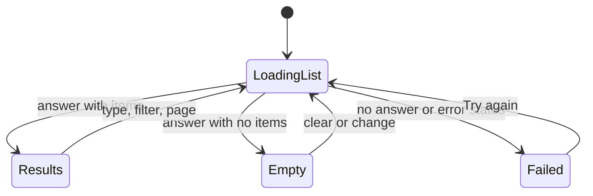
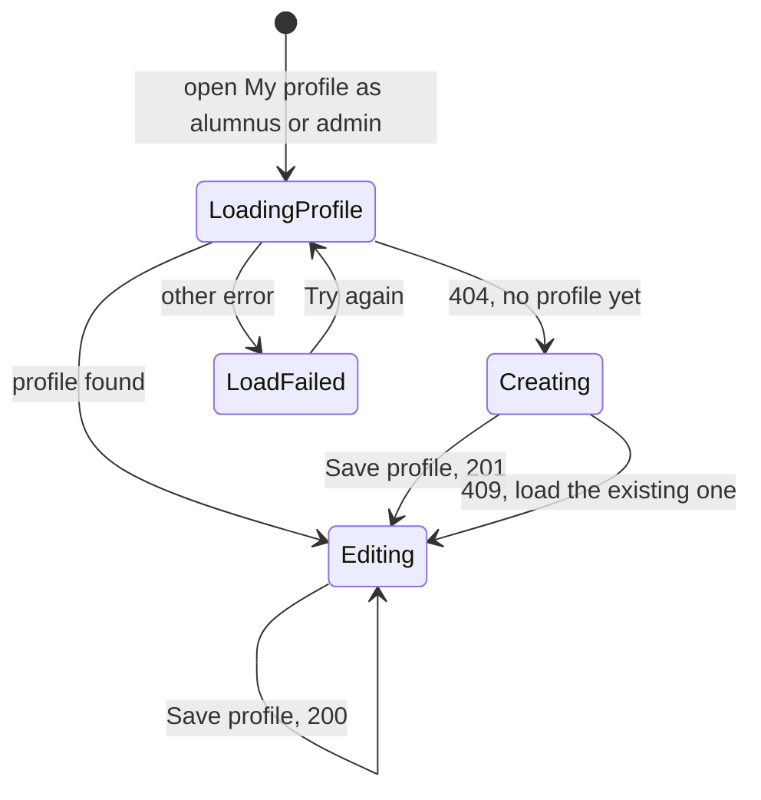
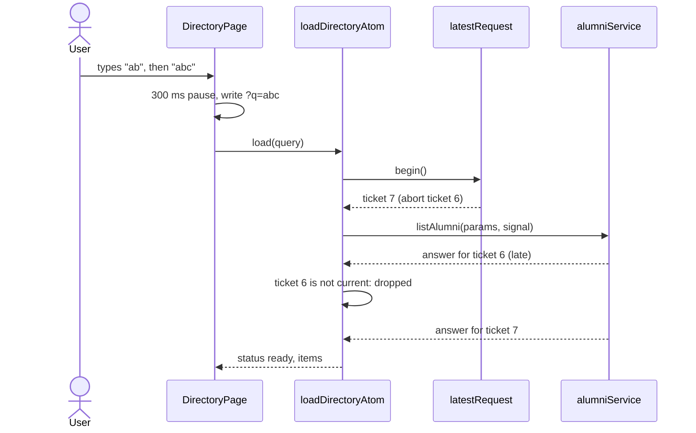
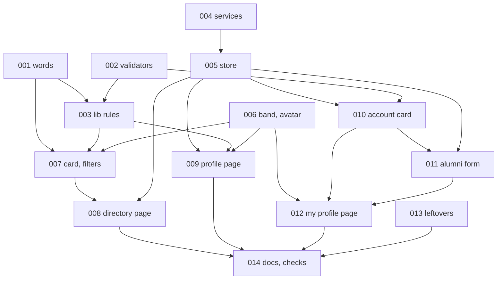

# REQ-fs-005-frontend-directory-and-profiles — Review Packet

`Packet: 154KB · round 2 · 21 files in this round · diff 98KB · excluded: scripts/frontend-lib-check.ts, docs/frontend-patterns.md (read them directly), the REQ's vault records`

This packet is round 2. The seven implementation commits (see `git log redesign..HEAD`) were reviewed in round 1 (findings in `verification.md` and `review-log.md`). Since then a fix round changed the working tree; it is NOT committed yet (it is committed after the review gate). Spec and architecture are unchanged and carried below. **Do not re-read the diff via Read; cite this packet.** Your required reading (conventions, vault, patterns doc, the library check, task notes) is not a packet gap. `Packet-gap` means the packet's own contents fell short.

## Round 2 — what changed since round 1

Findings addressed (digest rows from verification.md; "fix" = actionable, done in this round):

| ID | Finding | Fix landed in |
|----|---------|---------------|
| M1 | Save live on an untouched form | AccountCard, AlumniProfileCard, lib/alumniForm.ts (same-values rule) |
| m1 | mailto from raw email | lib/mailtoLink.ts (new), AlumniProfilePage |
| m2 | page click while search waiting sends page N | DirectoryPage writeControl |
| m3 | stuck past-the-end skeleton | DirectoryPage |
| m4 | one-frame stale state | store/alumniAtoms.ts clear actions, the 3 pages call them on close |
| m5 | typing during save overwritten | both cards |
| m7 | failure rule outside lib/ | lib/saveFailure.ts (new), lib/loadFailure.ts; components/profile/saveFailureText.ts removed |
| m8 | CSS copied across the two cards | both card css modules (composes) |
| m9 | "trimmed text or null" copies | lib/alumniDisplay.ts presentText used by alumniForm, alumniActions, sessionActions, Header, PhoneMenu |
| m11 | Admin tag invisible on the light band | ProfileBand.module.css |
| m12 | no layer check for lib/ | scripts/frontend-style-check.mjs rule k |
| m16 | focus after Try again on load errors | both cards |

Not fixed here (needs-decision, unchanged): M2, m6, m10, m13, m14, m15, m17 and the 9 trivial. Library check is now 326 cases (was 282); build and style check pass.

## Diff (uncommitted fix round, vs HEAD)

```diff
diff --git a/frontend/src/components/profile/AccountCard/AccountCard.module.css b/frontend/src/components/profile/AccountCard/AccountCard.module.css
index 0d5f30ac..be0474b4 100644
--- a/frontend/src/components/profile/AccountCard/AccountCard.module.css
+++ b/frontend/src/components/profile/AccountCard/AccountCard.module.css
@@ -1,48 +1,60 @@
-/* The Account card of my-profile.html. Tokens only. The card's frame is Card. */
+/*
+ * The Account card of my-profile.html. Tokens only. The card's frame is Card.
+ * This file owns the blocks both My profile cards share (card, heading, form,
+ * ruled); the Alumni profile card takes them with "composes", so the two
+ * cards cannot drift.
+ */
 .card {
   display: flex;
   flex-direction: column;
   gap: var(--space-5);
 }
 
-/* H2 as drawn: 24px, bold, snug. */
+/* H2 as drawn: 24px, bold, snug. As wide as its words, so the focus ring it
+ * gets after "Try again" hugs them. */
 .heading {
+  align-self: flex-start;
   margin: 0;
   font-size: var(--text-h2);
   line-height: var(--leading-h2);
   font-weight: var(--weight-bold);
   letter-spacing: var(--tracking-snug);
   overflow-wrap: anywhere;
 }
 
 .form {
   display: flex;
   flex-direction: column;
   gap: var(--space-5);
 }
 
+/* A row under a thin line, apart from what is above it. */
+.ruled {
+  padding-top: var(--space-5);
+  border-top: var(--border-line) solid var(--line);
+}
+
 /* A read-only row: the label as a field label, the role tag after it. */
 .role {
   display: flex;
   flex-wrap: wrap;
   align-items: center;
   gap: var(--space-3);
 }
 
 .roleLabel {
   font-size: var(--text-small);
   line-height: var(--leading-small);
   font-weight: var(--weight-semibold);
 }
 
 /* As wide as its words, not the card. */
 .save {
   display: flex;
 }
 
-/* Log out sits under a thin line, apart from the save. */
+/* Log out sits under the line, apart from the save. */
 .logOut {
+  composes: ruled;
   display: flex;
-  padding-top: var(--space-5);
-  border-top: var(--border-line) solid var(--line);
 }
diff --git a/frontend/src/components/profile/AccountCard/AccountCard.tsx b/frontend/src/components/profile/AccountCard/AccountCard.tsx
index 7560f27d..aede1592 100644
--- a/frontend/src/components/profile/AccountCard/AccountCard.tsx
+++ b/frontend/src/components/profile/AccountCard/AccountCard.tsx
@@ -1,246 +1,291 @@
 import { useAtomValue, useSetAtom } from "jotai";
 import type { PublicUser } from "@alumni/shared";
-import { useId, useRef, useState } from "react";
-import type { FormEvent } from "react";
+import { useEffect, useId, useRef, useState } from "react";
+import type { FormEvent, RefObject } from "react";
 import { Button } from "../../ui/Button/Button";
 import { Card } from "../../ui/Card/Card";
 import { ErrorState } from "../../ui/ErrorState/ErrorState";
 import { Message } from "../../ui/Message/Message";
 import { Skeleton, SkeletonGroup } from "../../ui/Skeleton/Skeleton";
 import { RoleTag } from "../../ui/Tag/RoleTag";
 import { TextInput } from "../../ui/TextInput/TextInput";
 import {
   ACCOUNT_CARD_HEADING,
   ACCOUNT_EMAIL_HELP,
   ACCOUNT_EMAIL_LABEL,
   ACCOUNT_LOAD_ERROR_HEADING,
   ACCOUNT_LOG_OUT_BUTTON,
   ACCOUNT_NAME_LABEL,
   ACCOUNT_PHOTO_HELP,
   ACCOUNT_PHOTO_LABEL,
   ACCOUNT_PHOTO_PLACEHOLDER,
   ACCOUNT_ROLE_LABEL,
   ACCOUNT_SAVED_TOAST,
   ACCOUNT_SAVE_BUTTON,
   ACCOUNT_SAVE_FAILED_GONE,
   OPTIONAL_MARK,
   SAVE_FAILED_NO_ANSWER,
   SAVE_FAILED_SERVER,
 } from "../../../config/text";
 import { useFormError } from "../../../hooks/useFormError";
+import { sameText } from "../../../lib/alumniDisplay";
 import { loadFailureText } from "../../../lib/loadFailure";
+import { saveFailureText } from "../../../lib/saveFailure";
+import type { SaveFailureWords } from "../../../lib/saveFailure";
 import { GENERAL_ERROR_MESSAGE, validateName, validatePhotoLink } from "../../../lib/validation";
 import { saveAccountAtom } from "../../../store/alumniActions";
 import { loadProfileAtom, profileAtom } from "../../../store/profileAtoms";
 import { logOutAtom } from "../../../store/sessionActions";
 import { showToastAtom } from "../../../store/toastAtoms";
-import { saveFailureText } from "../saveFailureText";
-import type { SaveFailureWords } from "../saveFailureText";
 import styles from "./AccountCard.module.css";
 
 // The Account card has no conflict case: the email is never sent. A 403 or
 // 404 talks about the account, not a profile.
 const SAVE_FAILURE_WORDS: SaveFailureWords = {
   noAnswer: SAVE_FAILED_NO_ANSWER,
   server: SAVE_FAILED_SERVER,
   gone: ACCOUNT_SAVE_FAILED_GONE,
   general: GENERAL_ERROR_MESSAGE,
 };
 
 type FieldErrors = {
   name: string | null;
   photoUrl: string | null;
 };
 
 const NO_ERRORS: FieldErrors = { name: null, photoUrl: null };
 
 export type AccountCardProps = {
   // "Save account" is the page's primary button only when no other card has
   // one (a student's page). With the Alumni profile card it is secondary,
   // as drawn: one primary button per view.
   primary?: boolean;
 };
 
 /**
  * The Account card of My profile, for every role: the name and photo link
  * can be edited, the email and role are shown, and the user can log out.
  * It reads the header's profile, so a save shows in the header at once.
  */
 export function AccountCard({ primary = true }: AccountCardProps) {
   const profile = useAtomValue(profileAtom);
   const loadProfile = useSetAtom(loadProfileAtom);
   const headingId = useId();
+  const headingRef = useRef<HTMLHeadingElement>(null);
+
+  // "Try again" goes away with the error state: focus moves to the heading,
+  // which stays the same element in every status.
+  function handleRetryLoad() {
+    void loadProfile();
+    headingRef.current?.focus();
+  }
 
   let body;
   if (profile.status === "ready" && profile.user !== null) {
     // Keyed on the user: another user's values never stay in the fields.
-    body = <AccountForm key={profile.user.id} user={profile.user} primary={primary} />;
+    body = (
+      <AccountForm
+        key={profile.user.id}
+        user={profile.user}
+        primary={primary}
+        headingRef={headingRef}
+      />
+    );
   } else if (profile.status === "error") {
     // The profile call does not keep its failure (null), so the shared rule
     // gives the no-answer words.
     body = (
       <ErrorState
         heading={ACCOUNT_LOAD_ERROR_HEADING}
         headingAs="h3"
         text={loadFailureText(null)}
         retryVariant="secondary"
-        onRetry={() => void loadProfile()}
+        onRetry={handleRetryLoad}
       />
     );
   } else {
     body = (
       <SkeletonGroup>
         <Skeleton />
         <Skeleton shape="block" />
         <Skeleton />
         <Skeleton shape="block" />
       </SkeletonGroup>
     );
   }
 
   return (
     <Card as="section" padding="lg" aria-labelledby={headingId}>
       <div className={styles.card}>
-        <h2 id={headingId} className={styles.heading}>
+        <h2 ref={headingRef} id={headingId} className={styles.heading} tabIndex={-1}>
           {ACCOUNT_CARD_HEADING}
         </h2>
         {body}
       </div>
     </Card>
   );
 }
 
 type AccountFormProps = {
   user: PublicUser;
   primary: boolean;
+  // Takes keyboard focus when the save button is switched off under it.
+  headingRef: RefObject<HTMLHeadingElement>;
 };
 
-function AccountForm({ user, primary }: AccountFormProps) {
+function AccountForm({ user, primary, headingRef }: AccountFormProps) {
   const saveAccount = useSetAtom(saveAccountAtom);
   const showToast = useSetAtom(showToastAtom);
   const logOut = useSetAtom(logOutAtom);
 
   const [name, setName] = useState(user.name ?? "");
   const [photoUrl, setPhotoUrl] = useState(user.photo_url ?? "");
   const [errors, setErrors] = useState<FieldErrors>(NO_ERRORS);
   const { formError, setFormError, formErrorRef, sending } = useFormError();
   const [busy, setBusy] = useState(false);
   const [loggingOut, setLoggingOut] = useState(false);
 
   const nameRef = useRef<HTMLInputElement>(null);
   const photoRef = useRef<HTMLInputElement>(null);
+  const saveRef = useRef<HTMLButtonElement>(null);
+
+  // The values as typed after the last render, for the end of a save.
+  const latest = useRef({ name, photoUrl });
+  useEffect(() => {
+    latest.current = { name, photoUrl };
+  });
+
+  // The saved user is the store's, so after a save the form is unchanged
+  // again. Save is off until a value differs, so a save always changes
+  // something (UI-001).
+  const changed =
+    !sameText(name, user.name ?? "") || !sameText(photoUrl, user.photo_url ?? "");
 
   async function handleSubmit(event: FormEvent<HTMLFormElement>) {
     event.preventDefault();
-    if (sending.current) {
+    if (sending.current || !changed) {
       return;
     }
 
     const found: FieldErrors = {
       name: validateName(name),
       photoUrl: validatePhotoLink(photoUrl),
     };
     setErrors(found);
     setFormError(null);
     if (found.name !== null) {
       nameRef.current?.focus();
       return;
     }
     if (found.photoUrl !== null) {
       photoRef.current?.focus();
       return;
     }
 
     sending.current = true;
     setBusy(true);
 
     // The action trims both values and never sends the email.
-    const result = await saveAccount({ name, photoUrl });
+    // The fields stay editable while it runs. A field is reset to the saved
+    // answer only if it still holds what was sent, so newer typing is kept
+    // (CORR-005).
+    const sent = { name, photoUrl };
+    const result = await saveAccount(sent);
     sending.current = false;
     setBusy(false);
 
     if (result.ok) {
-      setName(result.user.name ?? "");
-      setPhotoUrl(result.user.photo_url ?? "");
+      const savedName = result.user.name ?? "";
+      const savedPhotoUrl = result.user.photo_url ?? "";
+      const nameAsSent = sameText(latest.current.name, sent.name);
+      const photoAsSent = sameText(latest.current.photoUrl, sent.photoUrl);
+      setName((current) => (sameText(current, sent.name) ? savedName : current));
+      setPhotoUrl((current) => (sameText(current, sent.photoUrl) ? savedPhotoUrl : current));
+      // Nothing typed meanwhile: the button is about to be switched off.
+      if (nameAsSent && photoAsSent && document.activeElement === saveRef.current) {
+        headingRef.current?.focus();
+      }
       showToast(ACCOUNT_SAVED_TOAST);
       return;
     }
     // What the user typed stays in the fields.
     setFormError({ text: saveFailureText(result.failure, SAVE_FAILURE_WORDS) });
   }
 
   // The route guard sends the user to log in when the session is gone, and
   // this card leaves with the page. Nothing navigates here (pattern 11).
   function handleLogOut() {
     setLoggingOut(true);
     void logOut();
   }
 
   return (
     <form className={styles.form} noValidate onSubmit={handleSubmit}>
       {formError !== null ? (
         <Message ref={formErrorRef} tone="error">
           {formError.text}
         </Message>
       ) : null}
 
       <TextInput
         ref={nameRef}
         label={ACCOUNT_NAME_LABEL}
         name="name"
         autoComplete="name"
         value={name}
         error={errors.name}
         onChange={(event) => {
           setName(event.target.value);
           setErrors((current) => ({ ...current, name: null }));
         }}
       />
       <TextInput
         label={ACCOUNT_EMAIL_LABEL}
         type="email"
         name="email"
         value={user.email}
         help={ACCOUNT_EMAIL_HELP}
         disabled
         readOnly
       />
       <div className={styles.role}>
         <span className={styles.roleLabel}>{ACCOUNT_ROLE_LABEL}</span>
         <RoleTag role={user.role} />
       </div>
       <TextInput
         ref={photoRef}
         label={ACCOUNT_PHOTO_LABEL}
         optionalNote={OPTIONAL_MARK}
         type="url"
         name="photoUrl"
         autoComplete="photo"
         placeholder={ACCOUNT_PHOTO_PLACEHOLDER}
         value={photoUrl}
         help={ACCOUNT_PHOTO_HELP}
         error={errors.photoUrl}
         onChange={(event) => {
           setPhotoUrl(event.target.value);
           setErrors((current) => ({ ...current, photoUrl: null }));
         }}
       />
 
       <div className={styles.save}>
         <Button
+          ref={saveRef}
           type="submit"
           variant={primary ? "primary" : "secondary"}
           busy={busy}
+          disabled={!changed && !busy}
         >
           {ACCOUNT_SAVE_BUTTON}
         </Button>
       </div>
 
       <div className={styles.logOut}>
         <Button busy={loggingOut} onClick={handleLogOut}>
           {ACCOUNT_LOG_OUT_BUTTON}
         </Button>
       </div>
     </form>
   );
 }
diff --git a/frontend/src/components/profile/AlumniProfileCard/AlumniProfileCard.module.css b/frontend/src/components/profile/AlumniProfileCard/AlumniProfileCard.module.css
index ddcdc792..b838d21e 100644
--- a/frontend/src/components/profile/AlumniProfileCard/AlumniProfileCard.module.css
+++ b/frontend/src/components/profile/AlumniProfileCard/AlumniProfileCard.module.css
@@ -1,63 +1,58 @@
 /*
  * The Alumni profile card of my-profile.html. Tokens only. The card's frame
- * is Card; the heading takes the Account card's look with "composes", so the
- * two cards cannot drift.
+ * is Card; the card, heading, form and ruled blocks are the Account card's,
+ * taken with "composes", so the two cards cannot drift.
  */
 .card {
-  display: flex;
-  flex-direction: column;
-  gap: var(--space-5);
+  composes: card from "../AccountCard/AccountCard.module.css";
 }
 
 .top {
   display: flex;
   flex-direction: column;
   gap: var(--space-1);
 }
 
 .heading {
   composes: heading from "../AccountCard/AccountCard.module.css";
 }
 
 .intro {
   margin: 0;
   font-size: var(--text-body);
   line-height: var(--leading-body);
   color: var(--muted);
 }
 
 .form {
-  display: flex;
-  flex-direction: column;
-  gap: var(--space-5);
+  composes: form from "../AccountCard/AccountCard.module.css";
 }
 
 /* The short fields side by side while the card is wide enough, one per row
  * when it is not (a phone, or a narrow card). */
 .grid {
   display: grid;
   grid-template-columns: repeat(auto-fit, minmax(min(calc(var(--space-8) * 4), 100%), 1fr));
   gap: var(--space-5);
 }
 
 /* A failed save: the message, and under it the reload for a profile that
  * can no longer be saved. */
 .failure {
   display: flex;
   flex-direction: column;
   gap: var(--space-3);
 }
 
 /* As wide as its words, not the card. */
 .failureAction {
   display: flex;
 }
 
-/* The two buttons under a thin line, as drawn. */
+/* The two buttons under the thin line, as drawn. */
 .actions {
+  composes: ruled from "../AccountCard/AccountCard.module.css";
   display: flex;
   flex-wrap: wrap;
   gap: var(--space-3);
-  padding-top: var(--space-5);
-  border-top: var(--border-line) solid var(--line);
 }
diff --git a/frontend/src/components/profile/AlumniProfileCard/AlumniProfileCard.tsx b/frontend/src/components/profile/AlumniProfileCard/AlumniProfileCard.tsx
index 311cb8de..03370dde 100644
--- a/frontend/src/components/profile/AlumniProfileCard/AlumniProfileCard.tsx
+++ b/frontend/src/components/profile/AlumniProfileCard/AlumniProfileCard.tsx
@@ -1,225 +1,269 @@
 import { useAtomValue, useSetAtom } from "jotai";
 import type { Alumni } from "@alumni/shared";
 import { useEffect, useId, useRef, useState } from "react";
-import type { FormEvent } from "react";
+import type { FormEvent, MouseEvent } from "react";
 import { Button } from "../../ui/Button/Button";
 import { Card } from "../../ui/Card/Card";
 import { Checkbox } from "../../ui/Checkbox/Checkbox";
 import { ErrorState } from "../../ui/ErrorState/ErrorState";
 import { Message } from "../../ui/Message/Message";
 import { Skeleton, SkeletonGroup } from "../../ui/Skeleton/Skeleton";
 import { Textarea } from "../../ui/Textarea/Textarea";
 import { TextInput } from "../../ui/TextInput/TextInput";
 import {
   ALUMNI_BIO_LABEL,
   ALUMNI_CARD_HEADING,
   ALUMNI_CARD_INTRO,
   ALUMNI_COMPANY_LABEL,
   ALUMNI_DEPARTMENT_LABEL,
   ALUMNI_DISCARD_BUTTON,
   ALUMNI_EXPERIENCE_LABEL,
   ALUMNI_FIELD_LABEL,
   ALUMNI_JOB_TITLE_LABEL,
   ALUMNI_LINKEDIN_LABEL,
   ALUMNI_LOAD_ERROR_HEADING,
   ALUMNI_MENTORING_LABEL,
   ALUMNI_SAVED_TOAST,
   ALUMNI_SAVE_BUTTON,
   ALUMNI_YEAR_LABEL,
   OPTIONAL_MARK,
   SAVE_FAILED_CONFLICT,
   SAVE_FAILED_GONE,
   SAVE_FAILED_GONE_RETRY,
   SAVE_FAILED_NO_ANSWER,
   SAVE_FAILED_SERVER,
 } from "../../../config/text";
 import { useFormError } from "../../../hooks/useFormError";
 import {
   alumniToForm,
   firstInvalidField,
+  sameAlumniForm,
   validateAlumniForm,
 } from "../../../lib/alumniForm";
 import type {
   AlumniFormErrors,
   AlumniFormField,
   AlumniFormValues,
 } from "../../../lib/alumniForm";
 import { loadFailureText } from "../../../lib/loadFailure";
+import { saveFailureReason, saveFailureText } from "../../../lib/saveFailure";
+import type { SaveFailureWords } from "../../../lib/saveFailure";
 import { GENERAL_ERROR_MESSAGE } from "../../../lib/validation";
 import { saveAlumniProfileAtom } from "../../../store/alumniActions";
 import { loadMyAlumniAtom, myAlumniAtom } from "../../../store/alumniAtoms";
 import { showToastAtom } from "../../../store/toastAtoms";
-import { saveFailureReason, saveFailureText } from "../saveFailureText";
-import type { SaveFailureWords } from "../saveFailureText";
 import styles from "./AlumniProfileCard.module.css";
 
 // A 409 on create has its own words: the profile was reloaded into the form.
 const SAVE_FAILURE_WORDS: SaveFailureWords = {
   noAnswer: SAVE_FAILED_NO_ANSWER,
   server: SAVE_FAILED_SERVER,
   gone: SAVE_FAILED_GONE,
   conflict: SAVE_FAILED_CONFLICT,
   general: GENERAL_ERROR_MESSAGE,
 };
 
 const NO_ERRORS: AlumniFormErrors = {};
 
 const BIO_ROWS = 4;
 
 type TextField = Exclude<AlumniFormField, "mentoring">;
 
 /** The card-level message of a failed save; `gone` adds the reload button. */
 type SaveFailureMessage = {
   text: string;
   gone: boolean;
 };
 
 /**
  * The Alumni profile card of My profile, for the alumni and admin roles:
  * the form creates the profile the first time and edits it after.
  *
  * The page keys this card on the session's user id, and on nothing else.
  * The form is the same element whether the user has a profile or not, so
  * it stays mounted when a profile appears (after the first create, or the
  * reload after a 409): the values are reset in place, the failure message
  * stays and keyboard focus stays where it was (ADV-002).
  */
 export function AlumniProfileCard() {
   const mine = useAtomValue(myAlumniAtom);
   const loadMyAlumni = useSetAtom(loadMyAlumniAtom);
   const saveProfile = useSetAtom(saveAlumniProfileAtom);
   const showToast = useSetAtom(showToastAtom);
   const headingId = useId();
 
   const [values, setValues] = useState<AlumniFormValues>(() => alumniToForm(mine.alumni));
   const [errors, setErrors] = useState<AlumniFormErrors>(NO_ERRORS);
   // Its own message and guard, so a failure here never touches the Account card.
   const { formError, setFormError, formErrorRef, sending } = useFormError();
   const [gone, setGone] = useState(false);
   const [busy, setBusy] = useState(false);
   const fieldRefs = useRef<Partial<Record<AlumniFormField, HTMLElement | null>>>({});
+  const headingRef = useRef<HTMLHeadingElement>(null);
+  const saveRef = useRef<HTMLButtonElement>(null);
+
+  // The values the running (or last) save sent; null when no save is waiting
+  // for the store to take its answer.
+  const [sent, setSent] = useState<AlumniFormValues | null>(null);
+  // The values as typed after the last render, for the end of a save.
+  const latestValues = useRef(values);
+  useEffect(() => {
+    latestValues.current = values;
+  });
 
   // The saved profile the form was last filled from. When the store holds
   // another one (a load, a save, the reload after a 409), the values are
-  // reset in place during render, so no frame shows the old values.
+  // reset in place during render, so no frame shows the old values. Text
+  // typed while a save ran is kept: the reset happens only when the form
+  // still holds what was sent (CORR-005).
   const [filledFrom, setFilledFrom] = useState<Alumni | null>(mine.alumni);
   if (mine.alumni !== filledFrom) {
     setFilledFrom(mine.alumni);
-    setValues(alumniToForm(mine.alumni));
-    setErrors(NO_ERRORS);
+    if (sent === null || sameAlumniForm(values, sent)) {
+      setValues(alumniToForm(mine.alumni));
+      setErrors(NO_ERRORS);
+    }
+    setSent(null);
   }
 
+  // Save and Discard changes are off until a value differs from the saved
+  // one, so a save always changes something (UI-001).
+  const changed = !sameAlumniForm(values, alumniToForm(mine.alumni));
+
   useEffect(() => {
     void loadMyAlumni();
   }, [loadMyAlumni]);
 
+  // A button about to be switched off would drop keyboard focus to the
+  // page; the card heading takes it instead.
+  function keepFocusFrom(button: HTMLElement | null) {
+    if (button !== null && document.activeElement === button) {
+      headingRef.current?.focus();
+    }
+  }
+
+  // "Try again" goes away with the error state: focus moves to the heading,
+  // which stays the same element in every status.
+  function handleRetryLoad() {
+    void loadMyAlumni();
+    headingRef.current?.focus();
+  }
+
   function register(field: AlumniFormField) {
     return (element: HTMLElement | null) => {
       fieldRefs.current[field] = element;
     };
   }
 
   function setText(field: TextField, value: string) {
     setValues((current) => ({ ...current, [field]: value }));
     setErrors((current) => {
       if (current[field] === undefined) {
         return current;
       }
       const next = { ...current };
       delete next[field];
       return next;
     });
   }
 
   function showFailure(message: SaveFailureMessage | null) {
     setFormError(message === null ? null : { text: message.text });
     setGone(message?.gone ?? false);
   }
 
   async function handleSubmit(event: FormEvent<HTMLFormElement>) {
     event.preventDefault();
-    if (sending.current) {
+    if (sending.current || !changed) {
       return;
     }
 
     // Old stored data can break the limits (ADV-008): each such field gets
     // its own message here, like a typed value would.
     const found = validateAlumniForm(values, new Date().getFullYear());
     setErrors(found);
     showFailure(null);
     const first = firstInvalidField(found);
     if (first !== null) {
       fieldRefs.current[first]?.focus();
       return;
     }
 
     sending.current = true;
     setBusy(true);
+    setSent(values);
 
     // A create or an edit, chosen by the store. After a 409 the store has
     // already reloaded the profile, so the form shows it before the message.
+    // The fields stay editable while it runs; the store's answer resets them
+    // only if they still hold what was sent (see filledFrom above).
     const result = await saveProfile(values);
     sending.current = false;
     setBusy(false);
 
     if (result.ok) {
-      setValues(alumniToForm(result.alumni));
+      if (sameAlumniForm(latestValues.current, values)) {
+        keepFocusFrom(saveRef.current);
+      }
       showToast(ALUMNI_SAVED_TOAST);
       return;
     }
     // What the user typed stays in the fields.
     showFailure({
       text: saveFailureText(result.failure, SAVE_FAILURE_WORDS),
       gone: saveFailureReason(result.failure) === "gone",
     });
   }
 
   // Back to the last saved values, or empty; no question, no request (AC29).
-  function handleDiscard() {
+  function handleDiscard(event: MouseEvent<HTMLButtonElement>) {
+    keepFocusFrom(event.currentTarget);
     setValues(alumniToForm(mine.alumni));
     setErrors(NO_ERRORS);
+    setSent(null);
     showFailure(null);
   }
 
   function handleReload() {
     showFailure(null);
+    setSent(null);
     void loadMyAlumni();
   }
 
   let body;
   if (mine.status === "ready" || mine.status === "none") {
     body = (
       <form className={styles.form} noValidate onSubmit={handleSubmit}>
         {formError !== null ? (
           <div className={styles.failure}>
             <Message ref={formErrorRef} tone="error">
               {formError.text}
             </Message>
             {gone ? (
               <div className={styles.failureAction}>
                 <Button onClick={handleReload}>{SAVE_FAILED_GONE_RETRY}</Button>
               </div>
             ) : null}
           </div>
         ) : null}
 
         <div className={styles.grid}>
           <TextInput
             ref={register("department")}
             label={ALUMNI_DEPARTMENT_LABEL}
             name="department"
             value={values.department}
             error={errors.department}
             onChange={(event) => setText("department", event.target.value)}
           />
           <TextInput
             ref={register("graduationYear")}
             label={ALUMNI_YEAR_LABEL}
             name="graduationYear"
             inputMode="numeric"
             value={values.graduationYear}
             error={errors.graduationYear}
             onChange={(event) => setText("graduationYear", event.target.value)}
           />
           <TextInput
             ref={register("field")}
@@ -253,85 +297,93 @@ export function AlumniProfileCard() {
             name="experience"
             value={values.experience}
             error={errors.experience}
             onChange={(event) => setText("experience", event.target.value)}
           />
         </div>
 
         <TextInput
           ref={register("linkedinUrl")}
           label={ALUMNI_LINKEDIN_LABEL}
           optionalNote={OPTIONAL_MARK}
           type="url"
           name="linkedinUrl"
           autoComplete="url"
           value={values.linkedinUrl}
           error={errors.linkedinUrl}
           onChange={(event) => setText("linkedinUrl", event.target.value)}
         />
         <Textarea
           ref={register("bio")}
           label={ALUMNI_BIO_LABEL}
           name="bio"
           rows={BIO_ROWS}
           value={values.bio}
           error={errors.bio}
           onChange={(event) => setText("bio", event.target.value)}
         />
         <Checkbox
           ref={register("mentoring")}
           boxed
           label={ALUMNI_MENTORING_LABEL}
           name="mentoring"
           checked={values.mentoring}
           onChange={(event) => {
             const { checked } = event.target;
             setValues((current) => ({ ...current, mentoring: checked }));
           }}
         />
 
         <div className={styles.actions}>
-          <Button type="submit" variant="primary" busy={busy}>
+          <Button
+            ref={saveRef}
+            type="submit"
+            variant="primary"
+            busy={busy}
+            disabled={!changed && !busy}
+          >
             {ALUMNI_SAVE_BUTTON}
           </Button>
-          <Button onClick={handleDiscard}>{ALUMNI_DISCARD_BUTTON}</Button>
+          <Button disabled={!changed} onClick={handleDiscard}>
+            {ALUMNI_DISCARD_BUTTON}
+          </Button>
         </div>
       </form>
     );
   } else if (mine.status === "error") {
     // No form: a save must not overwrite a profile that failed to load (AC31).
     body = (
       <ErrorState
         heading={ALUMNI_LOAD_ERROR_HEADING}
         headingAs="h3"
         text={loadFailureText(mine.failure)}
         retryVariant="secondary"
-        onRetry={() => void loadMyAlumni()}
+        onRetry={handleRetryLoad}
       />
     );
   } else {
     body = (
       <SkeletonGroup>
         <Skeleton />
         <Skeleton shape="block" />
         <Skeleton />
         <Skeleton shape="block" />
         <Skeleton />
         <Skeleton shape="block" />
       </SkeletonGroup>
     );
   }
 
   return (
     <Card as="section" padding="lg" aria-labelledby={headingId}>
       <div className={styles.card}>
         <div className={styles.top}>
-          <h2 id={headingId} className={styles.heading}>
+          <h2 ref={headingRef} id={headingId} className={styles.heading} tabIndex={-1}>
             {ALUMNI_CARD_HEADING}
           </h2>
           <p className={styles.intro}>{ALUMNI_CARD_INTRO}</p>
         </div>
         {body}
       </div>
     </Card>
   );
 }
diff --git a/frontend/src/components/profile/saveFailureText.ts b/frontend/src/components/profile/saveFailureText.ts
deleted file mode 100644
index bd1bc1bb..00000000
--- a/frontend/src/components/profile/saveFailureText.ts
+++ /dev/null
@@ -1,55 +0,0 @@
-import type { ApiFailure } from "../../store/alumniAtoms";
-
-// The card-level message of a failed save, for both My profile cards. The
-// rule is here once; the words come from the caller, so each card can say
-// its own thing.
-
-/** Why a save failed, as far as the user needs to know. */
-export type SaveFailureReason = "noAnswer" | "server" | "gone" | "conflict" | "general";
-
-/**
- * The words for each reason. `conflict` is only for a card that can meet a
- * 409 it explains itself (the alumni profile create); without it a 409 gets
- * the general words.
- */
-export interface SaveFailureWords {
-  noAnswer: string;
-  server: string;
-  gone: string;
-  conflict?: string;
-  general: string;
-}
-
-const FORBIDDEN = 403;
-const NOT_FOUND = 404;
-const CONFLICT = 409;
-const FIRST_SERVER_ERROR = 500;
-
-/**
- * No answer → "noAnswer"; 500 and up → "server"; 403 or 404 → "gone" (the
- * thing can no longer be saved); 409 → "conflict"; anything else → "general".
- */
-export function saveFailureReason(failure: ApiFailure): SaveFailureReason {
-  if (failure.kind === "network") {
-    return "noAnswer";
-  }
-  if (failure.status >= FIRST_SERVER_ERROR) {
-    return "server";
-  }
-  if (failure.status === FORBIDDEN || failure.status === NOT_FOUND) {
-    return "gone";
-  }
-  if (failure.status === CONFLICT) {
-    return "conflict";
-  }
-  return "general";
-}
-
-/** The message to show in the card that failed. */
-export function saveFailureText(failure: ApiFailure, words: SaveFailureWords): string {
-  const reason = saveFailureReason(failure);
-  if (reason === "conflict") {
-    return words.conflict ?? words.general;
-  }
-  return words[reason];
-}
diff --git a/frontend/src/components/shell/Header/Header.tsx b/frontend/src/components/shell/Header/Header.tsx
index 00dc1be2..89ad7719 100644
--- a/frontend/src/components/shell/Header/Header.tsx
+++ b/frontend/src/components/shell/Header/Header.tsx
@@ -1,90 +1,91 @@
 import { useAtomValue } from "jotai";
 import { useCallback, useState } from "react";
 import { Link as RouterLink, NavLink } from "react-router-dom";
 import { APP_NAME } from "../../../config/app";
 import { MenuIcon } from "../../../icons/MenuIcon";
+import { presentText } from "../../../lib/alumniDisplay";
 import { isAdmin } from "../../../lib/token";
 import { PATHS } from "../../../routes/paths";
 import { profileAtom } from "../../../store/profileAtoms";
 import type { Profile } from "../../../store/profileAtoms";
 import { sessionAtom } from "../../../store/sessionAtoms";
 import { Avatar } from "../../ui/Avatar/Avatar";
 import { Skeleton, SkeletonGroup, SkeletonStack } from "../../ui/Skeleton/Skeleton";
 import { MAIN_NAV_LABEL, MY_PROFILE_LABEL } from "../navLabels";
 import { PhoneMenu } from "../PhoneMenu/PhoneMenu";
 import type { PhoneMenuLink } from "../PhoneMenu/PhoneMenu";
 import { ThemeSwitch } from "../ThemeSwitch/ThemeSwitch";
 import styles from "./Header.module.css";
 
 const EVERYONE_LINKS: readonly PhoneMenuLink[] = [
   { to: PATHS.dashboard, label: "Dashboard" },
   { to: PATHS.directory, label: "Directory" },
   { to: PATHS.feed, label: "Feed" },
 ];
 
 // Users is for admins only. The page has its own guard (RequireAdmin).
 const ADMIN_LINKS: readonly PhoneMenuLink[] = [
   ...EVERYONE_LINKS,
   { to: PATHS.users, label: "Users" },
 ];
 
 /** What the link to My profile holds: the avatar and the name (AC41). */
 function UserBlock({ profile }: { profile: Profile }) {
   // "idle" is the moment before the shell asks for the profile.
   if (profile.status === "idle" || profile.status === "loading") {
     return (
       <>
         <span className="visuallyHidden">{MY_PROFILE_LABEL}</span>
         <div className={styles.userLoading}>
           <SkeletonGroup layout="row">
             <Skeleton shape="avatar-sm" />
             <SkeletonStack>
               <Skeleton shape="line" />
             </SkeletonStack>
           </SkeletonGroup>
         </div>
       </>
     );
   }
 
-  const name = profile.user?.name?.trim() || null;
+  const name = presentText(profile.user?.name);
 
   // The call failed, or the user has no name: a plain avatar and plain words.
   if (name === null) {
     return (
       <>
         <Avatar size="sm" name={null} photoUrl={profile.user?.photo_url} />
         {MY_PROFILE_LABEL}
       </>
     );
   }
 
   return (
     <>
       <Avatar size="sm" name={name} photoUrl={profile.user?.photo_url} />
       <span className={styles.userName}>{name}</span>
       <span className="visuallyHidden">, {MY_PROFILE_LABEL}</span>
     </>
   );
 }
 
 /**
  * The header of every shell page (AC32, AC33). Wide screens: app name, main
  * links, theme switch, the user. Below 768px: the app name and a menu button
  * that opens the full-screen menu.
  */
 export function Header() {
   const session = useAtomValue(sessionAtom);
   const profile = useAtomValue(profileAtom);
   const [menuOpen, setMenuOpen] = useState(false);
 
   const links = isAdmin(session) ? ADMIN_LINKS : EVERYONE_LINKS;
   const closeMenu = useCallback(() => setMenuOpen(false), []);
 
   return (
     <header className={styles.header}>
       <div className={styles.inner}>
         <div className={styles.start}>
           <RouterLink className={styles.appName} to={PATHS.dashboard}>
             {APP_NAME}
           </RouterLink>
diff --git a/frontend/src/components/shell/PhoneMenu/PhoneMenu.tsx b/frontend/src/components/shell/PhoneMenu/PhoneMenu.tsx
index 82787ebb..037f45b8 100644
--- a/frontend/src/components/shell/PhoneMenu/PhoneMenu.tsx
+++ b/frontend/src/components/shell/PhoneMenu/PhoneMenu.tsx
@@ -1,93 +1,94 @@
 import { useSetAtom } from "jotai";
 import { useEffect, useId, useRef, useState } from "react";
 import { NavLink, useLocation } from "react-router-dom";
 import { APP_NAME } from "../../../config/app";
 import { PHONE_LAYOUT_QUERY } from "../../../config/layout";
 import { useModalDialog } from "../../../hooks/useModalDialog";
+import { presentText } from "../../../lib/alumniDisplay";
 import { CloseIcon } from "../../../icons/CloseIcon";
 import { PATHS } from "../../../routes/paths";
 import type { Profile } from "../../../store/profileAtoms";
 import { logOutAtom } from "../../../store/sessionActions";
 import { Avatar } from "../../ui/Avatar/Avatar";
 import { Button } from "../../ui/Button/Button";
 import { Skeleton, SkeletonGroup, SkeletonStack } from "../../ui/Skeleton/Skeleton";
 import { MAIN_NAV_LABEL, MY_PROFILE_LABEL } from "../navLabels";
 import { ThemeSwitch } from "../ThemeSwitch/ThemeSwitch";
 import styles from "./PhoneMenu.module.css";
 
 export type PhoneMenuLink = {
   to: string;
   label: string;
 };
 
 export type PhoneMenuProps = {
   open: boolean;
   // Asked for by Escape, the close button, a chosen link, a route change and
   // a window that grew past the phone layout. The caller answers by setting
   // `open` to false; the menu does not close on its own.
   onClose: () => void;
   /** The main links, in order. The menu adds My profile after them. */
   links: readonly PhoneMenuLink[];
   profile: Profile;
 };
 
 /** Who is logged in: avatar, name, email. Nothing when the profile call failed. */
 function Person({ profile }: { profile: Profile }) {
   if (profile.status === "idle" || profile.status === "loading") {
     return (
       <SkeletonGroup layout="row">
         <Skeleton shape="avatar-md" />
         <SkeletonStack>
           <Skeleton shape="title" />
           <Skeleton shape="line" />
         </SkeletonStack>
       </SkeletonGroup>
     );
   }
 
   const { user } = profile;
   if (user === null) {
     return null;
   }
 
-  const name = user.name?.trim() || null;
+  const name = presentText(user.name);
 
   return (
     <div className={styles.person}>
       <Avatar size="md" name={name} photoUrl={user.photo_url} />
       <div className={styles.personText}>
         {name !== null ? <div className={styles.name}>{name}</div> : null}
         <div className={styles.email}>{user.email}</div>
       </div>
     </div>
   );
 }
 
 /**
  * The full-screen menu of the phone layout (AC33, phone-menu.html). A native
  * <dialog> opened with showModal(): the browser moves focus inside, keeps Tab
  * inside, closes on Escape and gives focus back to the menu button.
  * It has its own look; it does not share the card of ui/Dialog.
  */
 export function PhoneMenu({ open, onClose, links, profile }: PhoneMenuProps) {
   const dialogRef = useModalDialog({ open, onClose });
   const titleId = useId();
   const { pathname } = useLocation();
   const logOut = useSetAtom(logOutAtom);
   const [loggingOut, setLoggingOut] = useState(false);
 
   // The effects below read the newest props here (the route-change effect must
   // not run again when they change).
   const latest = useRef({ open, onClose });
   useEffect(() => {
     latest.current = { open, onClose };
   });
 
   // The page changed (a link here, or the browser's Back button).
   useEffect(() => {
     if (latest.current.open) {
       latest.current.onClose();
     }
   }, [pathname]);
 
   // The window grew past the phone layout: the header shows the links again.
diff --git a/frontend/src/components/shell/ProfileBand/ProfileBand.module.css b/frontend/src/components/shell/ProfileBand/ProfileBand.module.css
index 5768fb0c..d43cd392 100644
--- a/frontend/src/components/shell/ProfileBand/ProfileBand.module.css
+++ b/frontend/src/components/shell/ProfileBand/ProfileBand.module.css
@@ -35,81 +35,89 @@
 
 .back:hover {
   color: var(--band-muted);
 }
 
 /* The down chevron, turned to point left: no second icon file. */
 .backIcon {
   display: inline-flex;
   transform: rotate(90deg);
 }
 
 /* Person on the left, actions on the right; the actions wrap under the
    person when the line is too short (a long name, a phone, 200% zoom). */
 .row {
   display: flex;
   flex-wrap: wrap;
   align-items: flex-end;
   justify-content: space-between;
   gap: var(--space-5) var(--space-6);
 }
 
 .person {
   display: flex;
   flex: 1 1 auto;
   flex-wrap: wrap;
   align-items: center;
   gap: var(--space-5);
   min-width: 0;
 }
 
 /* min-width: 0 lets a long name shrink the column, so the heading wraps. */
 .text {
   display: flex;
   flex: 1 1 auto;
   flex-direction: column;
   align-items: flex-start;
   gap: var(--space-3);
   min-width: 0;
 }
 
+/* The Admin tag is filled with --action, which on the light theme is the
+   band's own color, so it lost its box (review UI-002). In this slot only it
+   is filled with the band's text color and written in the band's color: a
+   light box on the band in both themes (18:1 light, 13:1 dark). Tags on cards
+   keep --action. The other role tags do not read these two tokens. */
 .tag {
+  --action: var(--band-text);
+  --on-action: var(--band);
+
   max-width: 100%;
 }
 
 /* As wide as its words, so the focus ring it gets on a page change hugs them. */
 .heading {
   composes: heading from "../Band/Band.module.css";
 }
 
 .sub {
   composes: sub from "../Band/Band.module.css";
   overflow-wrap: anywhere;
 }
 
 /* The loading line takes the width of the column, not of its own content. */
 .subLoading {
   display: block;
   align-self: stretch;
 }
 
 /* The plain tags take the band's text color: a Tag writes var(--text), which
    is near black on the light theme's band. Only this row is changed, so the
    role and mentoring tags above the heading keep their own colors. */
 .tags {
   --text: var(--band-text);
 
   display: flex;
   flex-wrap: wrap;
   gap: var(--space-2);
   max-width: 100%;
 }
 
 .actions {
   display: flex;
   flex-wrap: wrap;
   gap: var(--space-3);
   max-width: 100%;
 }
 
 .avatarLoading {
   composes: skeleton from "../../ui/Skeleton/Skeleton.module.css";
diff --git a/frontend/src/lib/alumniDisplay.ts b/frontend/src/lib/alumniDisplay.ts
index 161adda0..0102474f 100644
--- a/frontend/src/lib/alumniDisplay.ts
+++ b/frontend/src/lib/alumniDisplay.ts
@@ -1,53 +1,62 @@
 // The lines a card, the profile page and the profile band show for one person
 // (AC2, AC15). A value that is missing or only spaces is left out, never shown
 // as blank or "null".
 
 import {
   CLASS_OF_PREFIX,
   JOB_LINE_JOINER,
   NAME_NOT_GIVEN,
   NOT_GIVEN,
 } from "../config/text";
 
 /**
  * The trimmed text, or null when there is none. The one copy of this rule:
- * tags, band lines and Details rows all use it (AC2, AC36).
+ * tags, band lines, Details rows, the header name and the bodies the forms
+ * send all use it (AC2, AC36). A field left out (undefined) counts as none.
  */
-export function presentText(text: string | null): string | null {
-  if (text === null) {
+export function presentText(text: string | null | undefined): string | null {
+  if (text === null || text === undefined) {
     return null;
   }
   const trimmed = text.trim();
   return trimmed === "" ? null : trimmed;
 }
 
+/**
+ * True when two typed values would be sent the same: spaces around the text
+ * do not count, and empty is the same as only spaces.
+ */
+export function sameText(a: string, b: string): boolean {
+  return presentText(a) === presentText(b);
+}
+
 /** The name to show, or "Name not given". */
 export function displayName(name: string | null): string {
   return presentText(name) ?? NAME_NOT_GIVEN;
 }
 
 /** "Title at Company", only the part that exists, or null when neither does. */
 export function jobLine(title: string | null, company: string | null): string | null {
   const shownTitle = presentText(title);
   const shownCompany = presentText(company);
   if (shownTitle !== null && shownCompany !== null) {
     return `${shownTitle}${JOB_LINE_JOINER}${shownCompany}`;
   }
   return shownTitle ?? shownCompany;
 }
 
 /** "Class of 2019", or null when there is no year. */
 export function classLabel(year: number | null): string | null {
   return year === null ? null : `${CLASS_OF_PREFIX} ${year}`;
 }
 
 /** The text of a Details row, or "Not given". */
 export function orNotGiven(text: string | null): string {
   return presentText(text) ?? NOT_GIVEN;
 }
 
 /** The first word of the name, for "Email Nadia"; null when there is no name. */
 export function firstName(name: string | null): string | null {
   const shown = presentText(name);
   return shown === null ? null : shown.split(/\s+/)[0];
 }
diff --git a/frontend/src/lib/alumniForm.ts b/frontend/src/lib/alumniForm.ts
index bd09965d..d20ffd68 100644
--- a/frontend/src/lib/alumniForm.ts
+++ b/frontend/src/lib/alumniForm.ts
@@ -1,45 +1,46 @@
 // The rules of the "Alumni profile" form on My profile: the values as typed,
 // how a saved profile fills the form, how the form is judged, and the body
 // that a save sends.
 
 import type { Alumni, CreateAlumniDTO } from "@alumni/shared";
+import { presentText, sameText } from "./alumniDisplay";
 import {
   MAX_BIO_LENGTH,
   MAX_TEXT_LENGTH,
   validateGraduationYear,
   validateLinkedInLink,
   validateOptionalText,
 } from "./validation";
 
 /** The form as typed: every field is text, except the mentoring checkbox. */
 export interface AlumniFormValues {
   department: string;
   graduationYear: string;
   field: string;
   company: string;
   jobTitle: string;
   experience: string;
   linkedinUrl: string;
   bio: string;
   mentoring: boolean;
 }
 
 export type AlumniFormField = keyof AlumniFormValues;
 
 /** One message per field that has an error; a field with no error is absent. */
 export type AlumniFormErrors = Partial<Record<AlumniFormField, string>>;
 
 /** Every key the API accepts, always sent, so an emptied field is cleared (AC25). */
 export type AlumniFormBody = Required<CreateAlumniDTO>;
 
 // The order of the fields on the screen (AC23): the first one with an error
 // gets keyboard focus.
 const FIELD_ORDER: readonly AlumniFormField[] = [
   "department",
   "graduationYear",
   "field",
   "company",
   "jobTitle",
   "experience",
   "linkedinUrl",
   "bio",
@@ -70,63 +71,70 @@ export function alumniToForm(alumni: Alumni | null): AlumniFormValues {
     company: alumni.current_company ?? "",
     jobTitle: alumni.job_title ?? "",
     experience: alumni.experience ?? "",
     linkedinUrl: alumni.linkedin_url ?? "",
     bio: alumni.bio ?? "",
     mentoring: alumni.mentorship_available,
   };
 }
 
 /** Judges the whole form. Every field is optional; an empty map means it can be sent. */
 export function validateAlumniForm(values: AlumniFormValues, thisYear: number): AlumniFormErrors {
   const errors: AlumniFormErrors = {};
   const note = (field: AlumniFormField, message: string | null): void => {
     if (message !== null) {
       errors[field] = message;
     }
   };
   note("department", validateOptionalText(values.department, MAX_TEXT_LENGTH));
   note("graduationYear", validateGraduationYear(values.graduationYear, thisYear));
   note("field", validateOptionalText(values.field, MAX_TEXT_LENGTH));
   note("company", validateOptionalText(values.company, MAX_TEXT_LENGTH));
   note("jobTitle", validateOptionalText(values.jobTitle, MAX_TEXT_LENGTH));
   note("experience", validateOptionalText(values.experience, MAX_TEXT_LENGTH));
   note("linkedinUrl", validateLinkedInLink(values.linkedinUrl));
   note("bio", validateOptionalText(values.bio, MAX_BIO_LENGTH));
   return errors;
 }
 
 /** The first field with an error, in screen order, or null when there is none. */
 export function firstInvalidField(errors: AlumniFormErrors): AlumniFormField | null {
   return FIELD_ORDER.find((field) => errors[field] !== undefined) ?? null;
 }
 
 /**
  * The body of a save. Text is trimmed and an empty field becomes null; the
  * year becomes a number. user_id is never sent: the server takes the user
  * from the login token.
  */
 export function alumniFormToBody(values: AlumniFormValues): AlumniFormBody {
   return {
-    department: textOrNull(values.department),
+    department: presentText(values.department),
     graduation_year: yearOrNull(values.graduationYear),
-    current_company: textOrNull(values.company),
-    job_title: textOrNull(values.jobTitle),
-    experience: textOrNull(values.experience),
-    bio: textOrNull(values.bio),
-    linkedin_url: textOrNull(values.linkedinUrl),
+    current_company: presentText(values.company),
+    job_title: presentText(values.jobTitle),
+    experience: presentText(values.experience),
+    bio: presentText(values.bio),
+    linkedin_url: presentText(values.linkedinUrl),
     mentorship_available: values.mentoring,
-    field: textOrNull(values.field),
+    field: presentText(values.field),
   };
 }
 
-function textOrNull(value: string): string | null {
-  const text = value.trim();
-  return text === "" ? null : text;
+/**
+ * True when the two forms would save the same profile: text is compared
+ * after trimming, the checkbox as it is. Save and Discard changes stay off
+ * while the form is the same as the saved one (UI-001).
+ */
+export function sameAlumniForm(a: AlumniFormValues, b: AlumniFormValues): boolean {
+  return (
+    a.mentoring === b.mentoring &&
+    FIELD_ORDER.every((field) => field === "mentoring" || sameText(a[field], b[field]))
+  );
 }
 
 /** A whole number, or null when empty. The form is judged before this runs. */
 function yearOrNull(value: string): number | null {
   const text = value.trim();
   const year = Number(text);
   return text === "" || !Number.isInteger(year) ? null : year;
 }
diff --git a/frontend/src/lib/loadFailure.ts b/frontend/src/lib/loadFailure.ts
index 71c34371..831b9029 100644
--- a/frontend/src/lib/loadFailure.ts
+++ b/frontend/src/lib/loadFailure.ts
@@ -1,18 +1,26 @@
 // The line of a load error state (pattern 9): the server answered with an
 // error, or no answer came. One rule for every page and card that loads.
+// This file also owns the shape of a failed call and the status numbers the
+// rules read, so they are written once (lib/saveFailure.ts uses them too).
 
 import { FAILURE_NO_ANSWER_TEXT, FAILURE_SERVER_TEXT } from "../config/text";
 
 /**
  * A failed call, as far as the words need to know. The same shape as the
  * services' ApiFailure, written here so lib/ does not import services/.
  */
-export type LoadFailure = { kind: "network" } | { kind: "http"; status: number };
+export type CallFailure = { kind: "network" } | { kind: "http"; status: number };
+
+export const HTTP_FORBIDDEN = 403;
+export const HTTP_NOT_FOUND = 404;
+export const HTTP_CONFLICT = 409;
+/** 500 and every status above it is the server's own fault. */
+export const HTTP_FIRST_SERVER_ERROR = 500;
 
 /**
  * Any status from the server → the server words; no answer, or no failure
  * kept (null) → the no-answer words.
  */
-export function loadFailureText(failure: LoadFailure | null): string {
+export function loadFailureText(failure: CallFailure | null): string {
   return failure?.kind === "http" ? FAILURE_SERVER_TEXT : FAILURE_NO_ANSWER_TEXT;
 }
diff --git a/frontend/src/pages/AlumniProfilePage/AlumniProfilePage.tsx b/frontend/src/pages/AlumniProfilePage/AlumniProfilePage.tsx
index 5804097b..2a44f2c9 100644
--- a/frontend/src/pages/AlumniProfilePage/AlumniProfilePage.tsx
+++ b/frontend/src/pages/AlumniProfilePage/AlumniProfilePage.tsx
@@ -10,259 +10,274 @@ import {
 import { Card } from "../../components/ui/Card/Card";
 import { ErrorState } from "../../components/ui/ErrorState/ErrorState";
 import { Link } from "../../components/ui/Link/Link";
 import { Skeleton, SkeletonGroup } from "../../components/ui/Skeleton/Skeleton";
 import { Tag } from "../../components/ui/Tag/Tag";
 import {
   NOT_GIVEN,
   OPEN_TO_MENTORING,
   OPENS_IN_NEW_TAB,
   PROFILE_ABOUT_HEADING,
   PROFILE_BACK_LINK,
   PROFILE_COMPANY_LABEL,
   PROFILE_DEPARTMENT_LABEL,
   PROFILE_DETAILS_HEADING,
   PROFILE_EMAIL_LABEL,
   PROFILE_ERROR_HEADING,
   PROFILE_EXPERIENCE_LABEL,
   PROFILE_FIELD_LABEL,
   PROFILE_HEADING,
   PROFILE_JOB_TITLE_LABEL,
   PROFILE_LINKEDIN_LINK,
   PROFILE_MENTORING_LABEL,
   PROFILE_MENTORING_NO,
   PROFILE_MENTORING_YES,
   PROFILE_NOT_FOUND_HEADING,
   PROFILE_NOT_FOUND_LINK,
   PROFILE_NOT_FOUND_TEXT,
   PROFILE_YEAR_LABEL,
   profileEmailLink,
 } from "../../config/text";
 import {
   classLabel,
   displayName,
   firstName,
   jobLine,
   orNotGiven,
   presentText,
 } from "../../lib/alumniDisplay";
 import { readDirectorySearch } from "../../lib/directoryReturn";
 import { loadFailureText } from "../../lib/loadFailure";
+import { mailtoHref } from "../../lib/mailtoLink";
 import { readProfileId } from "../../lib/profileId";
 import { isWebLink } from "../../lib/validation";
 import { PATHS } from "../../routes/paths";
-import { loadAlumniAtom, viewedAlumniAtom } from "../../store/alumniAtoms";
+import {
+  clearViewedAlumniAtom,
+  loadAlumniAtom,
+  viewedAlumniAtom,
+} from "../../store/alumniAtoms";
 import styles from "./AlumniProfilePage.module.css";
 
 // How many lines the Details skeleton draws: one per row of the card.
 const DETAILS_ROW_COUNT = 8;
 
 type PageStatus = "loading" | "ready" | "notFound" | "error";
 
 /**
  * One person's public profile (AC15 to AC20). The band is drawn in every
  * status at the same place, so its <h1> stays the same element when the data
  * arrives and keyboard focus on it is not lost.
  */
 export default function AlumniProfilePage() {
   const { id: rawId } = useParams();
   const location = useLocation();
   const id = readProfileId(rawId);
   const viewed = useAtomValue(viewedAlumniAtom);
   const loadAlumni = useSetAtom(loadAlumniAtom);
+  const clearViewed = useSetAtom(clearViewedAlumniAtom);
   const bandRef = useRef<HTMLDivElement>(null);
 
   useEffect(() => {
     if (id !== null) {
       void loadAlumni(id);
     }
   }, [id, loadAlumni]);
 
+  // Leaving the page forgets the profile, so the next visit never starts
+  // from this visit's error, "not found" or old data (CORR-004, ARCH-005).
+  useEffect(() => () => clearViewed(), [clearViewed]);
+
   // The atom may still hold another profile: it counts only when its id is
   // this page's id (TASK-005).
   let status: PageStatus;
   if (id === null) {
     status = "notFound";
   } else if (viewed.id !== id || viewed.status === "idle" || viewed.status === "loading") {
     status = "loading";
   } else {
     status = viewed.status;
   }
   const alumni = status === "ready" ? viewed.alumni : null;
 
   // Back to the same filters and page; the plain directory when the state
   // is missing or not trusted (AC17).
   const backTo = PATHS.directory + readDirectorySearch(location.state);
   const heading = alumni ? displayName(alumni.name) : PROFILE_HEADING;
 
   function retryProfile(profileId: number) {
     void loadAlumni(profileId);
     // "Try again" goes away with the error state: focus moves to the band's
     // <h1>, which stays the same element in every status, not to the body.
     bandRef.current?.querySelector<HTMLElement>("h1")?.focus();
   }
 
   return (
     <PageLayout
       heading={heading}
       band={
         <div ref={bandRef}>
           <ProfileBand
             back={{ to: backTo, label: PROFILE_BACK_LINK }}
             avatar={{ name: alumni?.name ?? null, photoUrl: alumni?.photo_url ?? null }}
             heading={heading}
             loading={status === "loading"}
             {...(alumni ? bandDetails(alumni) : {})}
           />
         </div>
       }
     >
       {status === "loading" ? <ProfileSkeleton /> : null}
       {status === "ready" && alumni ? <ProfileContent alumni={alumni} /> : null}
       {status === "notFound" ? (
         <PageNote title={PROFILE_NOT_FOUND_HEADING} text={PROFILE_NOT_FOUND_TEXT}>
           <Link to={backTo}>{PROFILE_NOT_FOUND_LINK}</Link>
         </PageNote>
       ) : null}
       {status === "error" && id !== null ? (
         <ErrorState
           heading={PROFILE_ERROR_HEADING}
           text={loadFailureText(viewed.failure)}
           onRetry={() => retryProfile(id)}
         />
       ) : null}
     </PageLayout>
   );
 }
 
 /** The band's sub line, tags and links for a loaded profile. */
 function bandDetails(alumni: Alumni) {
   const tags = [
     presentText(alumni.department),
     classLabel(alumni.graduation_year),
     presentText(alumni.field),
   ].filter((tag): tag is string => tag !== null);
 
-  const email = presentText(alumni.email);
+  // Only a plain address becomes a link (CORR-001).
+  const emailHref = mailtoHref(alumni.email);
   const linkedIn = presentText(alumni.linkedin_url);
   // Only an http(s) address becomes a link: never javascript:, ftp: or
   // anything else (AC16).
   const showLinkedIn = linkedIn !== null && isWebLink(linkedIn);
   const first = firstName(alumni.name);
 
   return {
     tag: alumni.mentorship_available ? (
       <Tag variant="mentoring">{OPEN_TO_MENTORING}</Tag>
     ) : undefined,
     sub: jobLine(alumni.job_title, alumni.current_company) ?? undefined,
     tags:
       tags.length > 0 ? (
         <>
           {tags.map((tag, index) => (
             <Tag key={index}>{tag}</Tag>
           ))}
         </>
       ) : undefined,
     actions:
-      email !== null || showLinkedIn ? (
+      emailHref !== null || showLinkedIn ? (
         <>
-          {email !== null ? (
-            <ProfileBandAction variant="primary" href={`mailto:${email}`}>
+          {emailHref !== null ? (
+            <ProfileBandAction variant="primary" href={emailHref}>
               {first !== null ? profileEmailLink(first) : PROFILE_EMAIL_LABEL}
             </ProfileBandAction>
           ) : null}
           {showLinkedIn ? (
             <ProfileBandAction variant="outline" href={linkedIn} newTab>
               {PROFILE_LINKEDIN_LINK}
               <span className="visuallyHidden"> {OPENS_IN_NEW_TAB}</span>
             </ProfileBandAction>
           ) : null}
         </>
       ) : undefined,
   };
 }
 
 /** About and Details: two columns on a wide screen, one on a phone. */
 function ProfileContent({ alumni }: { alumni: Alumni }) {
   const aboutId = useId();
   const detailsId = useId();
   const bio = presentText(alumni.bio);
   const email = presentText(alumni.email);
+  const emailHref = mailtoHref(alumni.email);
   const year = alumni.graduation_year === null ? null : String(alumni.graduation_year);
 
   const rows: { label: string; value: string }[] = [
     { label: PROFILE_DEPARTMENT_LABEL, value: orNotGiven(alumni.department) },
     { label: PROFILE_YEAR_LABEL, value: orNotGiven(year) },
     { label: PROFILE_FIELD_LABEL, value: orNotGiven(alumni.field) },
     { label: PROFILE_COMPANY_LABEL, value: orNotGiven(alumni.current_company) },
     { label: PROFILE_JOB_TITLE_LABEL, value: orNotGiven(alumni.job_title) },
     { label: PROFILE_EXPERIENCE_LABEL, value: orNotGiven(alumni.experience) },
   ];
 
   return (
     <div className={styles.columns}>
       <Card as="section" aria-labelledby={aboutId}>
         <div className={styles.cardBody}>
           <h2 id={aboutId} className={styles.cardHeading}>
             {PROFILE_ABOUT_HEADING}
           </h2>
           <p className={bio !== null ? styles.bio : `${styles.bio} ${styles.muted}`}>
             {bio ?? NOT_GIVEN}
           </p>
         </div>
       </Card>
       <Card as="section" aria-labelledby={detailsId}>
         <div className={styles.cardBody}>
           <h2 id={detailsId} className={styles.cardHeading}>
             {PROFILE_DETAILS_HEADING}
           </h2>
           <dl className={styles.details}>
             {rows.map((row) => (
               <div key={row.label} className={styles.row}>
                 <dt className={styles.label}>{row.label}</dt>
                 <dd className={styles.value}>{row.value}</dd>
               </div>
             ))}
             <div className={styles.row}>
               <dt className={styles.label}>{PROFILE_EMAIL_LABEL}</dt>
               <dd className={styles.value}>
-                {email !== null ? <Link href={`mailto:${email}`}>{email}</Link> : NOT_GIVEN}
+                {/* An address that is not plain is shown as text, not as a link (CORR-001). */}
+                {email === null ? NOT_GIVEN : null}
+                {email !== null && emailHref !== null ? <Link href={emailHref}>{email}</Link> : null}
+                {email !== null && emailHref === null ? email : null}
               </dd>
             </div>
             <div className={styles.row}>
               <dt className={styles.label}>{PROFILE_MENTORING_LABEL}</dt>
               <dd className={styles.value}>
                 {alumni.mentorship_available ? PROFILE_MENTORING_YES : PROFILE_MENTORING_NO}
               </dd>
             </div>
           </dl>
         </div>
       </Card>
     </div>
   );
 }
 
 /** The loading state: the same two cards, as still blocks; "Loading" is said once. */
 function ProfileSkeleton() {
   return (
     <SkeletonGroup>
       <div className={styles.columns}>
         <Card>
           <div className={styles.cardBody}>
             <Skeleton shape="title" />
             <Skeleton shape="line" />
             <Skeleton shape="line" />
             <Skeleton shape="line" />
           </div>
         </Card>
         <Card>
           <div className={styles.cardBody}>
             <Skeleton shape="title" />
             {Array.from({ length: DETAILS_ROW_COUNT }, (_, index) => (
               <Skeleton key={index} shape="line" />
             ))}
           </div>
         </Card>
       </div>
     </SkeletonGroup>
   );
 }
diff --git a/frontend/src/pages/DirectoryPage/DirectoryPage.tsx b/frontend/src/pages/DirectoryPage/DirectoryPage.tsx
index 942bd9b7..b62b7e48 100644
--- a/frontend/src/pages/DirectoryPage/DirectoryPage.tsx
+++ b/frontend/src/pages/DirectoryPage/DirectoryPage.tsx
@@ -1,256 +1,272 @@
 import { useAtomValue, useSetAtom, useStore } from "jotai";
 import { useEffect, useLayoutEffect, useMemo, useRef, useState } from "react";
 import { useSearchParams } from "react-router-dom";
 import { AlumniCard } from "../../components/alumni/AlumniCard/AlumniCard";
 import { AlumniCardSkeleton } from "../../components/alumni/AlumniCard/AlumniCardSkeleton";
 import { DirectoryFilters } from "../../components/alumni/DirectoryFilters/DirectoryFilters";
 import type { DirectoryFilterPatch } from "../../components/alumni/DirectoryFilters/DirectoryFilters";
 import { PageLayout } from "../../components/shell/PageLayout/PageLayout";
 import { Card } from "../../components/ui/Card/Card";
 import { EmptyState } from "../../components/ui/EmptyState/EmptyState";
 import { ErrorState } from "../../components/ui/ErrorState/ErrorState";
 import { Pagination } from "../../components/ui/Pagination/Pagination";
 import { SkeletonGroup } from "../../components/ui/Skeleton/Skeleton";
 import {
   DIRECTORY_COUNT_FAILED,
   DIRECTORY_COUNT_LOADING,
   DIRECTORY_CLEAR_BUTTON,
   DIRECTORY_COUNT_NONE,
   DIRECTORY_EMPTY_MATCH_HEADING,
   DIRECTORY_EMPTY_MATCH_TEXT,
   DIRECTORY_EMPTY_NONE_HEADING,
   DIRECTORY_EMPTY_NONE_TEXT,
   DIRECTORY_ERROR_HEADING,
   DIRECTORY_HEADING,
   DIRECTORY_SUB,
   directoryCount,
 } from "../../config/text";
 import {
   DEFAULT_DIRECTORY_QUERY,
   hasCriteria,
   lastPage,
   readDirectoryQuery,
   toListParams,
   writeDirectoryQuery,
 } from "../../lib/directoryQuery";
 import type { DirectoryQuery } from "../../lib/directoryQuery";
 import { loadFailureText } from "../../lib/loadFailure";
 import {
+  clearDirectoryAtom,
   directoryAtom,
   filtersAtom,
   loadDirectoryAtom,
   loadFiltersAtom,
 } from "../../store/alumniAtoms";
 import styles from "./DirectoryPage.module.css";
 
 // A pause this long in typing sends the search (AC3).
 const SEARCH_DELAY_MS = 300;
 // The skeleton cards of a full page while a page loads (AC9).
 const SKELETON_CARD_COUNT = 12;
 
 type ListView = "loading" | "ready" | "empty" | "error";
 
 /** The canonical address text of a query: the load key and the card return state. */
 function queryKeyOf(query: DirectoryQuery): string {
   return writeDirectoryQuery(query).toString();
 }
 
 /**
  * The alumni directory (AC1 to AC14). The address is the truth: every
  * control writes it, and the list loads from it. Only the typed search text,
  * its timer and a few focus flags live in the component.
  */
 export default function DirectoryPage() {
   const [searchParams, setSearchParams] = useSearchParams();
   const query = useMemo(() => readDirectoryQuery(searchParams), [searchParams]);
   const queryKey = queryKeyOf(query);
 
   const store = useStore();
   const directory = useAtomValue(directoryAtom);
   const filters = useAtomValue(filtersAtom);
   const loadDirectory = useSetAtom(loadDirectoryAtom);
   const loadFilters = useSetAtom(loadFiltersAtom);
+  const clearDirectory = useSetAtom(clearDirectoryAtom);
 
   const [searchText, setSearchText] = useState(query.q);
 
   // The query of the address right now. A timer or a handler reads this at
   // the moment it writes, never a copy from when it started (ADV-003).
   const liveQuery = useRef(query);
   const setParams = useRef(setSearchParams);
   // The trimmed search text this page last wrote or read from the address.
   // The box is overwritten only when the address differs from it (ADV-003).
   const lastCommitted = useRef(query.q);
   // The typed text waiting for the timer, or null when no timer runs.
   const pendingText = useRef<string | null>(null);
   const timer = useRef<number | null>(null);
   // Set only by Pagination's onChange: Back, a pasted link and the
   // past-the-end fix never move focus (ADV-007).
   const focusCountOnPage = useRef(false);
-  // The address already moved to the last page once (AC7).
+  // The address the past-the-end fix last moved, until that episode ends (AC7).
   const clampedKey = useRef<string | null>(null);
 
   const countRef = useRef<HTMLParagraphElement>(null);
   const searchRef = useRef<HTMLInputElement>(null);
 
   useLayoutEffect(() => {
     liveQuery.current = query;
     setParams.current = setSearchParams;
   }, [query, setSearchParams]);
 
   function stopTimer(): string | null {
     if (timer.current !== null) {
       window.clearTimeout(timer.current);
       timer.current = null;
     }
     const pending = pendingText.current;
     pendingText.current = null;
     return pending === null ? null : pending.trim();
   }
 
   /** Writes the address; false when it would not change. */
   function writeAddress(next: DirectoryQuery, replace: boolean): boolean {
     if (queryKeyOf(next) === queryKeyOf(liveQuery.current)) {
       return false;
     }
     liveQuery.current = next;
     setParams.current(writeDirectoryQuery(next), { replace });
     return true;
   }
 
   /**
    * A change of a filter, the checkbox or the page. It pushes a history
    * entry, and a search still waiting for its timer goes with it (ADV-003).
+   * A new search always starts on page 1, even when a page click sends it
+   * (AC6, CORR-002).
    */
   function writeControl(patch: Partial<DirectoryQuery>): boolean {
     const pending = stopTimer();
     const base = liveQuery.current;
     const q = pending ?? base.q;
     lastCommitted.current = q;
-    return writeAddress({ ...base, q, ...patch }, false);
+    const newSearch = q !== base.q;
+    return writeAddress({ ...base, q, ...patch, ...(newSearch ? { page: 1 } : {}) }, false);
   }
 
   /** Sends the search text now. Typing replaces the history entry (listed deviation). */
   function commitSearch(text: string) {
     stopTimer();
     const q = text.trim();
     lastCommitted.current = q;
     if (q !== liveQuery.current.q) {
       writeAddress({ ...liveQuery.current, q, page: 1 }, true);
     }
   }
 
   function handleSearchTextChange(text: string) {
     setSearchText(text);
     stopTimer();
     pendingText.current = text;
     timer.current = window.setTimeout(() => commitSearch(text), SEARCH_DELAY_MS);
   }
 
   function handleFilterChange(patch: DirectoryFilterPatch) {
     writeControl({ ...patch, page: 1 });
   }
 
   function handlePageChange(page: number) {
     focusCountOnPage.current = writeControl({ page });
   }
 
   function handleClear() {
     stopTimer();
     setSearchText("");
     lastCommitted.current = "";
     writeAddress(DEFAULT_DIRECTORY_QUERY, false);
     // The Clear button disappears with the criteria: focus goes to the search box.
     searchRef.current?.focus();
   }
 
   function retryList() {
     void loadDirectory({ params: toListParams(query), queryKey });
     // The error state and its button go away: the count line says "Loading".
     countRef.current?.focus();
   }
 
   // The list follows the address. latestRequest drops older answers (G48).
   useEffect(() => {
     const keyQuery = readDirectoryQuery(new URLSearchParams(queryKey));
     void loadDirectory({ params: toListParams(keyQuery), queryKey });
   }, [queryKey, loadDirectory]);
 
   // The options once; not again when they are already here (back from a profile).
   useEffect(() => {
     if (store.get(filtersAtom).status !== "ready") {
       void loadFilters();
     }
   }, [store, loadFilters]);
 
   // Back, Forward or a pasted link changed the search: the box follows.
   useEffect(() => {
     if (query.q !== lastCommitted.current) {
       stopTimer();
       lastCommitted.current = query.q;
       setSearchText(query.q);
     }
   }, [query.q]);
 
   useEffect(() => () => void stopTimer(), []);
 
+  // Leaving the page forgets the list, so the next visit never shows this
+  // visit's list or error for a frame before its own load (CORR-004, ARCH-005).
+  useEffect(() => () => clearDirectory(), [clearDirectory]);
+
   // After the user changed page: focus on the count line. Pagination has
   // gone while the page loads, so nothing takes focus back (AC8).
   useEffect(() => {
     if (focusCountOnPage.current) {
       focusCountOnPage.current = false;
       countRef.current?.focus({ preventScroll: true });
       countRef.current?.scrollIntoView({ block: "start" });
     }
   }, [query.page]);
 
   // The state belongs to this address only when its key matches (ADV-007).
   const current = directory.queryKey === queryKey ? directory : null;
   const pageCount = current ? lastPage(current.total, current.limit) : 1;
   const pastTheEnd =
     current !== null && current.status === "ready" && current.total > 0 && query.page > pageCount;
 
-  // A page past the end: the address moves to the last page, once (AC7).
+  // A page past the end: the address moves to the last page, once per
+  // episode (AC7). The mark is cleared as soon as the page is not past the
+  // end, so the same address past the end again is moved again and the
+  // skeleton is never left on screen (CORR-003).
   useEffect(() => {
-    if (pastTheEnd && clampedKey.current !== queryKey) {
+    if (!pastTheEnd) {
+      clampedKey.current = null;
+    } else if (
+      clampedKey.current !== queryKey &&
+      writeAddress({ ...liveQuery.current, page: pageCount }, true)
+    ) {
       clampedKey.current = queryKey;
-      writeAddress({ ...liveQuery.current, page: pageCount }, true);
     }
   });
 
   let view: ListView;
   if (current === null || current.status === "idle" || current.status === "loading" || pastTheEnd) {
     view = "loading";
   } else if (current.status === "error") {
     view = "error";
   } else if (current.items.length === 0) {
     view = "empty";
   } else {
     view = "ready";
   }
 
   const countText = {
     loading: DIRECTORY_COUNT_LOADING,
     error: DIRECTORY_COUNT_FAILED,
     empty: DIRECTORY_COUNT_NONE,
     ready: directoryCount(current?.total ?? 0),
   }[view];
   const directorySearch = queryKey === "" ? "" : `?${queryKey}`;
   const emptyWithCriteria = view === "empty" && hasCriteria(query);
 
   return (
     <PageLayout heading={DIRECTORY_HEADING} sub={DIRECTORY_SUB}>
       <Card>
         <DirectoryFilters
           query={query}
           searchText={searchText}
           onSearchTextChange={handleSearchTextChange}
           onSearchNow={() => commitSearch(searchText)}
           onFilterChange={handleFilterChange}
           options={filters.filters}
           optionsStatus={filters.status}
           onRetryOptions={() => void loadFilters()}
           onClear={handleClear}
           showClear={!emptyWithCriteria}
           searchRef={searchRef}
         />
       </Card>
diff --git a/frontend/src/pages/MyProfilePage/MyProfilePage.tsx b/frontend/src/pages/MyProfilePage/MyProfilePage.tsx
index 689bda87..13745510 100644
--- a/frontend/src/pages/MyProfilePage/MyProfilePage.tsx
+++ b/frontend/src/pages/MyProfilePage/MyProfilePage.tsx
@@ -1,71 +1,77 @@
-import { useAtomValue } from "jotai";
+import { useEffect } from "react";
+import { useAtomValue, useSetAtom } from "jotai";
 import { AccountCard } from "../../components/profile/AccountCard/AccountCard";
 import { AlumniProfileCard } from "../../components/profile/AlumniProfileCard/AlumniProfileCard";
 import { PageLayout } from "../../components/shell/PageLayout/PageLayout";
 import {
   ProfileBand,
   ProfileBandAction,
 } from "../../components/shell/ProfileBand/ProfileBand";
 import { RoleTag } from "../../components/ui/Tag/RoleTag";
 import {
   MY_PROFILE_HEADING,
   MY_PROFILE_PUBLIC_LINK,
   myProfileSub,
 } from "../../config/text";
 import { alumniProfilePath } from "../../routes/paths";
-import { myAlumniAtom } from "../../store/alumniAtoms";
+import { clearMyAlumniAtom, myAlumniAtom } from "../../store/alumniAtoms";
 import { profileAtom } from "../../store/profileAtoms";
 import { sessionAtom } from "../../store/sessionAtoms";
 import styles from "./MyProfilePage.module.css";
 
 /**
  * My profile (AC21 to AC33): the band, then the cards for the user's role.
  * An alumnus or an admin gets the Alumni profile card first and the Account
  * card next to it; anyone else (a student, a role we do not know) gets only
  * the Account card, so their page never asks for /api/alumni/me (AC22).
  * Log out lives in the Account card (AC33).
  */
 export default function MyProfilePage() {
   const session = useAtomValue(sessionAtom);
   const profile = useAtomValue(profileAtom);
   const myAlumni = useAtomValue(myAlumniAtom);
+  const clearMyAlumni = useSetAtom(clearMyAlumniAtom);
+
+  // Only when the page closes: while it is open the band's public link
+  // reads the saved profile from the atom (CORR-004, ARCH-005).
+  useEffect(() => () => clearMyAlumni(), [clearMyAlumni]);
 
   // The role in the token decides the cards and the band's tag, so the two
   // always agree.
   const role = session?.role ?? null;
   const hasAlumniCard = session !== null && (role === "alumni" || role === "admin");
 
   const user = profile.status === "ready" ? profile.user : null;
   const sub = user ? myProfileSub(user.name, user.email) : "";
   // Only a profile that exists has a public page (AC32).
   const publicProfile =
     hasAlumniCard && myAlumni.status === "ready" ? myAlumni.alumni : null;
 
   return (
     <PageLayout
       heading={MY_PROFILE_HEADING}
       band={
         <ProfileBand
           avatar={{ name: user?.name ?? null, photoUrl: user?.photo_url ?? null }}
           tag={role !== null ? <RoleTag role={role} /> : undefined}
           heading={MY_PROFILE_HEADING}
           sub={sub !== "" ? sub : undefined}
           loading={profile.status === "idle" || profile.status === "loading"}
           actions={
             publicProfile !== null ? (
               <ProfileBandAction variant="outline" to={alumniProfilePath(publicProfile.id)}>
                 {MY_PROFILE_PUBLIC_LINK}
               </ProfileBandAction>
             ) : undefined
           }
         />
       }
     >
       {hasAlumniCard ? (
         <div className={styles.cards}>
           <div className={styles.main}>
             {/* Keyed on the user only: another user gets a fresh card (ADV-001),
                 the same user keeps one mounted card (ADV-002). */}
             <AlumniProfileCard key={session.userId} />
           </div>
           <div className={styles.side}>
diff --git a/frontend/src/store/alumniActions.ts b/frontend/src/store/alumniActions.ts
index 7945713c..c268d933 100644
--- a/frontend/src/store/alumniActions.ts
+++ b/frontend/src/store/alumniActions.ts
@@ -1,112 +1,112 @@
 import { atom } from "jotai";
 import type { Alumni, PublicUser, UpdateUserDTO } from "@alumni/shared";
+import { presentText } from "../lib/alumniDisplay";
 import { alumniFormToBody } from "../lib/alumniForm";
 import type { AlumniFormValues } from "../lib/alumniForm";
+import { HTTP_CONFLICT } from "../lib/loadFailure";
 import { createAlumni, updateAlumni } from "../services/alumniService";
 import { toApiFailure } from "../services/apiError";
 import type { ApiFailure } from "../services/apiError";
 import { updateUser } from "../services/userService";
 import { loadMyAlumniAtom, myAlumniAtom, setMyAlumniAtom } from "./alumniAtoms";
 import { setProfileUserAtom } from "./profileAtoms";
 import { sessionAtom } from "./sessionAtoms";
 
 // The two saves of My profile. Each returns a result and never throws; none
 // navigates (pattern 7). An answer that arrives after the session went to
 // another user is not stored: the page of that user must not show it.
 
 export type SaveAlumniResult =
   | { ok: true; alumni: Alumni }
   | { ok: false; failure: ApiFailure };
 
 export type SaveAccountResult =
   | { ok: true; user: PublicUser }
   | { ok: false; failure: ApiFailure };
 
 export interface AccountInput {
   name: string;
   photoUrl: string;
 }
 
 // Nothing to save against: no session, or the profile has not loaded. The
 // forms are not shown then, so no status is worth reporting: "network".
 const NOT_READY: ApiFailure = { kind: "network" };
 
-const CONFLICT = 409;
-
 /**
  * Saves the alumni profile form: a create when the user has none, an edit
  * of the loaded profile otherwise (the id `/me` returned, G37). After a 409
  * on create the existing profile is reloaded quietly before the result is
  * returned, so the form already shows it (AC30, ADV-002).
  */
 export const saveAlumniProfileAtom = atom(
   null,
   async (get, set, values: AlumniFormValues): Promise<SaveAlumniResult> => {
     const session = get(sessionAtom);
     const mine = get(myAlumniAtom);
     if (session === null) {
       return { ok: false, failure: NOT_READY };
     }
     const { userId } = session;
     const isSameUser = (): boolean => get(sessionAtom)?.userId === userId;
     const body = alumniFormToBody(values);
 
     let alumni: Alumni;
     if (mine.status === "ready" && mine.alumni !== null) {
       try {
         alumni = await updateAlumni(mine.alumni.id, body);
       } catch (error) {
         return { ok: false, failure: toApiFailure(error) };
       }
     } else if (mine.status === "none") {
       try {
         alumni = await createAlumni(body);
       } catch (error) {
         const failure = toApiFailure(error);
-        if (failure.kind === "http" && failure.status === CONFLICT && isSameUser()) {
+        if (failure.kind === "http" && failure.status === HTTP_CONFLICT && isSameUser()) {
           await set(loadMyAlumniAtom, { quiet: true });
         }
         return { ok: false, failure };
       }
     } else {
       return { ok: false, failure: NOT_READY };
     }
 
     if (isSameUser()) {
       set(setMyAlumniAtom, alumni);
     }
     return { ok: true, alumni };
   },
 );
 
 /**
  * Saves the account form (name and photo link) of the session's own user.
  * Both are trimmed; an empty one is sent as null. On success the header's
  * profile takes the answer (AC28).
  */
 export const saveAccountAtom = atom(
   null,
   async (get, set, input: AccountInput): Promise<SaveAccountResult> => {
     const session = get(sessionAtom);
     if (session === null) {
       return { ok: false, failure: NOT_READY };
     }
     const { userId } = session;
     const body: UpdateUserDTO = {
-      name: input.name.trim() || null,
-      photo_url: input.photoUrl.trim() || null,
+      name: presentText(input.name),
+      photo_url: presentText(input.photoUrl),
     };
 
     let user: PublicUser;
     try {
       user = await updateUser(userId, body);
     } catch (error) {
       return { ok: false, failure: toApiFailure(error) };
     }
 
     if (get(sessionAtom)?.userId === userId) {
       set(setProfileUserAtom, user);
     }
     return { ok: true, user };
   },
 );
diff --git a/frontend/src/store/alumniAtoms.ts b/frontend/src/store/alumniAtoms.ts
index fc006c4e..b0266617 100644
--- a/frontend/src/store/alumniAtoms.ts
+++ b/frontend/src/store/alumniAtoms.ts
@@ -54,81 +54,82 @@ export interface MyAlumniState {
   failure: ApiFailure | null;
 }
 
 export interface LoadDirectoryInput {
   params: AlumniListParams;
   // The canonical address the page built the params from.
   queryKey: string;
 }
 
 export interface LoadMyAlumniOptions {
   // Keep the current state until the answer arrives (ADV-002: the reload
   // after a 409 must not take the form off the screen).
   quiet?: boolean;
 }
 
 const IDLE_DIRECTORY: DirectoryState = {
   status: "idle",
   queryKey: null,
   items: [],
   total: 0,
   page: 1,
   limit: 0,
   failure: null,
 };
 const IDLE_FILTERS: FiltersState = { status: "idle", filters: null, failure: null };
 const IDLE_VIEWED: ViewedAlumniState = {
   status: "idle",
   id: null,
   alumni: null,
   failure: null,
 };
 const IDLE_MY_ALUMNI: MyAlumniState = { status: "idle", alumni: null, failure: null };
 
 const NOT_FOUND = 404;
 
 export const directoryAtom = atom<DirectoryState>(IDLE_DIRECTORY);
 export const filtersAtom = atom<FiltersState>(IDLE_FILTERS);
 export const viewedAlumniAtom = atom<ViewedAlumniState>(IDLE_VIEWED);
 export const myAlumniAtom = atom<MyAlumniState>(IDLE_MY_ALUMNI);
 
-// One per loader; resetAlumniAtom cancels all four.
+// One per loader; resetAlumniAtom cancels all four, and the three clear atoms
+// cancel the directory's, the viewed profile's and the user's own profile's.
 const directoryRequest = createLatestRequest();
 const filtersRequest = createLatestRequest();
 const viewedRequest = createLatestRequest();
 const myAlumniRequest = createLatestRequest();
 
 function isNotFound(failure: ApiFailure): boolean {
   return failure.kind === "http" && failure.status === NOT_FOUND;
 }
 
 /** Loads one page of the directory. Shows no items while it loads. */
 export const loadDirectoryAtom = atom(
   null,
   async (_get, set, input: LoadDirectoryInput): Promise<void> => {
     const { queryKey } = input;
     const ticket = directoryRequest.begin();
     set(directoryAtom, { ...IDLE_DIRECTORY, status: "loading", queryKey });
     try {
       const result = await listAlumni(input.params, ticket.signal);
       if (ticket.isCurrent()) {
         set(directoryAtom, {
           status: "ready",
           queryKey,
           items: result.items,
           total: result.total,
           page: result.page,
           limit: result.limit,
           failure: null,
         });
       }
     } catch (error) {
       if (ticket.isCurrent() && !isCancelled(error)) {
         set(directoryAtom, {
           ...IDLE_DIRECTORY,
           status: "error",
           queryKey,
           failure: toApiFailure(error),
         });
       }
     }
   },
@@ -193,55 +194,87 @@ export const loadMyAlumniAtom = atom(
     }
 
     const { userId } = session;
     const quiet = options?.quiet === true;
     // GET /api/alumni/me takes no signal: the ticket alone drops a late answer.
     const ticket = myAlumniRequest.begin();
     const isStillCurrent = (): boolean =>
       ticket.isCurrent() && get(sessionAtom)?.userId === userId;
 
     if (!quiet) {
       set(myAlumniAtom, { status: "loading", alumni: null, failure: null });
     }
     try {
       const alumni = await getMyAlumni();
       if (isStillCurrent()) {
         set(myAlumniAtom, { status: "ready", alumni, failure: null });
       }
     } catch (error) {
       if (!isStillCurrent() || isCancelled(error)) {
         return;
       }
       const failure = toApiFailure(error);
       if (isNotFound(failure)) {
         set(myAlumniAtom, { status: "none", alumni: null, failure: null });
       } else if (!quiet) {
         set(myAlumniAtom, { status: "error", alumni: null, failure });
       }
     }
   },
 );
 
 /**
  * Stores a profile the user just saved. Any load still running for the old
  * state is cancelled, so its answer cannot overwrite the saved one.
  */
 export const setMyAlumniAtom = atom(null, (_get, set, alumni: Alumni) => {
   myAlumniRequest.cancel();
   set(myAlumniAtom, { status: "ready", alumni, failure: null });
 });
 
+/**
+ * Forgets the directory list and cancels its call. The directory calls it
+ * when it unmounts, so the next visit never shows this visit's list or error
+ * for a frame before its own load starts (CORR-004, ARCH-005). The filter
+ * options are kept: they do not depend on the address.
+ */
+export const clearDirectoryAtom = atom(null, (_get, set) => {
+  directoryRequest.cancel();
+  set(directoryAtom, IDLE_DIRECTORY);
+});
+
+/**
+ * Forgets the viewed profile and cancels its call. The profile page calls it
+ * when it unmounts, so the next visit never starts from this visit's error,
+ * "not found" or old data (CORR-004, ARCH-005).
+ */
+export const clearViewedAlumniAtom = atom(null, (_get, set) => {
+  viewedRequest.cancel();
+  set(viewedAlumniAtom, IDLE_VIEWED);
+});
+
+/**
+ * Forgets the user's own profile and cancels its call. My profile calls it
+ * when it unmounts, never while it is open (the band's public link reads the
+ * saved profile), so the next visit never starts from this visit's error or
+ * old profile (CORR-004, ARCH-005).
+ */
+export const clearMyAlumniAtom = atom(null, (_get, set) => {
+  myAlumniRequest.cancel();
+  set(myAlumniAtom, IDLE_MY_ALUMNI);
+});
+
 /**
  * Puts all four back to idle and cancels their calls. The session actions
  * call it whenever the user changes, so one user's data is never shown to
  * the next (ADV-001).
  */
 export const resetAlumniAtom = atom(null, (_get, set) => {
   directoryRequest.cancel();
   filtersRequest.cancel();
   viewedRequest.cancel();
   myAlumniRequest.cancel();
   set(directoryAtom, IDLE_DIRECTORY);
   set(filtersAtom, IDLE_FILTERS);
   set(viewedAlumniAtom, IDLE_VIEWED);
   set(myAlumniAtom, IDLE_MY_ALUMNI);
 });
diff --git a/frontend/src/store/sessionActions.ts b/frontend/src/store/sessionActions.ts
index f8903516..e74b8adb 100644
--- a/frontend/src/store/sessionActions.ts
+++ b/frontend/src/store/sessionActions.ts
@@ -1,43 +1,44 @@
 import { atom } from "jotai";
 import type { SignUpUserDTO } from "@alumni/shared";
 import { REMEMBERED_EMAIL_STORAGE_KEY } from "../config/storageKeys";
+import { presentText } from "../lib/alumniDisplay";
 import { removeStored, writeStored } from "../lib/browserStorage";
 import { isLiveSession, readToken } from "../lib/token";
 import { toApiFailure } from "../services/apiError";
 import type { ApiFailure } from "../services/apiError";
 import { logIn } from "../services/authService";
 import { logOut, signUp } from "../services/userService";
 import { resetAlumniAtom } from "./alumniAtoms";
 import { IDLE_PROFILE, profileAtom } from "./profileAtoms";
 import {
   adoptStoredTokenAtom,
   authNoticeAtom,
   sessionAtom,
   tokenAtom,
 } from "./sessionAtoms";
 import type { AuthNotice } from "./sessionAtoms";
 
 // The session actions. Each is a write-only atom that returns a result and
 // never throws. None of them navigates: the route guards do that when they
 // see the session change (architecture.md, "Session").
 //
 // Jotai tells its listeners once per synchronous write. After an `await` every
 // `set` would tell them on its own, so each change of more than one atom goes
 // through one of the two small atoms below. The guards then never see a
 // half-changed session.
 
 export interface LogInInput {
   email: string;
   password: string;
   rememberEmail: boolean;
 }
 
 export type LogInResult = { ok: true } | { ok: false; failure: ApiFailure };
 
 export type SignUpResult =
   | { ok: true; loggedIn: boolean }
   | { ok: false; failure: ApiFailure };
 
 type TokenResult =
   | { ok: true; token: string }
   | { ok: false; failure: ApiFailure };
@@ -76,82 +77,82 @@ async function requestToken(email: string, password: string): Promise<TokenResul
   }
 }
 
 /**
  * Logs in. The email is trimmed and its letter case kept. On success the
  * email is remembered or forgotten first, because the log-in page may be gone
  * the moment the token is set.
  */
 export const logInAtom = atom(
   null,
   async (_get, set, input: LogInInput): Promise<LogInResult> => {
     const email = input.email.trim();
     const result = await requestToken(email, input.password);
     if (!result.ok) {
       return result;
     }
 
     if (input.rememberEmail) {
       writeStored(REMEMBERED_EMAIL_STORAGE_KEY, email);
     } else {
       removeStored(REMEMBERED_EMAIL_STORAGE_KEY);
     }
     set(startSessionAtom, result.token);
     return { ok: true };
   },
 );
 
 /**
  * Creates the user, then logs in with the same email and password. Name,
  * email and photo link are trimmed; an empty name or photo link is sent as
  * null. `loggedIn: false` means the account exists but the log in failed.
  * The remembered email is left as it is.
  */
 export const signUpAtom = atom(
   null,
   async (_get, set, input: SignUpUserDTO): Promise<SignUpResult> => {
     const body: SignUpUserDTO = {
       email: input.email.trim(),
       password: input.password,
       role: input.role,
-      name: input.name?.trim() || null,
-      photo_url: input.photo_url?.trim() || null,
+      name: presentText(input.name),
+      photo_url: presentText(input.photo_url),
     };
 
     try {
       await signUp(body);
     } catch (error) {
       return { ok: false, failure: toApiFailure(error) };
     }
 
     const result = await requestToken(body.email, body.password);
     if (!result.ok) {
       return { ok: true, loggedIn: false };
     }
     set(startSessionAtom, result.token);
     return { ok: true, loggedIn: true };
   },
 );
 
 /**
  * Tells the server, then logs out here whatever the server said (AC43).
  * Token, profile and the "loggedOut" notice change in one store update.
  */
 export const logOutAtom = atom(null, async (get, set): Promise<void> => {
   const session = get(sessionAtom);
   if (session !== null) {
     try {
       await logOut(session.userId);
     } catch {
       // The user asked to leave; a failed call does not keep them in.
     }
   }
   set(clearSessionAtom, "loggedOut");
 });
 
 /**
  * Ends a dead session: a 401, a token that ran out, a stored token that
  * cannot be read. The only way such a session is cleared; the log-in page
  * then shows the session-ended message.
  */
 export const endSessionAtom = atom(null, (_get, set) => {
   set(clearSessionAtom, "sessionEnded");
diff --git a/scripts/frontend-style-check.mjs b/scripts/frontend-style-check.mjs
index a8f4462b..fd04cea8 100644
--- a/scripts/frontend-style-check.mjs
+++ b/scripts/frontend-style-check.mjs
@@ -1,101 +1,109 @@
 // Style check for the new frontend (REQ-fs-004). Plain Node, no packages.
 //
 //   node scripts/frontend-style-check.mjs
 //
 // Reads every text file under frontend/src and prints one line per finding,
 // with the file and the line. Exit 1 on any finding, 0 on none.
 // It reads files only: it writes nothing and calls nothing.
 //
 // The rules:
 //   a  no color literal outside styles/tokens.css
 //   b  no px / em / rem number in a *.module.css or in styles/base.css
 //   c  no import of antd, @ant-design or @fontsource-variable/inter
 //   d  no import of axios or services/ from components, pages, routes, hooks, icons
 //   e  the app name and the contact email are written only in config/app.ts
 //   f  no onClick and no role="button" on a <div> or a <span>
 //   g  no dangerouslySetInnerHTML
 //   h  no box-shadow, no gradient, no "outline: none" in a stylesheet
 //   i  an address of routes/paths.ts, or a text starting with "ua.", written as
 //      a string only in routes/paths.ts and config/storageKeys.ts
 //   j  every max-width media query line in a stylesheet equals the phone
 //      layout of config/layout.ts
+//   k  no import of react, react-dom, react-router-dom, services/ or store/
+//      from lib/ (lib is plain functions; type imports of @alumni/shared are fine)
 
 import { readFileSync, readdirSync, statSync } from "node:fs";
 import path from "node:path";
 import { fileURLToPath } from "node:url";
 
 const REPO_ROOT = path.resolve(path.dirname(fileURLToPath(import.meta.url)), "..");
 const SRC_DIR = path.join(REPO_ROOT, "frontend", "src");
 
 const TOKENS_FILE = "styles/tokens.css";
 const BASE_FILE = "styles/base.css";
 const APP_CONFIG_FILE = "config/app.ts";
 const CONFIG_CONSTANTS = ["APP_NAME", "CONTACT_EMAIL"];
 
 const PATHS_FILE = "routes/paths.ts";
 const STORAGE_KEYS_FILE = "config/storageKeys.ts";
 const LAYOUT_FILE = "config/layout.ts";
 // A text starting with this is a storage key (config/storageKeys.ts).
 const STORAGE_KEY_PREFIX = "ua.";
 
 const TEXT_EXTENSIONS = new Set([
   ".ts", ".tsx", ".js", ".jsx", ".mjs", ".cjs", ".css", ".html", ".svg", ".json", ".md",
 ]);
 const SCRIPT_EXTENSIONS = new Set([".ts", ".tsx", ".js", ".jsx", ".mjs", ".cjs"]);
 
 // Folders whose files may not reach the API themselves (rule d).
 const UI_FOLDERS = ["components/", "pages/", "routes/", "hooks/", "icons/"];
 
+// The folder of plain functions, and what it may not import (rule k).
+const LIB_FOLDER = "lib/";
+const LIB_BANNED_PACKAGES = ["react", "react-dom", "react-router-dom"];
+const LIB_BANNED_FOLDER = /(?:^|\/)(services|store)(?:\/|$)/;
+
 const BANNED_PACKAGES = ["antd", "@ant-design", "@fontsource-variable/inter"];
 
 const RULES = {
   a: "color literal outside styles/tokens.css",
   b: "px / em / rem literal in a component stylesheet or base.css",
   c: "import of antd, @ant-design or @fontsource-variable/inter",
   d: "import of axios or services/ from a UI folder",
   e: "app name or contact email outside config/app.ts",
   f: "onClick or role=\"button\" on a <div> or <span>",
   g: "dangerouslySetInnerHTML",
   h: "box-shadow, gradient or outline removed in a stylesheet",
   i: "address or storage key written as a string outside routes/paths.ts and config/storageKeys.ts",
   j: "max-width media query that differs from config/layout.ts",
+  k: "import of React, the router, services/ or store/ from lib/",
 };
 
 // The CSS named colors (CSS Color Module Level 4). "transparent", "currentColor"
 // and "inherit" are not in the list: they carry no color value of their own.
 const NAMED_COLORS = new Set(
   (
     "aliceblue antiquewhite aqua aquamarine azure beige bisque black blanchedalmond blue " +
     "blueviolet brown burlywood cadetblue chartreuse chocolate coral cornflowerblue cornsilk " +
     "crimson cyan darkblue darkcyan darkgoldenrod darkgray darkgreen darkgrey darkkhaki " +
     "darkmagenta darkolivegreen darkorange darkorchid darkred darksalmon darkseagreen " +
     "darkslateblue darkslategray darkslategrey darkturquoise darkviolet deeppink deepskyblue " +
     "dimgray dimgrey dodgerblue firebrick floralwhite forestgreen fuchsia gainsboro ghostwhite " +
     "gold goldenrod gray green greenyellow grey honeydew hotpink indianred indigo ivory khaki " +
     "lavender lavenderblush lawngreen lemonchiffon lightblue lightcoral lightcyan " +
     "lightgoldenrodyellow lightgray lightgreen lightgrey lightpink lightsalmon lightseagreen " +
     "lightskyblue lightslategray lightslategrey lightsteelblue lightyellow lime limegreen linen " +
     "magenta maroon mediumaquamarine mediumblue mediumorchid mediumpurple mediumseagreen " +
     "mediumslateblue mediumspringgreen mediumturquoise mediumvioletred midnightblue mintcream " +
     "mistyrose moccasin navajowhite navy oldlace olive olivedrab orange orangered orchid " +
     "palegoldenrod palegreen paleturquoise palevioletred papayawhip peachpuff peru pink plum " +
     "powderblue purple rebeccapurple red rosybrown royalblue saddlebrown salmon sandybrown " +
     "seagreen seashell sienna silver skyblue slateblue slategray slategrey snow springgreen " +
     "steelblue tan teal thistle tomato turquoise violet wheat white whitesmoke yellow yellowgreen"
   ).split(" "),
 );
 
 // "#fff", "#ffff", "#ffffff", "#ffffffff". Not "&#8217;" (a character code).
 const HEX_COLOR = /(?<![&\w])#(?:[0-9a-fA-F]{8}|[0-9a-fA-F]{6}|[0-9a-fA-F]{3,4})(?![\w-])/;
 const COLOR_FUNCTION = /(?<![\w-])(?:rgba?|hsla?|hwb|lab|lch|oklab|oklch)\s*\(/i;
 // A named color given to a style property or an SVG attribute in a script file:
 //   style={{ color: "red" }}   fill="black"   stroke={'white'}
 const SCRIPT_COLOR_PROPERTY =
   /(?<![\w-])(?:color|background|backgroundColor|borderColor|border\w*Color|outlineColor|fill|stroke|stopColor|floodColor|caretColor|accentColor|textDecorationColor)\s*[:=]\s*\{?\s*["'`]\s*([a-zA-Z]+)\s*["'`]/g;
 
 const SIZE_LITERAL = /(?<![\w#.-])[+-]?(?:\d+\.?\d*|\.\d+)(?:px|rem|em)(?![\w-])/;
 
 const IMPORT_SPECIFIER =
   /(?:\bfrom\s*|\bimport\s*\(?\s*|\brequire\s*\(\s*|@import\s+(?:url\(\s*)?)["'`]([^"'`]+)["'`]/g;
 
 const CLICKABLE_TAG = /<(div|span)(?![\w.-])/g;
@@ -278,93 +286,103 @@ function checkCssNamedColors(rel, lines) {
       // "a:hover," is one line of a selector list, not a declaration.
       const isSelector = /^\s*[\w-]+:\S.*,\s*$/.test(line);
       if (declaration && !isSelector) value = declaration[2];
     } else {
       // "a { color: red; }" on one line: look inside the braces.
       const inside = line.slice(line.indexOf("{") + 1);
       const declaration = inside.match(/^\s*(--)?[\w-]+\s*:(.*)$/);
       if (declaration) value = declaration[2];
     }
     if (value === null) return;
     inValue = !/[;}]/.test(value);
     for (const word of cssValueWords(value)) {
       if (NAMED_COLORS.has(word.toLowerCase())) {
         report("a", rel, index + 1, `named color "${word}"`);
       }
     }
   });
 }
 
 function checkScriptNamedColors(rel, lines) {
   lines.forEach((line, index) => {
     for (const match of line.matchAll(SCRIPT_COLOR_PROPERTY)) {
       if (NAMED_COLORS.has(match[1].toLowerCase())) {
         report("a", rel, index + 1, `named color "${match[1]}"`);
       }
     }
   });
 }
 
 // ----- rule b ---------------------------------------------------------------
 
 function checkSizeLiterals(rel, lines, breakpointLine) {
   lines.forEach((line, index) => {
     const trimmed = line.trim().replace(/\s*\{$/, "");
     if (trimmed === breakpointLine) return;
     const match = line.match(SIZE_LITERAL);
     if (match) report("b", rel, index + 1, `size literal ${match[0]} (use a token)`);
   });
 }
 
-// ----- rules c and d --------------------------------------------------------
+// ----- rules c, d and k -----------------------------------------------------
 
 function isPackage(specifier, name) {
   return specifier === name || specifier.startsWith(`${name}/`);
 }
 
 function checkImports(rel, text) {
   const inUiFolder = UI_FOLDERS.some((folder) => rel.startsWith(folder));
+  const inLib = rel.startsWith(LIB_FOLDER);
   for (const match of text.matchAll(IMPORT_SPECIFIER)) {
     const specifier = match[1];
     const line = lineOf(text, match.index);
     const banned = BANNED_PACKAGES.find((name) => isPackage(specifier, name));
     if (banned) report("c", rel, line, `import of "${specifier}"`);
+    if (inLib) {
+      const libPackage = LIB_BANNED_PACKAGES.find((name) => isPackage(specifier, name));
+      const libFolder = specifier.startsWith(".") ? specifier.match(LIB_BANNED_FOLDER) : null;
+      if (libPackage) {
+        report("k", rel, line, `import of "${specifier}" (lib/ is plain functions, no React)`);
+      } else if (libFolder) {
+        report("k", rel, line, `import of "${specifier}" (lib/ may not reach ${libFolder[1]}/)`);
+      }
+    }
     if (!inUiFolder) continue;
     if (isPackage(specifier, "axios")) {
       report("d", rel, line, `import of "${specifier}" (API calls live in services/)`);
     } else if (/(?:^|\/)services(?:\/|$)/.test(specifier)) {
       report("d", rel, line, `import of "${specifier}" (read atoms and call actions instead)`);
     }
   }
 }
 
 // ----- rule e ---------------------------------------------------------------
 
 function checkConfigValues(rel, rawLines, configValues) {
   rawLines.forEach((line, index) => {
     for (const { name, value } of configValues) {
       if (line.includes(value)) report("e", rel, index + 1, `the value of ${name} (import it from config/app)`);
     }
   });
 }
 
 // ----- rule f ---------------------------------------------------------------
 
 // Returns the text of the opening tag that starts at `start`, up to its ">".
 // Text inside {...} and inside strings is replaced by spaces, so only real
 // attribute names are left. The result is as long as the text it was made
 // from, so a position in it is a position in the file (counted from `start`).
 function openingTagAttributes(text, start) {
   let depth = 0;
   let quote = null;
   let out = "";
   for (let i = start; i < text.length; i += 1) {
     const ch = text[i];
     if (quote) {
       if (ch === "\\") {
         i += 1;
         out += " ";
       } else if (ch === quote) quote = null;
       out += ch === "\n" ? "\n" : " ";
       continue;
     }
     if (ch === '"' || ch === "'" || ch === "`") {
```

## New files (untracked — full contents)

### frontend/src/lib/mailtoLink.ts

```
// The "mailto:" link of a stored email. The server takes any text as an
// email, so a stored value can carry "?cc=" or "&body=" and turn the link
// into a mail draft its owner wrote (CORR-001). Only a plain address becomes
// a link; anything else is shown as text by the page.

import { MAX_EMAIL_LENGTH, validateEmail } from "./validation";

// A plain address: letters, digits and . _ + - before the @; a domain of
// letters, digits and hyphens with at least one dot. No ? & # % , ; : / or
// spaces, so nothing can add a header or a second address to the link.
const PLAIN_ADDRESS = /^[A-Za-z0-9._+-]+@[A-Za-z0-9-]+(\.[A-Za-z0-9-]+)+$/;

/**
 * The href for an email link, or null when the email is not a plain address
 * (then the page shows it as text). The address is trimmed and encoded.
 */
export function mailtoHref(email: string | null | undefined): string | null {
  if (email === null || email === undefined) {
    return null;
  }
  const address = email.trim();
  if (
    address.length > MAX_EMAIL_LENGTH ||
    validateEmail(address) !== null ||
    !PLAIN_ADDRESS.test(address)
  ) {
    return null;
  }
  const at = address.indexOf("@");
  const local = address.slice(0, at);
  const domain = address.slice(at + 1);
  return `mailto:${encodeURIComponent(local)}@${encodeURIComponent(domain)}`;
}

```

### frontend/src/lib/saveFailure.ts

```
// The card-level message of a failed save, for both My profile cards. The
// rule is here once; the words come from the caller, so each card can say
// its own thing.

import {
  HTTP_CONFLICT,
  HTTP_FIRST_SERVER_ERROR,
  HTTP_FORBIDDEN,
  HTTP_NOT_FOUND,
} from "./loadFailure";
import type { CallFailure } from "./loadFailure";

/** Why a save failed, as far as the user needs to know. */
export type SaveFailureReason = "noAnswer" | "server" | "gone" | "conflict" | "general";

/**
 * The words for each reason. `conflict` is only for a card that can meet a
 * 409 it explains itself (the alumni profile create); without it a 409 gets
 * the general words.
 */
export interface SaveFailureWords {
  noAnswer: string;
  server: string;
  gone: string;
  conflict?: string;
  general: string;
}

/**
 * No answer → "noAnswer"; 500 and up → "server"; 403 or 404 → "gone" (the
 * thing can no longer be saved); 409 → "conflict"; anything else → "general".
 */
export function saveFailureReason(failure: CallFailure): SaveFailureReason {
  if (failure.kind === "network") {
    return "noAnswer";
  }
  if (failure.status >= HTTP_FIRST_SERVER_ERROR) {
    return "server";
  }
  if (failure.status === HTTP_FORBIDDEN || failure.status === HTTP_NOT_FOUND) {
    return "gone";
  }
  if (failure.status === HTTP_CONFLICT) {
    return "conflict";
  }
  return "general";
}

/** The message to show in the card that failed. */
export function saveFailureText(failure: CallFailure, words: SaveFailureWords): string {
  const reason = saveFailureReason(failure);
  if (reason === "conflict") {
    return words.conflict ?? words.general;
  }
  return words[reason];
}

```

## REQ spec

# New frontend, part 2: alumni directory, alumni profile and My profile

| Field | Value |
|---|---|
| REQ | REQ-fs-005 |
| Status | validated (owner approved 2026-10-08) |
| Phase | spec |
| Created | 2026-10-08 |
| Primary repo | alumni-details-system |
| Touched repos | alumni-details-system |
| Roadmap rows | F6 (Alumni directory) and F7 (Alumni profile and My profile) in `docs/roadmap.md`. See "Open points for the owner", item 1: the request said F6 to F8, but F8 is the post feed. |
| Related | [[context/design-system]], [[architecture/adr-03-one-alumni-profile-per-user-created-by-that-user\|ADR-03]], [[architecture/adr-04-profile-photo-is-a-url-field\|ADR-04]], [[architecture/adr-07-design-direction-oak-ink-band\|ADR-07]], [[architecture/adr-08-mentoring-and-field-stay-two-new-alumni-columns\|ADR-08]], [[architecture/adr-09-white-label-app-name-from-one-constant\|ADR-09]], [[architecture/adr-11-typed-errors-and-one-error-middleware\|ADR-11]], [[architecture/adr-12-list-endpoints-answer-items-total-page-limit\|ADR-12]], [[knowledge/concepts/paged-list-query]], [[knowledge/gotchas#^g37\|G37]], [[knowledge/gotchas#^g42\|G42]], [[knowledge/lessons/LESSON-REQ-fs-002-3-new-helper-convert-every-sibling\|L-REQ-fs-002-3]] |

## Problem

Part 1 gave the app a shell, a theme and log in, but the three screens that make this an alumni system are still "This page is being built": the directory, one person's profile, and My profile. A student cannot find a graduate. An alumnus cannot create or edit their own profile, so the directory has nothing to show. Nobody can change their own name. The backend for all of this is finished (REQ-fs-001 to REQ-fs-003) and nothing in the frontend calls it yet.

## Goal

A logged-in user can search and filter the alumni directory, page through the results, share the link to a filtered page, and open one person's profile. On My profile, every user sees their account (and can change their name and photo link, and log out). An alumnus or admin also sees the alumni profile form: it creates their profile the first time and edits it after that. The three pages match `directory.html`, `directory-dark.html`, `profile.html`, `profile-dark.html`, `my-profile.html`, `phone-directory.html` and `phone-menu.html` in both themes, from 360px wide. The three "being built" placeholders for these routes are gone. The backend and the database are untouched.

## Non-goals

- **No post feed, no "Recent posts" block on the profile.** The profile picture shows recent posts; that needs the feed (roadmap F8). The block is left out until the feed REQ.
- No dashboard, no users page, no About page, no Privacy page, no password reset.
- No backend change, no database change, no change to `shared/` types. A real gap is reported at the spec or architecture gate, not fixed quietly.
- No new package. No UI library, no form library, no data-fetching library (`docs/frontend-patterns.md`, pattern 16).
- No change to log in, sign-up or the shell, except what the three pages need (a profile link helper, My profile content). The words of the log-in and sign-up pages stay where they are (see "Open points", item 3).
- No email change, no password change, no photo upload (ADR-04: a photo is a link).
- No "unsaved changes" warning when leaving My profile.
- No sorting control in the directory. The backend order (newest first) is the order shown.

## Acceptance criteria

"Phone layout" means the narrow layout of `docs/design/README.md` section 4 (below 768px, `config/layout.ts`). "Words" means text a user reads, including button labels, error messages and screen-reader names.

### A. Directory (roadmap F6)

- [ ] **AC1.** The route `/directory` shows the directory inside the shell: band with heading "Alumni directory" and the sub line from `directory.html`, a search box, filters for Department, Graduation year, Field and "Only show alumni open to mentoring", a count line ("86 alumni"), result cards, and pagination.
- [ ] **AC2.** Each result card shows: avatar (photo when `photo_url` is set, else initials), name, job title, company, and plain tags for department, "Class of <year>" and field. Fields that are empty are left out, not shown as blank or "null". A card of someone open to mentoring carries the "Open to mentoring" tag. Each card has a "View profile" link to that person's profile page. The whole card is not one big link; "View profile" is the link, and its accessible name includes the person's name.
- [ ] **AC3.** Typing in search sends the request after the user stops typing for 300 ms (one request per pause, not one per key). Pressing Enter or the Search button sends it at once. Search matches what the API matches (name, company, job title); the page sends the text as typed, trimmed.
- [ ] **AC4.** The Department, Graduation year and Field options come from `GET /api/alumni/filters`, in the order the API sends them. Each select has an "All departments" / "Any year" / "Any field" first option. Changing a filter sends the request at once. If the options call fails, the selects stay usable with only their first option and a message with "Try again" says the options could not be loaded; the list still works.
- [ ] **AC5.** The search text, the three filters, the mentoring checkbox and the page number are kept in the address as query parameters (`q`, `department`, `graduation_year`, `field`, `mentoring=true`, `page`). Opening that address in a new tab shows the same filtered, same page result with the controls filled in. A parameter that is absent or empty is not written to the address. Page 1 is not written.
- [ ] **AC6.** Changing the search text or any filter returns to page 1. Using the browser Back button steps back through earlier filter states and pages.
- [ ] **AC7.** A bad value in the address does not break the page: `page` that is not a whole number of 1 or more is treated as 1; `mentoring` with any value other than `true` is ignored; a `graduation_year` that is not exactly four digits is ignored. A filter value that is well formed but not among the options (options still loading, options failed, an old link) is kept and shown in its select, not hidden. A `page` beyond the last page replaces the address with the last page (when there are results) instead of showing an empty page.
- [ ] **AC8.** Pagination shows Previous, page numbers, Next and "Page X of N", using the existing Pagination component. It is hidden when there is one page or none. Moving to another page moves keyboard focus to the result count line, and does not leave focus on a button that has disappeared.
- [ ] **AC9.** While a request is running, the list shows skeleton cards (the number of cards of a full page) and the count line says it is loading. Controls stay usable. The previous results are not shown as if they were the new ones.
- [ ] **AC10.** A response that arrives after a newer request was sent is ignored: typing "ab", then "abc" quickly, always ends showing the result for "abc", whichever answer arrives last. The older request is cancelled (aborted) when it is still running. A cancelled request shows no error.
- [ ] **AC11.** Empty result: an empty state that says nothing matched and gives a next step. With search or filters set, the next step is a "Clear search and filters" button that resets the controls and the address. With none set (the directory itself is empty), it says no alumni have joined yet and gives no clear button.
- [ ] **AC12.** Failed request: an error state with "Try again", which repeats the same request. The words differ for "no answer from the server" and "the server refused" (pattern 9). The server's own error text is never shown. The controls stay on the screen and usable.
- [ ] **AC13.** In the phone layout the search box and its button stay visible, and the other filters sit behind a "Filters" button that opens and closes the filter panel. The button says how many filters are active ("Filters (2)") and exposes whether the panel is open to a screen reader. The panel is not hidden from keyboard users when open and is not reachable by Tab when closed.
- [ ] **AC14.** A student, an alumnus and an admin all see the same directory.

### B. Alumni profile (roadmap F7, part 1)

- [ ] **AC15.** The route `/directory/:id` shows one person: band with large avatar, the name, "Open to mentoring" tag when true, and a line "Job title at Company" (just the part that exists); plain tags for department, class year and field; a "Back to directory" link above the band content; contact links; an "About" card with the bio; a "Details" card with Department, Graduation year, Field, Company, Job title, Experience, Email and Mentoring ("Open to students" or "Not at the moment"). A detail with no value shows "Not given" in the muted style. Nothing outside `db/schema.md` is shown.
- [ ] **AC16.** Contact links: "Email <first name>" is a `mailto:` link when the email is present. "LinkedIn profile" is shown only when `linkedin_url` is a web link (`http` or `https`); it opens in a new tab with `rel="noopener noreferrer"` and says so to a screen reader ("opens in a new tab"). A link that is not a web link is never rendered as a link.
- [ ] **AC17.** "Back to directory" returns to the directory with the filters and page the user left (the address is kept), when the user came from the directory in this tab. Opening the profile in a fresh tab and pressing the link goes to the plain directory.
- [ ] **AC18.** States: while loading, a skeleton in the shape of the page; an id that is not a whole number or an answer 404 shows a not-found state ("This profile does not exist" with a link back to the directory) and the page's heading is still unique; any other failure shows an error state with "Try again". No request is sent for an id that is not a whole number.
- [ ] **AC19.** The browser tab title is "<Name> · <App name>" once the profile is loaded, and "Alumni profile · <App name>" before. When the name is missing the profile shows "Name not given".
- [ ] **AC20.** All user-supplied text (name, bio, company and the rest) is shown as text. Nothing is inserted as HTML. A long unbroken word does not break the layout at 360px or at 200% zoom.

### C. My profile (roadmap F7, part 2)

- [ ] **AC21.** The route `/profile` shows, for every role, an Account card: a read-only "Role" row with the role tag, "Full name" (editable), "Email" (disabled, with "Ask an admin to change your email."), "Photo link (optional)" with help "Without a photo, your initials are shown.", a "Save account" button and a "Log out" button.
- [ ] **AC22.** A student sees only the Account card. A student's page sends no request to `/api/alumni/me`.
- [ ] **AC23.** An alumnus or admin also sees the "Alumni profile" card with: Department, Graduation year, Field, Company, Job title, Experience, LinkedIn link (optional), Bio, and the "I am open to mentoring students" checkbox inside the accent-soft box; buttons "Save profile" and "Discard changes". The card loads the user's profile with `GET /api/alumni/me` and shows a loading state while it does.
- [ ] **AC24.** If that call answers 404 (no profile yet), the form is shown empty and "Save profile" creates the profile with `POST /api/alumni`. If a profile exists, the form is filled and "Save profile" edits it with `PUT /api/alumni/:id`. After a create, the next save is an edit.
- [ ] **AC25.** A save sends every field of the form (an emptied text field is sent as `null`, so clearing a field really clears it). `user_id` is never sent.
- [ ] **AC26.** Validation runs on submit, not while typing. Each error is words under its field, linked to the field for screen readers, and keyboard focus moves to the first field with an error. No request is sent while any error stands; an error clears when that field is edited. The rules are in "Choices I made" below.
- [ ] **AC27.** A successful profile save shows the toast "Profile saved". A successful account save shows the toast "Account saved". The button name and the toast use the same word ("Save profile" leads to "Profile saved"; "Save account" leads to "Account saved"). The form then shows the saved values and "Discard changes" returns to them.
- [ ] **AC28.** After a successful account save the name and photo in the header change at once, without a reload.
- [ ] **AC29.** "Discard changes" puts every field back to the last saved values (or to empty when there is no profile yet) and clears the errors. It does not ask for confirmation and sends no request.
- [ ] **AC30.** A failed save shows a message in the card (not only a toast), says what to do, keeps everything the user typed, and re-enables the buttons. A double click on a Save button sends one request. The two cards save independently: a failed profile save does not touch the account card.
  - 409 on create ("You already have an alumni profile"): the page loads the existing profile into the form and tells the user it already existed and to check the details and save again.
  - 403 or 404 on edit: a message says the profile can no longer be saved, with "Try again" that reloads it.
  - 401: handled by the existing session-ended flow; no extra message.
  - No answer from the server, or any other status: "Something went wrong. Try again." style message (pattern 9).
- [ ] **AC31.** If the profile call fails with anything but 404, the Alumni profile card shows an error state with "Try again" and no form (so a save cannot overwrite a profile that failed to load). The Account card still works.
- [ ] **AC32.** When a profile exists, a link "See my public profile" opens `/directory/<id>`. It is not shown before the profile exists.
- [ ] **AC33.** "Log out" is on the Account card and works as in part 1 (the guard does the redirect; the page does not navigate).

### D. All three pages

- [ ] **AC34.** Each page is a real page file; the "being built" placeholder text no longer appears for `/directory`, `/directory/:id` or `/profile`. `BeingBuilt` is still used by the routes that are not built yet (feed, dashboard, users), so it stays.
- [ ] **AC35.** Every list and form has loading, empty and error states (the directory list, the filter options, the profile, the My profile card). Nothing shows a blank area while loading.
- [ ] **AC36.** The parts that already exist are reused: Band (through PageLayout), Card, Tag, RoleTag, Avatar, Field, TextInput, Select, Checkbox, Pagination, Skeleton, EmptyState, ErrorState, Message, Toast, Dialog (if a dialog is needed at all), Button, Link. No second copy of any of them. Where two places in this REQ need the same new thing, it is one shared piece used by both. At the end, a search of the new files for a repeated block finds none (L-REQ-fs-002-3).
- [ ] **AC37.** State follows the part 1 pattern: shared state in Jotai atoms under `src/store/` with actions that return a result and never throw; API calls only in `src/services/` with relative `/api` paths and types from `@alumni/shared`; no page or component imports `axios` or anything from `services/`. Screen-only state (typed text, panel open) stays in the component.
- [ ] **AC38.** All words the three pages show come from the one text config file (`frontend/src/config/text.ts`), including error messages, empty-state text and screen-reader names. The app name comes from the one constant. The style check (rule e) still passes.
- [ ] **AC39.** No hard-coded color, size or spacing value in any new stylesheet or `.tsx` file; everything is a design token. No `box-shadow`, no gradient, no `outline: none`. The style check passes.
- [ ] **AC40.** Both themes are correct on all three pages: text meets WCAG AA contrast (the tokens are already checked; new combinations are checked again), and the three pages show no color the other theme's picture does not.
- [ ] **AC41.** Layout holds from 360px wide up and at 200% zoom: no horizontal page scroll, no overlapping text, tags and long words wrap.
- [ ] **AC42.** Every control and link (search, selects, checkbox, Filters button, card link, pagination, form fields, buttons, mailto and LinkedIn links) is reachable with the keyboard, in an order that matches the screen, with the visible focus ring. When a view changes under the user (new result page, a saved form), focus is not lost.
- [ ] **AC43.** Motion respects `prefers-reduced-motion`. Skeleton pulse and any filter-panel transition stop or become instant.
- [ ] **AC44.** A screen reader hears the result count and the loading, empty and error changes (a polite live region), the state of the Filters button, and the field errors on My profile.

### E. Leftovers from part 1

- [ ] **AC45.** `frontend/README.md` is a short real README: what the frontend is, how to run it (from the repo root), a map of the folders under `frontend/src`, and a link to `docs/frontend-patterns.md`. No Vite template text remains. It does not name the app (the name lives only in the config constant) and does not mention `.env` contents.
- [ ] **AC46.** The two comments "Kept as it is for the legacy frontend…" in `shared/types/user.types.ts` no longer say "legacy frontend". They say what is true today (the legacy frontend is gone; `User` and `CreateUserDTO` carry `password` and are not exported from `index.ts`; new code uses `PublicUser` and `SignUpUserDTO`/`UpdateUserDTO`). Comments only: no type, field or export changes.
- [ ] **AC47.** The "Comments" section of `.adlc/context/conventions.md` is written (it is empty template prompts today): when a comment is expected, when it is noise, and the TODO format. It is marked `STATUS: needs verification` until the owner confirms it.

### F. Docs and checks

- [ ] **AC48.** `docs/frontend-patterns.md` gets a new numbered section for each new pattern this REQ introduces (at least: a list loaded into atoms with its three states and stale-response handling; filters and page kept in the address; a load-then-edit form that creates or edits; dates and the profile link helper if used), written after the code works, with real paths that exist. `docs/roadmap.md` rows F6 and F7 are marked Done at wrap-up.
- [ ] **AC49.** `npm run build`, `node scripts/frontend-style-check.mjs` and `npx tsx scripts/frontend-lib-check.ts` all exit 0 before each gate from implement onward. New pure functions (reading and writing the address parameters, the form validators, page-count and name/line builders if they exist) are in `frontend/src/lib/` and have cases in `scripts/frontend-lib-check.ts`, with the expected answers written from this spec, not from the code.
- [ ] **AC50.** `git grep -n --untracked "antd" -- frontend/src frontend/package.json` still prints nothing. `frontend/package.json` has no new dependency.
- [ ] **AC51.** A manual checklist for the owner (`manual-checklist.md` in this REQ's folder) lists what a script cannot prove: the real backend, the three pages in both themes at 360px, 768px and 1280px, a screen reader pass, the keyboard order.
- [ ] **AC52.** Any browser check run during this REQ is first pointed at a mock API, never at a backend whose database is unknown (L-REQ-fs-004-5). No `.env` file is read or printed, no database command is run, nothing is pushed.

## Flow





## Assumptions

- The backend is as the vault describes it and needs no change for these pages: `GET /api/alumni` (paged, filters `q`, `department`, `graduation_year`, `field`, `mentoring=true`, `page`, `limit`), `GET /api/alumni/filters`, `GET /api/alumni/me`, `GET /api/alumni/:id`, `POST /api/alumni`, `PUT /api/alumni/:id`, `PUT /api/users/:id`. Read from `AlumniController.ts`, `AlumniRoutes.ts`, `UserRoutes.ts` and `shared/types` on 2026-10-08, not run. `STATUS: needs verification` against the real backend (owner's checklist).
- The part 1 owner checklist (`manual-checklist.md` of REQ-fs-004) has not been run against the real backend yet (`now.md`). This REQ is built and checked against a mock; real-backend proof stays with the owner. `STATUS: needs verification`.
- `GET /api/alumni/me` answers 404 with `{ "error": "Alumni profile not found" }` when the user has none. The page tells "no profile" from "failed" by status 404 only, not by the message text.
- `PUT /api/users/:id` with `{ name, photo_url }` answers the updated user without the password column (`PublicUser`). The header reads the logged-in user from the same store atom that My profile updates.
- Column limits are real: `department`, `current_company`, `job_title` and `experience` are `varchar(100)`; `User.name` is `varchar(100)`. A longer value would be refused by the database (and G34 says its raw message can still reach the client), so the forms must stop it first. `field`, `bio`, `linkedin_url` and `photo_url` are `text` with no database limit.
- G37: a user may already have two profiles from before the lock; `/me` returns the lowest id and the edit uses that id. The page does not try to detect or merge duplicates.
- G42 (any logged-in user can read every alumnus's email) is still undecided by the owner. The approved profile picture shows the email, so the page shows it. If the owner decides otherwise later, it is one `Details` row and one link.
- The session knows the user's id and role (`sessionAtom`, from the token); the role decides whether the alumni profile card is shown. An admin has the same card as an alumnus. The server remains the real check.
- `graduation_year` in the filter options is a list of numbers; `department` and `field` are lists of strings, already trimmed and sorted A to Z (ADR-08).
- No automated test runner exists; proof is the three commands, a mock-API browser review and the owner's checklist (conventions.md, Testing).

### Choices I made (the common standard, where the request left it open)

These were open in the request or in the design. I took the usual answer so you can read them in one place. Say which to change at the gate.

| # | Open point | Choice |
|---|---|---|
| 1 | Search debounce | 300 ms; Enter or the button sends at once |
| 2 | Page size | 12, the API default; the page does not send `limit` |
| 3 | Address parameters | `q`, `department`, `graduation_year`, `field`, `mentoring=true`, `page`; defaults and empty values left out; a new filter state is a history entry, a page past the end is a replace |
| 4 | Changing a filter | Goes back to page 1 |
| 5 | Filters that apply | At once on change (no "Apply" button); search has its own button |
| 6 | Phone filter panel | Inline panel under the search row, not a dialog; the "Filters" button shows an active count |
| 7 | After a page change | Focus goes to the count line; the page scrolls to the top of the results |
| 8 | Skeleton count | 12 cards (one full page) |
| 9 | Stale responses | The older request is aborted; any answer that still arrives late is ignored by a request number |
| 10 | Card link | "View profile" is the link (as in the design), not the whole card |
| 11 | Empty names | "Name not given"; empty details "Not given" |
| 12 | Mentoring detail wording | "Open to students" / "Not at the moment" (the first is from the design) |
| 13 | LinkedIn / photo link rule | Must start with `http://` or `https://` (the existing `isWebLink`); maximum 500 characters |
| 14 | Graduation year rule | Optional; four digits; from 1950 to this year plus 6 (a student in the last years) |
| 15 | Text length limits | `department`, `current company`, `job title`, `experience`, `field` and `full name`: 100 characters (the column size; `field` follows the others); `bio`: 2000 characters |
| 16 | Required fields | Only "Full name" is required (on the Account card). Every alumni profile field is optional, as the API allows, so even an all-empty first save is accepted |
| 17 | Name rule | Trimmed, 1 to 100 characters |
| 18 | Photo link | On the Account card, as in `my-profile.html`; empty clears it |
| 19 | Button and toast words | "Save profile" then "Profile saved"; "Save account" then "Account saved"; "Discard changes" |
| 20 | Dirty-state | No "unsaved changes" prompt; Discard changes is the way back |
| 21 | Dates | Not shown on these pages (no date on the approved directory or profile pictures other than the posts block, which is out of scope). The `3 October 2026` format stays reserved for the feed |
| 22 | Words location | All new words in `config/text.ts`, grouped by page with a comment line per group |
| 23 | After a 409 on create | Load the existing profile, tell the user, do not retry the save by itself |
| 24 | Back link | Returns to the directory address the user left, using the router history state; otherwise the plain directory |
| 25 | Link to a profile | One helper next to `PATHS` builds `/directory/<id>`; no address is typed as text elsewhere (pattern 12) |

## Open points for the owner

These need a look at the gate. None blocks the spec.

1. **Scope: F6 to F8 or F6 and F7?** The request says "roadmap rows F6 to F8". In `docs/roadmap.md` F6 is the directory, F7 is "Alumni profile and My profile" and F8 is the **post feed**. The three screens you listed are F6 and F7. I scoped to F6 and F7 and left the feed out. If you meant to include the feed, say so now; it is a separate and much larger screen.
2. **Profile picture shows "Recent posts".** `profile.html` has a "Recent posts" block with comment counts. It needs the feed's data and components (F8), so it is left out of this REQ and will be added by the feed REQ. The profile page works without it.
3. **"All text from the config text file" versus part 1.** Part 1's log-in and sign-up pages keep their messages as constants at the top of each page file (pattern 9). `config/text.ts` holds only `LOADING_TEXT`. For this REQ all words of the three new pages go into `config/text.ts`. I do **not** move the part 1 words in this REQ (that would touch two finished pages). Say if you want them moved too; it adds one task and a check.
4. **G42, email visibility.** The profile shows the email and an "Email <name>" link, as drawn. G42 (every logged-in user can read every alumnus's email) is still undecided. Keep as drawn, or hide the email until you decide?
5. **Photo link on the Account card.** `my-profile.html` has "Photo link (optional)" on the Account card. Your list says name, email, role, Log out. I followed the picture (the README says it wins) and the API accepts it. Drop it if you want a smaller card.

## Out of scope (for now)

- The "Recent posts" block on a profile (F8, feed).
- Counting or listing a person's posts and comments.
- A role-aware "Edit" shortcut from someone's own public profile to My profile.
- Replacing the browser-side token check; sorting and page-size controls; saving a filter set.
- Moving the part 1 words into `config/text.ts`, unless you ask (open point 3).
- Merging duplicate alumni profiles (G37).

## Related

- Concepts: [[knowledge/concepts/paged-list-query]], [[knowledge/concepts/frontend-session-flow]], [[knowledge/concepts/partial-update-sent-fields]]
- Components: [[knowledge/components/frontend-app]], [[knowledge/components/api-controllers-and-routes]]
- Lessons: [[knowledge/lessons/LESSON-REQ-fs-002-3-new-helper-convert-every-sibling|L-REQ-fs-002-3]] (one shared piece, not a copy), [[knowledge/lessons/LESSON-REQ-fs-004-2-one-rule-one-function-in-lib|L-REQ-fs-004-2]] (a rule used twice lives in `lib/`), [[knowledge/lessons/LESSON-REQ-fs-004-4-check-focus-for-real|L-REQ-fs-004-4]] (test focus with a real Tab), [[knowledge/lessons/LESSON-REQ-fs-004-5-find-out-what-listens-on-the-api-port|L-REQ-fs-004-5]] (mock API first), [[knowledge/lessons/LESSON-REQ-fs-004-6-a-check-that-reads-only-tracked-files|L-REQ-fs-004-6]], [[knowledge/lessons/LESSON-REQ-fs-003-6-change-the-shared-types-with-the-endpoint|L-REQ-fs-003-6]]
- ADRs: [[architecture/adr-03-one-alumni-profile-per-user-created-by-that-user|ADR-03]], [[architecture/adr-04-profile-photo-is-a-url-field|ADR-04]], [[architecture/adr-07-design-direction-oak-ink-band|ADR-07]], [[architecture/adr-08-mentoring-and-field-stay-two-new-alumni-columns|ADR-08]], [[architecture/adr-09-white-label-app-name-from-one-constant|ADR-09]], [[architecture/adr-11-typed-errors-and-one-error-middleware|ADR-11]], [[architecture/adr-12-list-endpoints-answer-items-total-page-limit|ADR-12]]
- Gotchas: [[knowledge/gotchas#^g34|G34]] (raw database text), [[knowledge/gotchas#^g37|G37]] (duplicate profiles), [[knowledge/gotchas#^g42|G42]] (email visible to all)

## Backlinks

_(populated by /wrapup or manually)_

## REQ architecture

# New frontend, part 2: alumni directory, alumni profile and My profile — Architecture

| Field | Value |
|---|---|
| REQ | REQ-fs-005 |
| Status | drafting |
| Created | 2026-10-08 |
| Related ADRs | none new. [[architecture/adr-03-one-alumni-profile-per-user-created-by-that-user\|ADR-03]], [[architecture/adr-07-design-direction-oak-ink-band\|ADR-07]], [[architecture/adr-12-list-endpoints-answer-items-total-page-limit\|ADR-12]], [[architecture/adr-13-frontend-structure-css-modules-on-tokens\|ADR-13]], [[architecture/adr-14-session-and-theme-kept-in-the-browser\|ADR-14]] stay in effect. The new patterns go into `docs/frontend-patterns.md` (no library or backend decision is made, so no ADR). |

## Summary

Three screens are built on the part 1 foundation: the directory (`/directory`), one person's profile (`/directory/:id`) and My profile (`/profile`). The frontend only grows: one new service file, three new store files, two new pure-function files and a few new components. The backend, the database and `shared/` types are not touched. The directory keeps its search, filters and page in the address and loads through one "latest request wins" helper that cancels the older call. The two profile forms follow the part 1 form pattern (state in the component, pure validators, a result-returning store action). A new shared band for profiles lets the profile page and My profile use the same markup.

## Corrections to the exploration report

`exploration.md` was checked against the code. Where it is wrong, this file wins:

- **Cancellation (AC10).** `apiClient` needs no change: axios already takes a `signal` on every call. The real gap is `toApiFailure`, which would turn a cancelled call into a `network` failure and show an error. A new `isCancelled(error)` in `services/apiError.ts` fixes that; `apiClient.ts` is not edited.
- **File names.** The service is `alumniService.ts` (like `authService.ts`), not `alumni.ts`. Components live in PascalCase folders; the report's `ui/Tag.tsx` style paths are wrong.
- **Components.** "No change needed" is true for `Card`, `Field`, `TextInput`, `Select`, `Textarea`, `Checkbox` (it has `boxed`), `Message`, `EmptyState`, `ErrorState`, `Skeleton`, `Pagination`, `Link`. It is not true for `Avatar` (no size above 72px; the profile band needs 120px) and `PageLayout`/`Band` (they take only a heading and a sub line, but the profile band holds a back link, an avatar, tags and links). Both get a small, shared extension (TASK-006).
- **Words.** Its idea that address parameters also apply to My profile is wrong (directory only), and "AC45/AC53" references do not exist in the spec.

## Blast radius

| Path | Why touched | Risk |
|---|---|---|
| `frontend/src/config/text.ts` | All new words of the three pages, grouped by page (AC38) | low |
| `frontend/src/lib/validation.ts` | Add graduation year, long-text, bio and link-length validators; add a maximum to `validateName` and `validatePhotoLink` (sign-up gets the same limit, see Risks) | med |
| `frontend/src/lib/alumniForm.ts` | New. Form values, defaults, `Alumni`→form, validation of the whole form, form→request body | med |
| `frontend/src/lib/directoryQuery.ts` | New. Read/write the directory address, request params, active filter count, last page | med |
| `frontend/src/lib/alumniDisplay.ts` | New. Name, "Title at Company", "Class of 2019" and "Not given" builders | low |
| `frontend/src/lib/directoryReturn.ts` | New. Reads the "came from the directory" router state safely | low |
| `scripts/frontend-lib-check.ts` | New cases for every new lib function and the changed validators | low |
| `frontend/src/services/alumniService.ts` | New. List, filters, me, by id, create, update | low |
| `frontend/src/services/userService.ts` | Add `updateUser` | low |
| `frontend/src/services/apiError.ts` | Add `isCancelled` | low |
| `frontend/src/routes/paths.ts` | Add `alumniProfilePath(id)` next to `PATHS` | low |
| `frontend/src/store/latestRequest.ts` | New. One helper: abort the older call, ignore its late answer | med |
| `frontend/src/store/alumniAtoms.ts` | New. Directory list, filter options, one viewed profile, my profile: state and loaders | med |
| `frontend/src/store/alumniActions.ts` | New. Save profile (create or edit, 409 handling), save account | med |
| `frontend/src/store/profileAtoms.ts` | Add `setProfileUserAtom` so a saved name/photo reaches the header (AC28) | low |
| `frontend/src/store/sessionActions.ts` | Reset the alumni atoms when a session starts or ends, so one user's profile or the directory is never shown to the next | med |
| `frontend/src/styles/tokens.css` | Add `--avatar-xl` (120px wide screens, 96px on phone) in "Added by later tasks" | low |
| `frontend/src/components/ui/Avatar/Avatar.tsx` + `.module.css` | Add size `xl` | low |
| `frontend/src/components/shell/PageLayout/PageLayout.tsx` | Optional `band` slot that replaces the default band (the heading still sets the tab title) | med |
| `frontend/src/components/shell/ProfileBand/ProfileBand.tsx` + `.module.css` | New. The band of the profile and My profile; takes the band look from `Band.module.css` with `composes` | med |
| `frontend/src/components/alumni/AlumniCard/` | New. Result card and its loading card | med |
| `frontend/src/components/alumni/DirectoryFilters/` | New. Search row, filters, phone panel | high |
| `frontend/src/components/profile/AccountCard/` | New. Account form | med |
| `frontend/src/components/profile/AlumniProfileCard/` | New. Alumni profile form | high |
| `frontend/src/components/profile/saveFailureText.ts` | New. One failure→words function for both cards | low |
| `frontend/src/pages/DirectoryPage/`, `AlumniProfilePage/`, `MyProfilePage/` | Replace the placeholders; each gets a `.module.css` | high |
| `frontend/src/pages/dev/ComponentsPage/ComponentsPage.tsx` | Sections for the new components (pattern 22) | low |
| `frontend/README.md`, `shared/types/user.types.ts`, `shared/index.ts` (comments), `.adlc/context/conventions.md` | AC45 to AC47 | low |
| `docs/frontend-patterns.md` | New numbered sections (AC48) | low |
| `docs/roadmap.md` | Rows F6 and F7 to Done at wrap-up only | low |

Not touched: `backend/`, `db/`, `shared/types/alumni.types.ts`, `App.tsx` (the routes already exist), `AppShell`, `Header`, `apiClient.ts`, `toastAtoms.ts`, `frontend/package.json`.

## Approach

**Layers (pattern 1).** Pages and components read atoms and call actions. Only `store/` imports `services/`. `lib/` holds every rule that is more than a line and has cases in the library check.

**Directory (AC1 to AC14).**

- The address is the truth. `DirectoryPage` reads `useSearchParams()` through `readDirectoryQuery` (lib). A bad value falls back to its default there, so the page never sees a bad query (AC7). Changing a control writes a new address through `writeDirectoryQuery`, which leaves out defaults and page 1 (AC5).
- Write rule: changing a filter, the checkbox or the page *pushes* a history entry and resets the page to 1 (except a page change). Typing in search *replaces* the entry, so Back does not step through every pause. This narrows spec choice 3 ("every new filter state is an entry") for the search text only; it is listed for the gate.
- A search box has its own text state and a 300 ms timer that writes the address. Enter or the Search button writes it at once. When the address changes by itself (Back, a pasted link) and differs from what the user last typed, the box takes the new value.
- The list loads in an effect keyed on the canonical address string. The effect calls `loadDirectoryAtom(query)`. That action asks `latestRequest` for a ticket: the older call is aborted, and any answer whose ticket is not the latest is dropped. A cancelled call changes nothing and shows no error (AC10). The atom holds `{ status, query, page }`, where status is `loading`, `ready` or `error`; while loading, no items are kept, so old results are never shown as new (AC9).
- Filter options load once on mount through `loadFiltersAtom`; a failure leaves the first option and shows a retry (AC4).
- A page past the end (ready, total above 0, page above the last page) replaces the address with the last page (AC7).
- After the user changes page, focus goes to the count line from the page's own effect, which runs after `Pagination`'s effect and so wins over its focus rule (AC8). The count line is a polite live region and always in the page (AC44).
- Phone filters (AC13) need no JavaScript media query: the "Filters" button is only drawn under the phone query, and the panel is `display: none` there while closed (so it is out of the tab order and the reading order); the open state is a `useState` in the component and an `aria-expanded` on the button. On wide screens the panel is always shown and the button is hidden.
- Card (AC2): `AlumniCard` is a `Card` with `Avatar` (md; the picture's 56px sits between steps, nearest step used), name, job line, tags, "View profile" `Link`. The link carries router state `{ directorySearch }` so the profile page can return to the same filters (AC17).
- Loading (AC9): one `SkeletonGroup` around twelve skeleton cards, so a screen reader hears "Loading" once.

**Alumni profile (AC15 to AC20).** `AlumniProfilePage` reads `:id`, refuses anything that is not digits (no request, not-found state), then calls `loadAlumniAtom(id)` (also through `latestRequest`, so moving between two profiles cannot show the wrong one). Status: `loading`, `ready`, `notFound` (404), `error`. `ProfileBand` is rendered in every status at the same place in the tree, so the `<h1>` is the same DOM node and keyboard focus is not lost when the data arrives. The tab title is the heading passed to `PageLayout`: the name when loaded. Two columns on a wide screen (About; Details), one on a phone. `linkedin_url` becomes a link only if `isWebLink`; it opens in a new tab with `rel="noopener noreferrer"` and a hidden "(opens in a new tab)". Email is a `mailto:` link.

**My profile (AC21 to AC33).**

- The Account card reads the header's `profileAtom` (the user the shell already loads) and offers a retry through the existing `loadProfileAtom`. Save calls `saveAccountAtom`, which calls `PUT /api/users/:id` and, on success, writes the answer into `profileAtom` through `setProfileUserAtom` (the header updates, AC28).
- The Alumni profile card is rendered for the `alumni` and `admin` roles only (`sessionAtom.role`); a student's page never calls `/api/alumni/me` (AC22). `loadMyAlumniAtom` sets `loading`, then `ready` (a profile), `none` (404) or `error` (anything else). `saveAlumniProfileAtom` creates (`POST`) when the state is `none` and edits (`PUT /:id`) when it is `ready`; it returns `{ ok: true }` or `{ ok: false, failure }`. On a 409 while creating it first reloads the existing profile, so the next render is the edit form (AC30).
- `lib/alumniForm.ts` holds the whole form's rules: values as typed (all strings plus the checkbox), `alumniToForm`, `validateAlumniForm(values, thisYear)` and `alumniFormToBody` (trimmed; empty is `null`; all nine fields always sent, so clearing works; `user_id` never sent, AC25).
- The two cards share the part 1 form skeleton (`useFormError`, `noValidate`, first error gets focus, busy button, double-submit guard) and one `saveFailureText` function for the card-level message. Each card has its own `useFormError`, so one card's failure does not touch the other.
- Order on the page: Alumni profile card first (it overlaps the band), then Account (as drawn). A student's Account card is first. The band shows avatar, name, email and the role tag as in the picture; the Account card also has a read-only "Role" row, because the request asked for the role in the Account card. "See my public profile" sits in the band and appears only when a profile exists.

**Shared pieces, one copy each (AC36, L-REQ-fs-002-3).** `latestRequest` (three loaders), `ProfileBand` (two pages), `saveFailureText` (two cards), the address helper `alumniProfilePath` (cards and My profile), `alumniDisplay` builders (card, profile, band), `validation.ts` (sign-up and the new forms: `validateName` and `validatePhotoLink` are reused, not copied).

**Words (AC38).** All page words are in `config/text.ts`, grouped by page. Validator messages stay as exported constants in `lib/validation.ts`, where part 1 put them, so the library check can reach them (pattern 16). This narrows AC38 for validator messages only; it is listed for the gate. `lib/alumniDisplay.ts` imports a few plain word constants from `config/text.ts`.

### Diagrams



STATUS: needs verification (designed, not built).

## Task DAG

### Tier 0
- `TASK-001` — all new words in `config/text.ts`
- `TASK-002` — validators and the alumni form rules in `lib/`, with library-check cases
- `TASK-004` — services and the profile address helper
- `TASK-006` — avatar size, `PageLayout` band slot, `ProfileBand`
- `TASK-013` — leftovers: README, stale comments, conventions Comments section

### Tier 1
- `TASK-003` — directory address, display and return-state rules in `lib/`, with cases (depends on TASK-001, TASK-002)
- `TASK-005` — store: `latestRequest`, alumni atoms and actions, header update, session resets (depends on TASK-004)

### Tier 2
- `TASK-007` — `AlumniCard`, its skeleton and `DirectoryFilters` (depends on TASK-001, TASK-003, TASK-006)
- `TASK-009` — alumni profile page (depends on TASK-001, TASK-003, TASK-005, TASK-006)
- `TASK-010` — `AccountCard` and `saveFailureText` (depends on TASK-001, TASK-002, TASK-005)
- `TASK-011` — `AlumniProfileCard` (depends on TASK-001, TASK-002, TASK-005, TASK-010)

### Tier 3
- `TASK-008` — directory page (depends on TASK-005, TASK-007)
- `TASK-012` — My profile page (depends on TASK-006, TASK-010, TASK-011)

### Tier 4
- `TASK-014` — components page, patterns doc, checks, browser review on a mock API, owner checklist (depends on TASK-008, TASK-009, TASK-012, TASK-013)



## Test strategy

There is no test runner (conventions.md, Testing). Proof, in this order:

1. **Library check** (`npx tsx scripts/frontend-lib-check.ts`). New cases, with expected answers written from the spec, for: `readDirectoryQuery` (absent, empty, `page=0`, `page=abc`, `page=2`, `mentoring=true`, `mentoring=yes`, `graduation_year=2019`, `graduation_year=abc`, repeated keys, whitespace), `writeDirectoryQuery` (defaults left out, page 1 left out, round trip with the reader), `toListParams`, `activeFilterCount`, `lastPage`, `readDirectorySearch` (hostile router state), `jobLine`/`classLabel`/`displayName` (missing parts), the validators (year 1949, 1950, this year + 6, + 7, `abc`, empty; text 100 and 101 characters; bio 2000 and 2001; link `ftp://`, 500 and 501 characters), `alumniFormToBody` (empty becomes `null`, year becomes a number, all nine keys present, no `user_id`), `alumniToForm`. One case that must fail is run once against a wrong expectation to prove the script can fail (L-REQ-fs-004-6).
2. **Build and style check.** `npm run build` (types) and `node scripts/frontend-style-check.mjs` before every gate from implement on.
3. **Browser review on a mock API** (ui-reviewer, and TASK-014). The mock is a throwaway script in the session scratchpad, never in the repo, and the Vite proxy is pointed at it (L-REQ-fs-004-5: first find out what listens on port 3000). Cases: directory at 360, 768 and 1280px in both themes; search, filters, page, Back, a shared link, a page past the end, an empty result, a failed list and a failed filters call, a slow first answer arriving after a fast second one (AC10); profile found, 404, 500, long words; My profile as student, as alumni with no profile (create), with a profile (edit), a 409, a 403, a validation error, a double click; real Tab-key focus order (L-REQ-fs-004-4).
4. **Owner checklist** (`manual-checklist.md`) for the real backend, a screen reader and what the mock cannot prove.

## Convention alignment

- Backend untouched; layers, tokens, CSS Modules with no literals, no UI library, no new package, no `any`, `import type` for types, no barrel files, camelCase non-component files, PascalCase component folders: as in part 1.
- Every list and form has loading, empty and error states (directory list, filter options, profile, both cards).
- API calls only in `services/`, called only from `store/`.
- **Deviations, each listed for the gate:** (1) validator messages stay in `lib/validation.ts`, not `config/text.ts`; (2) search typing replaces the history entry; (3) directory card avatar is 44px, not the picture's 56px (nearest token step, as part 1 did); (4) `validateName` and `validatePhotoLink` gain a length limit, so sign-up now also refuses over-long values; (5) the profile band avatar is 120px (96px on a phone), My profile uses the same (the picture shows 96px); (6) `field` is capped at 100 characters although its column is `text` (it follows the other fields; the spec's choice 15 already says so); (7) two spec sentences were clarified, not changed in meaning: AC7 (a `graduation_year` that is not four digits is ignored; a well-formed value missing from the options is kept and shown) and AC21 (the avatar and name are in the band as drawn; the Account card has the read-only Role row).

## Stress test (architecture-adversary, full pass)

8 findings: 0 critical, 3 major, 5 minor. All 8 are fixed in the tasks; none is only accepted. The adversary also checked, and found nothing in: the backend contract, the validator limits against `db/schema.md`, the `Pagination` focus order, the CSS-only phone panel on resize, StrictMode with `latestRequest`.

| Finding | What it was | Handled in |
|---|---|---|
| ADV-001 major | A user switch made in another tab left the old user's profile loaded; an admin's save would overwrite it | TASK-005 resets in `tokenChangedElsewhereAtom`; TASK-011 keys the card on the user id |
| ADV-002 major | Remounting the form lost focus after a create and hid the 409 message | TASK-011 keeps the form mounted and resets values in place; TASK-005 adds a quiet reload |
| ADV-003 major | Debounce could drop a filter picked within 300 ms and erase a typed trailing space | TASK-008 builds the address from live params, cancels the timer on any other change, compares trimmed values |
| ADV-004 minor | The reader dropped long values and JS-trimmed filters; the server strips spaces only | TASK-003 |
| ADV-005 minor | A filter value not in the options showed as "All" | TASK-007 adds it as an extra option; AC7 wording |
| ADV-006 minor | AC21 put the avatar in the Account card; the picture puts it in the band | AC21 wording |
| ADV-007 minor | Old results for a frame; focus moved on Back | TASK-008 derives the status from the address; focus only from `Pagination` |
| ADV-008 minor | New limits meet old stored data | TASK-011 per-field messages; deviation 6 listed |

Full report: `architecture-adversary.md`.

## Risks

| Risk | Likelihood | Mitigation |
|---|---|---|
| Typing, the debounce timer and the address fight each other (input jumps back, a loop of writes) | med | Input text is its own state; the address is written only from the timer, Enter, or a control; the input is overwritten from the address only when the address differs from the last value the user committed. Covered by the browser review (type fast, Back, forward). |
| React StrictMode runs effects twice in dev, so two list calls start | med | `latestRequest` aborts the first; both the abort and the ticket make it harmless (G48). Checked in dev. |
| `Pagination`'s own focus rule fights the "focus the count" rule | med | The page's effect runs after the child's and sets focus last; checked with a real Tab key. |
| A saved profile overwritten by a form that never loaded | med | The form is not rendered unless the profile call answered `ready` or 404 (AC31). |
| Two profiles for one user (G37) | low | `/me` and the edit use the same lowest id; not detected, not merged (spec assumption). |
| Longer limits in `validateName` change sign-up | low | Same limit as the database column; cases added; sign-up is in the library check already. |
| The profile band swaps its content and loses focus | low | Same component at the same place in every status. |
| Words in the card link ("View profile") are the same for every card | low | Each link has an accessible name that includes the person's name (AC2). |
| `PageLayout`'s first-child overlap breaks with a band of a different height | low | The slot only replaces the band's inside; it keeps the same outer padding rule through `composes`. Checked at 360px and 200% zoom. |
| G42: email shown to every logged-in user | known | Shown as drawn; one row and one link to remove. |

## Open questions

- [ ] None block the build. The five deviations above need a nod at the gate.

## Related

- Spec: REQ-fs-005
- Concepts: [[knowledge/concepts/paged-list-query]], [[knowledge/concepts/frontend-session-flow]], [[knowledge/concepts/partial-update-sent-fields]]
- Components: [[knowledge/components/frontend-app]]
- Lessons checked: [[knowledge/lessons/LESSON-REQ-fs-002-3-new-helper-convert-every-sibling|L-REQ-fs-002-3]], [[knowledge/lessons/LESSON-REQ-fs-004-1-router-state-survives-a-reload|L-REQ-fs-004-1]] (router state is untrusted), [[knowledge/lessons/LESSON-REQ-fs-004-2-one-rule-one-function-in-lib|L-REQ-fs-004-2]], [[knowledge/lessons/LESSON-REQ-fs-004-3-401-flag-token-header-timeout|L-REQ-fs-004-3]], [[knowledge/lessons/LESSON-REQ-fs-004-4-check-focus-for-real|L-REQ-fs-004-4]], [[knowledge/lessons/LESSON-REQ-fs-004-5-find-out-what-listens-on-the-api-port|L-REQ-fs-004-5]], [[knowledge/lessons/LESSON-REQ-fs-004-6-a-check-that-reads-only-tracked-files|L-REQ-fs-004-6]], [[knowledge/lessons/LESSON-REQ-fs-004-7-delete-a-module-close-its-mentions|L-REQ-fs-004-7]]
- Gotchas: [[knowledge/gotchas#^g34|G34]], [[knowledge/gotchas#^g37|G37]], [[knowledge/gotchas#^g42|G42]], [[knowledge/gotchas#^g48|G48]], [[knowledge/gotchas#^g49|G49]], [[knowledge/gotchas#^g50|G50]]
- ADRs: listed in the header

_(exploration sections omitted in round 2)_
