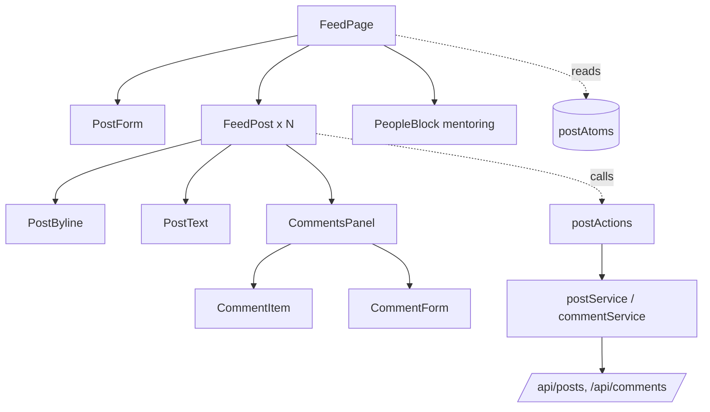
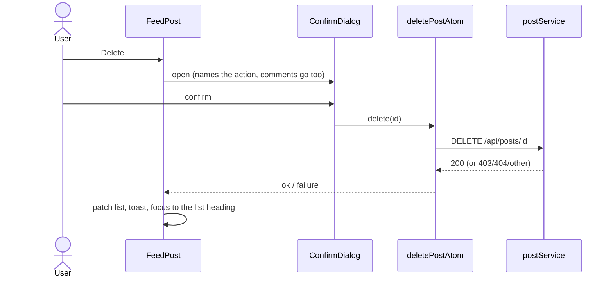
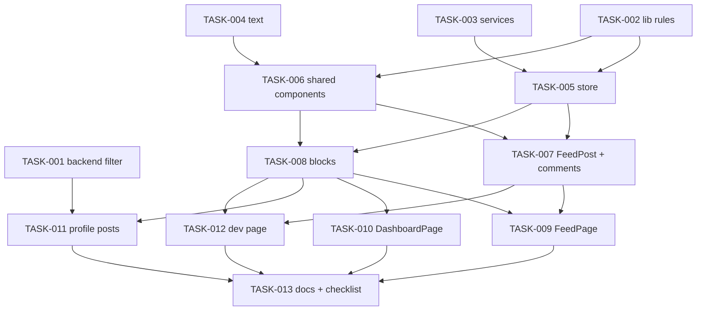

# Frontend part 3: the feed and the dashboard — Architecture

| Field | Value |
|---|---|
| REQ | REQ-fs-006 |
| Status | validated |
| Created | 2026-10-08 |
| Related ADRs | none new. Follows ADR-02, 05, 06, 07, 09, 11, 12, 13, 14 |

## Summary

Two placeholder pages become real pages (Feed, Dashboard) and the alumni profile gets a "Recent posts" block. All of it is built on the layers of part 1 and part 2 (`pages/components -> store -> services -> API`, pure rules in `lib/`). The new code is: three service files, one store topic (posts, comments, small lists, counts), a set of shared post and people components, pure rules in `lib/` with cases in the library check, and one small backend change (an optional `user_id` filter on `GET /api/posts`, approved at the spec gate). No new ADR: every choice here either follows an accepted ADR or is a pattern written into `docs/frontend-patterns.md` at the end. No new package, no schema change, no new color.

## Blast radius

| Path | Why touched | Risk |
|---|---|---|
| `backend/src/dal/query/PostQuery.ts` | `listPosts` takes an optional author filter; the same condition applies to the rows **and** the count | med |
| `backend/src/businessLogic/src/PostManager.ts` | pass the filter through | low |
| `backend/src/api/controllers/PostController.ts` | `getAllPosts` reads `user_id` with `parseId` (400 on a bad value) | med |
| `frontend/src/services/postService.ts` (new) | list, create, update, delete a post | low |
| `frontend/src/services/commentService.ts` (new) | comments of a post, create, update, delete | low |
| `frontend/src/services/statsService.ts` (new) | `GET /api/stats` | low |
| `frontend/src/services/alumniService.ts` | `AlumniListParams` gets an optional `limit` (the dashboard and the side list need 3, not 12). Its comment "limit is never sent" changes | low |
| `frontend/src/lib/postDisplay.ts` (new) | `dateText`, `commentCountText` | low |
| `frontend/src/lib/contentOwner.ts` (new) | one owner rule for posts and comments: `canEditContent`, `canDeleteContent` | low |
| `frontend/src/lib/commentThread.ts` (new) | group comments into threads; add, replace, remove-with-replies; count replies | med |
| `frontend/src/lib/feedPaging.ts` (new) | `nextFeedPage`, `mergePosts` (the "Load more" rule, see Approach) | med |
| `frontend/src/lib/validation.ts` | `validateCaption`, `validateComment` and their messages and limits | low |
| `frontend/src/config/text.ts` | all new words, grouped by page | low |
| `frontend/src/store/postAtoms.ts` (new) | feed, comments, recent posts, people, stats: state and loaders | med |
| `frontend/src/store/postActions.ts` (new) | the writes: publish, save, delete a post; add, save, delete a comment | med |
| `frontend/src/store/sessionActions.ts` | call the new reset in the **three** places that call `resetAlumniAtom` (LESSON-REQ-fs-002-3) | low |
| `frontend/src/components/ui/ButtonLink/` (new) | a router link drawn as a button (the design's "Write a post", "Edit my profile"); takes the look from `Button.module.css` with `composes` | low |
| `frontend/src/components/ui/EmptyState/EmptyState.tsx` | an optional link action (`actionTo`) so an empty state can lead to another page without a button that navigates | low |
| `frontend/src/components/posts/` (new) | `PostByline`, `PostText`, `PostForm`, `CommentForm`, `FeedPost`, `CommentsPanel`, `CommentItem`, `PostSummaryCard` | med |
| `frontend/src/components/alumni/PeopleBlock/` (new) | small people list with its own states; Feed side list and Dashboard "New in the directory" | low |
| `frontend/src/components/dashboard/` (new) | `CountsBlock`, `RecentPostsBlock` (also used on the profile), `YourProfileBlock` | med |
| `frontend/src/pages/FeedPage/`, `DashboardPage/` | replaced; each gets a stylesheet | high |
| `frontend/src/pages/AlumniProfilePage/AlumniProfilePage.tsx` | "Recent posts" block under About | med |
| `frontend/src/pages/dev/ComponentsPage/ComponentsPage.tsx` | the new components in every state (pattern 22) | low |
| `frontend/src/styles/tokens.css` | only if a size is needed that is not on the scale, in "Added by later tasks" with a comment | low |
| `scripts/frontend-lib-check.ts` | cases for the new pure rules | low |
| `docs/frontend-patterns.md` | new sections 29 and on, and the file lists | low |
| `docs/roadmap.md`, root `CLAUDE.md` frontend line | **wrap-up**, not implement: F8 Done, F9 "Dashboard done, Users to do"; the line that says the feed and dashboard are placeholders | low |

Not touched: `App.tsx` and `routes/paths.ts` (both routes already exist and are lazy), the shell, `Header` navigation, the other pages, `shared/types` (no type changes, so the checked-in compiled output of G38 stays as it is), the database.

`scripts/api-check.mjs` exists; it is **not** run by this REQ (it may talk to a real API and database). `postman/collections` is empty in this repo, so the spec's "one Postman example" (AC26) has nothing to extend; the filter is documented in the code comment and in this REQ instead. Spec AC26 is amended accordingly (see Open questions).

## Approach

**Backend (one small change).** `PostQuery.listPosts(page, filter?)`: with `filter.user_id` set, both `SELECT COUNT(*) FROM posts` and the page query get `WHERE p.user_id = $n`, built from one condition list so the two cannot drift apart. No filter changes nothing. `PostController.getAllPosts` reads `req.query.user_id`: absent means no filter; present goes through `parseId(sent, "user_id")`, so `?user_id=`, `?user_id=abc`, `?user_id=1&user_id=2` and `?user_id=0` are all 400. No new helper is needed (the existing `parseId` already refuses arrays and non-digits).

**Layers (frontend).** Pages and components read atoms and call actions; they never import `services/` or `axios` (pattern 1, style rule d). Services are thin lists of calls with relative `/api` paths and `@alumni/shared` types; the loaders that can be cancelled take a `signal`. The store has one new topic file for state and loaders (`postAtoms.ts`) and one for writes (`postActions.ts`), like `alumniAtoms.ts` / `alumniActions.ts`. Actions never throw: `{ ok: true }` or `{ ok: false, failure }` (pattern 7). Pages show toasts and move focus after a result; actions do neither.

**State (`postAtoms.ts`).**

- `feedAtom`: `{ status: idle|loading|ready|error, items, total, limit, failure, more: idle|loading|error }`. While loading, `items` is empty. `loadFeedAtom` loads page 1; `loadMoreFeedAtom` loads the next page and merges. One `createLatestRequest()` for both: a retry or a leave cancels a "load more" and the other way round.
- `commentsAtom`: `{ postId, status, items, failure }`. **One post's comments are open at a time** (C3), so one atom. A component treats `postId !== post.id` as "not open". `openCommentsAtom(postId)` loads; `closeCommentsAtom` cancels and clears. Its own `latestRequest`.
- `recentPostsAtom`: `{ status, authorId: number | null, items, failure }`, one loader for both the Dashboard (`authorId` null, newest 3 of everyone) and the profile (`authorId` = the person's user id). The key rule of pattern 23 applies: a page that finds another `authorId` treats the state as loading.
- `peopleAtom`: `{ status, kind: "newest" | "mentoring" | null, items, failure }` for "New in the directory" and "Open to mentoring" (both take the first 3 of the directory list; the mentoring one sends `mentoring: "true"`). Same key rule on `kind`.
- `statsAtom`: `{ status, stats, failure }`.
- The user's own alumni profile for the Dashboard is the **existing** `myAlumniAtom` and `loadMyAlumniAtom`; it is loaded only for alumni and admin.
- `resetPostsAtom` cancels every loader above and empties every atom. It is called where `resetAlumniAtom` is called (session start, session end, tokens changed elsewhere). Each page clears its own atoms in an effect cleanup (LESSON-REQ-fs-005-2).

**The "Load more" rule (`lib/feedPaging.ts`).** The API pages by number, and a delete or a create moves posts between pages. Asking for "page + 1" after a delete would **skip** a post for good. So the next page is worked out from how many posts are held: `nextFeedPage(held, limit) = floor(held / limit) + 1`. The answer is merged by id (`mergePosts`, newest first, no id twice), and `total` is taken from the answer. With no writes this is plain "page + 1". After a delete (held 11, limit 12) it asks for page 1 again, gets one new post and the next press is aligned again. After a create (held 13) it asks for page 2 and drops the one post it already holds. This copes with **this browser's own** writes: no post is shown twice and none is skipped. It cannot see a post that **someone else** deletes meanwhile: the held list keeps it, and one post can be missed until the page is opened again (accepted, see Risks; stress-test finding ADV-001). "Load more" shows while `held < total`.

**Patching, not refetching (C2).** After the server answers: a created post goes on top (`total + 1`), an edited post replaces its item, a deleted post is removed (`total - 1`). Comments are patched the same way with pure functions in `lib/commentThread.ts`: a created comment is appended, an edited one replaced, a deleted one removed **with all its replies** (`removeWithReplies`). The post's `comment_count` is then set to the length of the comment list (AC12, AC14), so the number can never disagree with the list. A 404 on edit or delete removes the item locally (AC18).

**Threads (C3).** `buildThreads(comments)` returns top-level comments, oldest first, each with its replies (every descendant, flat, oldest first). A comment whose parent is not in the list is treated as top-level (it cannot be hidden). A reply to a reply is sent with that reply's id as `parent_id` and drawn under the top-level ancestor, with "Replying to <name>" kept in the form only.

**Owner rules (`lib/contentOwner.ts`).** `canEditContent(session, userId)` is true only for the author. `canDeleteContent(session, userId)` is true for the author or an admin (ADR-02). Posts and comments both call them. The server still decides; a 403 shows words (AC18).

**Forms.** One `PostForm` serves "Write a post" and "Edit post" (caption, image link, submit and optional cancel). One `CommentForm` serves add, reply and edit. Both follow pattern 16: values in `useState`, validators from `lib/validation.ts`, messages under the field through `Field`, focus to the first field with a message, a busy button and an early return against a double submit. Validators: `validateCaption` (needs a visible character, at most 2000), `validateComment` (needs a visible character, at most 1000), and the existing `validatePhotoLink` for the image link (an optional web link; its message is the generic `WEB_LINK_INVALID_MESSAGE`). The form keeps what was typed on a failed save. The "dirty" lesson (LESSON-REQ-fs-005-1) applies to edit: Save stays on (a post is never "new"), and the form is closed by Save or Cancel, so none of the three traps arises; this is stated in TASK-006 so the implementer does not add a disabled-until-changed rule.

**Focus (C11, LESSON-REQ-fs-004-4).** After a publish, back to the caption field. After an edit is saved or cancelled, to that post's Edit button (the element exists again after the edit form closes). After a post delete, to a visually hidden `<h2>` "Posts" with `tabIndex={-1}` above the list (the opener is gone). After a comment is added, to the comment field; after a comment delete, to the comment field. Opening comments leaves focus on the toggle (`aria-expanded`). `ConfirmDialog` already traps focus and starts on Cancel.

**Live regions.** A visually hidden polite status line above the list says "Showing N of M posts" (updated after load, load more, publish and delete). Dashboard blocks are announced by their skeleton group's existing busy text.

**Dashboard (C12).** Four independent blocks. Each block component takes its state and a retry; the page starts the four loads in one effect and clears them on close. `YourProfileBlock` chooses by `session.role`: a student gets the prompt and **no request**; alumni and admin load `myAlumniAtom` and see the summary, or (status `none`) the prompt to create a profile. `CountsBlock` maps `alumni`, `mentoring`, `posts` from the stats answer; `students` is not shown (the design has three cards).

**Sizes off the design scale.** The design draws the dashboard profile avatar at 56px: the nearest avatar step is `md` (44). The big count numbers are drawn at 52px: the nearest type token is Display (44). Comment action buttons are 36px in the design (size `sm`); post actions are 44px. Spec AC30 says touch targets are at least 44px; this is amended to "post actions and form buttons 44px, comment actions 36px as drawn" (see Open questions).

**Shared pieces that did not exist (LESSON-REQ-fs-005-5, checked against the code):**

| Reused part | Does it carry what the design needs? | Change |
|---|---|---|
| `Button` | no link form | new `ButtonLink` composes `Button.module.css`; `Button` untouched |
| `EmptyState` | only a button action | add optional `actionTo` rendered with `ButtonLink` |
| `Avatar` | sizes 32/44/72/120 | none (sm for comments and lists, md for posts) |
| `Link` | takes `to`, `state`, `strong` | none |
| `Textarea`, `TextInput`, `Field` | label, optional note, help, error, ref | none |
| `ConfirmDialog` | title, body, confirm label, `danger`, `busy` | none |
| `Card` | `as="article"`, `section`, padding | none |
| `Skeleton` | line, title, avatar-sm/md, block | none |
| `listAlumni` params | no `limit` | add optional `limit` |
| `Tag`/`RoleTag` | needed only for a role tag, which the API cannot feed | not used |

### Diagrams

**Component structure (Feed).**

**Delete a post (the key interaction).**

## Task DAG

### Tier 0
- `TASK-001` — backend: optional `user_id` filter on `GET /api/posts`
- `TASK-002` — pure rules in `lib/` and their cases in the library check
- `TASK-003` — services: posts, comments, stats; `limit` on the alumni list
- `TASK-004` — all new words in `config/text.ts`

### Tier 1
- `TASK-005` — store: `postAtoms.ts`, `postActions.ts`, reset wiring (depends on TASK-002, TASK-003)
- `TASK-006` — shared small components: `ButtonLink`, `EmptyState` link action, `PostByline`, `PostText`, `PostForm`, `CommentForm` (depends on TASK-002, TASK-004)

### Tier 2
- `TASK-007` — `FeedPost`, `CommentsPanel`, `CommentItem` (depends on TASK-005, TASK-006)
- `TASK-008` — `PeopleBlock`, `PostSummaryCard`, `RecentPostsBlock`, `CountsBlock`, `YourProfileBlock` (depends on TASK-005, TASK-006)

### Tier 3
- `TASK-009` — `FeedPage` (depends on TASK-007, TASK-008)
- `TASK-010` — `DashboardPage` (depends on TASK-008)
- `TASK-011` — alumni profile "Recent posts" (depends on TASK-001, TASK-008)

### Tier 4
- `TASK-012` — dev components page (depends on TASK-007, TASK-008)
- `TASK-013` — `docs/frontend-patterns.md` and the manual checklist (depends on TASK-009, TASK-010, TASK-011, TASK-012)

Spec coverage: AC1 to AC6 = TASK-005, 007, 009. AC7 to AC9 = TASK-005, 006, 009. AC10 to AC14 = TASK-002, 005, 006, 007. AC15 to AC19 = TASK-002, 005, 007, 009. AC20 = TASK-008, 009. AC21 to AC25 = TASK-008, 010. AC26 = TASK-001. AC27, AC28 = TASK-008, 011. AC29 to AC35 = every UI task, checked at each task's end. AC36 = TASK-002. AC37 = every task. AC38 = TASK-012, 013 (and wrap-up).

## Test strategy

There is no test runner (conventions). The checks are:

- `npm run build` (type-checks `frontend/src` and builds the API workspaces, so TASK-001 is type-checked), `node scripts/frontend-style-check.mjs`, `npx tsx scripts/frontend-lib-check.ts`, and `git grep -n --untracked "antd" -- frontend/src frontend/package.json` (prints nothing). Run after every task and before each gate.
- New cases in `scripts/frontend-lib-check.ts`, with expected answers written from the spec (G55: not from the code, and not JSON-text compared): `dateText` (a normal date, single-digit day, 31 December, a leap day, `null`, empty and unreadable text give `null`), `commentCountText` (0, 1, 2, 1000), `canEditContent` / `canDeleteContent` (author, other user, admin, student, no session), `buildThreads` (top level order, replies flat and oldest first, a reply to a reply, a missing parent becomes top level, empty list), `removeWithReplies` (leaf, a comment with replies and a reply of a reply, an id that is not there), `appendComment`/`replaceComment`, `nextFeedPage` (0, 11, 12, 13, 24 held with limit 12), `mergePosts` (no id twice, newest first, an empty side), `validateCaption` / `validateComment` (empty, spaces only, 1 character, exactly at the limit, one over). Prove once that a case can fail, with a copy outside the repo (G55).
- The backend filter cannot be run against a database in this REQ (no `psql`, no database changes). TASK-001 is checked by the build, by reading the SQL for both queries, and by a throwaway script **outside the repo** that calls the controller function with a fake request (`user_id` absent, `"7"`, `""`, `"abc"`, `["1","2"]`, `"0"`) and a stubbed manager. The owner's manual checklist includes one real call.
- Screens are checked in a browser against a **mock API** (a throwaway script and Vite config outside the repo). Before starting, find out what listens on port 3000; never point anything at it (LESSON-REQ-fs-004-5, G50). The mock must be able to answer: empty, error, slow and out-of-order answers, 403 and 404 on writes, a student, an alumnus and an admin.
- Focus is checked with a real Tab key, not a scripted `focus()` (LESSON-REQ-fs-004-4).
- `ComponentsPage` shows the new components in every state; the manual checklist (`manual-checklist.md` in this REQ folder, written in TASK-013) covers what scripts cannot: the real backend, a screen reader, both themes by eye.

## Convention alignment

- Layers, one-way imports, no API call in a component, relative `/api` paths, types from `@alumni/shared`: followed.
- CSS Modules, no literals, the single phone query from `config/layout.ts`, no shadow, no `outline: none`: followed; the style check enforces them.
- Component and folder names PascalCase, other files camelCase, no `index.ts` barrels: followed.
- All words from `config/text.ts` (validator messages stay in `lib/validation.ts` as exported constants, pattern 16). App name only through `APP_NAME`.
- One rule, one function in `lib/` (pattern 28, LESSON-REQ-fs-002-3): date text, count text, owner rule, thread shaping, paging, validators. `firstName`, `displayName`, `jobLine`, `presentText`, `isWebLink`, `loadFailureText`, `saveFailureText` and `latestRequest` are reused, not copied.
- Backend: Route -> Controller -> Manager -> Query kept; SQL parameterized and in `PostQuery` only; no schema change; no endpoint returns `password` (the post read names its columns).
- **Deviations, each justified:** (1) the author's role tag and profile link are left out because the post answer lacks the data (spec, "Differences from the design"); (2) comment action buttons are 36px as drawn, not 44px (clarifies AC30); (3) the dashboard avatar and count sizes move to the nearest token step (above); (4) the spec's "one Postman example" is dropped because the repo holds no collection.

## Risks

| Risk | Likelihood | Mitigation |
|---|---|---|
| A write finishes after the user left the page, or after another user logged in, and patches the wrong list | med | writes patch only when the atom is `ready` and the item is still in it; `resetPostsAtom` and the page clear empty the atoms, so a late patch finds nothing to patch (LESSON-REQ-fs-005-2) |
| "Load more" skips or repeats a post after a delete or create | med | the aligned-page rule and `mergePosts` (above), with `nextFeedPage` and `mergePosts` cases in the library check |
| Two requests for different posts' comments answer out of order | med | one open thread at a time, one `latestRequest`, and a `postId` key on the state |
| Opening comments, then deleting that post, leaves comments of a gone post on screen | low | `deletePostAtom` closes the thread when its post is the open one |
| The `user_id` filter is applied to the rows but not the count (or the other way round) | low | one condition list builds both queries (TASK-001), and the throwaway script prints both SQL strings |
| Date shown one day off for a viewer in another time zone | med | `dateText` uses the viewer's local date, as the spec assumes; flagged `STATUS: needs verification` in the spec; the manual checklist includes one post written near midnight |
| A failed image never loads and leaves a broken box | low | the image is hidden on error (`onError`), as `Avatar` does |
| A very long caption or unbroken text breaks the card at 360px | med | `PostText` uses `overflow-wrap: anywhere` and keeps line breaks; checked at 360px and 200% zoom |
| Admin sees Delete on every post and a student sees none | low | `canDeleteContent`/`canEditContent` cases cover the roles |
| Another user deletes a post while this one is open: Load more can miss a post, and the deleted post stays on screen until a reload | med | accepted and documented (ADV-001): AC3 now reads "no post twice, none skipped by your own changes"; leaving and returning (or reloading) reloads page 1. A real fix needs two requests per press and still leaves the deleted post on screen; not worth it before the owner has seen the feed |
| A write lands while the list is not ready, or a load that started earlier answers after a delete | med | the composer exists only when the feed is `ready`; deleted ids are remembered for the visit and dropped from late answers; the comment count is adjusted even when the thread is closed (ADV-003) |
| Focus lost after a delete because the dialog is still open when `focus()` runs, or the opener is gone | med | focus is requested through state and run in an effect after the commit; the heading is outside the list branch; the dialog ignores Escape and Cancel while busy (ADV-004) |
| The count SQL has no alias, so the shared condition fails at run time and the build cannot see it | med | TASK-001 aliases the count query (`FROM posts p`), checks the printed SQL, and the owner's checklist has one real call (ADV-002) |
| A reply targets a comment, or a thread belongs to a post, that someone else removed | low | a 400 on a reply says the comment is gone and clears the reply; a 404 on the thread removes the post (ADV-005) |
| Reused components need more than they offer (the lesson's trap) | med | the table above was checked against the code; the three gaps (`ButtonLink`, `EmptyState` link, alumni `limit`) are tasks, not surprises |

## Open questions

- [ ] Confirm the amended AC30 (36px comment actions as drawn, 44px elsewhere) and the dropped Postman example (AC26) at this gate. Both are small clarifications, not new scope.
- [ ] Confirm the wording change to spec AC3 (own changes only; ADV-001 is accepted, not fixed).
- [ ] Text constants: TASK-004 writes the main set; later tasks append their own missing words one task at a time (no two tasks edit `text.ts` at once).
- [ ] `STATUS: needs verification` — the time-zone behavior of `created_at` (spec assumption). The manual checklist asks the owner to look at one real post.
- [ ] `STATUS: needs verification` — the 2000 and 1000 character limits are the common choice, not an owner decision (spec C7).

## Related

- Spec: REQ-fs-006 (`requirement.md` in this folder)
- Exploration: `exploration.md` in this folder
- Concepts: [[knowledge/concepts/latest-request-wins]], [[knowledge/concepts/paged-list-query]]
- Components: [[knowledge/components/frontend-app]]
- Lessons checked: [[knowledge/lessons/LESSON-REQ-fs-002-3-new-helper-convert-every-sibling]], [[knowledge/lessons/LESSON-REQ-fs-003-1-write-the-check-from-the-spec-not-the-code]], [[knowledge/lessons/LESSON-REQ-fs-004-4-check-focus-for-real]], [[knowledge/lessons/LESSON-REQ-fs-004-5-find-out-what-listens-on-the-api-port]], [[knowledge/lessons/LESSON-REQ-fs-005-1-disable-until-changed-has-three-traps]], [[knowledge/lessons/LESSON-REQ-fs-005-2-store-state-outlives-the-page]], [[knowledge/lessons/LESSON-REQ-fs-005-5-does-the-reused-part-carry-what-the-design-needs]]
- Gotchas: G11 (comment count is counted live), G33 (no `GET /api/posts/:id` route), G36, G38, G48, G50, G55
- ADRs: ADR-02, ADR-05, ADR-06, ADR-07, ADR-09, ADR-11, ADR-12, ADR-13, ADR-14
