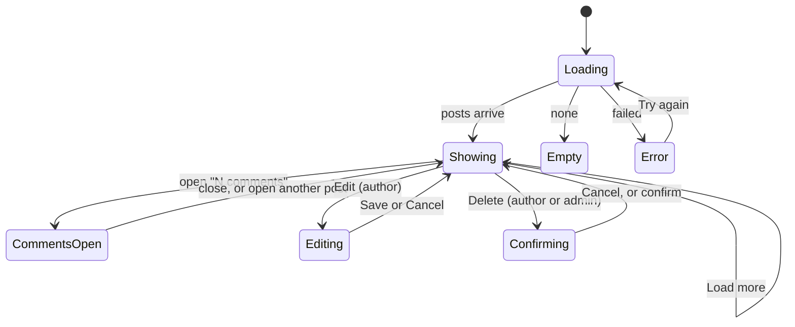

# Frontend part 3: the feed and the dashboard

| Field | Value |
|---|---|
| REQ | REQ-fs-006 |
| Status | validated |
| Phase | architect |
| Created | 2026-10-08 |
| Primary repo | alumni-details-system |
| Touched repos | alumni-details-system |
| Related | [[architecture/adr-02-admin-deletes-any-post-edits-only-own]], [[architecture/adr-05-post-list-returns-author-name-and-photo]], [[architecture/adr-06-deleting-rows-that-other-rows-reference]], [[architecture/adr-07-design-direction-oak-ink-band]], [[architecture/adr-09-white-label-app-name-from-one-constant]], [[architecture/adr-11-typed-errors-and-one-error-middleware]], [[architecture/adr-12-list-endpoints-answer-items-total-page-limit]], [[architecture/adr-13-frontend-structure-css-modules-on-tokens]], [[architecture/adr-14-session-and-theme-kept-in-the-browser]] |

## Problem

Two of the six pages behind the log in still say "This page is being built": the Feed and the Dashboard. The backend for both has been finished since REQ-fs-003 (posts with author and comment count, comments by post, owner checks, counts). A logged-in user has nowhere to read or write posts or comments, and lands on an empty Dashboard after every log in. The approved design (`docs/design/screens/feed.html`, `dashboard.html`, `profile.html`) shows all of it.

## Goal

After this ships, a logged-in user can read the feed, write posts (alumni and admin), comment and reply, edit and delete their own posts and comments, and an admin can delete anyone's. The Dashboard greets the user and shows the counts, the three newest posts, a short summary of their own profile and the newest people in the directory. The alumni profile page shows that person's recent posts. All of it is built from the part 1 and part 2 components, follows the design in both themes from 360px wide, and every list and form has loading, empty and error states. No backend change is made except, if the owner agrees, one small filter described in "Needs your decision".

## Scope and the roadmap rows

`docs/roadmap.md` has the Feed as **F8**, the Dashboard **and** admin Users as **F9**, and Polish as **F10**. The request named "F9 and F10". This spec covers the **Feed (F8)** and the **Dashboard half of F9**. The admin Users page stays "being built" and F10 (polish) is not touched. At wrap-up, F8 becomes Done and F9 becomes "Dashboard done, Users to do". If you meant something else, say so at this gate.

## Non-goals

- The admin Users page (the other half of F9). It stays a placeholder.
- Polish and performance work (F10), the About page (F11).
- Likes, reactions, sharing, search inside the feed, notifications, live updates, image upload (a post takes an image **link** only), a page of its own for one post.
- Any change to the database, to the shared types' meaning, or to the other backend routes.
- A test runner. Checks stay as in `docs/frontend-patterns.md` (build, style check, library check, manual checklist).

## Choices taken from "the common standard"

You asked for the common standard wherever a choice is open. These are the choices. Each can be overturned at this gate.

| # | Choice | Taken |
|---|---|---|
| C1 | Paging in the feed | A **"Load more posts"** button under the list adds the next page (the usual feed pattern). The page size is the server's default. No post is ever shown twice. The numbered Pagination stays for tables and the directory. |
| C2 | Updating the list after a write | **Patch the list in place after the server answers**, no optimistic guess. A new post goes on top, an edited post is replaced, a deleted post is removed, the total is adjusted. A comment count is always set from the comment list the server just returned. |
| C3 | Comments | Opened **on demand** from the post's "N comments" button (loaded then, not with the list). **One post's comments are open at a time**; opening another closes the first. Replies are shown one level deep: a reply to a reply is saved under that reply but drawn flat under the top-level comment, oldest first. |
| C4 | Which "Reply" | The post has a comments button that opens its thread. Each comment has its own **Reply** button, as in the design. (Your request says "Reply opens that post's comments"; the design does it this way. See "Needs your decision".) |
| C5 | Who can write a post | The server allows posts only from alumni and admin. **Students do not see the "Write a post" form**; they see one sentence saying who can post. Students can read and comment. The same goes for the Dashboard's "Write a post" button. |
| C6 | Empty input | Validated on submit, message in words under the field, focus to the first field with a message, nothing sent. A post needs words in the caption; an image link alone is refused. Text of only spaces counts as empty. |
| C7 | Length limits | A post caption is at most 2000 characters and a comment at most 1000, with a message in words. The server sets no limit; these are interface limits, kept as named constants. |
| C8 | Editing | **In place**: the text turns into a field with Save and Cancel. Posts edit the caption and the image link; comments edit the text. |
| C9 | Dates | "3 October 2026", English month names fixed in code (the same in every browser), shown in the viewer's local time zone. A missing or unreadable date shows nothing, never "Invalid Date". |
| C10 | Text and links | Post and comment text is plain text with line breaks kept. No HTML. The image shows only for a web link (`http` or `https`), with the author's name in its description; if it cannot load, nothing is shown in its place. |
| C11 | After a write, where focus goes | After publishing or commenting, back to the (now empty) field. After saving an edit, to that item's Edit button. After a delete, to the heading of the list, because the button that opened the dialog is gone. |
| C12 | Dashboard blocks | Counts, recent posts, your profile, new people: **four blocks, four requests, four states**. One failing never touches the others. |
| C13 | "Recent" sizes | Dashboard: the 3 newest posts and the 3 newest people. Profile: the 3 newest posts of that person. Feed side list "Open to mentoring": the first 3. |
| C14 | A post on the Dashboard | Caption cut to a few lines (the full text is on the Feed), author, date and a "N comments" link to the Feed. There is no address for one post, so the link goes to the Feed. |

## Differences from the design (the API does not carry the data)

- The design shows an "Alumni" tag beside a post author. The post answer has the author's **name and photo only** (ADR-05), not the role. **The tag is left out.** Same for comments.
- The design links the author's name to a profile. A post has the author's **user id**, but a profile address uses the **alumni id**, and an admin author may have no profile. **The author's name is plain text, not a link.** The people lists (new people, open to mentoring) link as designed because they carry the alumni id.
- The Feed page's existing placeholder sub text ("News and questions from the community.") is replaced by the design's "News, job openings and events from alumni."

## Needs your decision

1. **Recent posts on the alumni profile (item 4 of your request).** The design **does** show a "Recent posts" block on `profile.html`. The API cannot give one person's posts: `GET /api/posts` takes only `page` and `limit`. This is the one real backend gap. The smallest fix is an **optional `user_id` filter on `GET /api/posts`** (digits only, a bad value is a 400, same order and same answer shape, no schema change; a small change in the post controller, the post manager and `PostQuery`, with a Postman example). Without it, the block cannot be built correctly: filtering one page of the global feed in the browser would show an empty block for most people. Options: **(a) add the filter and build the block (Recommended)**, or **(b) leave the block out and keep it on the list for later**. AC26 to AC28 apply only under (a).
2. **Dashboard and Feed extras the design shows but your list did not name:** the Feed's side list "Open to mentoring" (AC20), and Edit/Delete on **comments** (AC13 and AC14; the backend supports both). They are in this spec because the design shows them. Say `revise` to drop either.
3. **C4, which "Reply".** Default as in the design. If you wanted the post-level button to be labelled "Reply" instead of "N comments", say so.

## Acceptance criteria

**Feed: reading**

- [ ] AC1. The Feed route shows the design's band (heading "Feed", the design's sub text) and no longer shows "being built". The tab title and the single `<h1>` come from `PageLayout`.
- [ ] AC2. While the first page loads, skeleton cards show; they hold no post data. A post shows the author's avatar (photo when set, else initials), the author's name, the date as "3 October 2026", the caption and, when it is a web link, the image.
- [ ] AC3. Posts come newest first. "Load more posts" shows only while more exist (loaded count below the total), adds the next page under the list, and shows no post twice and skips none because of this user's own changes (a post that someone else deletes meanwhile can still be missed until the page is opened again). While it loads the button is busy; if it fails, a message with "Try again" shows under the list and the posts already shown stay.
- [ ] AC4. An empty feed shows an empty state. For alumni and admin it says to write the first post and moves focus to the field when its action is chosen; for a student it says posts will appear here.
- [ ] AC5. A failed first load shows an error state with "Try again" (words from the shared load-failure rule); retry works. A failure on 401 follows the existing session-ended path and shows no second message.
- [ ] AC6. A slow answer for an old request never replaces a newer one: a retry, a quick leave and return, or a user switch never shows older data (the part 2 "latest request wins" rule, `latestRequest`).

**Feed: writing a post**

- [ ] AC7. Alumni and admin see the "Write a post" form: a caption field and an optional image link field (the design's labels), and one primary button "Publish post". A student sees no form, only a sentence naming who can post.
- [ ] AC8. Publishing with an empty (or spaces-only) caption sends nothing and shows a message in words under the caption field. An image link that is not a web link shows a message under that field. A caption over 2000 characters shows a message under the field.
- [ ] AC9. A good post is sent once (a double press sends one request); the button is busy meanwhile. On success the new post is on top without a reload, the form is cleared, a toast says "Post published", and focus is on the caption field. On failure the form keeps what was typed and a message in words shows (403 says who can post; other failures use the shared save-failure rule).

**Feed: comments**

- [ ] AC10. Each post has a "N comments" button (the singular for 1, "No comments yet" or "0 comments" as one fixed form for 0) that opens that post's comments and toggles `aria-expanded`. Opening shows a loading state, then the comments oldest first with author avatar, name and date, then the comment form. Opening a second post closes the first.
- [ ] AC11. A post whose comments fail to load shows an error with "Try again" inside the open area; the rest of the feed is unaffected. A post with no comments shows an empty state that invites the first comment.
- [ ] AC12. Adding a comment: an empty or spaces-only comment, or one over 1000 characters, is refused with a message in words under the field and nothing is sent. A good one is sent once, appears in the list, the field is cleared, the count on the post button is set from the list, a toast confirms, and focus returns to the field. The request body uses `posts_id` for the post.
- [ ] AC13. Each comment has a **Reply** button. Reply puts a "Replying to <name>" line above the comment field with a Cancel; the comment is then sent with `parent_id`. A reply is drawn one level under its top-level comment, as in the design. Cancelling or sending clears the reply state.
- [ ] AC14. Only the author sees **Edit** on a comment. The author and an admin see **Delete**. Edit works in place (Save, Cancel; empty text refused as in AC12; saving updates the text only). Delete always opens the confirm dialog; confirming removes the comment **and its replies** (the dialog says so when it has replies), and the count is set from the list.

**Feed: editing and deleting a post**

- [ ] AC15. Only the author sees **Edit** on a post. The author and an admin see **Delete**. A student who is the author of nothing sees neither.
- [ ] AC16. Edit works in place on the caption and the image link with the same rules as AC8, Save and Cancel; saving replaces the post in the list; a toast says "Post saved"; focus goes to that post's Edit button. Cancel restores the text and focus.
- [ ] AC17. Delete on a post always opens the confirm dialog. The dialog's heading and sentence name the action and say that the post's comments go with it. Focus starts on Cancel, stays inside the dialog and returns to a sensible place after it closes (C11). Confirm removes the post from the list, adjusts the total, and a toast says "Post deleted".
- [ ] AC18. If the server answers 403 on an edit or delete, a message in words says the person may only change their own; if it answers 404, the item is removed from the list (it is already gone) with a short message. Other failures use the shared save-failure rule, the dialog stays open or closes with the message visible, and nothing is removed.
- [ ] AC19. A write in progress cannot be repeated: the buttons involved are busy and ignore presses; Delete cannot be confirmed twice.

**Feed: side list**

- [ ] AC20. A side block "Open to mentoring" lists up to 3 people (avatar, name linked to their profile, job line) from the directory's mentoring filter, with a link "See all in the directory" that opens the directory with the mentoring filter on. It has its own loading, empty and error states and its failure does not touch the posts. On a phone it sits below the posts.

**Dashboard**

- [ ] AC21. The Dashboard route shows the band "Welcome back, <first name>" with the design's sub text (just "Welcome back" while the name is unknown), and no longer shows "being built". The greeting uses the shared first-name rule.
- [ ] AC22. A counts block shows three cards from `GET /api/stats` — "Alumni in the directory", "Open to mentoring", "Posts in the feed" — each with the number and a link (Browse the directory, See who can help, Open the feed) as in the design. Loading shows skeleton cards, a failure shows one error state with "Try again", and a count of 0 still shows "0".
- [ ] AC23. A "Recent posts" block shows the 3 newest posts as in C14, with a "Write a post" link to the Feed for alumni and admin only. It has loading, empty (with a next step) and error states.
- [ ] AC24. A "Your profile" block depends on the role. Alumni and admin with a profile see avatar, name, job line and a link "Edit my profile". Alumni or admin **without** a profile see a prompt with a link to create it on My profile. A **student** sees only a prompt to complete their account with a link to My profile; the page sends **no** alumni-profile request for a student. Loading and error states exist; a failure to load never hides the other blocks.
- [ ] AC25. A "New in the directory" block shows the 3 newest people (avatar, name linked to their profile, job line and company), with loading, empty and error states and a link to the directory.

**Alumni profile (applies only if the owner chooses option (a))**

- [ ] AC26. The backend accepts an optional `user_id` on `GET /api/posts`: digits only, a bad value gives 400, no `user_id` behaves exactly as today, the answer is still `{ items, total, page, limit }` in the same order. No schema change. The route, controller, manager and query follow the existing layers. (The one Postman example in the first draft is dropped: the repo has no Postman collection to extend. Amended at the architect gate.)
- [ ] AC27. The alumni profile page shows a "Recent posts" block below the About block: the 3 newest posts of that person with date, caption and a "N comments" link to the Feed (no author line, as in the design), with loading, empty ("has not posted yet") and error states. A person with no linked user shows the empty state and sends no request.
- [ ] AC28. The block loads on its own: its failure does not change the rest of the profile, and a slow answer for a previous profile never shows on the next one.

**All pages**

- [ ] AC29. Both themes: every new surface uses tokens only; the style check passes (no color literal, no pixel number in a component stylesheet, no shadow, no `outline: none`, layer rules).
- [ ] AC30. From 360px wide nothing overflows sideways and nothing is cut off at 200% zoom; the dashboard counts, the feed columns and the post action buttons wrap; post actions and form buttons are 44px high and comment actions 36px, as drawn (amended at the architect gate).
- [ ] AC31. Every control (buttons, links, fields, the Load more button, the comment toggles) has a visible focus ring and can be reached and used with the keyboard alone; `prefers-reduced-motion` is respected (no motion that is not an answer to a click).
- [ ] AC32. Text and non-text contrast meet WCAG AA in both themes. Counts and loading changes are announced politely (a live region); errors are tied to their fields (`Field`). Colour is never the only signal.
- [ ] AC33. All words shown to the user come from the config text file or the shared word rules; the app name appears only through its one constant; no API call is made inside a UI component (calls live in `services/`, state in `store/`); the services use relative `/api` paths and `@alumni/shared` types.
- [ ] AC34. No second copy of anything that exists: avatar, tags, cards, fields, buttons, dialog, empty/error/skeleton states, messages, toasts, `latestRequest`, `loadFailure`, `saveFailure`, `isWebLink`, `firstName`, `jobLine`, `displayName`, the directory helpers. Anything both pages need and that does not exist yet (the post card, the date rule, the "N comments" wording) is **one** shared piece (LESSON-REQ-fs-002-3).
- [ ] AC35. Each page clears its own store data when it closes and on a session change, and treats "idle" as loading, so one visit never shows the last visit's data (LESSON-REQ-fs-005-2).
- [ ] AC36. The new pure rules (date text, comment-count wording, the checks of AC8 and AC12, the reply-nesting) have cases in `scripts/frontend-lib-check.ts` with expected answers written from this spec, and a check that can fail was proven to fail once.
- [ ] AC37. `npm run build`, `node scripts/frontend-style-check.mjs` and `npx tsx scripts/frontend-lib-check.ts` all exit 0 before every gate, and `git grep -n --untracked "antd" -- frontend/src frontend/package.json` prints nothing.
- [ ] AC38. The dev components page shows the new components in every state; `docs/frontend-patterns.md` gets the new patterns; `docs/roadmap.md` is updated at wrap-up (F8 done; F9 Dashboard done, Users to do).

## Flow

## Assumptions

- The posts and comments answers are as in `shared/types/posts.types.ts` and `comment.types.ts`; the stats answer is `{ alumni, students, posts, mentoring }`. Verified against the code on 2026-10-08.
- The alumni read answer carries `user_id`, `name`, `photo_url` and the job fields (read from `shared/types/alumni.types.ts`), so the "new people" and "open to mentoring" lists need no new endpoint.
- The new-people order is the server's order for the unfiltered directory (`a.id DESC`, newest profile first). `STATUS: needs verification` that "newest profile" is what the owner means by "new in the directory".
- Dates arrive as ISO strings with a time zone; the local date is shown. `STATUS: needs verification` against the real database (the columns are `timestamp without time zone`, so a viewer in another time zone may see a date off by one around midnight).
- The session gives the user's id (`sub`) and role; the server stays the final judge of every owner check.
- The 2000 and 1000 character limits (C7) are the common choice, not an owner decision. `STATUS: needs verification`.
- Existing test rows in the database (see roadmap, "Later") mean the real backend has some posts to look at; the review uses a mock API, never the real backend (G50, LESSON-REQ-fs-004-5).

## Open questions

None that block this spec. The decisions in "Needs your decision" have a stated default.

## Out of scope (for now)

- A page and address for a single post (so Dashboard and profile links could open the exact post).
- Showing a role tag or a profile link on a post author (needs the post answer to carry the role and the alumni id).
- Edit history, "edited" marks, mentions, hashtags, pinned posts.
- Moderation tools beyond the admin's Delete.

## Related

- Concepts: [[knowledge/concepts/latest-request-wins]], [[knowledge/concepts/paged-list-query]]
- Components: [[knowledge/components/frontend-app]]
- Lessons: [[knowledge/lessons/LESSON-REQ-fs-002-3-new-helper-convert-every-sibling]], [[knowledge/lessons/LESSON-REQ-fs-004-4-check-focus-for-real]], [[knowledge/lessons/LESSON-REQ-fs-004-5-find-out-what-listens-on-the-api-port]], [[knowledge/lessons/LESSON-REQ-fs-005-1-disable-until-changed-has-three-traps]], [[knowledge/lessons/LESSON-REQ-fs-005-2-store-state-outlives-the-page]], [[knowledge/lessons/LESSON-REQ-fs-005-5-does-the-reused-part-carry-what-the-design-needs]]
- ADRs: ADR-02, ADR-05, ADR-06, ADR-07, ADR-09, ADR-11, ADR-12, ADR-13, ADR-14
- Design: `docs/design/README.md`, `docs/design/screens/feed.html`, `dashboard.html`, `profile.html`
- Patterns: `docs/frontend-patterns.md`

## Backlinks

_(populated by /wrapup or manually)_
