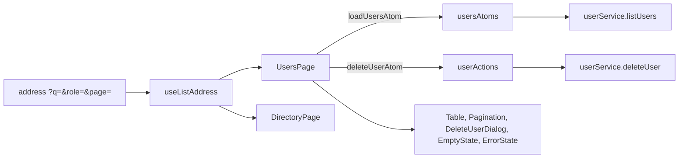
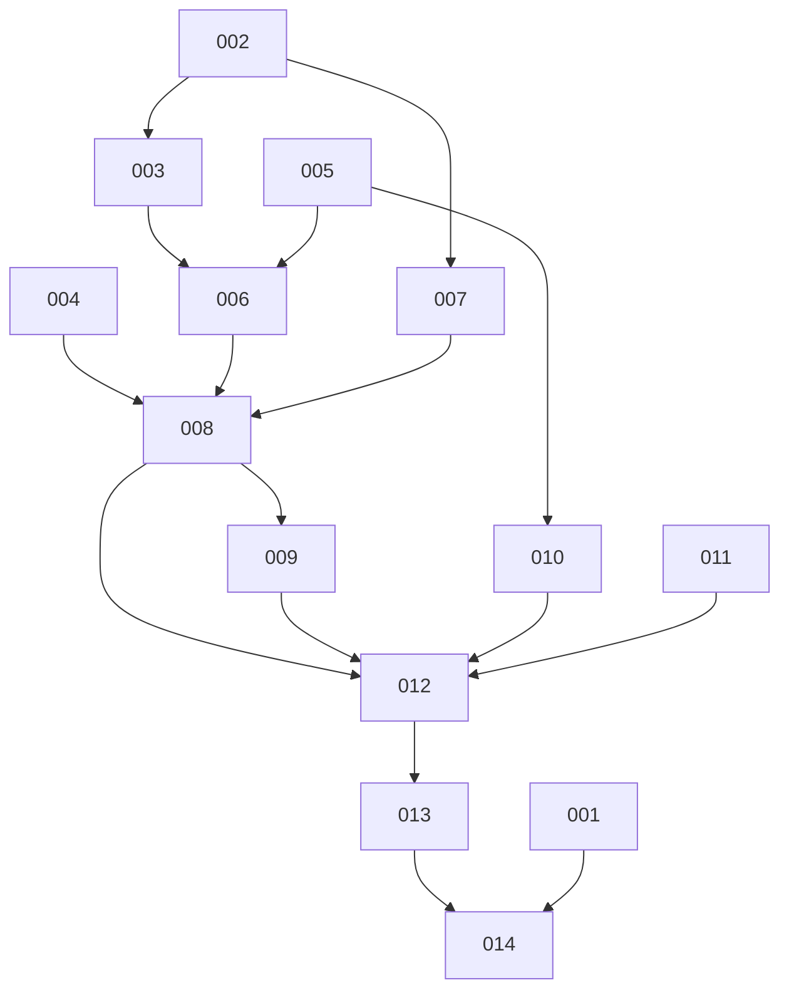

# Frontend part 4: Users page, About page, phone polish, performance — Architecture

| Field | Value |
|---|---|
| REQ | REQ-fs-007 |
| Status | drafting |
| Created | 2026-10-08 |
| Related ADRs | none new. In effect: [[architecture/adr-06-deleting-rows-that-other-rows-reference\|ADR-06]], [[architecture/adr-09-white-label-app-name-from-one-constant\|ADR-09]], [[architecture/adr-10-about-page-last-privacy-and-password-reset-later\|ADR-10]], [[architecture/adr-11-typed-errors-and-one-error-middleware\|ADR-11]], [[architecture/adr-12-list-endpoints-answer-items-total-page-limit\|ADR-12]], [[architecture/adr-13-frontend-structure-css-modules-on-tokens\|ADR-13]] |

## Summary

The frontend only. The Users page is the Directory page's twin: its search, role filter and page live in the address, the list sits in an atom with a "latest request wins" loader, and Delete goes through the existing confirm dialog. To avoid a second copy of the Directory's address and search-timer code (about 200 lines), that code moves into one shared hook, `useListAddress`, and the Directory page is changed to use it with no change in behaviour. The About page is a plain page on the page frame, with a footer link. Phone polish is an audit of every page at 360 and 390px in a real headless Chrome against a throwaway mock API, with fixes in the CSS Modules. Performance work is measured before and after: a font preload for the one Latin font file, image size hints, `memo` on list rows where a re-render is shown to be needless, and a check of what sits in the entry script. Two small fixes from earlier reviews are made (an unchanged edit sends no request); one is not (see Risks).

## Blast radius

Backend: none. The exploration report's claim that the font preload "is already correct" is wrong: `frontend/index.html` has no preload today. The report's other claims were checked against the code; corrections are in the Approach.

| Path | Why touched | Risk |
|---|---|---|
| `frontend/src/lib/addressParams.ts` (new) | `singleParam` and `readPageParam`, moved out of `directoryQuery.ts` so Users does not copy them | low |
| `frontend/src/lib/pageRange.ts` | gains `lastPage` (moved from `directoryQuery.ts`) | low |
| `frontend/src/lib/directoryQuery.ts` | imports the two helpers; `lastPage` leaves | medium (Directory still must behave the same) |
| `frontend/src/lib/usersQuery.ts` (new) | read / write / `toListParams` / `hasCriteria` for `q`, `role`, `page` | low |
| `frontend/src/lib/writeFailure.ts` | `userDeleteFailureText` (409 words, then the existing rules) | low |
| `scripts/frontend-lib-check.ts` | cases for all of the above (469 now) | low |
| `frontend/src/hooks/useListAddress.ts` (new) | the search box, its timer, page change, clear and past-the-end rule, taken out of `DirectoryPage.tsx` | **high** (a refactor of a working page) |
| `frontend/src/pages/DirectoryPage/DirectoryPage.tsx` | uses the hook; loses about 150 lines | **high** |
| `frontend/src/services/userService.ts` | `listUsers(params, signal)`, `deleteUser(id)` | low |
| `frontend/src/store/usersAtoms.ts` (new) | `usersAtom`, `loadUsersAtom`, `clearUsersAtom`, `resetUsersAtom` | medium |
| `frontend/src/store/userActions.ts` (new) | `deleteUserAtom` | medium |
| `frontend/src/store/sessionActions.ts` | `resetUsersAtom` next to the two existing resets, in all three places | medium (a missed place leaks one admin's list to the next user) |
| `frontend/src/config/text.ts` | Users, About, role and footer words; `usersCount` | low |
| `frontend/src/routes/paths.ts` | `PATHS.about` | low |
| `frontend/src/components/ui/Tag/RoleTag.tsx` | role words move to `config/text.ts` so the filter and the tag share one copy | low |
| `frontend/src/components/users/UsersFilters/*` (new) | search box, role select, Search button | medium |
| `frontend/src/components/users/UserCells/*` (new) | name cell (avatar, name, "You" tag), actions cell | low |
| `frontend/src/components/users/DeleteUserDialog/*` (new) | confirm dialog with its failure message; props only, so the dev page can show it | medium |
| `frontend/src/pages/UsersPage/UsersPage.tsx` + `.module.css` | the real page | medium |
| `frontend/src/pages/AboutPage/AboutPage.tsx` (new) + `.module.css` | the About page | low |
| `frontend/src/App.tsx` | lazy `AboutPage` and its route inside the shell | low |
| `frontend/src/components/shell/Footer/Footer.tsx` + `.module.css` | name on the left, "About" link on the right | low |
| `frontend/src/pages/dev/ComponentsPage/ComponentsPage.tsx` + css | Users sections, About-free; no request can start | low |
| `frontend/src/components/posts/FeedPost/FeedPost.tsx`, `.../CommentItem/CommentItem.tsx` | an unchanged edit sends no request | low |
| `frontend/src/components/ui/Avatar/Avatar.tsx`, `.../FeedPost/FeedPost.tsx` (+ css) | image `width`, `height`, `decoding` | low |
| `frontend/vite.config.ts` | small plugin: one font preload in the built `index.html` | medium |
| various `*.module.css` and TSX | phone fixes found by the audit; list-row `memo` | medium (unknown until the audit runs) |
| `docs/frontend-patterns.md`, `docs/roadmap.md` | AC31 | low |
| `.adlc/` vault: REQ folder (audit notes, sizes, skipped list), later `CLAUDE.md` and project overview | AC17, AC22, AC30, AC32 | low |

## Approach

**What the exploration report got wrong, checked against the code.**
- The session is `{ userId, role, expiresAt }` (`lib/token.ts`), not `sub`. The "You" row compares `row.id` to `session.userId`.
- The font preload does not exist (see Blast radius). Vite hashes the font file name, so the preload must be written at build time by a plugin that reads the bundle.
- The unchanged-edit fix goes in the two callers (`FeedPost.handleSave`, `CommentItem.handleSave`), not in `PostForm` or `CommentForm`: those forms also create, and a new post is never "unchanged".
- `Avatar` and the post image have `loading="lazy"` but no `width`/`height`. Only `Avatar` and `FeedPost` draw an ``.
- The Users page needs `usersAtoms` only; `DELETE` is a store action in a second file, as the feed does (`postAtoms.ts` + `postActions.ts`).

**Users (first).**
1. *Address.* `usersQuery.ts` mirrors `directoryQuery.ts` for three keys (`q`, `role`, `page`). A role other than `student`, `alumni`, `admin` reads as "all roles". Page and "one value only" parsing come from the new `addressParams.ts`, which `directoryQuery.ts` also uses (one copy). `lastPage` moves to `pageRange.ts`, which already owns the page numbers.
2. *Shared hook.* `useListAddress` takes `{ read, write, defaultQuery }` and the list's `{ queryKey, status, total, limit }` and returns `query`, `queryKey`, `searchText`, `searchRef`, `countRef`, the handlers `onSearchTextChange`, `searchNow`, `changeFilter`, `changePage`, `clear`, `retryFocus`, and the two values both pages draw from, `pageCount` and `pastTheEnd` (ADV-003; the hook also decides whether the list belongs to this address, once). It owns the live-query ref, the 300 ms timer, "last committed text", the past-the-end fix and "focus the count after a page change". The page keeps what is its own: the load effect, the clear on close, and the views. The move is done first as a behaviour-preserving refactor of `DirectoryPage` (TASK-007), so any change in the Directory is a bug. `[[knowledge/lessons/LESSON-REQ-fs-002-3-new-helper-convert-every-sibling|L-REQ-fs-002-3]]`: the sibling is converted in the same REQ.
3. *Store.* `usersAtom` holds `{ status, queryKey, items, total, page, limit, failure }` and is shaped like `DirectoryState` (pattern 23): no items while loading, `queryKey` says whose it is, own `createLatestRequest()`. `clearUsersAtom` (page close) and `resetUsersAtom` (session change, in all three places `sessionActions.ts` already resets the other stores) cancel the loader and go back to idle.
4. *Delete.* `deleteUserAtom(id)` returns `{ ok: true } | { ok: false; failure }` and never throws. It remembers the user and the visit when it starts and patches nothing if either changed (L-REQ-fs-006-2). On success or on a 404 it removes the row if held and lowers `total` by one (never below zero). It does not reload: the row goes, the place stays; a page left short is fixed the next time the admin changes page, and an emptied page 2 or later is moved to the last page by the existing past-the-end rule. A 409 patches nothing.
5. *Words.* `userDeleteFailureText(failure, words)` in `writeFailure.ts`: 409 gives `words.blocked`; everything else goes to `writeFailureText`. The 409 words name posts, comments **and the alumni profile** (spec A3, from `UserManager.ts` and ADR-06).
6. *Components.* `UsersFilters` (a `Card` with the search field, the role `Select` and a Search button; props only), `UserNameCell` (avatar, name, "You" tag; `min-width: 0` and `overflow-wrap: anywhere` so a 60-character name wraps), `UserActionsCell` (the Delete button with `aria-label` "Delete <name>", absent on the admin's own row), `DeleteUserDialog` (`ConfirmDialog` + a `Message` for the failure; it takes `open`, `name`, `busy`, `errorText`, `onClose`, `onConfirm`). `UsersPage` composes them with `Table`, `Pagination`, `EmptyState`, `ErrorState`, `SkeletonGroup`. The delete follows `FeedPost` exactly (stress-test ADV-001): Cancel and Escape always close the dialog, also while the delete runs; a failure that answers while the dialog is open shows in the dialog, and one that answers after the admin closed it becomes a toast. Success closes it, shows a toast "<name> was deleted" and moves focus to the count line through a request counter and a page effect (ADV-002: `focus()` in the same tick as the close is swallowed by the modal, and the opener is gone); a 404 closes it, shows "already gone" and removes the row. `ConfirmDialog` is not changed.
7. *Role words.* The three role words move from `RoleTag.tsx` to `config/text.ts` (`ROLE_WORDS`), and both `RoleTag` and the filter read them. A user with no role shows plain muted text "No role" (spec A2), not a tag.
8. *Date.* `dateText(created_at)` from `lib/postDisplay.ts`; "Not given" when it is null (`NOT_GIVEN` exists).

**About (second).** `AboutPage` is `PageLayout` with a heading, a sub text and two or three short paragraphs in `Card`s, all from `text.ts`, using `APP_NAME` and the contact email constant (rule e of the style check allows them only through `config/app.ts`, so the page imports `APP_NAME` and `CONTACT_EMAIL`). The email is a link made with `mailtoHref`. The route sits inside `RequireAuth` and `AppShell` (spec A5). The footer keeps its name on the left and gets an About `Link` on the right. No claim about any university.

**Phone polish (third).** One audit task, then fixes. Method as in REQ-fs-006 (`docs/frontend-patterns.md`, "Checks to run"; [[knowledge/gotchas#^g50|G50]]): the installed Chrome in headless mode, a throwaway mock API script and a throwaway Vite config in the scratchpad folder, on a port that is **not** 3000, the script importing nothing from `backend/` and loading no `pg` or `dotenv`. The audit measures `document.documentElement.scrollWidth` against the viewport at 360px, 390px and 200% zoom, in both themes, on all 12 screens, with 60-character names and words, a toast and a dialog open. Every finding is one line in `phone-audit.md` with its fix. Fixes are CSS-Module changes on tokens only.

**Performance (fourth).**
- *Before / after.* TASK-001 builds the branch untouched and records sizes (raw and gzip) in `build-size.md`; TASK-014 repeats it.
- *Code splitting.* Already done (pattern 13). The task checks the entry script's imports for page-only modules (for example a store or a validator pulled in by `App.tsx` or `AppShell`) and moves any that do not belong. No new split is invented.
- *Font.* A Vite plugin (`transformIndexHtml` with `ctx.bundle`) finds the built file whose name contains `hanken-grotesk-latin-wght-normal` and ends in `.woff2` (the bundle keys start with `assets/`; the build throws if none is found) and adds one `<link rel="preload" as="font" type="font/woff2" crossorigin href=…>`. In dev there is no bundle and nothing is added. The package's CSS already has `font-display: swap` and `unicode-range` per subset, so latin-ext and vietnamese load only when a name needs them. The weights 400 to 700 are one variable file, so "used weights only" is this one file.
- *Images.* `Avatar` gets `width`/`height` attributes equal for a square hint and `decoding="async"`; the CSS size from the tokens stays the real size. `FeedPost`'s picture gets a fixed 4:3 box (`aspect-ratio: 4 / 3`, `object-fit: contain`, the existing sunken background) plus 4:3 `width`/`height` and `decoding="async"` (ADV-004). The pictures come from any link, so their real shape is unknown: the box never moves the page, and a picture of another shape is letterboxed. That is a small change to how a wide or tall picture looks today (it was shown at its own height) and is for you to confirm.
- *Re-renders.* The audit uses the React DevTools-free method: a temporary render counter in the headless run (not committed). `memo` is added only to row components where a sibling's change re-draws them: `FeedPost`, `CommentItem`, `AlumniCard`, and the Users cells. A row is only worth `memo` if its props are stable, so the handlers it receives are wrapped in `useCallback` where the audit shows it. Each added `memo` is listed with the count it saved.
- *Motion.* Check only: the skeleton, toast and dialog already read `prefers-reduced-motion` from `base.css`.

**Small fixes.** The unchanged edit: `FeedPost.handleSave` and `CommentItem.handleSave` compare the trimmed values with the loaded ones (using `sameText`, `presentText` from `lib/alumniDisplay.ts`; a null image link equals an empty one), close the form and return `{ ok: true }` with no request and no toast (spec A7). The Load-more total (`n2`): read `totalAfterAnswer` in `postAtoms.ts`; when a post is deleted here while a load runs, the server may already have left it out of its `total`, and the `-1` edit is then taken a second time. Telling the two cases apart needs the server's order of events, which the browser does not know, so it is **not** a one-line safe fix. It goes on the skipped list with that reason.

### Diagrams

STATUS: needs verification until implemented (names of hook fields may change).

## Task DAG

### Tier 0
- `TASK-001` — build size before
- `TASK-002` — address helpers, `lastPage` move
- `TASK-004` — user delete failure words (lib)
- `TASK-005` — text, path, role words, user service
- `TASK-011` — unchanged edit sends no request; n2 verdict

### Tier 1
- `TASK-003` — `usersQuery` (depends on TASK-002)
- `TASK-006` — users atoms, delete action, session reset (depends on TASK-003, TASK-005)
- `TASK-007` — `useListAddress` and the Directory refactor (depends on TASK-002)
- `TASK-010` — About page and footer link (depends on TASK-005)

### Tier 2
- `TASK-008` — Users page and parts (depends on TASK-004, TASK-006, TASK-007)

### Tier 3
- `TASK-009` — Users on the dev components page (depends on TASK-008)

### Tier 4
- `TASK-012` — phone audit and fixes (depends on TASK-008, TASK-009, TASK-010, TASK-011)

### Tier 5
- `TASK-013` — performance (depends on TASK-012)

### Tier 6
- `TASK-014` — docs, build size after, final checks (depends on TASK-013)

TASK-001 (the size "before") runs first of all, before any task that changes code, so the number is honest; TASK-002, 004, 005 and 011 list it as a dependency.

Order of work follows your order: Users (002 to 009), About (010), phone (012), performance (013). TASK-010 may be done any time after TASK-005; it is placed before TASK-012 either way.

## Test strategy

There is no test runner (conventions, "Testing"). Three levels:
1. **Library check** (`scripts/frontend-lib-check.ts`), with expected values typed from the spec, not from the code (L-REQ-fs-003-1). New cases: `readUsersQuery` (bad page, repeated key, unknown role, spaces), `writeUsersQuery` (defaults left out), `toListParams`, `hasCriteria`, `readPageParam`, `singleParam`, `lastPage` in its new home (the old cases move with it), and `userDeleteFailureText` (409, 404, 403, network, 500). One case is proved able to fail with a copy outside the repo (L-REQ-fs-003-4).
2. **Build and style check**: `npm run build`, `node scripts/frontend-style-check.mjs`, `npx tsx scripts/frontend-lib-check.ts`, the `antd` grep. Run before each gate.
3. **Browser check in review** (headless Chrome, mock API in the scratchpad, never port 3000): Users (search, role, page, "You" row, delete success, 409, 404, network, Escape and focus), Directory unchanged (search timer, filters, Back, past-the-end, focus on count), About and footer, the audit widths, both themes.
4. **Manual checklist for the owner**: the real server (admin list, real 409 on a user with content, the exact 409 body), a real phone, a screen reader on the dialog. Nothing here reaches the database.

## Convention alignment

- Layers: page → store → service; `services/` is imported only by the store (pattern 1). The hook lives in `hooks/` and imports neither `services/` nor `store/`.
- No UI library, no new package, no hex or `px` in CSS, one phone media query (rules a, b, h, j of the style check).
- All words in `config/text.ts`; app name and contact email only from `config/app.ts`.
- Every list and form has loading, empty and error states (AC10).
- One deviation to confirm: `DirectoryPage` is edited by a REQ whose subject is "Users". Reason: the alternative is a 200-line copy, which the owner's rule forbids. It is its own task, with a before-and-after browser check.

## Risks

| Risk | Likelihood | Mitigation |
|---|---|---|
| The hook extraction changes the Directory's behaviour (search timer, Back, past-the-end, focus) | med | TASK-007 changes nothing else; the review browser check runs the Directory scenarios of REQ-fs-005's AC list. If a difference cannot be fixed, fall back to a copy and tell the owner |
| `resetUsersAtom` missed in one of three places in `sessionActions.ts` leaks a list to the next user | low | grep for `resetAlumniAtom` and add the new reset beside each; list the three lines in the task |
| Preload written for a file the page does not request (a wasted request and a browser warning) | med | The check reads the built `index.html` and the CSS and compares the file name; the browser run confirms no "preloaded but not used" warning in the console |
| Post pictures of unknown shape look different in a fixed 4:3 box (letterboxed) | high | Accepted for the gate; the alternative lets the page move. A true fit needs the picture's size from the API, a backend change |
| `memo` makes things worse (extra comparison cost, stale props) | low | Only added where the counter shows a saving; each case recorded |
| The audit finds more than this REQ can fix | med | Fix what is a CSS or markup fix; list the rest as skipped with a reason at the review gate |
| `n2` stays as it is | known | Listed as skipped with its reason; not a regression |
| Real `/api/users` differs from what the code assumes (A1, A2) | low | Manual checklist; the page handles a `null` role and a missing photo |

## Stress-test result

Full pass by the architecture-adversary (`architecture-adversary.md`): 36 acceptance criteria checked against 14 tasks, every one has a task (AC32 is left to wrap-up on purpose). 5 findings survived; all are fixed in this plan:

| ID | Severity | What | Handled |
|---|---|---|---|
| ADV-001 | major | The delete dialog could stick open and swallow a late 409 (Cancel was to be "aria-disabled", which `ConfirmDialog` cannot do; a second Escape closes the native dialog anyway) | Fixed: the `FeedPost` rule, TASK-008 |
| ADV-002 | minor | No way to focus the count line after a delete | Fixed: request counter + effect, TASK-008 |
| ADV-003 | minor | The hook left `pageCount` and `pastTheEnd` to each page, so the rule would be copied | Fixed: the hook returns both, TASK-007 |
| ADV-004 | minor | `aspect-ratio: auto 4/3` with `height: auto` does not stop a page jump | Fixed: a fixed 4:3 box, TASK-013; asks for your confirmation |
| ADV-005 | minor | The performance task could break the phone fixes unseen | Fixed: TASK-013 re-runs the browser scenarios and refreshes screenshots |

Also taken: the font plugin matches on the file name and throws if it is missing; TASK-001 now comes first. Checked and found right: the three session reset places, the font file name, the 409 reaching the UI, `Table` roles with the card CSS, a user with no name.

## Open questions

- [ ] Confirm the Directory refactor (above). Recommended: yes.
- [ ] The Users list does not reload after a delete (the place is kept). Recommended: yes, common standard.
- [ ] Post pictures sit in a fixed 4:3 box, letterboxed (ADV-004). Recommended: yes; the alternative is to let the page move a little as pictures load.

## Related

- Spec: REQ-fs-007 (same folder, `requirement.md`)
- Concepts: [[knowledge/concepts/paged-list-query]]
- Components: [[knowledge/components/frontend-app]]
- Lessons checked: [[knowledge/lessons/LESSON-REQ-fs-002-3-new-helper-convert-every-sibling|L-REQ-fs-002-3]], [[knowledge/lessons/LESSON-REQ-fs-003-1-write-the-check-from-the-spec-not-the-code|L-REQ-fs-003-1]], [[knowledge/lessons/LESSON-REQ-fs-003-4-a-check-must-be-able-to-fail|L-REQ-fs-003-4]], [[knowledge/lessons/LESSON-REQ-fs-005-1-disable-until-changed-has-three-traps|L-REQ-fs-005-1]], [[knowledge/lessons/LESSON-REQ-fs-005-2-store-state-outlives-the-page|L-REQ-fs-005-2]], [[knowledge/lessons/LESSON-REQ-fs-006-2-an-async-answer-may-only-change-its-own-state|L-REQ-fs-006-2]], [[knowledge/lessons/LESSON-REQ-fs-006-3-patched-list-total-needs-a-log-of-local-changes|L-REQ-fs-006-3]], [[knowledge/lessons/LESSON-REQ-fs-006-5-build-a-component-so-the-dev-page-can-show-it|L-REQ-fs-006-5]]
- ADRs: see the table above
