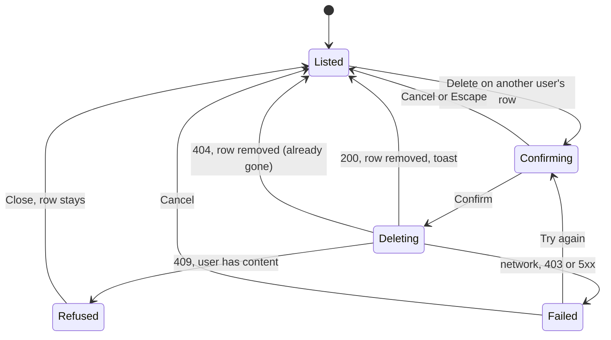

# Frontend part 4: Users page, About page, phone polish, performance

| Field | Value |
|---|---|
| REQ | REQ-fs-007 |
| Status | drafting |
| Phase | spec |
| Created | 2026-10-08 |
| Primary repo | alumni-details-system |
| Touched repos | alumni-details-system (frontend, docs and vault only; no backend change planned) |
| Related | [[architecture/adr-07-design-direction-oak-ink-band\|ADR-07]], [[architecture/adr-09-white-label-app-name-from-one-constant\|ADR-09]], [[architecture/adr-10-about-page-last-privacy-and-password-reset-later\|ADR-10]], [[architecture/adr-06-deleting-rows-that-other-rows-reference\|ADR-06]], [[architecture/adr-11-typed-errors-and-one-error-middleware\|ADR-11]], [[architecture/adr-12-list-endpoints-answer-items-total-page-limit\|ADR-12]], [[knowledge/lessons/LESSON-REQ-fs-002-3-new-helper-convert-every-sibling\|L-REQ-fs-002-3]], [[knowledge/lessons/LESSON-REQ-fs-005-1-disable-until-changed-has-three-traps\|L-REQ-fs-005-1]], [[knowledge/lessons/LESSON-REQ-fs-005-2-store-state-outlives-the-page\|L-REQ-fs-005-2]], [[knowledge/lessons/LESSON-REQ-fs-006-2-an-async-answer-may-only-change-its-own-state\|L-REQ-fs-006-2]], [[knowledge/lessons/LESSON-REQ-fs-006-3-patched-list-total-needs-a-log-of-local-changes\|L-REQ-fs-006-3]], [[knowledge/gotchas#^g46\|G46]], [[knowledge/gotchas#^g50\|G50]], [[knowledge/gotchas#^g56\|G56]] |

## Problem

The redesigned frontend is built through part 3, but four things are missing. The admin Users page is still a "This page is being built" placeholder, so an admin has no screen to find or delete a user (roadmap F9, second half). The footer has no "About" link and there is no About page (F11, [[architecture/adr-10-about-page-last-privacy-and-password-reset-later|ADR-10]]). Pages were built one part at a time and have not been checked together at phone widths (F10). And the build has not been measured or tuned for speed. The owner also has a short list of small, safe fixes noted in earlier review files.

## Goal

After this ships, an admin can search, filter, page through and delete users on a Users page that matches `docs/design/screens/users.html`. Every logged-in page and the About page work at 360px and 390px with no sideways scroll, in both themes. The footer links to a finished About page. The app loads less up front, shows its font without a flash of invisible text, and the build size before and after is on record. `docs/frontend-patterns.md` and `docs/roadmap.md` describe the result. Work is done in this order so the important part lands first: Users, About, phone polish, performance.

## Non-goals

- No backend change. If a real gap is found it is reported at the spec gate, not fixed here (see Open questions: none found that needs a change).
- No role editing, no "add user" and no edit of other people's accounts from the Users page. The design has Delete only.
- No Privacy page and no password reset ([[architecture/adr-10-about-page-last-privacy-and-password-reset-later|ADR-10]] keeps them later).
- No new UI library, no data-fetching library, no new package. If a package turns out to be needed, stop and ask.
- No new colors and no new design. Anything not drawn follows `docs/design/README.md` section 4 and the existing components.
- No automated test runner (the repo has none). Checks stay the build, the style check, the library check and a manual checklist.
- The pull request to `main` and removing the test rows from the database stay on the roadmap as they are.

## Acceptance criteria

### 1. Users page (admin only)

- [ ] AC1. `/users` shows a page headed "Users" with the sub text from the design ("Everyone with an account."), on the same page frame as the other pages. A non-admin still gets the no-access page and the page sends no request (the existing `RequireAdmin` guard is kept).
- [ ] AC2. A search box filters by name or email. Typing waits for a pause (300 ms, as the directory does), then loads. Enter or the Search button loads at once. The text is sent as `q`.
- [ ] AC3. A role filter has the choices All roles, Student, Alumni and Admin and sends `role` only when a role is chosen. The labels come from the config text file; the page shows the role's name, not the stored word.
- [ ] AC4. The list is a `Table` with the columns Name, Email, Role, Joined and Actions, shown as the design draws it (avatar and name, email, a role tag, a date like "20 January 2026"). Only fields that exist in `db/schema.md` are shown.
- [ ] AC5. The row of the logged-in admin shows a "You" tag next to the name and has no Delete button. Every other row has a Delete button whose accessible name includes the person's name.
- [ ] AC6. Delete opens the existing confirm dialog first, with the person's name in the words. Cancel closes it and sends nothing. Focus lands on Cancel.
- [ ] AC7. Confirming Delete sends `DELETE /api/users/:id`. On success the row is gone from the list, the total goes down by one, a toast confirms it, and focus moves to a stable place on the page (not to a button that no longer exists).
- [ ] AC8. When the delete answers 409, the dialog or the page shows a message in words that the user cannot be deleted because they still have content, and the row stays. The message names what the server checks: posts, comments or an alumni profile (see Assumptions, A3). Other failures (network, 403, 404, 5xx) get their own plain words through the existing failure rules; a 404 removes the row, because the person is gone.
- [ ] AC9. A count line says how many users match ("124 users", "1 user", "No users found") and is a polite live region. Pagination (the existing `Pagination`) shows when there is more than one page. Search, role and page are kept in the address like the directory (pattern 24), so a reload and Back work. A page past the end moves to the last page.
- [ ] AC10. Loading shows a skeleton, an empty list shows an empty state (one wording for "no users at all" and one for "nothing matches", with a way to clear the search and filter), and a failed load shows the error state with "Try again". The previous results never show for a frame under a new search (latest request wins, pattern 23). The atom is cleared when the page closes and when the session changes.
- [ ] AC11. On a phone (below 768px) each row is a card through the existing `Table` card mode. A long name or email wraps and never makes the page scroll sideways. The Delete button is full size for touch (44px).
- [ ] AC12. The Users page has a section on the dev components page only if it adds a new component; any new component can be shown in its states without a request.

### 2. About page

- [ ] AC13. A page at `/about` is reachable from a footer "About" link on every page inside the app shell, and also by a logged-out visitor if the shell allows it (see Assumptions, A5). The link is a real link, has a visible focus ring and its address comes from `PATHS`.
- [ ] AC14. The About page is built on the page frame with one `<h1>`, uses the app name from the one constant, and takes all its words from the config text file. The words are neutral: what an alumni system is for (find people, read posts, comment, keep a profile) and who to ask (the contact email constant). It states no fact about any university: no founding year, no numbers, no names, no address, no policy.
- [ ] AC15. The tab title reads "About · App name". The page works in both themes and from 360px.
- [ ] AC16. The words "About" and the footer link text come from the config text file. The strings "Privacy" and "password reset" do not appear.

### 3. Phone polish (360px and 390px)

- [ ] AC17. Every page is audited at 360px and 390px, in light and dark: log in, sign-up, Dashboard, Directory, an Alumni profile, Feed (with an open comment thread), My profile, Users, About, the no-access page, the not-found page and the open phone menu. The audit result is written in the REQ folder, one line per page per problem found and fixed.
- [ ] AC18. On each of those pages there is no horizontal scroll at 360px and at 200% zoom. Header, phone menu, band, cards, forms, dialogs, tables as cards and toasts all fit inside the screen. A name or word of 60 characters with no spaces wraps or breaks inside its box on every page that shows names, emails, captions, comments and links.
- [ ] AC19. Touch targets that were found below 44px by the audit are raised to the control-height tokens. Text and icon contrast stays at WCAG AA in both themes. Keyboard focus is visible on everything the audit touches.
- [ ] AC20. A toast, a dialog and the phone menu do not cover each other's buttons at 360px, and a toast does not hide the page's main action.
- [ ] AC21. Every fix uses tokens and shared components; no literal color, `px` or media query other than the phone one is added (the style check passes).

### 4. Performance

- [ ] AC22. The build size before and after is recorded in the REQ folder: for each run of `npm run build`, the total of `frontend/dist/assets` and the size of the entry script, the entry stylesheet and each page file, raw and gzipped, plus the font files. "Before" is measured at the start of the implement phase, on the branch before any change of this REQ.
- [ ] AC23. Pages are split by route with `React.lazy` and a skeleton shown while the file is fetched (pattern 13 already does this). The audit confirms it still holds for the new About page and the Users page, that no page file is pulled into the entry script by an import, and that the large shared pieces (for example `postAtoms`, `alumniAtoms`, the validators) are not imported into the entry script without need. Any change is listed with its size effect.
- [ ] AC24. The font loads with `font-display: swap`. Only the files the app uses are preloaded: the Latin subset of the variable font, no other subset. The check is that the built `index.html` has one `rel="preload"` for a font, with `crossorigin`, and that the file it names is the one the page requests. The text keeps its fallback fonts so there is no layout jump larger than the fallback allows.
- [ ] AC25. Every `` the app draws (avatars, post images) has `width` and `height` set, `loading="lazy"` when it is not at the top of the page and `decoding="async"`. A post image does not make the page jump when it loads.
- [ ] AC26. Long lists do not re-render rows that did not change: a row component whose props are the same does not draw again when a sibling changes (for the feed, the directory cards, the Users rows, the comment items). Done with the standard tool (`memo` and stable props), only where the audit shows a row draws again for no reason, and each case says what it saved.
- [ ] AC27. Animation and motion respect `prefers-reduced-motion` (already in `base.css`); the audit confirms the skeleton, the toast and the dialog follow it.

### 5. Small fixes from earlier review files

- [ ] AC28. Saving an edit with nothing changed sends no request (the `m6` item of REQ-fs-006): the post edit and the comment edit close the form as "saved" with no `PUT`. If it needs a design decision it is skipped and listed (see Assumptions, A7).
- [ ] AC29. The "Load more" total being one off after a write racing it (`n2` of REQ-fs-006) is checked. If it still happens and the fix is one safe line, it is fixed; otherwise it is listed with the reason.
- [ ] AC30. Everything else in the earlier `verification.md` files that needs a design decision, is not one line, or is not safe is skipped. The list of skipped items, each with a one-line reason, is written in the REQ folder and shown at the review gate.

### 6. Docs and the build rules

- [ ] AC31. `docs/frontend-patterns.md` gets new numbered sections for what is new (at least: the admin list and its delete, the About page and the footer link, the phone audit rules, the performance rules) and the "Contents", "Checks to run" and "Open points" parts are brought up to date. `docs/roadmap.md`: F9 becomes Done, F10 and F11 become Done (REQ-fs-007) when they are.
- [ ] AC32. The root `CLAUDE.md` line about the frontend ("the users page is still a placeholder") and `.adlc/context/project-overview.md` ("the footer has no About link") are brought up to date at wrap-up.
- [ ] AC33. No second copy of anything is made: the work reuses `Table`, `Pagination`, `ConfirmDialog`, `Tag` and the role tag, `Avatar`, `Field`, `TextInput`, `Select`, `Skeleton`, `EmptyState`, `ErrorState`, `Message`, `Toast`, `latestRequest`, `loadFailure`, `writeFailure`, `contentOwner`, `dateText` and the directory-query pattern. Where two places need one new rule it is written once in `lib/` with cases in the library check ([[knowledge/lessons/LESSON-REQ-fs-002-3-new-helper-convert-every-sibling|L-REQ-fs-002-3]]).
- [ ] AC34. State uses jotai in `frontend/src/store/`, API calls are in `frontend/src/services/`, no API call is made in a component, no hex value is in a component, and all words are in `frontend/src/config/text.ts`.
- [ ] AC35. Before each gate, `npm run build`, `node scripts/frontend-style-check.mjs` and `npx tsx scripts/frontend-lib-check.ts` all exit 0, and `git grep -n --untracked "antd" -- frontend/src frontend/package.json` prints nothing.
- [ ] AC36. Anything that needs the real database or a real log in goes on a manual checklist for the owner. No check reads `.env`, imports from `backend/`, loads `pg` or `dotenv`, or reaches a database or a real socket (session rules; [[knowledge/gotchas#^g56|G56]]).

## Flow (optional)

The delete flow has several outcomes that are hard to hold from prose.

## Assumptions

- A1. The existing backend does what the task says: `GET /api/users` is admin only and takes `q`, `role`, `page` and `limit` and answers `{ items, total, page, limit }`; `DELETE /api/users/:id` is admin only and answers 409 when the user still has content. Read from `UserController.ts`, `UserRoutes.ts` and `UserManager.ts`. `STATUS: needs verification` by the owner against the real server (it goes on the manual checklist, because the session rules forbid reaching the database).
- A2. The list items are `PublicUser` rows (no password column). The `role` column holds the words `student`, `alumni` and `admin`; a user with no role (`null`) is shown with a neutral tag "No role". `STATUS: needs verification` against the real data.
- A3. **Wording of the 409 (a mismatch to confirm).** The task says to tell the admin the user "has posts or comments". The server's own message and ADR-06 also refuse when the user has an **alumni profile**. A user with only a profile would get 409 and a message that talks about posts and comments only, which is wrong. The common standard taken here: the words say "posts, comments or an alumni profile". If you want "posts or comments" only, say so at the gate. This is not a backend gap; the server's behaviour is right.
- A4. Roles shown in the filter and tags are Student, Alumni and Admin. The sign-up form calls alumni "Graduate"; the Users page follows the stored role name "Alumni" (as the design's role tag does), and the filter label for the stored `alumni` is "Alumni". `STATUS: needs verification` — if you want "Graduate" everywhere, say so.
- A5. The About page is inside the app shell and the guards like every other page, so only a logged-in user sees it. The footer is part of the shell, so the link shows on logged-in pages only; the log-in and sign-up pages have no footer. Making About public (so a visitor can read it before signing up) is a different decision and is left out. Common standard taken: logged-in only.
- A6. The About text is general: what the system is for and who to contact. It uses `APP_NAME` and `CONTACT_EMAIL`, both from the config. `CONTACT_EMAIL` is still the placeholder `alumni-office@example.com`; the owner replaces it before the demo.
- A7. "Save on an unchanged edit sends no request" is taken as: when the trimmed text and the image link equal what was loaded, Save closes the form with no request and no "saved" toast. The common standard for a toast here is none, because nothing was saved. If the owner prefers a toast, say so.
- A8. Route-level code splitting already exists (pattern 13, every page is a `React.lazy` import with a skeleton). This REQ audits it and extends it to the two new pages; it does not rebuild it.
- A9. The font is `@fontsource-variable/hanken-grotesk` (one variable file per subset, `font-display: swap` in the package's CSS). Preloading only the Latin file is the "used weights only" rule: the weights 400 to 700 are all in that one file. `STATUS: needs verification` — the architecture phase checks the built CSS before relying on it.
- A10. Page size for the Users list is the backend default (12), the same as the directory.
- A11. Phone is below 768px (`config/layout.ts`); the audit widths are 360px and 390px and 200% zoom of a 1280px window. The audit is done in a headless browser against a mock API that is a throwaway script outside the repo (pattern "Checks to run", [[knowledge/gotchas#^g50|G50]], [[knowledge/gotchas#^g56|G56]]); real-device checks go on the owner's list.
- A12. An admin deleting themselves is blocked in the screen only (no Delete on their own row). The server does not block it; the server also answers 409 for most admins because they own content. This is noted, not changed.

## Open questions

None block the spec gate. Three items are decisions taken from "common standard"; they are in the assumptions so you can overrule them in one line:

- [ ] A3 (409 wording includes the alumni profile)
- [ ] A5 (About for logged-in users only)
- [ ] A7 (no toast on an unchanged save)

## Out of scope (for now)

- Changing a user's role, editing another user's account, resetting a password, or exporting the list.
- A public About page, a Privacy page, a Contact form.
- Sorting the Users table by a column (the server order is fixed; there is no `sort` parameter).
- Automated tests and a CI run.
- Image optimisation beyond `width`, `height` and `loading` (no resizing service, no new image format).
- Preloading every page after log in; only measured if the audit shows slow page moves.
- Removing the test rows from the database before the demo (stays on the roadmap).

## Related

- Concepts: [[knowledge/concepts/paged-list-query]]
- Components: [[knowledge/components/frontend-app]]
- Lessons: see the Related row above; also [[knowledge/lessons/LESSON-REQ-fs-004-4-check-focus-for-real|L-REQ-fs-004-4]] (check focus for real) and [[knowledge/lessons/LESSON-REQ-fs-006-5-build-a-component-so-the-dev-page-can-show-it|L-REQ-fs-006-5]]
- ADRs: see the Related row above
- Source files for this work: `docs/design/README.md`, `docs/design/screens/users.html`, `docs/design/screens/phone-directory.html`, `docs/design/screens/phone-menu.html`, `docs/frontend-patterns.md`, `docs/roadmap.md`

## Backlinks

_(populated by /wrapup or manually)_
