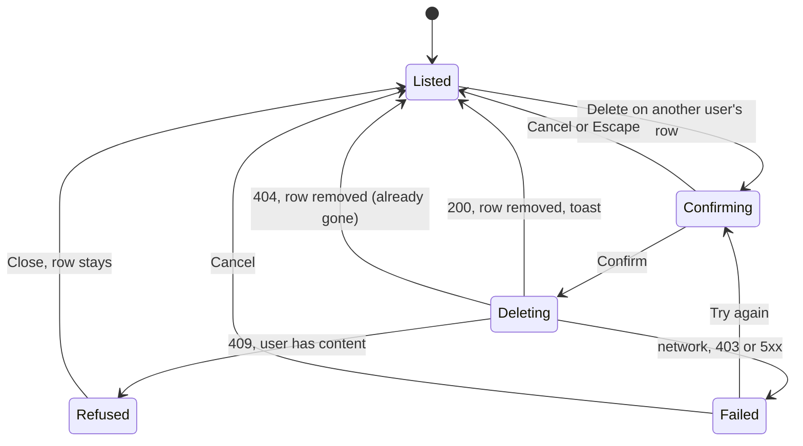
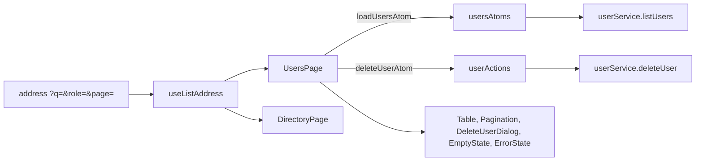
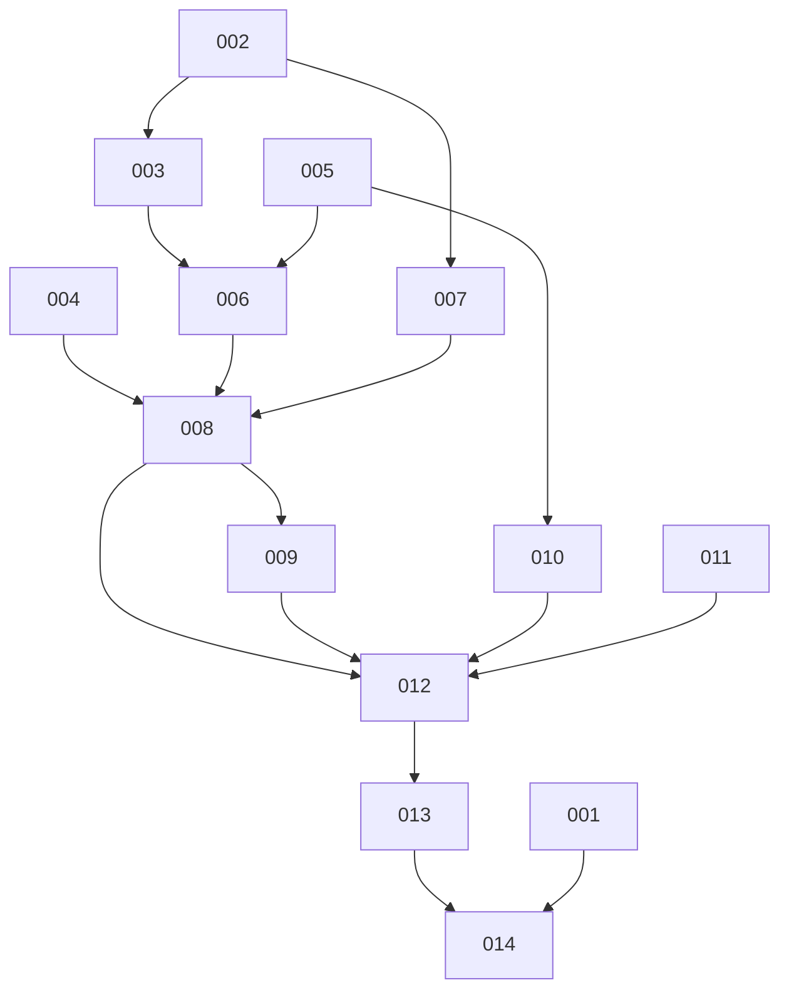

# REQ-fs-007-frontend-users-about-polish-perf — Review Packet (round 2)

`Packet: 116KB · round 2 · 19 files in this round`

This packet holds the fix round only: the uncommitted changes since the commits reviewed in round 1 (`git diff HEAD`). The round-1 diff is not repeated; the work tree and `review-log.md` (your own earlier section) carry the rest. Reading the work tree is your mandate, not a packet gap. Spec and architecture are unchanged below.

## Round 2 — what changed since round 1

Fixed (the user chose "fix all"): m1 CORR-001 (stale flag on leaving the page), m2 REFL-001 (comment 404 guard), m3 UI-002 (empty Actions label in phone cards), m4 QUAL-003 (asRole), m5 REFL-003 (LoginPage mailto, dev ROLE_OPTIONS), m6 QUAL-001 (text only; BeingBuilt.tsx NOT deleted, waits for the owner), m7 QUAL-002/REFL-004 (docs bullet), m8 QUAL-004 (cases for word functions), m9 QUAL-005 (cases for toPeopleBlockState), m10 ARCH-002 (refill moved into the store), t1 ARCH-003, t2 QUAL-006, t3 UI-003.
Not fixed on purpose, owner decides: m11 (409 words vs ADR-06), m12 (About vs ADR-10), m13 (toasts on a phone), v1 (vault wording), and the chain duplication in m8.
Checks after the round: build ok, style check PASS, library check 565 passed.

## Diff (uncommitted, vs HEAD), 15 lines of context

```diff
diff --git a/docs/frontend-patterns.md b/docs/frontend-patterns.md
index 9bc78aec..f9e53323 100644
--- a/docs/frontend-patterns.md
+++ b/docs/frontend-patterns.md
@@ -445,31 +445,31 @@ When there is an error, it replaces the help text. `TextInput`, `PasswordInput`,
 We did not rely on placeholders as labels, and we did not let each page write its own ids.
 
 ---
 
 ## 16. Forms without a form library; validators are pure functions
 
 **What it is.** A form page holds its values in `useState`. On submit it runs the validators, shows each message under its field, and moves focus to the first field with an error. No request is sent while there is an error. A field's error goes away when the user edits that field. Forms carry `noValidate`, so the browser's own bubbles do not appear.
 
 A validator is a plain function: it takes the text as typed and returns the message to show, or `null`. The messages are exported constants. The validators judge email and name after trimming; they never trim a password.
 
 A double submit is stopped twice: the button is busy (it stays focusable and ignores presses), and the submit handler returns early while a request runs.
 
 **Where it lives.**
 
 - Validators and messages: `frontend/src/lib/validation.ts`
-- The check that runs them without a browser: `scripts/frontend-lib-check.ts` (333 cases after part 2, 469 after part 3, 536 after part 4; the expected messages are typed out in the script on purpose, so the code is not compared with itself)
+- The check that runs them without a browser: `scripts/frontend-lib-check.ts` (333 cases after part 2, 469 after part 3, 565 after part 4 and its review fixes; `toPeopleBlockState` in `store/` is covered too, because its imports are types only; the expected messages are typed out in the script on purpose, so the code is not compared with itself)
 - Forms: `frontend/src/pages/LoginPage/LoginPage.tsx`, `frontend/src/pages/SignUpPage/SignUpPage.tsx`
 - The busy button: `frontend/src/components/ui/Button/Button.tsx`
 - Other pure functions checked the same way: `frontend/src/lib/token.ts`, `frontend/src/lib/initials.ts`
 
 **Why we chose it.** There is no test runner in this repo. A pure function can still be run from the command line, so the rules that are easiest to get wrong (what counts as an email, how long a password is) have a real check. Two forms with five fields do not need a library.
 
 We did not add a form library or a schema library. If part 3's profile form grows large, raise it then; adding a package needs the owner's yes.
 
 One rule is used in two places on purpose: `isWebLink` in `validation.ts` decides both whether a photo link is accepted in the form and whether `frontend/src/components/ui/Avatar/Avatar.tsx` will load it.
 
 ---
 
 ## 17. The native dialog element for the dialog and the phone menu
 
 **What it is.** The confirm dialog and the full-screen phone menu are both a real `<dialog>` element opened with `showModal()`. The browser then does the hard parts: it moves focus inside, keeps Tab inside, makes the page behind unusable, closes on Escape, and gives focus back to the button that opened it.
@@ -725,31 +725,31 @@ We did not put the directory query into the profile's address (it would make eve
 ## 28. One rule, one function in lib
 
 **What it is.** A rule used in two places is written once, as a pure function in `lib/`, with cases in the library check. Part 2 found three copies of small rules while building and moved each into one function:
 
 - "trimmed text, or null when empty": `presentText` in `frontend/src/lib/alumniDisplay.ts` (with `displayName`, `jobLine`, `classLabel`, `orNotGiven`, `firstName`)
 - "which words for a failed load": `loadFailureText` in `frontend/src/lib/loadFailure.ts`. It declares its own failure shape, so `lib/` does not import `services/`.
 - "is this a profile id": `readProfileId` in `frontend/src/lib/profileId.ts`
 - "is this email a safe link": `mailtoHref` in `frontend/src/lib/mailtoLink.ts` (a plain address is encoded into a `mailto:` link; anything else is shown as text, because the server accepts any email string)
 
 The validators are shared the same way: sign-up and the two My profile cards use the same `validateName` and `validatePhotoLink` from `frontend/src/lib/validation.ts`. Validator messages stay there as exported constants (pattern 16); page words are in `frontend/src/config/text.ts`, grouped by page.
 
 Part 4 did the same for four more rules, each moved or written once when the Users page needed it:
 
 - "the one value of an address key" and "the page number in the address": `singleParam` and `readPageParam` in `frontend/src/lib/addressParams.ts`, taken out of `directoryQuery.ts` so both list pages use them
 - "the last page number": `lastPage` moved from `directoryQuery.ts` to `frontend/src/lib/pageRange.ts`, beside the other page numbers
-- "the three role words": `ROLES` in `frontend/src/lib/token.ts` is now exported; `usersQuery.ts`, `UsersFilters.tsx` and `usersColumns.tsx` test a role against it. The shown names are `ROLE_WORDS` in `frontend/src/config/text.ts`, read by both `RoleTag` and the Users role filter.
+- "the three role words": `ROLES` in `frontend/src/lib/token.ts` is now exported, and "is this string a role" is `asRole(value)` beside it (the exact lower-case word, else null), used by `usersQuery.ts`, `UsersFilters.tsx`, `usersColumns.tsx` and `RoleTag`. The shown names are `ROLE_WORDS` in `frontend/src/config/text.ts`, read by both `RoleTag` and the Users role filter.
 - "which words for a failed user delete": `userDeleteFailureText` in `frontend/src/lib/writeFailure.ts` (pattern 9)
 
 **Where it lives.** `frontend/src/lib/` and `scripts/frontend-lib-check.ts`. The rule for a failed save is there too: `saveFailureText` in `frontend/src/lib/saveFailure.ts`. It reads the failure shape `CallFailure` declared in `frontend/src/lib/loadFailure.ts`, not the store's type, so it needs nothing outside `lib/` and the library check covers it.
 
 **Why we chose it.** Two copies of a rule drift apart, and only one gets the fix. A function in `lib/` can be checked from the command line, which a rule inside a component cannot.
 
 We did not make a general "utils" file (a file named for no rule grows without limit), and we did not move the words into the functions: the caller still chooses what to say (pattern 9).
 
 ---
 
 ## 29. A feed that loads more by the aligned page and merges by id
 
 **What it is.** The feed shows the newest posts and a "Load more" button. The API pages by number, but this browser's own writes move posts between pages: a delete pulls every later post up by one, a new post pushes them down by one. Asking for "the page after the last one" would then skip or repeat a post.
 
 So the next page is worked out from how many posts the feed holds: `nextFeedPage(held, limit)` is `floor(held / limit) + 1`. The answer is merged into the list with `mergePosts`: newest first, no id twice, and for an id in both lists the new copy wins. `total` is taken from each answer. "Load more" shows while the feed holds fewer posts than `total`.
@@ -940,31 +940,31 @@ It returns:
 - `current`: the list, or `null` when the list belongs to another address. The page draws from `current`, so the "is this list mine" rule is written once.
 - `pageCount` and `pastTheEnd` (the list is ready, not empty, and the address asks for a page after the last one)
 - `searchText`, `searchRef` and `countRef`
 - the handlers `onSearchTextChange`, `searchNow`, `changeFilter`, `changePage`, `clear` and `retryFocus`
 
 The hook owns the 300 ms search timer, the ref to the address as it is now (so a timer never writes an old copy), "the text last sent" (so Back fills the box, but the box is not overwritten while the user types), the move from a page past the end to the last page, focus to the count line after a page change, and focus to the search box after Clear.
 
 The page keeps what is its own: the effect that loads the list when `queryKey` changes, the clear when the page closes, retry (the page starts the load, then calls `retryFocus`), and everything it draws. The Directory also keeps its filter options.
 
 **The order of effects.** The page calls the hook first, so the hook's effects run before the page's own. Before the move, the Directory's effects sat in a different order. This is safe because none of them reads what another writes in the same render, and in the render where `queryKey` changes `current` is `null`, so the past-the-end move cannot act on an old list. Keep it that way: an effect in the hook must not need an effect of the page to have run first.
 
 **Where it lives.**
 
 - The hook: `frontend/src/hooks/useListAddress.ts`
 - The two pages: `frontend/src/pages/DirectoryPage/DirectoryPage.tsx`, `frontend/src/pages/UsersPage/UsersPage.tsx`
-- The shared address readers: `frontend/src/lib/addressParams.ts` (`singleParam`: a key sent twice counts as absent; `readPageParam`: a whole number from 1 to 9999999, else 1)
+- The shared address readers: `frontend/src/lib/addressParams.ts` (`singleParam`: a key sent twice counts as absent; `readPageParam`: a whole number from 1 to 9999999, else 1; `PAGE_KEY`: the one name of the page key, used by both list pages' writers)
 - `lastPage` (at least 1, also for an empty list or a page size of 0): `frontend/src/lib/pageRange.ts`. It moved there from `directoryQuery.ts`.
 - The Users rules: `frontend/src/lib/usersQuery.ts` (`readUsersQuery`, `writeUsersQuery`, `toUserListParams`, `hasUsersCriteria`, `DEFAULT_USERS_QUERY`). A role that is not exactly `student`, `alumni` or `admin` reads as "all roles". `limit` is never sent. Its type `UserListParams` has the same name as the one in `frontend/src/services/userService.ts`; a file that imports both must rename one.
 - The cases: `scripts/frontend-lib-check.ts` (`singleParam`, `readPageParam`, `lastPage` in its new home, and the Users query)
 
 **Why we chose it.** The Users page needed the same 150 or so lines the Directory had (review item m13 of REQ-fs-005). Two copies drift apart, and only one gets the fix (L-REQ-fs-002-3). The move was its own task: the Directory was changed to use the hook with no change in behaviour, and a browser run checked the timer, the filters, Back, past the end and the focus before the Users page was built on it.
 
 We did not put the list load in the hook (each page loads differently, and the hook would then need the store). We did not make one component that draws a whole list page (the two pages draw different things). We did not change any Directory behaviour during the move, not even the review items about it (Enter still replaces the history entry, REQ-fs-005 m10).
 
 ---
 
 ## 36. The About page and the footer link
 
 **What it is.** `/about` is a plain page on the page frame: the heading "About", a sub text, a card with two short sections (what the app is for, what you can do), and a card "Who to ask" with the contact email as a `mailto:` link. The link is made with `mailtoHref`; if the owner ever sets an address that is not a plain one, it shows as text. A long address wraps instead of making the page scroll sideways.
 
 All words come from `frontend/src/config/text.ts`. The app name and the email come from `frontend/src/config/app.ts`; the page passes `APP_NAME` into word functions such as `aboutSub(appName)` and `aboutPurposeText(appName)`, so the name is still written in one place (pattern 5). The text states no fact about any school: no year, no number, no name, no address. There is no Privacy page and no password reset (ADR-10).
@@ -1060,31 +1060,31 @@ For any later work on the frontend (parts 2 to 4 followed these rules too):
 4. **If you extend a pattern, add to "Where it lives"**. A new service file, a new store file or a new guard is a line there, not a new section.
 5. **Say what you did not choose.** That sentence is what stops the next person from trying it again.
 6. **Plain words, short sentences.** The reader is the owner and whoever builds the next part.
 7. **When something moves or is removed, search for its old wording.** Grep this file, the other docs and the header comments of the code for the old name or the old place, and fix every hit in the same piece of work (L-REQ-fs-006-4).
 
 Part 2 wrote sections 23 to 28. Part 3 (the feed and the dashboard) wrote sections 29 to 33; the owner check expected here became pattern 31, and dates written as "3 October 2026" are `dateText` in `frontend/src/lib/postDisplay.ts` (pattern 30). Part 4 (REQ-fs-007: the Users page, the About page, phone polish and performance) wrote sections 34 to 37 and updated patterns 1, 6 to 9, 12 to 14, 16, 18, 22 to 24, 28 and 32. The role changes expected here were not built: the design has Delete only.
 
 ## Checks to run
 
 Run all four from the repo root before you say a piece of work is done. All must exit 0. `npm run check:frontend` runs the style check and the library check in one go.
 
 | Command | What it proves |
 |---|---|
 | `npm run build` | The code compiles (type errors fail it) and the production build works. |
 | `node scripts/frontend-style-check.mjs` | The eleven style and layer rules of pattern 3. |
-| `npx tsx scripts/frontend-lib-check.ts` | The pure functions in `frontend/src/lib/` give the right answers (536 cases after part 4). |
+| `npx tsx scripts/frontend-lib-check.ts` | The pure functions in `frontend/src/lib/` give the right answers (565 cases after part 4 and its review fixes). |
 | `git grep -n --untracked "antd" -- frontend/src frontend/package.json` | Prints nothing: the old UI library is gone. Keep `--untracked`; without it git skips files that are not committed yet. |
 
 After the build, three looks at the output:
 
 - `ls frontend/dist/assets` shows one `.js` file for each page, plus a few shared files.
 - `grep -rlF "Compare each section with" frontend/dist` prints nothing: the components page is not in the build.
 - The font preload (pattern 37): `grep -c 'rel="preload"' frontend/dist/index.html` prints `1`, and `grep -o 'hanken-grotesk-latin-wght-normal-[^.]*\.woff2' frontend/dist/index.html frontend/dist/assets/index-*.css` prints the same file name for both files, so the preloaded file is the one the page asks for.
 
 To measure the build size, do it the same way every time, or the numbers cannot be compared: run `npm run build --workspace=@alumni/frontend`, then for each file of `frontend/dist` take `wc -c < <file>` (raw bytes) and `gzip -c <file> | wc -c` (gzip bytes, GNU gzip at its default level). Do not use the kB that Vite prints. `gzip -c` stores the file name in its output, so the same file under a new name can differ by a few bytes. Part 4's numbers, before and after, are in `build-size.md` in the REQ-fs-007 folder of the vault.
 
 When you add a validator or another pure function, add its cases to `scripts/frontend-lib-check.ts`. Write the expected answer from the spec, not from the code. Prove once that a new case can fail: run a copy of the script with one wrong expectation and see `FAIL` and exit 1. Make the copy outside the repo (rewrite its `../frontend/src/` imports to full paths), so nothing has to be deleted from the repo after.
 
 The build type-checks `frontend/src` only. The library check runs through `tsx`, which strips types without checking them, so a type error in `scripts/` is not caught.
 
 Screens are checked in a browser against a mock API: a throwaway script outside the repo, and a throwaway Vite config that points the `/api` proxy at it and reads no `.env` file. Before you start, find out what listens on port 3000; it may be the real backend on a real database. Never point anything at it for a review. The full method, with its traps, is in pattern 37.
@@ -1099,19 +1099,18 @@ Seven files were added after the first draft of this document. All paths are und
 
 Known gaps left by part 1. None blocks parts 2 to 4. The full list is in `check-notes.md` in the REQ-fs-004 folder.
 
 - The API client has no general timeout. Only log out has one (5 seconds); other calls wait for the server.
 - The checks on the store (401 handling, start-up check, and in part 2 the latest-request and save actions) were run from scratch files and are not in `scripts/`.
 - ESLint is not installed, so nothing lints the code.
 - Part 2: `ProfileBand` takes no heading ref, so the profile page reaches its `<h1>` through a wrapper element. After a 409 on create the focused Save button switches off with no focus move. Other review items left open are listed in the REQ-fs-005 `verification.md`.
 - Part 3 (REQ-fs-006), known gaps after the implement phase:
   - Saving or deleting a comment that is not in the open thread patches nothing on this screen: the store cannot tell which post it belongs to. Today a comment's buttons are only shown inside the open thread, so this cannot happen from the screen.
   - The browser checks (focus rings by a real Tab key, 360px and 200% zoom, screenshots in both themes) were done in the review phase of REQ-fs-006 against a mock API; the screenshots are in the `ui-evidence/` folder of that REQ.
   - ADV-001: a post that another user deletes while the feed is open can make "Load more" miss one post until the page is opened again (pattern 29).
 - Part 4 (REQ-fs-007), known gaps after the implement phase. The review items it left open, each with its reason, are in `skipped.md` in the REQ-fs-007 folder.
   - A post picture link that fails after its 4:3 box is drawn is hidden, so the page below moves up once. The owner chooses: keep it (as built) or keep an empty 4:3 box (pattern 37).
   - Three page stores sit in the entry script so that log out can reset them (pattern 37). Moving them out is a design change for a later REQ.
   - "Load more" can show a total one too low after a delete that races a load (REQ-fs-006 n2). The browser cannot tell the two orders apart, so there is no safe small fix.
-  - `BeingBuilt` (`frontend/src/components/shell/BeingBuilt/BeingBuilt.tsx`) has no user any more and can be deleted. The `PageNote` comment in `frontend/src/components/shell/PageLayout/PageLayout.tsx` still gives "This page is being built" as its example.
-  - The comment on `list` in `frontend/src/hooks/useListAddress.ts` says style rule d keeps `hooks/` out of `store/`. Rule d checks only `axios` and `services/`; staying out of `store/` is the hook's own choice (pattern 35).
+  - `BeingBuilt` (`frontend/src/components/shell/BeingBuilt/BeingBuilt.tsx`) has no user any more and can be deleted; deleting it waits for the owner's yes.
   - Links inside a sentence or a list are below 44px on a phone (allowed by WCAG 2.5.8). A toast can cover a button that sits exactly on the bottom edge of a phone screen, until it leaves after 5 seconds or is dismissed.
   - 200% zoom was checked by emulation in headless Chrome, not by a real browser zoom. A real phone, a real 409 from the server on a user with content, and a screen reader on the delete dialog are on the owner's manual checklist.
diff --git a/frontend/src/components/posts/CommentItem/CommentItem.tsx b/frontend/src/components/posts/CommentItem/CommentItem.tsx
index c6dadc30..cb70d056 100644
--- a/frontend/src/components/posts/CommentItem/CommentItem.tsx
+++ b/frontend/src/components/posts/CommentItem/CommentItem.tsx
@@ -119,32 +119,36 @@ export function CommentItem({
     }
     const result = await saveComment({ id: comment.id, content });
     if (result.ok) {
       if (editingRef.current) {
         closeEdit();
       }
       showToast(COMMENT_SAVED_TOAST);
       return { ok: true };
     }
     if ("blank" in result) {
       // Nothing was sent; the form blocks this first.
       return { ok: false, text: COMMENT_REQUIRED_MESSAGE };
     }
     if (isGone(result.failure)) {
       // The store took the comment off the list, so this form goes with it.
+      // Focus moves only if this edit is still open: a late 404 must not pull
+      // focus away from another edit or reply (LESSON-REQ-fs-006-2).
       showToast(COMMENT_NOT_FOUND_TEXT);
-      onRemoved();
+      if (editingRef.current) {
+        onRemoved();
+      }
     }
     return { ok: false, text: writeFailureText(result.failure, COMMENT_WRITE_FAILURE_WORDS) };
   }
 
   function openConfirm() {
     setDeleteError(null);
     confirmOpenRef.current = true;
     setConfirmOpen(true);
   }
 
   // Cancel and Escape, also while the delete runs: the browser closes the
   // dialog on a second Escape anyway, so the flag always follows it. A failure
   // that answers after the close becomes a toast (handleConfirmDelete).
   function closeConfirm() {
     confirmOpenRef.current = false;
diff --git a/frontend/src/components/shell/PageLayout/PageLayout.tsx b/frontend/src/components/shell/PageLayout/PageLayout.tsx
index f6de463e..112089f6 100644
--- a/frontend/src/components/shell/PageLayout/PageLayout.tsx
+++ b/frontend/src/components/shell/PageLayout/PageLayout.tsx
@@ -32,32 +32,32 @@ export function PageLayout({ heading, sub, band, children }: PageLayoutProps) {
       <div className={styles.content}>{children}</div>
     </>
   );
 }
 
 export type PageNoteProps = {
   /** The statement, as the heading of the card. */
   title: string;
   /** One quieter line under it. */
   text?: string;
   /** What the page adds under the words: a link or a button. */
   children?: ReactNode;
 };
 
 /**
- * A card that says one thing about the page: "This page is being built",
- * "You do not have access to this page". Used as a child of PageLayout.
+ * A card that says one thing about the page: "You do not have access to this
+ * page", "There is no page at this address". Used as a child of PageLayout.
  */
 export function PageNote({ title, text, children }: PageNoteProps) {
   const titleId = useId();
 
   return (
     <Card as="section" aria-labelledby={titleId}>
       <div className={styles.note}>
         <h2 id={titleId} className={styles.noteTitle}>
           {title}
         </h2>
         {text ? <p className={styles.noteText}>{text}</p> : null}
         {children ? <div className={styles.noteExtra}>{children}</div> : null}
       </div>
     </Card>
   );
diff --git a/frontend/src/components/ui/Table/Table.module.css b/frontend/src/components/ui/Table/Table.module.css
index 6270de64..02b8eb4e 100644
--- a/frontend/src/components/ui/Table/Table.module.css
+++ b/frontend/src/components/ui/Table/Table.module.css
@@ -101,19 +101,32 @@
     font-size: var(--text-caption);
     line-height: var(--leading-caption);
     font-weight: var(--weight-semibold);
     overflow-wrap: anywhere;
   }
 
   /* Every card divides its own cells, the last card too. */
   .row:last-child .cell {
     border-bottom: var(--border-line) solid var(--line);
   }
 
   .row .cell:last-child {
     border-bottom: 0;
   }
 
+  /*
+   * A cell whose render gave nothing (the own row's Actions) is not drawn: a
+   * label beside an empty box reads as a missing control. The cell before an
+   * empty last cell then ends the card, so it loses its divider too.
+   */
+  .cell:has(> .value:empty) {
+    display: none;
+  }
+
+  .row .cell:nth-last-child(2):has(+ .cell > .value:empty) {
+    border-bottom: 0;
+  }
+
   .value {
     overflow-wrap: anywhere;
   }
 }
diff --git a/frontend/src/components/ui/Tag/RoleTag.tsx b/frontend/src/components/ui/Tag/RoleTag.tsx
index ff106d0f..c7df2c86 100644
--- a/frontend/src/components/ui/Tag/RoleTag.tsx
+++ b/frontend/src/components/ui/Tag/RoleTag.tsx
@@ -1,28 +1,26 @@
 import { ROLE_WORDS } from "../../../config/text";
+import { asRole } from "../../../lib/token";
 import type { Role } from "../../../lib/token";
 import { Tag } from "./Tag";
 import type { TagVariant } from "./Tag";
 
 // The colour of each role. The word comes from ROLE_WORDS (one copy, shared
 // with the Users role filter).
 const ROLE_VARIANTS: Record<Role, TagVariant> = {
   student: "role-student",
   alumni: "role-alumni",
   admin: "role-admin",
 };
 
-function isRole(value: string): value is Role {
-  return Object.hasOwn(ROLE_VARIANTS, value);
-}
-
 export type RoleTagProps = {
   // The role as the API gives it. A role we do not know renders nothing.
   role: string | null | undefined;
 };
 
 export function RoleTag({ role }: RoleTagProps) {
-  if (!role || !isRole(role)) {
+  const known = role ? asRole(role) : null;
+  if (known === null) {
     return null;
   }
-  return <Tag variant={ROLE_VARIANTS[role]}>{ROLE_WORDS[role]}</Tag>;
+  return <Tag variant={ROLE_VARIANTS[known]}>{ROLE_WORDS[known]}</Tag>;
 }
diff --git a/frontend/src/components/users/UserCells/usersColumns.tsx b/frontend/src/components/users/UserCells/usersColumns.tsx
index e3bd0dd2..c220b586 100644
--- a/frontend/src/components/users/UserCells/usersColumns.tsx
+++ b/frontend/src/components/users/UserCells/usersColumns.tsx
@@ -1,68 +1,64 @@
 import type { PublicUser } from "@alumni/shared";
 import {
   NOT_GIVEN,
   NO_ROLE,
   USERS_COLUMN_ACTIONS,
   USERS_COLUMN_EMAIL,
   USERS_COLUMN_JOINED,
   USERS_COLUMN_NAME,
   USERS_COLUMN_ROLE,
 } from "../../../config/text";
 import { dateText } from "../../../lib/postDisplay";
-import { ROLES } from "../../../lib/token";
+import { asRole } from "../../../lib/token";
 import type { TableColumn } from "../../ui/Table/Table";
 import { RoleTag } from "../../ui/Tag/RoleTag";
 import { UserActionsCell } from "./UserActionsCell";
 import { UserNameCell } from "./UserNameCell";
 import styles from "./usersColumns.module.css";
 
-function isKnownRole(role: string | null): boolean {
-  return ROLES.some((known) => known === role);
-}
-
 export type UsersColumnsOptions = {
   // The logged-in admin's id: their own row shows "You" and no Delete (AC5).
   selfId: number | null;
   // Delete on a row was pressed.
   onDelete: (user: PublicUser) => void;
 };
 
 /**
  * The five columns of the Users table (users.html): name, email, role,
  * joined and actions. One set, used by the Users page and the dev page, so
  * the dev page shows the real table.
  */
 export function usersColumns({ selfId, onDelete }: UsersColumnsOptions): TableColumn<PublicUser>[] {
   return [
     {
       key: "name",
       header: USERS_COLUMN_NAME,
       render: (user) => (
         <UserNameCell name={user.name} photoUrl={user.photo_url} isSelf={user.id === selfId} />
       ),
     },
     {
       key: "email",
       header: USERS_COLUMN_EMAIL,
       render: (user) => <span className={styles.muted}>{user.email}</span>,
     },
     {
       key: "role",
       header: USERS_COLUMN_ROLE,
       render: (user) =>
-        isKnownRole(user.role) ? (
+        user.role !== null && asRole(user.role) !== null ? (
           <RoleTag role={user.role} />
         ) : (
           <span className={styles.muted}>{NO_ROLE}</span>
         ),
     },
     {
       key: "joined",
       header: USERS_COLUMN_JOINED,
       render: (user) => <span className={styles.muted}>{dateText(user.created_at) ?? NOT_GIVEN}</span>,
     },
     {
       key: "actions",
       header: USERS_COLUMN_ACTIONS,
       align: "right",
       render: (user) => (
diff --git a/frontend/src/components/users/UsersFilters/UsersFilters.tsx b/frontend/src/components/users/UsersFilters/UsersFilters.tsx
index 62277014..9ecdf545 100644
--- a/frontend/src/components/users/UsersFilters/UsersFilters.tsx
+++ b/frontend/src/components/users/UsersFilters/UsersFilters.tsx
@@ -1,25 +1,25 @@
 import type { ChangeEvent, FormEvent, Ref } from "react";
 import {
   ROLE_WORDS,
   USERS_ALL_ROLES,
   USERS_ROLE_LABEL,
   USERS_SEARCH_BUTTON,
   USERS_SEARCH_LABEL,
   USERS_SEARCH_PLACEHOLDER,
 } from "../../../config/text";
-import { ROLES } from "../../../lib/token";
+import { ROLES, asRole } from "../../../lib/token";
 import type { Role } from "../../../lib/token";
 import type { UsersQuery } from "../../../lib/usersQuery";
 import { Button } from "../../ui/Button/Button";
 import { Card } from "../../ui/Card/Card";
 import { Select } from "../../ui/Select/Select";
 import type { SelectOption } from "../../ui/Select/Select";
 import { TextInput } from "../../ui/TextInput/TextInput";
 import styles from "./UsersFilters.module.css";
 
 // The three roles, with the word shown for each (AC3).
 const ROLE_OPTIONS: SelectOption[] = ROLES.map((role) => ({ value: role, label: ROLE_WORDS[role] }));
 
 export type UsersFiltersProps = {
   /** The query read from the address: what is really filtering the list. */
   query: UsersQuery;
@@ -41,31 +41,31 @@ export type UsersFiltersProps = {
 export function UsersFilters({
   query,
   searchText,
   onSearchTextChange,
   onSearchNow,
   onRoleChange,
   searchRef,
 }: UsersFiltersProps) {
   function handleSubmit(event: FormEvent<HTMLFormElement>) {
     event.preventDefault();
     onSearchNow();
   }
 
   // Choosing the role that is already set does not write the address again.
   function handleRole(event: ChangeEvent<HTMLSelectElement>) {
-    const role = ROLES.find((value) => value === event.target.value) ?? "";
+    const role = asRole(event.target.value) ?? "";
     if (role !== query.role) {
       onRoleChange(role);
     }
   }
 
   return (
     <Card>
       <form role="search" className={styles.form} onSubmit={handleSubmit} noValidate>
         <div className={styles.search}>
           <TextInput
             ref={searchRef}
             label={USERS_SEARCH_LABEL}
             type="search"
             placeholder={USERS_SEARCH_PLACEHOLDER}
             enterKeyHint="search"
diff --git a/frontend/src/hooks/useListAddress.ts b/frontend/src/hooks/useListAddress.ts
index 5ae0e389..af547a6b 100644
--- a/frontend/src/hooks/useListAddress.ts
+++ b/frontend/src/hooks/useListAddress.ts
@@ -1,33 +1,36 @@
 import { useEffect, useLayoutEffect, useMemo, useRef, useState } from "react";
 import type { RefObject } from "react";
 import { useSearchParams } from "react-router-dom";
 import { lastPage } from "../lib/pageRange";
 
 // A pause this long in typing sends the search (AC3).
 const SEARCH_DELAY_MS = 300;
 
 /** The part of an address query the hook works with: the search text and the page. */
 export interface ListAddressQuery {
   q: string;
   page: number;
 }
 
+/** The states a list goes through; the store's lists use the same four words. */
+export type ListAddressStatus = "idle" | "loading" | "ready" | "error";
+
 /** The part of a list's state the hook reads. `queryKey` says which address it belongs to. */
 export interface ListAddressList {
   queryKey: string | null;
-  status: string;
+  status: ListAddressStatus;
   total: number;
   limit: number;
 }
 
 export interface ListAddressOptions<Q extends ListAddressQuery, L extends ListAddressList> {
   // Pass functions defined at module level, so the query is read again only
   // when the address changes.
   read: (params: URLSearchParams) => Q;
   write: (query: Q) => URLSearchParams;
   // What Clear writes.
   defaultQuery: Q;
   // The page's list state, passed in, so the hook serves any list and knows no
   // store. (Style rule d only keeps axios and services/ out of hooks/.)
   list: L | null;
 }
@@ -108,66 +111,68 @@ export function useListAddress<Q extends ListAddressQuery, L extends ListAddress
   function writeAddress(next: Q, replace: boolean): boolean {
     if (write(next).toString() === write(liveQuery.current).toString()) {
       return false;
     }
     liveQuery.current = next;
     setParams.current(write(next), { replace });
     return true;
   }
 
   /**
    * A change of a filter, the checkbox or the page. It pushes a history
    * entry, and a search still waiting for its timer goes with it (ADV-003).
    * A new search always starts on page 1, even when a page click sends it
    * (AC6, CORR-002).
    */
-  function writeControl(patch: Partial<Q>): boolean {
+  function writeControl(patch: Partial<Q>, page: number): boolean {
     const pending = stopTimer();
     const base = liveQuery.current;
     const q = pending ?? base.q;
     lastCommitted.current = q;
     const newSearch = q !== base.q;
-    return writeAddress({ ...base, q, ...patch, ...(newSearch ? { page: 1 } : {}) }, false);
+    return writeAddress({ ...base, q, ...patch, page: newSearch ? 1 : page }, false);
   }
 
   /** Sends the search text now. Typing replaces the history entry (listed deviation). */
   function commitSearch(text: string) {
     stopTimer();
     const q = text.trim();
     lastCommitted.current = q;
     if (q !== liveQuery.current.q) {
       writeAddress({ ...liveQuery.current, q, page: 1 }, true);
     }
   }
 
   function onSearchTextChange(text: string) {
     setSearchText(text);
     stopTimer();
     pendingText.current = text;
     timer.current = window.setTimeout(() => commitSearch(text), SEARCH_DELAY_MS);
   }
 
   function searchNow() {
     commitSearch(searchText);
   }
 
+  // The page is its own argument, so no cast: `{ page }` is not a Partial<Q>
+  // for every Q the compiler can imagine.
   function changeFilter(patch: Partial<Q>) {
-    writeControl({ ...patch, page: 1 });
+    writeControl(patch, 1);
   }
 
   function changePage(page: number) {
-    focusCountOnPage.current = writeControl({ page } as Partial<Q>);
+    focusCountOnPage.current = writeControl({}, page);
   }
 
   function clear() {
     stopTimer();
     setSearchText("");
     lastCommitted.current = "";
     writeAddress(defaultQuery, false);
     // The Clear button disappears with the criteria: focus goes to the search box.
     searchRef.current?.focus();
   }
 
   // After a Retry: the error state and its button go away, and the count line
   // says "Loading". The page starts the load itself.
   function retryFocus() {
     countRef.current?.focus();
diff --git a/frontend/src/lib/addressParams.ts b/frontend/src/lib/addressParams.ts
index 994152b1..5e3c4cbf 100644
--- a/frontend/src/lib/addressParams.ts
+++ b/frontend/src/lib/addressParams.ts
@@ -1,19 +1,20 @@
 // Reading single values out of the address, shared by the pages that keep
 // their state there (the Directory and Users).
 
 // A whole number from 1 to 9999999, without a leading zero.
 const PAGE_PATTERN = /^[1-9][0-9]{0,6}$/;
 
-const PAGE_KEY = "page";
+/** The address key of the page number, shared by every list query. */
+export const PAGE_KEY = "page";
 
 /** The one value of a key, or null when it is absent or sent more than once. */
 export function singleParam(params: URLSearchParams, key: string): string | null {
   const values = params.getAll(key);
   return values.length === 1 ? values[0] : null;
 }
 
 /** The page in the address: a whole number from 1 to 9999999, else 1. */
 export function readPageParam(params: URLSearchParams): number {
   const page = singleParam(params, PAGE_KEY);
   return page !== null && PAGE_PATTERN.test(page) ? Number(page) : 1;
 }
diff --git a/frontend/src/lib/directoryQuery.ts b/frontend/src/lib/directoryQuery.ts
index 19bc2403..27fdb55a 100644
--- a/frontend/src/lib/directoryQuery.ts
+++ b/frontend/src/lib/directoryQuery.ts
@@ -1,20 +1,20 @@
 // The directory's search, filters and page, as kept in the address (AC5, AC7).
 // The address is the truth: the page reads it through readDirectoryQuery and
 // writes it through writeDirectoryQuery, so a bad value never reaches the page.
 
-import { readPageParam, singleParam } from "./addressParams";
+import { PAGE_KEY, readPageParam, singleParam } from "./addressParams";
 
 /** The directory query after reading the address. Defaults mean "not set". */
 export interface DirectoryQuery {
   q: string;
   department: string;
   graduationYear: number | null;
   field: string;
   mentoring: boolean;
   page: number;
 }
 
 export const DEFAULT_DIRECTORY_QUERY: DirectoryQuery = {
   q: "",
   department: "",
   graduationYear: null,
@@ -32,31 +32,31 @@ export interface DirectoryListParams {
   q?: string;
   department?: string;
   graduation_year?: number;
   field?: string;
   mentoring?: "true";
   page?: number;
 }
 
 // The address keys, in the order they are written (the same query always
 // gives the same address text).
 const Q_KEY = "q";
 const DEPARTMENT_KEY = "department";
 const YEAR_KEY = "graduation_year";
 const FIELD_KEY = "field";
 const MENTORING_KEY = "mentoring";
-const PAGE_KEY = "page";
+// The page key is PAGE_KEY from addressParams.ts, written last.
 
 const YEAR_PATTERN = /^[0-9]{4}$/;
 // The server compares department and field with btrim, which strips spaces
 // only (ADV-004). A tab or a line break in an option must survive the trip.
 const OUTER_SPACES = /^ +| +$/g;
 
 /**
  * Reads the directory query from the address. Anything bad falls back to its
  * default (AC7): a page that is not 1 to 9999999 is 1, a year that is not
  * exactly four digits is no year, mentoring is on only for the text "true".
  * No text is dropped for its length: the server accepts any length (ADV-004).
  */
 export function readDirectoryQuery(params: URLSearchParams): DirectoryQuery {
   const q = singleParam(params, Q_KEY);
   const department = singleParam(params, DEPARTMENT_KEY);
diff --git a/frontend/src/lib/token.ts b/frontend/src/lib/token.ts
index 8968116e..29a64217 100644
--- a/frontend/src/lib/token.ts
+++ b/frontend/src/lib/token.ts
@@ -2,47 +2,56 @@
 // never checks the signature, the server does (ADR-14).
 
 export type Role = "student" | "alumni" | "admin";
 
 export interface Session {
   userId: number;
   // null when the token carries no role or one we do not know (G42).
   // Such a user is still logged in.
   role: Role | null;
   // Milliseconds since 1970, or null when the token has no expiry.
   expiresAt: number | null;
 }
 
 /** The three role words, defined once (the Users filter reads them too). */
 export const ROLES: readonly Role[] = ["student", "alumni", "admin"];
+
+/**
+ * The role a text names, or null. An exact match only: the words are stored
+ * in lower case, so "Alumni" or " alumni" is not a role.
+ */
+export function asRole(value: string): Role | null {
+  return ROLES.find((role) => role === value) ?? null;
+}
+
 const TOKEN_PART_COUNT = 3;
 const PAYLOAD_PART_INDEX = 1;
 const BASE64_BLOCK_LENGTH = 4;
 const MS_PER_SECOND = 1000;
 
 function decodeBase64Url(text: string): string {
   const base64 = text.replaceAll("-", "+").replaceAll("_", "/");
   const missing =
     (BASE64_BLOCK_LENGTH - (base64.length % BASE64_BLOCK_LENGTH)) %
     BASE64_BLOCK_LENGTH;
   const binary = atob(base64 + "=".repeat(missing));
   const bytes = Uint8Array.from(binary, (char) => char.charCodeAt(0));
   return new TextDecoder("utf-8", { fatal: true }).decode(bytes);
 }
 
 function toRole(value: unknown): Role | null {
-  return ROLES.find((role) => role === value) ?? null;
+  return typeof value === "string" ? asRole(value) : null;
 }
 
 /** The session a token describes, or null when the token cannot be read. */
 export function readToken(token: string): Session | null {
   const parts = token.split(".");
   if (parts.length !== TOKEN_PART_COUNT) {
     return null;
   }
 
   let payload: unknown;
   try {
     payload = JSON.parse(decodeBase64Url(parts[PAYLOAD_PART_INDEX]));
   } catch {
     return null;
   }
diff --git a/frontend/src/lib/usersQuery.ts b/frontend/src/lib/usersQuery.ts
index 5a966942..7163e2a1 100644
--- a/frontend/src/lib/usersQuery.ts
+++ b/frontend/src/lib/usersQuery.ts
@@ -1,55 +1,55 @@
 // The Users page's search, role filter and page, as kept in the address.
 // The address is the truth: the page reads it through readUsersQuery and
 // writes it through writeUsersQuery, so a bad value never reaches the page.
 
-import { readPageParam, singleParam } from "./addressParams";
-import { ROLES, type Role } from "./token";
+import { PAGE_KEY, readPageParam, singleParam } from "./addressParams";
+import { asRole, type Role } from "./token";
 
 /** The users query after reading the address. "" means "not set". */
 export interface UsersQuery {
   q: string;
   role: "" | Role;
   page: number;
 }
 
 export const DEFAULT_USERS_QUERY: UsersQuery = {
   q: "",
   role: "",
   page: 1,
 };
 
 /**
  * The query of GET /api/users. The same keys as `UserListParams` in
  * services/userService.ts, without `limit`; it is repeated here because lib/
  * does not import services/.
  */
 export interface UserListParams {
   q?: string;
   role?: Role;
   page?: number;
 }
 
 // The address keys, in the order they are written (the same query always
 // gives the same address text).
 const Q_KEY = "q";
 const ROLE_KEY = "role";
-const PAGE_KEY = "page";
+// The page key is PAGE_KEY from addressParams.ts, written last.
 
 /** A role word exactly as stored (lower case), else "" (all roles). */
 function readRole(value: string | null): "" | Role {
-  return ROLES.find((role) => role === value) ?? "";
+  return (value === null ? null : asRole(value)) ?? "";
 }
 
 /**
  * Reads the users query from the address. Anything bad falls back to its
  * default: a key sent twice is absent, a role that is not one of the three
  * words is "all roles", a page that is not 1 to 9999999 is 1.
  */
 export function readUsersQuery(params: URLSearchParams): UsersQuery {
   const q = singleParam(params, Q_KEY);
   return {
     q: q === null ? "" : q.trim(),
     role: readRole(singleParam(params, ROLE_KEY)),
     page: readPageParam(params),
   };
 }
diff --git a/frontend/src/pages/LoginPage/LoginPage.tsx b/frontend/src/pages/LoginPage/LoginPage.tsx
index bea2d3d9..7f3a273f 100644
--- a/frontend/src/pages/LoginPage/LoginPage.tsx
+++ b/frontend/src/pages/LoginPage/LoginPage.tsx
@@ -2,30 +2,31 @@ import { useAtomValue, useSetAtom } from "jotai";
 import { useRef, useState } from "react";
 import type { FormEvent } from "react";
 import { useLocation } from "react-router-dom";
 import { AuthLayout } from "../../components/auth/AuthLayout/AuthLayout";
 import { Button } from "../../components/ui/Button/Button";
 import { Checkbox } from "../../components/ui/Checkbox/Checkbox";
 import { Link } from "../../components/ui/Link/Link";
 import { Message } from "../../components/ui/Message/Message";
 import { PasswordInput } from "../../components/ui/PasswordInput/PasswordInput";
 import { TextInput } from "../../components/ui/TextInput/TextInput";
 import { CONTACT_EMAIL } from "../../config/app";
 import { REMEMBERED_EMAIL_STORAGE_KEY } from "../../config/storageKeys";
 import { useDocumentTitle } from "../../hooks/useDocumentTitle";
 import { useFormError } from "../../hooks/useFormError";
 import { readStored } from "../../lib/browserStorage";
+import { mailtoHref } from "../../lib/mailtoLink";
 import {
   GENERAL_ERROR_MESSAGE,
   MAX_EMAIL_LENGTH,
   validateEmail,
   validateLoginPassword,
 } from "../../lib/validation";
 import { PATHS } from "../../routes/paths";
 import { logInAtom } from "../../store/sessionActions";
 import { authNoticeAtom } from "../../store/sessionAtoms";
 import styles from "./LoginPage.module.css";
 
 const PAGE_TITLE = "Log in";
 const HEADLINE = "Stay close to the people you studied with.";
 const SUB_TEXT = "Find graduates, follow their news and ask for advice.";
 const LEAD_TEXT = "Use the email you signed up with.";
@@ -78,30 +79,33 @@ export default function LoginPage() {
   // Read once, when the page opens.
   const [rememberedEmail] = useState(() => readStored(REMEMBERED_EMAIL_STORAGE_KEY) ?? "");
   const [email, setEmail] = useState(rememberedEmail);
   const [password, setPassword] = useState("");
   const [rememberEmail, setRememberEmail] = useState(rememberedEmail !== "");
 
   const [errors, setErrors] = useState<FieldErrors>(NO_ERRORS);
   const { formError, setFormError, formErrorRef, sending } = useFormError();
   const [busy, setBusy] = useState(false);
   // The notices say why the user is here. They go once a request was sent.
   const [requestSent, setRequestSent] = useState(false);
 
   const emailRef = useRef<HTMLInputElement>(null);
   const passwordRef = useRef<HTMLInputElement>(null);
 
+  // A plain address is a link; anything else shows as text (as on About).
+  const contactHref = mailtoHref(CONTACT_EMAIL);
+
   async function handleSubmit(event: FormEvent<HTMLFormElement>) {
     event.preventDefault();
     if (sending.current) {
       return;
     }
 
     const found: FieldErrors = {
       email: validateEmail(email),
       password: validateLoginPassword(password),
     };
     setErrors(found);
     setFormError(null);
     if (found.email !== null) {
       emailRef.current?.focus();
       return;
@@ -192,22 +196,22 @@ export default function LoginPage() {
           busy={busy}
           busyLabel={SUBMIT_BUSY_LABEL}
         >
           {SUBMIT_LABEL}
         </Button>
 
         <div className={styles.footer}>
           <p>
             {NEW_HERE_TEXT}
             <Link to={PATHS.signup} strong>
               {SIGN_UP_LINK_TEXT}
             </Link>
           </p>
           <p>
             {FORGOT_PASSWORD_TEXT}
-            <Link href={`mailto:${CONTACT_EMAIL}`}>{CONTACT_EMAIL}</Link>
+            {contactHref !== null ? <Link href={contactHref}>{CONTACT_EMAIL}</Link> : CONTACT_EMAIL}
           </p>
         </div>
       </form>
     </AuthLayout>
   );
 }
diff --git a/frontend/src/pages/UsersPage/UsersPage.tsx b/frontend/src/pages/UsersPage/UsersPage.tsx
index 1c875060..bbbc3f14 100644
--- a/frontend/src/pages/UsersPage/UsersPage.tsx
+++ b/frontend/src/pages/UsersPage/UsersPage.tsx
@@ -1,17 +1,17 @@
 import type { PublicUser } from "@alumni/shared";
-import { useAtomValue, useSetAtom, useStore } from "jotai";
+import { useAtomValue, useSetAtom } from "jotai";
 import { useEffect, useRef, useState } from "react";
 import { PageLayout } from "../../components/shell/PageLayout/PageLayout";
 import { Card } from "../../components/ui/Card/Card";
 import { EmptyState } from "../../components/ui/EmptyState/EmptyState";
 import { ErrorState } from "../../components/ui/ErrorState/ErrorState";
 import { Pagination } from "../../components/ui/Pagination/Pagination";
 import { Skeleton, SkeletonGroup, SkeletonStack } from "../../components/ui/Skeleton/Skeleton";
 import { Table } from "../../components/ui/Table/Table";
 import { DeleteUserDialog } from "../../components/users/DeleteUserDialog/DeleteUserDialog";
 import { usersColumns } from "../../components/users/UserCells/usersColumns";
 import { UsersFilters } from "../../components/users/UsersFilters/UsersFilters";
 import {
   USERS_CLEAR_BUTTON,
   USERS_COUNT_FAILED,
   USERS_COUNT_LOADING,
@@ -19,58 +19,56 @@ import {
   USERS_EMPTY_MATCH_HEADING,
   USERS_EMPTY_MATCH_TEXT,
   USERS_EMPTY_NONE_HEADING,
   USERS_EMPTY_NONE_TEXT,
   USERS_ERROR_HEADING,
   USERS_HEADING,
   USERS_SUB,
   USER_ALREADY_GONE_TOAST,
   userDeleteFailureWords,
   userDeletedToast,
   usersCount,
 } from "../../config/text";
 import { useListAddress } from "../../hooks/useListAddress";
 import { displayName } from "../../lib/alumniDisplay";
 import { loadFailureText } from "../../lib/loadFailure";
-import { lastPage } from "../../lib/pageRange";
 import {
   DEFAULT_USERS_QUERY,
   hasUsersCriteria,
   readUsersQuery,
   toUserListParams,
   writeUsersQuery,
 } from "../../lib/usersQuery";
 import { isGone, userDeleteFailureText } from "../../lib/writeFailure";
 import { sessionAtom } from "../../store/sessionAtoms";
 import { showToastAtom } from "../../store/toastAtoms";
 import { deleteUserAtom } from "../../store/userActions";
 import { clearUsersAtom, loadUsersAtom, usersAtom } from "../../store/usersAtoms";
 import styles from "./UsersPage.module.css";
 
 // The skeleton rows shown while a page loads (AC10).
 const SKELETON_ROW_COUNT = 6;
 
 type ListView = "loading" | "ready" | "empty" | "error";
 
 /**
  * The admin's list of every account (AC1 to AC11). The address is the truth,
  * as on the directory: search, role and page live in it (useListAddress).
  * Delete follows FeedPost: Cancel and Escape always close the dialog, and a
  * failure that answers after the close becomes a toast (ADV-001).
  */
 export default function UsersPage() {
-  const store = useStore();
   const users = useAtomValue(usersAtom);
   const session = useAtomValue(sessionAtom);
   const loadUsers = useSetAtom(loadUsersAtom);
   const clearUsers = useSetAtom(clearUsersAtom);
   const deleteUser = useSetAtom(deleteUserAtom);
   const showToast = useSetAtom(showToastAtom);
 
   const {
     query,
     queryKey,
     current,
     pageCount,
     pastTheEnd,
     searchText,
     searchRef,
@@ -104,30 +102,40 @@ export default function UsersPage() {
   const [focusCountRequest, setFocusCountRequest] = useState(0);
   // The request came from a delete whose dialog was already closed: focus
   // moves only when it was lost with the row, never away from another control.
   const focusOnlyIfLost = useRef(false);
 
   // The list follows the address. latestRequest drops older answers (G48).
   useEffect(() => {
     const keyQuery = readUsersQuery(new URLSearchParams(queryKey));
     void loadUsers({ params: toUserListParams(keyQuery), queryKey });
   }, [queryKey, loadUsers]);
 
   // Leaving the page forgets the list, so the next visit never shows this
   // visit's list or error for a frame before its own load.
   useEffect(() => () => clearUsers(), [clearUsers]);
 
+  // Leaving the page closes the dialog for good: a delete that fails after
+  // that becomes a toast, not an error on a dialog nobody sees (ADV-001).
+  useEffect(
+    () => () => {
+      confirmOpenRef.current = null;
+      setConfirmOpen(false);
+    },
+    [],
+  );
+
   // Runs after the dialog's own close effect (a child's effect runs first),
   // so the modal no longer swallows the focus.
   useEffect(() => {
     if (focusCountRequest === 0) {
       return;
     }
     const active = document.activeElement;
     if (focusOnlyIfLost.current && active !== null && active !== document.body) {
       return;
     }
     countRef.current?.focus();
   }, [focusCountRequest, countRef]);
 
   function retryList() {
     void loadUsers({ params: toUserListParams(query), queryKey });
@@ -146,72 +154,52 @@ export default function UsersPage() {
   // dialog on a second Escape anyway, so the flag always follows it.
   function closeConfirm() {
     confirmOpenRef.current = null;
     setConfirmOpen(false);
   }
 
   function setDeleting(id: number, running: boolean) {
     if (running) {
       deletingRef.current.add(id);
     } else {
       deletingRef.current.delete(id);
     }
     setDeletingIds([...deletingRef.current]);
   }
 
-  /**
-   * The row was the last one on its page but more users remain there: load
-   * the page again rather than show "No users found". A page after the last
-   * one is moved by useListAddress (past the end).
-   */
-  function refillEmptiedPage() {
-    const list = store.get(usersAtom);
-    if (
-      list.status === "ready" &&
-      list.queryKey !== null &&
-      list.items.length === 0 &&
-      list.total > 0 &&
-      list.page <= lastPage(list.total, list.limit)
-    ) {
-      const keyQuery = readUsersQuery(new URLSearchParams(list.queryKey));
-      void loadUsers({ params: toUserListParams(keyQuery), queryKey: list.queryKey });
-    }
-  }
-
   async function handleConfirmDelete() {
     const user = pendingUser;
     if (user === null || deletingRef.current.has(user.id)) {
       return;
     }
     const name = displayName(user.name);
     setDeleting(user.id, true);
     setDeleteError(null);
     const result = await deleteUser(user.id);
     setDeleting(user.id, false);
 
     // Still the dialog of this user: nobody closed it or opened another.
     const dialogOpen = confirmOpenRef.current === user.id;
 
     if (result.ok || isGone(result.failure)) {
-      // The store took the row off the list.
+      // The store took the row off the list, and reloaded a page it emptied.
       if (dialogOpen) {
         closeConfirm();
       }
       showToast(result.ok ? userDeletedToast(name) : USER_ALREADY_GONE_TOAST);
       focusOnlyIfLost.current = !dialogOpen;
       setFocusCountRequest((count) => count + 1);
-      refillEmptiedPage();
       return;
     }
     const text = userDeleteFailureText(result.failure, userDeleteFailureWords(name));
     if (dialogOpen) {
       setDeleteError(text);
     } else {
       showToast(text);
     }
   }
 
   let view: ListView;
   if (current === null || current.status === "idle" || current.status === "loading" || pastTheEnd) {
     view = "loading";
   } else if (current.status === "error") {
     view = "error";
diff --git a/frontend/src/pages/dev/ComponentsPage/ComponentsPage.module.css b/frontend/src/pages/dev/ComponentsPage/ComponentsPage.module.css
index 6c5539bd..e48a9f15 100644
--- a/frontend/src/pages/dev/ComponentsPage/ComponentsPage.module.css
+++ b/frontend/src/pages/dev/ComponentsPage/ComponentsPage.module.css
@@ -511,30 +511,34 @@
   .pair,
   .formGrid,
   .cards,
   .states {
     grid-template-columns: minmax(0, 1fr);
   }
 
   .pair {
     gap: var(--space-6);
   }
 
   .cardWide {
     grid-column: auto;
   }
 
-  /* The row name takes its own line; the three states share the next one. */
+  /*
+   * The row name takes its own line; the three states share the next one. A
+   * column never gets narrower than its button: the busy "Deleting" is wider
+   * than a third at 360, so the other two give it the room.
+   */
   .buttonGrid {
-    grid-template-columns: repeat(3, minmax(0, 1fr));
+    grid-template-columns: repeat(3, minmax(min-content, 1fr));
     gap: var(--space-2);
   }
 
   .rowName,
   .gridCorner {
     grid-column: 1 / -1;
   }
 
   .gridCorner {
     display: none;
   }
 }
diff --git a/frontend/src/pages/dev/ComponentsPage/ComponentsPage.tsx b/frontend/src/pages/dev/ComponentsPage/ComponentsPage.tsx
index b7b3bdaf..02d5dd99 100644
--- a/frontend/src/pages/dev/ComponentsPage/ComponentsPage.tsx
+++ b/frontend/src/pages/dev/ComponentsPage/ComponentsPage.tsx
@@ -81,30 +81,31 @@ import {
   PEOPLE_NEW_HEADING,
   POST_CHANGE_FORBIDDEN_TEXT,
   POST_DELETE_CONFIRM,
   POST_DELETE_TITLE,
   POST_EDIT_LABEL,
   POST_FORM_HEADING,
   POST_PUBLISH_BUSY,
   POST_PUBLISH_BUTTON,
   POST_SAVE_FAILURE_WORDS,
   PROFILE_BACK_LINK,
   PROFILE_HEADING,
   PROFILE_LINKEDIN_LINK,
   PROFILE_POSTS_EMPTY_TEXT,
   PROFILE_POSTS_ERROR_HEADING,
   PROFILE_POSTS_HEADING,
+  ROLE_WORDS,
   SAVE_LABEL,
   SAVING_LABEL,
   USERS_HEADING,
   myProfileSub,
   postDeleteBody,
   profileEmailLink,
   profilePostsEmptyHeading,
   userDeleteFailureWords,
 } from "../../../config/text";
 import { useDocumentTitle } from "../../../hooks/useDocumentTitle";
 import { buildThreads, countReplies } from "../../../lib/commentThread";
 import { DEFAULT_DIRECTORY_QUERY } from "../../../lib/directoryQuery";
 import type { DirectoryQuery } from "../../../lib/directoryQuery";
 import { displayName } from "../../../lib/alumniDisplay";
 import { HTTP_CONFLICT, loadFailureText } from "../../../lib/loadFailure";
@@ -215,34 +216,36 @@ const ICONS: readonly { name: string; Icon: ComponentType<IconProps> }[] = [
   { name: "Menu", Icon: MenuIcon },
   { name: "Close", Icon: CloseIcon },
   { name: "Chevron down", Icon: ChevronDownIcon },
   { name: "Check", Icon: CheckIcon },
   { name: "Alert", Icon: AlertIcon },
 ];
 
 const DEPARTMENTS = [
   { value: "cs", label: "Computer Science" },
   { value: "ee", label: "Electrical Engineering" },
   { value: "ba", label: "Business Administration" },
 ];
 
 type SampleRole = "student" | "alumni";
 
-const ROLE_OPTIONS: { value: SampleRole; label: string }[] = [
-  { value: "student", label: "Student" },
-  { value: "alumni", label: "Alumni" },
-];
+// The sign-up choices; the words come from ROLE_WORDS.
+const SAMPLE_ROLES: readonly SampleRole[] = ["student", "alumni"];
+const ROLE_OPTIONS: { value: SampleRole; label: string }[] = SAMPLE_ROLES.map((value) => ({
+  value,
+  label: ROLE_WORDS[value],
+}));
 
 type SampleUser = {
   id: number;
   name: string;
   email: string;
   role: string;
   joined: string;
 };
 
 const SAMPLE_USERS: SampleUser[] = [
   { id: 1, name: "Nadia Rahman", email: "nadia.rahman@example.com", role: "alumni", joined: "12 March 2026" },
   { id: 2, name: "Erik Lindqvist", email: "erik.lindqvist@example.com", role: "student", joined: "2 February 2026" },
   { id: 3, name: "Amira Haddad", email: "amira.haddad@example.com", role: "admin", joined: "20 January 2026" },
 ];
 
diff --git a/frontend/src/store/userActions.ts b/frontend/src/store/userActions.ts
index bb2931d3..b0e54f4d 100644
--- a/frontend/src/store/userActions.ts
+++ b/frontend/src/store/userActions.ts
@@ -1,30 +1,32 @@
 import { atom } from "jotai";
 import type { Getter } from "jotai";
 import { isGone } from "../lib/writeFailure";
 import { toApiFailure } from "../services/apiError";
 import type { ApiFailure } from "../services/apiError";
 import { deleteUser } from "../services/userService";
 import { sessionAtom } from "./sessionAtoms";
-import { currentUsersVisit, removeUserLocallyAtom } from "./usersAtoms";
+import { currentUsersVisit, refillEmptiedUsersPageAtom, removeUserLocallyAtom } from "./usersAtoms";
 
 // The one write of the Users page: delete a user (admin only). It returns a
 // result and never throws; it shows no toast and moves no focus (pattern 7).
 // After the server answers, the list is patched, not reloaded, and only when
 // it is still safe: the same user, the same visit of the page (no clear or
 // reset since), and the list `ready` and holding the row (L-REQ-fs-006-2).
-// A late answer patches nothing and still returns its result.
+// Under the same guard, a page the delete left empty while more users remain
+// is loaded again (refillEmptiedUsersPageAtom). A late answer patches and
+// reloads nothing and still returns its result.
 //
 // A 404 still returns the failure, and also removes the row here, so the page
 // can say "already gone". A 409 (the user still owns content) and any other
 // failure patch nothing.
 
 // Pages read failures from here, never from services/ (pattern 1).
 export type { ApiFailure } from "../services/apiError";
 
 export type UserWriteResult = { ok: true } | { ok: false; failure: ApiFailure };
 
 // Nothing to write as: no session. The page is not shown then, so no status
 // is worth reporting: "network".
 const NOT_READY: ApiFailure = { kind: "network" };
 
 /**
@@ -32,36 +34,40 @@ const NOT_READY: ApiFailure = { kind: "network" };
  * patch the list only while `isCurrent()` is true. Null when nobody is logged in.
  */
 function startWrite(get: Getter): { isCurrent: () => boolean } | null {
   const session = get(sessionAtom);
   if (session === null) {
     return null;
   }
   const { userId } = session;
   const visit = currentUsersVisit();
   return {
     isCurrent: () =>
       get(sessionAtom)?.userId === userId && currentUsersVisit() === visit,
   };
 }
 
-/** Deletes a user. Does not reload the list: the page decides what comes next. */
+/**
+ * Deletes a user. Reloads the list only for a page the delete emptied; the
+ * page decides the dialog, the toast and the focus.
+ */
 export const deleteUserAtom = atom(
   null,
   async (get, set, id: number): Promise<UserWriteResult> => {
     const scope = startWrite(get);
     if (scope === null) {
       return { ok: false, failure: NOT_READY };
     }
     let failure: ApiFailure | null = null;
     try {
       await deleteUser(id);
     } catch (error) {
       failure = toApiFailure(error);
     }
     const gone = failure === null || isGone(failure);
     if (gone && scope.isCurrent()) {
       set(removeUserLocallyAtom, id);
+      set(refillEmptiedUsersPageAtom);
     }
     return failure === null ? { ok: true } : { ok: false, failure };
   },
 );
diff --git a/frontend/src/store/usersAtoms.ts b/frontend/src/store/usersAtoms.ts
index 29624a84..1cf58866 100644
--- a/frontend/src/store/usersAtoms.ts
+++ b/frontend/src/store/usersAtoms.ts
@@ -1,17 +1,19 @@
 import { atom } from "jotai";
 import type { PublicUser } from "@alumni/shared";
+import { lastPage } from "../lib/pageRange";
+import { readUsersQuery, toUserListParams } from "../lib/usersQuery";
 import { isCancelled, toApiFailure } from "../services/apiError";
 import type { ApiFailure } from "../services/apiError";
 import { listUsers } from "../services/userService";
 import type { UserListParams } from "../services/userService";
 import { createLatestRequest } from "./latestRequest";
 
 // The Users page's list (admin only). The loader is a write-only atom that
 // never throws, with its own `latestRequest` (pattern 23): an older call never
 // overwrites a newer one, and a cancelled call changes nothing and shows no
 // error. The delete is in userActions.ts.
 
 // Pages read failures from here, never from services/ (pattern 1).
 export type { ApiFailure } from "../services/apiError";
 
 /** The users list. `queryKey` says which address the state belongs to. */
@@ -95,35 +97,54 @@ export const loadUsersAtom = atom(
  * is left alone.
  */
 export const removeUserLocallyAtom = atom(null, (get, set, id: number) => {
   const users = get(usersAtom);
   if (users.status !== "ready" || !users.items.some((user) => user.id === id)) {
     return;
   }
   set(usersAtom, {
     ...users,
     items: users.items.filter((user) => user.id !== id),
     total: Math.max(0, users.total - 1),
   });
 });
 
 /**
- * Forgets the list and cancels its call. The Users page calls it when it
- * closes, so the next visit never starts from this one. A delete still
- * running patches nothing afterwards.
+ * The row taken off was the last one on its page, but more users remain
+ * there: loads the page again rather than show "No users found". Only a
+ * ready list is reloaded, with the params of its own address. A page after
+ * the last one is moved by useListAddress (past the end), not here.
  */
-export const clearUsersAtom = atom(null, (_get, set) => {
+export const refillEmptiedUsersPageAtom = atom(null, (get, set) => {
+  const list = get(usersAtom);
+  if (
+    list.status === "ready" &&
+    list.queryKey !== null &&
+    list.items.length === 0 &&
+    list.total > 0 &&
+    list.page <= lastPage(list.total, list.limit)
+  ) {
+    const keyQuery = readUsersQuery(new URLSearchParams(list.queryKey));
+    void set(loadUsersAtom, { params: toUserListParams(keyQuery), queryKey: list.queryKey });
+  }
+});
+
+// Forgets the list, cancels its call and starts a new visit: a delete still
+// running patches nothing afterwards.
+const forgetUsersAtom = atom(null, (_get, set) => {
   usersVisit += 1;
   usersRequest.cancel();
   set(usersAtom, IDLE_USERS);
 });
 
 /**
- * Puts the list back to idle and cancels its call. The session actions call
- * it beside `resetAlumniAtom` whenever the user changes, so one admin's list
- * is never shown to the next user.
+ * Forgets the list. The Users page calls it when it closes, so the next
+ * visit never starts from this one.
  */
-export const resetUsersAtom = atom(null, (_get, set) => {
-  usersVisit += 1;
-  usersRequest.cancel();
-  set(usersAtom, IDLE_USERS);
-});
+export const clearUsersAtom = forgetUsersAtom;
+
+/**
+ * The same as clearUsersAtom, for the session actions: they call it beside
+ * `resetAlumniAtom` whenever the user changes, so one admin's list is never
+ * shown to the next user.
+ */
+export const resetUsersAtom = forgetUsersAtom;
diff --git a/scripts/frontend-lib-check.ts b/scripts/frontend-lib-check.ts
index b74876fc..cfdd35a5 100644
--- a/scripts/frontend-lib-check.ts
+++ b/scripts/frontend-lib-check.ts
@@ -1,27 +1,29 @@
 // Checks the pure functions in frontend/src/lib/ without a browser.
 // Run from the repo root:  npx tsx scripts/frontend-lib-check.ts
 // Exit code 0 when every case passes, 1 when any fails.
 //
 // The cases are written from the spec (REQ-fs-004: AC42, AC46, AC53 and the
 // TASK-003 list; REQ-fs-005: choices 13 to 17, AC2, AC5, AC7, AC15, AC17,
 // AC18, AC25, AC26, TASK-015; REQ-fs-006: C3, C7, C9, AC8, AC10 to AC15,
 // AC18, AC36; REQ-fs-007: the TASK-002 and TASK-003 lists), not from the code. The expected messages are typed out here
 // on purpose: importing the constants would compare the code with itself.
 //
-// It imports only from frontend/src/lib/ and the plain words of
-// frontend/src/config/text.ts. It reads no file and calls no API.
+// It imports only from frontend/src/lib/, the plain words of
+// frontend/src/config/text.ts, and frontend/src/store/peopleBlockState.ts
+// (type-only imports, so no atom or service loads). It reads no file and
+// calls no API.
 
 import type { Alumni } from "@alumni/shared";
 import { readPageParam, singleParam } from "../frontend/src/lib/addressParams.ts";
 import {
   alumniFormToBody,
   alumniToForm,
   EMPTY_ALUMNI_FORM,
   firstInvalidField,
   validateAlumniForm,
 } from "../frontend/src/lib/alumniForm.ts";
 import {
   classLabel,
   displayName,
   firstName,
   jobLine,
@@ -1140,19 +1142,127 @@ check("users criteria: a role", hasUsersCriteria({ q: "", role: "student", page:
 import { userDeleteFailureText } from "../frontend/src/lib/writeFailure.ts";
 
 const USER_DELETE_WORDS = { ...WRITE_WORDS, blocked: "blocked" };
 check("user delete words: 409 is blocked", userDeleteFailureText({ kind: "http", status: 409 }, USER_DELETE_WORDS), "blocked");
 check(
   "user delete words: 409 is blocked even with conflict save words",
   userDeleteFailureText({ kind: "http", status: 409 }, { ...WRITE_WORDS_CONFLICT, blocked: "blocked" }),
   "blocked",
 );
 check("user delete words: 404 is not found", userDeleteFailureText({ kind: "http", status: 404 }, USER_DELETE_WORDS), "notFound");
 check("user delete words: 403 is forbidden", userDeleteFailureText({ kind: "http", status: 403 }, USER_DELETE_WORDS), "forbidden");
 check("user delete words: no answer", userDeleteFailureText({ kind: "network" }, USER_DELETE_WORDS), "noAnswer");
 check("user delete words: 500", userDeleteFailureText({ kind: "http", status: 500 }, USER_DELETE_WORDS), "server");
 check("user delete words: 400", userDeleteFailureText({ kind: "http", status: 400 }, USER_DELETE_WORDS), "general");
 
+// ---- REQ-fs-007 fix round: the Users and About words (QUAL-004) ------------
+// Typed from the spec (AC9, A3, TASK-008 list) and the design intent, not
+// worked out with the code. The functions take a name the caller has already
+// chosen (displayName gives "Name not given"); they add no fallback of their own.
+
+import {
+  aboutPurposeText,
+  aboutSub,
+  userDeleteBlockedText,
+  userDeleteBody,
+  userDeletedToast,
+  userDeleteFailureWords,
+  usersCount,
+  usersDeleteButtonName,
+} from "../frontend/src/config/text.ts";
+
+check("users count: 0", usersCount(0), "0 users");
+check("users count: 1", usersCount(1), "1 user");
+check("users count: 2", usersCount(2), "2 users");
+check("users count: 124", usersCount(124), "124 users");
+check("users delete button: read out with the name", usersDeleteButtonName("Nadia Rahman"), "Delete Nadia Rahman");
+check("users delete button: no name given", usersDeleteButtonName("Name not given"), "Delete Name not given");
+check(
+  "user delete body: names the person",
+  userDeleteBody("Nadia Rahman"),
+  "The account of Nadia Rahman will be removed for everyone. This cannot be undone.",
+);
+check("user deleted toast", userDeletedToast("Nadia Rahman"), "Nadia Rahman was deleted");
+check(
+  "user delete 409: names posts, comments and an alumni profile",
+  userDeleteBlockedText("Nadia Rahman"),
+  "Nadia Rahman cannot be deleted because they still have posts, comments or an alumni profile. Nothing was changed.",
+);
+check(
+  "user delete words: blocked names the person",
+  userDeleteFailureWords("Tanvir Ahmed").blocked,
+  "Tanvir Ahmed cannot be deleted because they still have posts, comments or an alumni profile. Nothing was changed.",
+);
+check(
+  "user delete words: 404 is the already-gone toast",
+  userDeleteFailureWords("Tanvir Ahmed").notFound,
+  "This user had already been deleted, so they were removed from the list.",
+);
+check("about sub: uses the app name given", aboutSub("Nordlys Alumni"), "What Nordlys Alumni is for, and who to ask.");
+check(
+  "about purpose: uses the app name given",
+  aboutPurposeText("Nordlys Alumni"),
+  "Nordlys Alumni helps graduates and students stay in touch with each other.",
+);
+
+// ---- REQ-fs-007 fix round: asRole (QUAL-003) --------------------------------
+// Only the three stored words, exactly, in lower case. Anything else is null.
+
+import { asRole } from "../frontend/src/lib/token.ts";
+
+check("role: student", asRole("student"), "student");
+check("role: alumni", asRole("alumni"), "alumni");
+check("role: admin", asRole("admin"), "admin");
+check("role: Admin (capital) is none", asRole("Admin"), null);
+check("role: ADMIN is none", asRole("ADMIN"), null);
+check("role: leading space is none", asRole(" admin"), null);
+check("role: trailing space is none", asRole("admin "), null);
+check("role: empty is none", asRole(""), null);
+check("role: teacher is none", asRole("teacher"), null);
+check("role: alumnus is none", asRole("alumnus"), null);
+
+// ---- REQ-fs-007 fix round: toPeopleBlockState (QUAL-005, REQ-fs-006 n6) ------
+// The file lives in store/ but imports types only, which tsx erases, so no atom,
+// service or axios is loaded. Idle, or loaded for the other kind, is "loading"
+// with no items, so a page never shows the other page's list (pattern 23).
+
+import { toPeopleBlockState } from "../frontend/src/store/peopleBlockState.ts";
+
+const PERSON = { id: 5, full_name: "Nadia Rahman" } as unknown as Alumni;
+const PEOPLE_LOADING = { status: "loading", items: [], failure: null };
+const PEOPLE_FAILURE = { kind: "http" as const, status: 500 };
+
+check(
+  "people block: idle is loading",
+  toPeopleBlockState({ status: "idle", kind: null, items: [], failure: null }, "newest"),
+  PEOPLE_LOADING,
+);
+check(
+  "people block: loading for this kind",
+  toPeopleBlockState({ status: "loading", kind: "mentoring", items: [], failure: null }, "mentoring"),
+  PEOPLE_LOADING,
+);
+check(
+  "people block: ready for this kind keeps the items",
+  toPeopleBlockState({ status: "ready", kind: "newest", items: [PERSON], failure: null }, "newest"),
+  { status: "ready", items: [PERSON], failure: null },
+);
+check(
+  "people block: error for this kind keeps the failure",
+  toPeopleBlockState({ status: "error", kind: "mentoring", items: [], failure: PEOPLE_FAILURE }, "mentoring"),
+  { status: "error", items: [], failure: PEOPLE_FAILURE },
+);
+check(
+  "people block: ready for the other kind is loading, no items",
+  toPeopleBlockState({ status: "ready", kind: "mentoring", items: [PERSON], failure: null }, "newest"),
+  PEOPLE_LOADING,
+);
+check(
+  "people block: error for the other kind is loading, no failure",
+  toPeopleBlockState({ status: "error", kind: "newest", items: [], failure: PEOPLE_FAILURE }, "mentoring"),
+  PEOPLE_LOADING,
+);
+
 // ---- Result ---------------------------------------------------------------
 
 console.log(`frontend-lib-check: ${passed} passed, ${failed} failed`);
 process.exit(failed === 0 ? 0 : 1);
```

## REQ spec

# Frontend part 4: Users page, About page, phone polish, performance

| Field | Value |
|---|---|
| REQ | REQ-fs-007 |
| Status | drafting |
| Phase | spec |
| Created | 2026-10-08 |
| Primary repo | alumni-details-system |
| Touched repos | alumni-details-system (frontend, docs and vault only; no backend change planned) |
| Related | [[architecture/adr-07-design-direction-oak-ink-band\|ADR-07]], [[architecture/adr-09-white-label-app-name-from-one-constant\|ADR-09]], [[architecture/adr-10-about-page-last-privacy-and-password-reset-later\|ADR-10]], [[architecture/adr-06-deleting-rows-that-other-rows-reference\|ADR-06]], [[architecture/adr-11-typed-errors-and-one-error-middleware\|ADR-11]], [[architecture/adr-12-list-endpoints-answer-items-total-page-limit\|ADR-12]], [[knowledge/lessons/LESSON-REQ-fs-002-3-new-helper-convert-every-sibling\|L-REQ-fs-002-3]], [[knowledge/lessons/LESSON-REQ-fs-005-1-disable-until-changed-has-three-traps\|L-REQ-fs-005-1]], [[knowledge/lessons/LESSON-REQ-fs-005-2-store-state-outlives-the-page\|L-REQ-fs-005-2]], [[knowledge/lessons/LESSON-REQ-fs-006-2-an-async-answer-may-only-change-its-own-state\|L-REQ-fs-006-2]], [[knowledge/lessons/LESSON-REQ-fs-006-3-patched-list-total-needs-a-log-of-local-changes\|L-REQ-fs-006-3]], [[knowledge/gotchas#^g46\|G46]], [[knowledge/gotchas#^g50\|G50]], [[knowledge/gotchas#^g56\|G56]] |

## Problem

The redesigned frontend is built through part 3, but four things are missing. The admin Users page is still a "This page is being built" placeholder, so an admin has no screen to find or delete a user (roadmap F9, second half). The footer has no "About" link and there is no About page (F11, [[architecture/adr-10-about-page-last-privacy-and-password-reset-later|ADR-10]]). Pages were built one part at a time and have not been checked together at phone widths (F10). And the build has not been measured or tuned for speed. The owner also has a short list of small, safe fixes noted in earlier review files.

## Goal

After this ships, an admin can search, filter, page through and delete users on a Users page that matches `docs/design/screens/users.html`. Every logged-in page and the About page work at 360px and 390px with no sideways scroll, in both themes. The footer links to a finished About page. The app loads less up front, shows its font without a flash of invisible text, and the build size before and after is on record. `docs/frontend-patterns.md` and `docs/roadmap.md` describe the result. Work is done in this order so the important part lands first: Users, About, phone polish, performance.

## Non-goals

- No backend change. If a real gap is found it is reported at the spec gate, not fixed here (see Open questions: none found that needs a change).
- No role editing, no "add user" and no edit of other people's accounts from the Users page. The design has Delete only.
- No Privacy page and no password reset ([[architecture/adr-10-about-page-last-privacy-and-password-reset-later|ADR-10]] keeps them later).
- No new UI library, no data-fetching library, no new package. If a package turns out to be needed, stop and ask.
- No new colors and no new design. Anything not drawn follows `docs/design/README.md` section 4 and the existing components.
- No automated test runner (the repo has none). Checks stay the build, the style check, the library check and a manual checklist.
- The pull request to `main` and removing the test rows from the database stay on the roadmap as they are.

## Acceptance criteria

### 1. Users page (admin only)

- [ ] AC1. `/users` shows a page headed "Users" with the sub text from the design ("Everyone with an account."), on the same page frame as the other pages. A non-admin still gets the no-access page and the page sends no request (the existing `RequireAdmin` guard is kept).
- [ ] AC2. A search box filters by name or email. Typing waits for a pause (300 ms, as the directory does), then loads. Enter or the Search button loads at once. The text is sent as `q`.
- [ ] AC3. A role filter has the choices All roles, Student, Alumni and Admin and sends `role` only when a role is chosen. The labels come from the config text file; the page shows the role's name, not the stored word.
- [ ] AC4. The list is a `Table` with the columns Name, Email, Role, Joined and Actions, shown as the design draws it (avatar and name, email, a role tag, a date like "20 January 2026"). Only fields that exist in `db/schema.md` are shown.
- [ ] AC5. The row of the logged-in admin shows a "You" tag next to the name and has no Delete button. Every other row has a Delete button whose accessible name includes the person's name.
- [ ] AC6. Delete opens the existing confirm dialog first, with the person's name in the words. Cancel closes it and sends nothing. Focus lands on Cancel.
- [ ] AC7. Confirming Delete sends `DELETE /api/users/:id`. On success the row is gone from the list, the total goes down by one, a toast confirms it, and focus moves to a stable place on the page (not to a button that no longer exists).
- [ ] AC8. When the delete answers 409, the dialog or the page shows a message in words that the user cannot be deleted because they still have content, and the row stays. The message names what the server checks: posts, comments or an alumni profile (see Assumptions, A3). Other failures (network, 403, 404, 5xx) get their own plain words through the existing failure rules; a 404 removes the row, because the person is gone.
- [ ] AC9. A count line says how many users match ("124 users", "1 user", "No users found") and is a polite live region. Pagination (the existing `Pagination`) shows when there is more than one page. Search, role and page are kept in the address like the directory (pattern 24), so a reload and Back work. A page past the end moves to the last page.
- [ ] AC10. Loading shows a skeleton, an empty list shows an empty state (one wording for "no users at all" and one for "nothing matches", with a way to clear the search and filter), and a failed load shows the error state with "Try again". The previous results never show for a frame under a new search (latest request wins, pattern 23). The atom is cleared when the page closes and when the session changes.
- [ ] AC11. On a phone (below 768px) each row is a card through the existing `Table` card mode. A long name or email wraps and never makes the page scroll sideways. The Delete button is full size for touch (44px).
- [ ] AC12. The Users page has a section on the dev components page only if it adds a new component; any new component can be shown in its states without a request.

### 2. About page

- [ ] AC13. A page at `/about` is reachable from a footer "About" link on every page inside the app shell, and also by a logged-out visitor if the shell allows it (see Assumptions, A5). The link is a real link, has a visible focus ring and its address comes from `PATHS`.
- [ ] AC14. The About page is built on the page frame with one `<h1>`, uses the app name from the one constant, and takes all its words from the config text file. The words are neutral: what an alumni system is for (find people, read posts, comment, keep a profile) and who to ask (the contact email constant). It states no fact about any university: no founding year, no numbers, no names, no address, no policy.
- [ ] AC15. The tab title reads "About · App name". The page works in both themes and from 360px.
- [ ] AC16. The words "About" and the footer link text come from the config text file. The strings "Privacy" and "password reset" do not appear.

### 3. Phone polish (360px and 390px)

- [ ] AC17. Every page is audited at 360px and 390px, in light and dark: log in, sign-up, Dashboard, Directory, an Alumni profile, Feed (with an open comment thread), My profile, Users, About, the no-access page, the not-found page and the open phone menu. The audit result is written in the REQ folder, one line per page per problem found and fixed.
- [ ] AC18. On each of those pages there is no horizontal scroll at 360px and at 200% zoom. Header, phone menu, band, cards, forms, dialogs, tables as cards and toasts all fit inside the screen. A name or word of 60 characters with no spaces wraps or breaks inside its box on every page that shows names, emails, captions, comments and links.
- [ ] AC19. Touch targets that were found below 44px by the audit are raised to the control-height tokens. Text and icon contrast stays at WCAG AA in both themes. Keyboard focus is visible on everything the audit touches.
- [ ] AC20. A toast, a dialog and the phone menu do not cover each other's buttons at 360px, and a toast does not hide the page's main action.
- [ ] AC21. Every fix uses tokens and shared components; no literal color, `px` or media query other than the phone one is added (the style check passes).

### 4. Performance

- [ ] AC22. The build size before and after is recorded in the REQ folder: for each run of `npm run build`, the total of `frontend/dist/assets` and the size of the entry script, the entry stylesheet and each page file, raw and gzipped, plus the font files. "Before" is measured at the start of the implement phase, on the branch before any change of this REQ.
- [ ] AC23. Pages are split by route with `React.lazy` and a skeleton shown while the file is fetched (pattern 13 already does this). The audit confirms it still holds for the new About page and the Users page, that no page file is pulled into the entry script by an import, and that the large shared pieces (for example `postAtoms`, `alumniAtoms`, the validators) are not imported into the entry script without need. Any change is listed with its size effect.
- [ ] AC24. The font loads with `font-display: swap`. Only the files the app uses are preloaded: the Latin subset of the variable font, no other subset. The check is that the built `index.html` has one `rel="preload"` for a font, with `crossorigin`, and that the file it names is the one the page requests. The text keeps its fallback fonts so there is no layout jump larger than the fallback allows.
- [ ] AC25. Every `` the app draws (avatars, post images) has `width` and `height` set, `loading="lazy"` when it is not at the top of the page and `decoding="async"`. A post image does not make the page jump when it loads.
- [ ] AC26. Long lists do not re-render rows that did not change: a row component whose props are the same does not draw again when a sibling changes (for the feed, the directory cards, the Users rows, the comment items). Done with the standard tool (`memo` and stable props), only where the audit shows a row draws again for no reason, and each case says what it saved.
- [ ] AC27. Animation and motion respect `prefers-reduced-motion` (already in `base.css`); the audit confirms the skeleton, the toast and the dialog follow it.

### 5. Small fixes from earlier review files

- [ ] AC28. Saving an edit with nothing changed sends no request (the `m6` item of REQ-fs-006): the post edit and the comment edit close the form as "saved" with no `PUT`. If it needs a design decision it is skipped and listed (see Assumptions, A7).
- [ ] AC29. The "Load more" total being one off after a write racing it (`n2` of REQ-fs-006) is checked. If it still happens and the fix is one safe line, it is fixed; otherwise it is listed with the reason.
- [ ] AC30. Everything else in the earlier `verification.md` files that needs a design decision, is not one line, or is not safe is skipped. The list of skipped items, each with a one-line reason, is written in the REQ folder and shown at the review gate.

### 6. Docs and the build rules

- [ ] AC31. `docs/frontend-patterns.md` gets new numbered sections for what is new (at least: the admin list and its delete, the About page and the footer link, the phone audit rules, the performance rules) and the "Contents", "Checks to run" and "Open points" parts are brought up to date. `docs/roadmap.md`: F9 becomes Done, F10 and F11 become Done (REQ-fs-007) when they are.
- [ ] AC32. The root `CLAUDE.md` line about the frontend ("the users page is still a placeholder") and `.adlc/context/project-overview.md` ("the footer has no About link") are brought up to date at wrap-up.
- [ ] AC33. No second copy of anything is made: the work reuses `Table`, `Pagination`, `ConfirmDialog`, `Tag` and the role tag, `Avatar`, `Field`, `TextInput`, `Select`, `Skeleton`, `EmptyState`, `ErrorState`, `Message`, `Toast`, `latestRequest`, `loadFailure`, `writeFailure`, `contentOwner`, `dateText` and the directory-query pattern. Where two places need one new rule it is written once in `lib/` with cases in the library check ([[knowledge/lessons/LESSON-REQ-fs-002-3-new-helper-convert-every-sibling|L-REQ-fs-002-3]]).
- [ ] AC34. State uses jotai in `frontend/src/store/`, API calls are in `frontend/src/services/`, no API call is made in a component, no hex value is in a component, and all words are in `frontend/src/config/text.ts`.
- [ ] AC35. Before each gate, `npm run build`, `node scripts/frontend-style-check.mjs` and `npx tsx scripts/frontend-lib-check.ts` all exit 0, and `git grep -n --untracked "antd" -- frontend/src frontend/package.json` prints nothing.
- [ ] AC36. Anything that needs the real database or a real log in goes on a manual checklist for the owner. No check reads `.env`, imports from `backend/`, loads `pg` or `dotenv`, or reaches a database or a real socket (session rules; [[knowledge/gotchas#^g56|G56]]).

## Flow (optional)

The delete flow has several outcomes that are hard to hold from prose.



## Assumptions

- A1. The existing backend does what the task says: `GET /api/users` is admin only and takes `q`, `role`, `page` and `limit` and answers `{ items, total, page, limit }`; `DELETE /api/users/:id` is admin only and answers 409 when the user still has content. Read from `UserController.ts`, `UserRoutes.ts` and `UserManager.ts`. `STATUS: needs verification` by the owner against the real server (it goes on the manual checklist, because the session rules forbid reaching the database).
- A2. The list items are `PublicUser` rows (no password column). The `role` column holds the words `student`, `alumni` and `admin`; a user with no role (`null`) is shown with a neutral tag "No role". `STATUS: needs verification` against the real data.
- A3. **Wording of the 409 (a mismatch to confirm).** The task says to tell the admin the user "has posts or comments". The server's own message and ADR-06 also refuse when the user has an **alumni profile**. A user with only a profile would get 409 and a message that talks about posts and comments only, which is wrong. The common standard taken here: the words say "posts, comments or an alumni profile". If you want "posts or comments" only, say so at the gate. This is not a backend gap; the server's behaviour is right.
- A4. Roles shown in the filter and tags are Student, Alumni and Admin. The sign-up form calls alumni "Graduate"; the Users page follows the stored role name "Alumni" (as the design's role tag does), and the filter label for the stored `alumni` is "Alumni". `STATUS: needs verification` — if you want "Graduate" everywhere, say so.
- A5. The About page is inside the app shell and the guards like every other page, so only a logged-in user sees it. The footer is part of the shell, so the link shows on logged-in pages only; the log-in and sign-up pages have no footer. Making About public (so a visitor can read it before signing up) is a different decision and is left out. Common standard taken: logged-in only.
- A6. The About text is general: what the system is for and who to contact. It uses `APP_NAME` and `CONTACT_EMAIL`, both from the config. `CONTACT_EMAIL` is still the placeholder `alumni-office@example.com`; the owner replaces it before the demo.
- A7. "Save on an unchanged edit sends no request" is taken as: when the trimmed text and the image link equal what was loaded, Save closes the form with no request and no "saved" toast. The common standard for a toast here is none, because nothing was saved. If the owner prefers a toast, say so.
- A8. Route-level code splitting already exists (pattern 13, every page is a `React.lazy` import with a skeleton). This REQ audits it and extends it to the two new pages; it does not rebuild it.
- A9. The font is `@fontsource-variable/hanken-grotesk` (one variable file per subset, `font-display: swap` in the package's CSS). Preloading only the Latin file is the "used weights only" rule: the weights 400 to 700 are all in that one file. `STATUS: needs verification` — the architecture phase checks the built CSS before relying on it.
- A10. Page size for the Users list is the backend default (12), the same as the directory.
- A11. Phone is below 768px (`config/layout.ts`); the audit widths are 360px and 390px and 200% zoom of a 1280px window. The audit is done in a headless browser against a mock API that is a throwaway script outside the repo (pattern "Checks to run", [[knowledge/gotchas#^g50|G50]], [[knowledge/gotchas#^g56|G56]]); real-device checks go on the owner's list.
- A12. An admin deleting themselves is blocked in the screen only (no Delete on their own row). The server does not block it; the server also answers 409 for most admins because they own content. This is noted, not changed.

## Open questions

None block the spec gate. Three items are decisions taken from "common standard"; they are in the assumptions so you can overrule them in one line:

- [ ] A3 (409 wording includes the alumni profile)
- [ ] A5 (About for logged-in users only)
- [ ] A7 (no toast on an unchanged save)

## Out of scope (for now)

- Changing a user's role, editing another user's account, resetting a password, or exporting the list.
- A public About page, a Privacy page, a Contact form.
- Sorting the Users table by a column (the server order is fixed; there is no `sort` parameter).
- Automated tests and a CI run.
- Image optimisation beyond `width`, `height` and `loading` (no resizing service, no new image format).
- Preloading every page after log in; only measured if the audit shows slow page moves.
- Removing the test rows from the database before the demo (stays on the roadmap).

## Related

- Concepts: [[knowledge/concepts/paged-list-query]]
- Components: [[knowledge/components/frontend-app]]
- Lessons: see the Related row above; also [[knowledge/lessons/LESSON-REQ-fs-004-4-check-focus-for-real|L-REQ-fs-004-4]] (check focus for real) and [[knowledge/lessons/LESSON-REQ-fs-006-5-build-a-component-so-the-dev-page-can-show-it|L-REQ-fs-006-5]]
- ADRs: see the Related row above
- Source files for this work: `docs/design/README.md`, `docs/design/screens/users.html`, `docs/design/screens/phone-directory.html`, `docs/design/screens/phone-menu.html`, `docs/frontend-patterns.md`, `docs/roadmap.md`

## Backlinks

_(populated by /wrapup or manually)_

## REQ architecture

# Frontend part 4: Users page, About page, phone polish, performance — Architecture

| Field | Value |
|---|---|
| REQ | REQ-fs-007 |
| Status | drafting |
| Created | 2026-10-08 |
| Related ADRs | none new. In effect: [[architecture/adr-06-deleting-rows-that-other-rows-reference\|ADR-06]], [[architecture/adr-09-white-label-app-name-from-one-constant\|ADR-09]], [[architecture/adr-10-about-page-last-privacy-and-password-reset-later\|ADR-10]], [[architecture/adr-11-typed-errors-and-one-error-middleware\|ADR-11]], [[architecture/adr-12-list-endpoints-answer-items-total-page-limit\|ADR-12]], [[architecture/adr-13-frontend-structure-css-modules-on-tokens\|ADR-13]] |

## Summary

The frontend only. The Users page is the Directory page's twin: its search, role filter and page live in the address, the list sits in an atom with a "latest request wins" loader, and Delete goes through the existing confirm dialog. To avoid a second copy of the Directory's address and search-timer code (about 200 lines), that code moves into one shared hook, `useListAddress`, and the Directory page is changed to use it with no change in behaviour. The About page is a plain page on the page frame, with a footer link. Phone polish is an audit of every page at 360 and 390px in a real headless Chrome against a throwaway mock API, with fixes in the CSS Modules. Performance work is measured before and after: a font preload for the one Latin font file, image size hints, `memo` on list rows where a re-render is shown to be needless, and a check of what sits in the entry script. Two small fixes from earlier reviews are made (an unchanged edit sends no request); one is not (see Risks).

## Blast radius

Backend: none. The exploration report's claim that the font preload "is already correct" is wrong: `frontend/index.html` has no preload today. The report's other claims were checked against the code; corrections are in the Approach.

| Path | Why touched | Risk |
|---|---|---|
| `frontend/src/lib/addressParams.ts` (new) | `singleParam` and `readPageParam`, moved out of `directoryQuery.ts` so Users does not copy them | low |
| `frontend/src/lib/pageRange.ts` | gains `lastPage` (moved from `directoryQuery.ts`) | low |
| `frontend/src/lib/directoryQuery.ts` | imports the two helpers; `lastPage` leaves | medium (Directory still must behave the same) |
| `frontend/src/lib/usersQuery.ts` (new) | read / write / `toListParams` / `hasCriteria` for `q`, `role`, `page` | low |
| `frontend/src/lib/writeFailure.ts` | `userDeleteFailureText` (409 words, then the existing rules) | low |
| `scripts/frontend-lib-check.ts` | cases for all of the above (469 now) | low |
| `frontend/src/hooks/useListAddress.ts` (new) | the search box, its timer, page change, clear and past-the-end rule, taken out of `DirectoryPage.tsx` | **high** (a refactor of a working page) |
| `frontend/src/pages/DirectoryPage/DirectoryPage.tsx` | uses the hook; loses about 150 lines | **high** |
| `frontend/src/services/userService.ts` | `listUsers(params, signal)`, `deleteUser(id)` | low |
| `frontend/src/store/usersAtoms.ts` (new) | `usersAtom`, `loadUsersAtom`, `clearUsersAtom`, `resetUsersAtom` | medium |
| `frontend/src/store/userActions.ts` (new) | `deleteUserAtom` | medium |
| `frontend/src/store/sessionActions.ts` | `resetUsersAtom` next to the two existing resets, in all three places | medium (a missed place leaks one admin's list to the next user) |
| `frontend/src/config/text.ts` | Users, About, role and footer words; `usersCount` | low |
| `frontend/src/routes/paths.ts` | `PATHS.about` | low |
| `frontend/src/components/ui/Tag/RoleTag.tsx` | role words move to `config/text.ts` so the filter and the tag share one copy | low |
| `frontend/src/components/users/UsersFilters/*` (new) | search box, role select, Search button | medium |
| `frontend/src/components/users/UserCells/*` (new) | name cell (avatar, name, "You" tag), actions cell | low |
| `frontend/src/components/users/DeleteUserDialog/*` (new) | confirm dialog with its failure message; props only, so the dev page can show it | medium |
| `frontend/src/pages/UsersPage/UsersPage.tsx` + `.module.css` | the real page | medium |
| `frontend/src/pages/AboutPage/AboutPage.tsx` (new) + `.module.css` | the About page | low |
| `frontend/src/App.tsx` | lazy `AboutPage` and its route inside the shell | low |
| `frontend/src/components/shell/Footer/Footer.tsx` + `.module.css` | name on the left, "About" link on the right | low |
| `frontend/src/pages/dev/ComponentsPage/ComponentsPage.tsx` + css | Users sections, About-free; no request can start | low |
| `frontend/src/components/posts/FeedPost/FeedPost.tsx`, `.../CommentItem/CommentItem.tsx` | an unchanged edit sends no request | low |
| `frontend/src/components/ui/Avatar/Avatar.tsx`, `.../FeedPost/FeedPost.tsx` (+ css) | image `width`, `height`, `decoding` | low |
| `frontend/vite.config.ts` | small plugin: one font preload in the built `index.html` | medium |
| various `*.module.css` and TSX | phone fixes found by the audit; list-row `memo` | medium (unknown until the audit runs) |
| `docs/frontend-patterns.md`, `docs/roadmap.md` | AC31 | low |
| `.adlc/` vault: REQ folder (audit notes, sizes, skipped list), later `CLAUDE.md` and project overview | AC17, AC22, AC30, AC32 | low |

## Approach

**What the exploration report got wrong, checked against the code.**
- The session is `{ userId, role, expiresAt }` (`lib/token.ts`), not `sub`. The "You" row compares `row.id` to `session.userId`.
- The font preload does not exist (see Blast radius). Vite hashes the font file name, so the preload must be written at build time by a plugin that reads the bundle.
- The unchanged-edit fix goes in the two callers (`FeedPost.handleSave`, `CommentItem.handleSave`), not in `PostForm` or `CommentForm`: those forms also create, and a new post is never "unchanged".
- `Avatar` and the post image have `loading="lazy"` but no `width`/`height`. Only `Avatar` and `FeedPost` draw an ``.
- The Users page needs `usersAtoms` only; `DELETE` is a store action in a second file, as the feed does (`postAtoms.ts` + `postActions.ts`).

**Users (first).**
1. *Address.* `usersQuery.ts` mirrors `directoryQuery.ts` for three keys (`q`, `role`, `page`). A role other than `student`, `alumni`, `admin` reads as "all roles". Page and "one value only" parsing come from the new `addressParams.ts`, which `directoryQuery.ts` also uses (one copy). `lastPage` moves to `pageRange.ts`, which already owns the page numbers.
2. *Shared hook.* `useListAddress` takes `{ read, write, defaultQuery }` and the list's `{ queryKey, status, total, limit }` and returns `query`, `queryKey`, `searchText`, `searchRef`, `countRef`, the handlers `onSearchTextChange`, `searchNow`, `changeFilter`, `changePage`, `clear`, `retryFocus`, and the two values both pages draw from, `pageCount` and `pastTheEnd` (ADV-003; the hook also decides whether the list belongs to this address, once). It owns the live-query ref, the 300 ms timer, "last committed text", the past-the-end fix and "focus the count after a page change". The page keeps what is its own: the load effect, the clear on close, and the views. The move is done first as a behaviour-preserving refactor of `DirectoryPage` (TASK-007), so any change in the Directory is a bug. `[[knowledge/lessons/LESSON-REQ-fs-002-3-new-helper-convert-every-sibling|L-REQ-fs-002-3]]`: the sibling is converted in the same REQ.
3. *Store.* `usersAtom` holds `{ status, queryKey, items, total, page, limit, failure }` and is shaped like `DirectoryState` (pattern 23): no items while loading, `queryKey` says whose it is, own `createLatestRequest()`. `clearUsersAtom` (page close) and `resetUsersAtom` (session change, in all three places `sessionActions.ts` already resets the other stores) cancel the loader and go back to idle.
4. *Delete.* `deleteUserAtom(id)` returns `{ ok: true } | { ok: false; failure }` and never throws. It remembers the user and the visit when it starts and patches nothing if either changed (L-REQ-fs-006-2). On success or on a 404 it removes the row if held and lowers `total` by one (never below zero). It does not reload: the row goes, the place stays; a page left short is fixed the next time the admin changes page, and an emptied page 2 or later is moved to the last page by the existing past-the-end rule. A 409 patches nothing.
5. *Words.* `userDeleteFailureText(failure, words)` in `writeFailure.ts`: 409 gives `words.blocked`; everything else goes to `writeFailureText`. The 409 words name posts, comments **and the alumni profile** (spec A3, from `UserManager.ts` and ADR-06).
6. *Components.* `UsersFilters` (a `Card` with the search field, the role `Select` and a Search button; props only), `UserNameCell` (avatar, name, "You" tag; `min-width: 0` and `overflow-wrap: anywhere` so a 60-character name wraps), `UserActionsCell` (the Delete button with `aria-label` "Delete <name>", absent on the admin's own row), `DeleteUserDialog` (`ConfirmDialog` + a `Message` for the failure; it takes `open`, `name`, `busy`, `errorText`, `onClose`, `onConfirm`). `UsersPage` composes them with `Table`, `Pagination`, `EmptyState`, `ErrorState`, `SkeletonGroup`. The delete follows `FeedPost` exactly (stress-test ADV-001): Cancel and Escape always close the dialog, also while the delete runs; a failure that answers while the dialog is open shows in the dialog, and one that answers after the admin closed it becomes a toast. Success closes it, shows a toast "<name> was deleted" and moves focus to the count line through a request counter and a page effect (ADV-002: `focus()` in the same tick as the close is swallowed by the modal, and the opener is gone); a 404 closes it, shows "already gone" and removes the row. `ConfirmDialog` is not changed.
7. *Role words.* The three role words move from `RoleTag.tsx` to `config/text.ts` (`ROLE_WORDS`), and both `RoleTag` and the filter read them. A user with no role shows plain muted text "No role" (spec A2), not a tag.
8. *Date.* `dateText(created_at)` from `lib/postDisplay.ts`; "Not given" when it is null (`NOT_GIVEN` exists).

**About (second).** `AboutPage` is `PageLayout` with a heading, a sub text and two or three short paragraphs in `Card`s, all from `text.ts`, using `APP_NAME` and the contact email constant (rule e of the style check allows them only through `config/app.ts`, so the page imports `APP_NAME` and `CONTACT_EMAIL`). The email is a link made with `mailtoHref`. The route sits inside `RequireAuth` and `AppShell` (spec A5). The footer keeps its name on the left and gets an About `Link` on the right. No claim about any university.

**Phone polish (third).** One audit task, then fixes. Method as in REQ-fs-006 (`docs/frontend-patterns.md`, "Checks to run"; [[knowledge/gotchas#^g50|G50]]): the installed Chrome in headless mode, a throwaway mock API script and a throwaway Vite config in the scratchpad folder, on a port that is **not** 3000, the script importing nothing from `backend/` and loading no `pg` or `dotenv`. The audit measures `document.documentElement.scrollWidth` against the viewport at 360px, 390px and 200% zoom, in both themes, on all 12 screens, with 60-character names and words, a toast and a dialog open. Every finding is one line in `phone-audit.md` with its fix. Fixes are CSS-Module changes on tokens only.

**Performance (fourth).**
- *Before / after.* TASK-001 builds the branch untouched and records sizes (raw and gzip) in `build-size.md`; TASK-014 repeats it.
- *Code splitting.* Already done (pattern 13). The task checks the entry script's imports for page-only modules (for example a store or a validator pulled in by `App.tsx` or `AppShell`) and moves any that do not belong. No new split is invented.
- *Font.* A Vite plugin (`transformIndexHtml` with `ctx.bundle`) finds the built file whose name contains `hanken-grotesk-latin-wght-normal` and ends in `.woff2` (the bundle keys start with `assets/`; the build throws if none is found) and adds one `<link rel="preload" as="font" type="font/woff2" crossorigin href=…>`. In dev there is no bundle and nothing is added. The package's CSS already has `font-display: swap` and `unicode-range` per subset, so latin-ext and vietnamese load only when a name needs them. The weights 400 to 700 are one variable file, so "used weights only" is this one file.
- *Images.* `Avatar` gets `width`/`height` attributes equal for a square hint and `decoding="async"`; the CSS size from the tokens stays the real size. `FeedPost`'s picture gets a fixed 4:3 box (`aspect-ratio: 4 / 3`, `object-fit: contain`, the existing sunken background) plus 4:3 `width`/`height` and `decoding="async"` (ADV-004). The pictures come from any link, so their real shape is unknown: the box never moves the page, and a picture of another shape is letterboxed. That is a small change to how a wide or tall picture looks today (it was shown at its own height) and is for you to confirm.
- *Re-renders.* The audit uses the React DevTools-free method: a temporary render counter in the headless run (not committed). `memo` is added only to row components where a sibling's change re-draws them: `FeedPost`, `CommentItem`, `AlumniCard`, and the Users cells. A row is only worth `memo` if its props are stable, so the handlers it receives are wrapped in `useCallback` where the audit shows it. Each added `memo` is listed with the count it saved.
- *Motion.* Check only: the skeleton, toast and dialog already read `prefers-reduced-motion` from `base.css`.

**Small fixes.** The unchanged edit: `FeedPost.handleSave` and `CommentItem.handleSave` compare the trimmed values with the loaded ones (using `sameText`, `presentText` from `lib/alumniDisplay.ts`; a null image link equals an empty one), close the form and return `{ ok: true }` with no request and no toast (spec A7). The Load-more total (`n2`): read `totalAfterAnswer` in `postAtoms.ts`; when a post is deleted here while a load runs, the server may already have left it out of its `total`, and the `-1` edit is then taken a second time. Telling the two cases apart needs the server's order of events, which the browser does not know, so it is **not** a one-line safe fix. It goes on the skipped list with that reason.

### Diagrams



STATUS: needs verification until implemented (names of hook fields may change).

## Task DAG

### Tier 0
- `TASK-001` — build size before
- `TASK-002` — address helpers, `lastPage` move
- `TASK-004` — user delete failure words (lib)
- `TASK-005` — text, path, role words, user service
- `TASK-011` — unchanged edit sends no request; n2 verdict

### Tier 1
- `TASK-003` — `usersQuery` (depends on TASK-002)
- `TASK-006` — users atoms, delete action, session reset (depends on TASK-003, TASK-005)
- `TASK-007` — `useListAddress` and the Directory refactor (depends on TASK-002)
- `TASK-010` — About page and footer link (depends on TASK-005)

### Tier 2
- `TASK-008` — Users page and parts (depends on TASK-004, TASK-006, TASK-007)

### Tier 3
- `TASK-009` — Users on the dev components page (depends on TASK-008)

### Tier 4
- `TASK-012` — phone audit and fixes (depends on TASK-008, TASK-009, TASK-010, TASK-011)

### Tier 5
- `TASK-013` — performance (depends on TASK-012)

### Tier 6
- `TASK-014` — docs, build size after, final checks (depends on TASK-013)

TASK-001 (the size "before") runs first of all, before any task that changes code, so the number is honest; TASK-002, 004, 005 and 011 list it as a dependency.

Order of work follows your order: Users (002 to 009), About (010), phone (012), performance (013). TASK-010 may be done any time after TASK-005; it is placed before TASK-012 either way.



## Test strategy

There is no test runner (conventions, "Testing"). Three levels:
1. **Library check** (`scripts/frontend-lib-check.ts`), with expected values typed from the spec, not from the code (L-REQ-fs-003-1). New cases: `readUsersQuery` (bad page, repeated key, unknown role, spaces), `writeUsersQuery` (defaults left out), `toListParams`, `hasCriteria`, `readPageParam`, `singleParam`, `lastPage` in its new home (the old cases move with it), and `userDeleteFailureText` (409, 404, 403, network, 500). One case is proved able to fail with a copy outside the repo (L-REQ-fs-003-4).
2. **Build and style check**: `npm run build`, `node scripts/frontend-style-check.mjs`, `npx tsx scripts/frontend-lib-check.ts`, the `antd` grep. Run before each gate.
3. **Browser check in review** (headless Chrome, mock API in the scratchpad, never port 3000): Users (search, role, page, "You" row, delete success, 409, 404, network, Escape and focus), Directory unchanged (search timer, filters, Back, past-the-end, focus on count), About and footer, the audit widths, both themes.
4. **Manual checklist for the owner**: the real server (admin list, real 409 on a user with content, the exact 409 body), a real phone, a screen reader on the dialog. Nothing here reaches the database.

## Convention alignment

- Layers: page → store → service; `services/` is imported only by the store (pattern 1). The hook lives in `hooks/` and imports neither `services/` nor `store/`.
- No UI library, no new package, no hex or `px` in CSS, one phone media query (rules a, b, h, j of the style check).
- All words in `config/text.ts`; app name and contact email only from `config/app.ts`.
- Every list and form has loading, empty and error states (AC10).
- One deviation to confirm: `DirectoryPage` is edited by a REQ whose subject is "Users". Reason: the alternative is a 200-line copy, which the owner's rule forbids. It is its own task, with a before-and-after browser check.

## Risks

| Risk | Likelihood | Mitigation |
|---|---|---|
| The hook extraction changes the Directory's behaviour (search timer, Back, past-the-end, focus) | med | TASK-007 changes nothing else; the review browser check runs the Directory scenarios of REQ-fs-005's AC list. If a difference cannot be fixed, fall back to a copy and tell the owner |
| `resetUsersAtom` missed in one of three places in `sessionActions.ts` leaks a list to the next user | low | grep for `resetAlumniAtom` and add the new reset beside each; list the three lines in the task |
| Preload written for a file the page does not request (a wasted request and a browser warning) | med | The check reads the built `index.html` and the CSS and compares the file name; the browser run confirms no "preloaded but not used" warning in the console |
| Post pictures of unknown shape look different in a fixed 4:3 box (letterboxed) | high | Accepted for the gate; the alternative lets the page move. A true fit needs the picture's size from the API, a backend change |
| `memo` makes things worse (extra comparison cost, stale props) | low | Only added where the counter shows a saving; each case recorded |
| The audit finds more than this REQ can fix | med | Fix what is a CSS or markup fix; list the rest as skipped with a reason at the review gate |
| `n2` stays as it is | known | Listed as skipped with its reason; not a regression |
| Real `/api/users` differs from what the code assumes (A1, A2) | low | Manual checklist; the page handles a `null` role and a missing photo |

## Stress-test result

Full pass by the architecture-adversary (`architecture-adversary.md`): 36 acceptance criteria checked against 14 tasks, every one has a task (AC32 is left to wrap-up on purpose). 5 findings survived; all are fixed in this plan:

| ID | Severity | What | Handled |
|---|---|---|---|
| ADV-001 | major | The delete dialog could stick open and swallow a late 409 (Cancel was to be "aria-disabled", which `ConfirmDialog` cannot do; a second Escape closes the native dialog anyway) | Fixed: the `FeedPost` rule, TASK-008 |
| ADV-002 | minor | No way to focus the count line after a delete | Fixed: request counter + effect, TASK-008 |
| ADV-003 | minor | The hook left `pageCount` and `pastTheEnd` to each page, so the rule would be copied | Fixed: the hook returns both, TASK-007 |
| ADV-004 | minor | `aspect-ratio: auto 4/3` with `height: auto` does not stop a page jump | Fixed: a fixed 4:3 box, TASK-013; asks for your confirmation |
| ADV-005 | minor | The performance task could break the phone fixes unseen | Fixed: TASK-013 re-runs the browser scenarios and refreshes screenshots |

Also taken: the font plugin matches on the file name and throws if it is missing; TASK-001 now comes first. Checked and found right: the three session reset places, the font file name, the 409 reaching the UI, `Table` roles with the card CSS, a user with no name.

## Open questions

- [ ] Confirm the Directory refactor (above). Recommended: yes.
- [ ] The Users list does not reload after a delete (the place is kept). Recommended: yes, common standard.
- [ ] Post pictures sit in a fixed 4:3 box, letterboxed (ADV-004). Recommended: yes; the alternative is to let the page move a little as pictures load.

## Related

- Spec: REQ-fs-007 (same folder, `requirement.md`)
- Concepts: [[knowledge/concepts/paged-list-query]]
- Components: [[knowledge/components/frontend-app]]
- Lessons checked: [[knowledge/lessons/LESSON-REQ-fs-002-3-new-helper-convert-every-sibling|L-REQ-fs-002-3]], [[knowledge/lessons/LESSON-REQ-fs-003-1-write-the-check-from-the-spec-not-the-code|L-REQ-fs-003-1]], [[knowledge/lessons/LESSON-REQ-fs-003-4-a-check-must-be-able-to-fail|L-REQ-fs-003-4]], [[knowledge/lessons/LESSON-REQ-fs-005-1-disable-until-changed-has-three-traps|L-REQ-fs-005-1]], [[knowledge/lessons/LESSON-REQ-fs-005-2-store-state-outlives-the-page|L-REQ-fs-005-2]], [[knowledge/lessons/LESSON-REQ-fs-006-2-an-async-answer-may-only-change-its-own-state|L-REQ-fs-006-2]], [[knowledge/lessons/LESSON-REQ-fs-006-3-patched-list-total-needs-a-log-of-local-changes|L-REQ-fs-006-3]], [[knowledge/lessons/LESSON-REQ-fs-006-5-build-a-component-so-the-dev-page-can-show-it|L-REQ-fs-006-5]]
- ADRs: see the table above

## Codebase exploration — blast radius + vault references

## 2. Blast radius

| Path | Why touched | Risk |
|---|---|---|
| `frontend/src/pages/UsersPage/UsersPage.tsx` | Placeholder → full Users page (list, delete, filters, pagination) | high |
| `frontend/src/pages/AboutPage/AboutPage.tsx` | New file. Page with heading, text from config, no new component. | high (new file) |
| `frontend/src/store/usersAtoms.ts` | New file. Atoms for users list state, delete action, latestRequest pattern. | high (new file) |
| `frontend/src/lib/usersQuery.ts` | New file. Read/write users query from address (q, role, page). | high (new file) |
| `frontend/src/config/text.ts` | Add USERS_* and ABOUT_* text constants; add text accessors like `directoryCount()`. | medium (additive) |
| `frontend/src/routes/paths.ts` | Add `about: "/about"` constant. | low (additive) |
| `frontend/src/App.tsx` | Add `const AboutPage = lazy(() => import(...))` at line 13–27 range; add route at line 56–67 range inside AppShell. | low (additive) |
| `frontend/src/components/shell/Footer/Footer.tsx` | Add About link with href from PATHS.about. | low (additive) |
| `frontend/src/services/userService.ts` | Add `listUsers(params: UserListParams)` function. | low (additive) |
| `frontend/src/lib/token.ts` (session id access) | No change needed; `session.userId` is already accessible from sessionAtom. | low (reference) |
| `frontend/src/App.tsx` (RequireAdmin) | Users route already guarded by RequireAdmin (line 63). About route does not need guard (logged-in only via AppShell). | low (reference) |
| `frontend/index.html` | No change to font preload (already correct per A9: only Latin hanken-grotesk). | low |
| `frontend/vite.config.ts` | No change needed; route splitting already configured (React.lazy). | low (reference) |
| `frontend/src/main.tsx` | No change; font import `@fontsource-variable/hanken-grotesk` already in place. | low (reference) |
| `frontend/src/components/ui/Avatar/Avatar.tsx` | Avatar images need `width` and `height` attributes (AC25). Also `loading="lazy"` already present. | medium (modify) |
| `frontend/src/components/posts/PostText/PostText.tsx` | Post images need `width`, `height`, `loading="lazy"`, `decoding="async"`. Check if already set. | medium (audit) |
| `frontend/src/components/posts/PostForm/PostForm.tsx` | m6 fix: Check if caption and media_url have changed before sending PUT. Compare `sameText(caption, initialCaption)`. | medium (modify) |
| `frontend/src/components/posts/CommentForm/CommentForm.tsx` | m6 fix: Check if comment text changed before sending PUT (same as PostForm). | medium (modify) |
| `frontend/src/components/posts/FeedPost/FeedPost.tsx` | No change; already models delete pattern correctly for Users page. | low (reference) |
| `frontend/src/store/postAtoms.ts` lines 34–44 | n2 issue: "Load more" racing a write can show total one off. Check if totalEdits log properly applies local changes to older server answer. Code at lines 34–44 documents totalEdits; search for usage in "Load more" load. | medium (audit) |
| CSS modules (phone risk) | All component CSS modules checked for `width`, `min-width`, `nowrap`, `overflow`. Good pattern: `overflow-wrap: anywhere` on text, `min-width: 0` on flex parents. Examples: PhoneMenu.module.css lines 143, 150; AlumniCard.module.css lines 32, 37; FeedPost.module.css line 61. | low (audit) |
| `frontend/src/pages/*/[PageName].module.css` (phone risk) | Each page audited at 360px and 390px; dialog, toast, header, phone menu do not overlap or scroll sideways. AC21 requires no new literal colors, px widths, or media queries outside phone breakpoint. | low (audit) |

## Vault references

- [[knowledge/lessons/LESSON-REQ-fs-002-3-new-helper-convert-every-sibling|L-REQ-fs-002-3]] — Shared rules written once (sameText, presentText applied to Posts and Comments).
- [[knowledge/lessons/LESSON-REQ-fs-005-1-disable-until-changed-has-three-traps|L-REQ-fs-005-1]] — One trap: disabling Save when form unchanged (pattern for m6 fix).
- [[knowledge/lessons/LESSON-REQ-fs-006-2-an-async-answer-may-only-change-its-own-state|L-REQ-fs-006-2]] — latestRequest pattern: older answers are dropped (used by Users loader).
- [[knowledge/lessons/LESSON-REQ-fs-006-3-patched-list-total-needs-a-log-of-local-changes|L-REQ-fs-006-3]] — totalEdits log for Load more (n2 item, needs audit).
- [[knowledge/gotchas#^g48|G48]] — latestRequest: StrictMode double-run, old answers dropped.
- [[knowledge/gotchas#^g50|G50]] — Headless browser audit (pattern reference).
- [[knowledge/gotchas#^g56|G56]] — Session rules: no .env, pg, dotenv, database, real socket.
- [[architecture/adr-06-deleting-rows-that-other-rows-reference|ADR-06]] — User delete blocked when has content (posts, comments, alumni profile).
- [[architecture/adr-10-about-page-last-privacy-and-password-reset-later|ADR-10]] — About page logged-in only (A5), footer link, no Privacy or password reset (A7).
- [[architecture/adr-11-typed-errors-and-one-error-middleware|ADR-11]] — Error format `{ error: "<message>" }`.
- [[architecture/adr-12-list-endpoints-answer-items-total-page-limit|ADR-12]] — Paged<T> response shape.


_(the full recon narrative is not here — it goes to reflector alone)_
